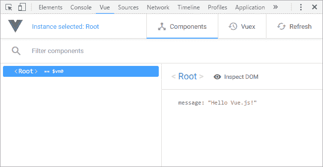

# 第一章：开始使用 Vue

Vue ([`vuejs.org/`](https://vuejs.org/))是一个专注于构建 Web 用户界面的 JavaScript 库。在本章中，我们将了解这个库，并在简要介绍之后，我们将开始创建一个 Web 应用程序，为我们在本书中一起构建的不同项目奠定基础。

# 为什么需要另一个前端框架？

Vue 在 JavaScript 前端领域是一个相对新手，但是对当前主要的库来说是一个非常严肃的挑战者。它简单、灵活、非常快速，同时还提供了许多功能和可选工具，可以帮助您高效地构建现代 Web 应用程序。它的创造者*Evan You*称其为**渐进式框架**：

+   Vue 是可以逐步采用的，核心库专注于用户界面，您可以在现有项目中使用它

+   你可以制作小型原型，一直到大型复杂的 Web 应用程序

+   Vue 是易于接近的-初学者可以轻松掌握这个库，而经验丰富的开发人员可以很快提高生产力

Vue 大致遵循模型-视图-视图模型架构，这意味着视图（用户界面）和模型（数据）是分开的，视图模型（Vue）是两者之间的中介。它会自动处理更新，并已经为您进行了优化。因此，您不必指定视图的哪一部分应该更新，因为 Vue 会选择正确的方式和时间来进行更新。

该库还从其他类似的库（如 React、Angular 和 Polymer）中汲取灵感。以下是其核心特性的概述：

+   一个反应灵敏的数据系统可以自动更新您的用户界面，具有轻量级的虚拟 DOM 引擎和最小的优化工作是必需的

+   灵活的视图声明-艺术家友好的 HTML 模板、JSX（JavaScript 内的 HTML）或超文本渲染函数（纯 JavaScript）

+   可组合的用户界面，具有可维护和可重用的组件

+   官方伴随库提供了路由、状态管理、脚手架和更高级的功能，使 Vue 成为一个非武断但完全成熟的前端框架

# 一个热门项目

*Evan You*在 2013 年开始在谷歌工作时着手开发了 Vue 的第一个原型，当时他正在使用 Angular。最初的目标是拥有 Angular 的所有很酷的特性，比如数据绑定和数据驱动的 DOM，但不包含使这个框架武断和难以学习和使用的额外概念。

2014 年 2 月，第一个公开版本发布，第一天就取得了巨大成功，在 HackerNews 的首页、`/r/javascript`排名第一，并且官方网站访问量达到了 1 万次。

第一个主要版本 1.0 于 2015 年 10 月发布，到年底，npm 下载量飙升至 382k，GitHub 仓库获得了 11k 颗星，官方网站访问量达到了 363k，流行的 PHP 框架 Laravel 选择了 Vue 作为其官方前端库，而不是 React。

第二个主要版本 2.0 于 2016 年 9 月发布，采用了基于虚拟 DOM 的新渲染器和许多新功能，如服务器端渲染和性能改进。这就是本书中将使用的版本。现在它是最快的前端库之一，甚至在与 React 团队精心比较后，超过了 React（[`vuejs.org/v2/guide/comparison`](https://vuejs.org/v2/guide/comparison)）。撰写本书时，Vue 是 GitHub 上第二受欢迎的前端库，拥有 72k 颗星，仅次于 React，领先于 Angular 1（[`github.com/showcases/front-end-javascript-frameworks`](https://github.com/showcases/front-end-javascript-frameworks)）。

路线图上该库的下一个发展阶段包括更多与 Vue 原生库（如 Weex 和 NativeScript）的集成，以创建具有 Vue 的原生移动应用程序，以及新功能和改进。

如今，Vue 被许多公司使用，如微软、Adobe、阿里巴巴、百度、小米、Expedia、任天堂和 GitLab。

# 兼容性要求

Vue 没有任何依赖，可以在任何符合 ECMAScript 5 最低标准的浏览器中使用。这意味着它与 Internet Explorer 8 或更低版本不兼容，因为它需要相对较新的 JavaScript 功能，如`Object.defineProperty`，这在旧版浏览器上无法进行 polyfill。

在本书中，我们使用 JavaScript 版本 ES2015（以前是 ES6）编写代码，因此在前几章中，您需要一个现代浏览器来运行示例（如 Edge、Firefox 或 Chrome）。在某个时候，我们将介绍一个名为*Babel*的编译器，它将帮助我们使我们的代码与旧版浏览器兼容。

# 一分钟设置

话不多说，让我们开始用一个非常快速的设置创建我们的第一个 Vue 应用程序。Vue 足够灵活，可以通过简单的`script`标签包含在任何网页中。让我们创建一个非常简单的网页，其中包括该库，一个简单的`div`元素和另一个`script`标签：

```js
<html>
<head>
  <meta charset="utf-8">
  <title>Vue Project Guide setup</title>
</head>
<body>

  <!-- Include the library in the page -->
  <script src="https://unpkg.com/vue/dist/vue.js"></script>

  <!-- Some HTML -->
  <div id="root">
    <p>Is this an Hello world?</p>
  </div>

  <!-- Some JavaScript -->
  <script>
  console.log('Yes! We are using Vue version', Vue.version)
  </script>

</body>
</html>
```

在浏览器控制台中，我们应该有类似这样的东西：

```js
Yes! We are using Vue version 2.0.3
```

正如您在前面的代码中所看到的，该库公开了一个包含我们需要使用它的所有功能的`Vue`对象。我们现在准备好了。

# 创建一个应用程序

目前，我们的网页上没有任何 Vue 应用程序在运行。整个库都是基于**Vue 实例**的，它们是视图和数据之间的中介。因此，我们需要创建一个新的 Vue 实例来启动我们的应用程序：

```js
// New Vue instance
var app = new Vue({
  // CSS selector of the root DOM element
  el: '#root',
  // Some data
  data () {
    return {
      message: 'Hello Vue.js!',
    }
  },
})
```

使用`new`关键字调用 Vue 构造函数来创建一个新实例。它有一个参数--选项对象。它可以有多个属性（称为选项），我们将在接下来的章节中逐渐发现。目前，我们只使用了其中的两个。

使用`el`选项，我们告诉 Vue 在哪里使用 CSS 选择器在我们的网页上添加（或“挂载”）实例。在这个例子中，我们的实例将使用`<div id="root">` DOM 元素作为其根元素。我们也可以使用 Vue 实例的`$mount`方法而不是`el`选项：

```js
var app = new Vue({
  data () {
    return {
      message: 'Hello Vue.js!',
    }
  },
})
// We add the instance to the page
app.$mount('#root')
```

大多数 Vue 实例的特殊方法和属性都以美元符号开头。

我们还将在`data`选项中初始化一些数据，其中包含一个包含字符串的`message`属性。现在 Vue 应用程序正在运行，但它还没有做太多事情。

您可以在单个网页上添加尽可能多的 Vue 应用程序。只需为它们中的每一个创建一个新的 Vue 实例，并将它们挂载在不同的 DOM 元素上。当您想要将 Vue 集成到现有项目中时，这将非常方便。

# Vue devtools

Vue 的官方调试工具在 Chrome 上作为一个名为 Vue.js devtools 的扩展可用。它可以帮助您查看您的应用程序的运行情况，以帮助您调试您的代码。您可以从 Chrome Web Store（[`chrome.google.com/webstore/search/vue`](https://chrome.google.com/webstore/search/vue)）或 Firefox 附加组件注册表（[`addons.mozilla.org/en-US/firefox/addon/vue-js-devtools/?src=ss`](https://addons.mozilla.org/en-US/firefox/addon/vue-js-devtools/?src=ss)）下载它。

对于 Chrome 版本，您需要设置一个额外的设置。在扩展设置中，启用允许访问文件 URL，以便它可以检测到从本地驱动器打开的网页上的 Vue：


在您的网页上，使用*F12*快捷键（或在 OS X 上使用*Shift* + *command* + *c*）打开 Chrome Dev Tools，并搜索 Vue 标签（它可能隐藏在 More tools...下拉菜单中）。一旦打开，您可以看到一个树，其中包含我们的 Vue 实例，按照惯例命名为 Root。如果单击它，侧边栏将显示实例的属性：

您可以随意拖动`devtools`选项卡。不要犹豫将其放在前面的选项卡中，因为在 Vue 不处于开发模式或根本没有运行时，它将被隐藏在页面中。

您可以使用`name`选项更改实例的名称：

```js
var app = new Vue({
  name: 'MyApp',
  // ...
})
```

这将帮助您在拥有更多实例时看到它们在开发工具中的位置：


# 模板使您的 DOM 动态化

使用 Vue，我们有几个系统可供编写我们的视图。现在，我们将从模板开始。模板是描述视图的最简单方式，因为它看起来很像 HTML，但有一些额外的语法，使 DOM 动态更新非常容易。

# 显示文本

我们将看到的第一个模板功能是**文本插值**，用于在网页内显示动态文本。文本插值语法是一对双大括号，其中包含任何类型的 JavaScript 表达式。当 Vue 处理模板时，其结果将替换插值。用以下内容替换`<div id="root">`元素：

```js
<div id="root">
  <p>{{ message }}</p>
</div>
```

此示例中的模板具有一个`<p>`元素，其内容是`message` JavaScript 表达式的结果。它将返回我们实例的 message 属性的值。现在，您的网页上应该显示一个新的文本--Hello Vue.js！。看起来不像什么，但 Vue 在这里为我们做了很多工作--我们现在的 DOM 与我们的数据连接起来了。

为了证明这一点，打开浏览器控制台，更改`app.message`的值，然后按键盘上的*Enter*：

```js
app.message = 'Awesome!'
```

消息已更改。这称为**数据绑定**。这意味着 Vue 能够在数据更改时自动更新 DOM，而无需您的任何操作。该库包括一个非常强大和高效的响应系统，可以跟踪所有数据，并能够在某些内容更改时更新所需的内容。所有这些都非常快速。

# 使用指令添加基本交互性

让我们为我们原本相当静态的应用程序添加一些互动，例如，一个文本输入框，允许用户更改显示的消息。我们可以在模板中使用特殊的 HTML 属性，称为**指令**来实现这一点。

Vue 中的所有指令都以`v-`开头，并遵循 kebab-case 语法。这意味着您应该用破折号分隔单词。请记住，HTML 属性不区分大小写（它们是大写还是小写都无关紧要）。

我们在这里需要的指令是`v-model`，它将绑定我们的`<input>`元素的值与我们的`message`数据属性。在模板中添加一个带有`v-model="message"`属性的新的`<input>`元素：

```js
<div id="root">
  <p>{{ message }}</p>
  <!-- New text input -->
  <input v-model="message" />
</div>
```

当输入值发生变化时，Vue 现在会自动更新`message`属性。您可以尝试更改输入内容，以验证文本随着您的输入而更新，devtools 中的值也会发生变化：


Vue 中有许多其他指令可用，甚至可以创建自己的指令。不用担心，我们将在后面的章节中介绍这些内容。

# 摘要

在本章中，我们快速设置了一个网页，开始使用 Vue 并编写了一个简单的应用程序。我们创建了一个 Vue 实例来挂载 Vue 应用程序，并编写了一个模板来使 DOM 动态化。在这个模板中，我们使用了 JavaScript 表达式来显示文本，感谢文本插值。最后，我们通过一个输入元素添加了一些互动，将其与`v-model`指令绑定到我们的数据上。

在下一章中，我们将使用 Vue 创建我们的第一个真正的 Web 应用程序--一个 Markdown 笔记本。我们将需要更多的 Vue 超能力，将这个应用程序的开发变成一个有趣而迅速的体验。
