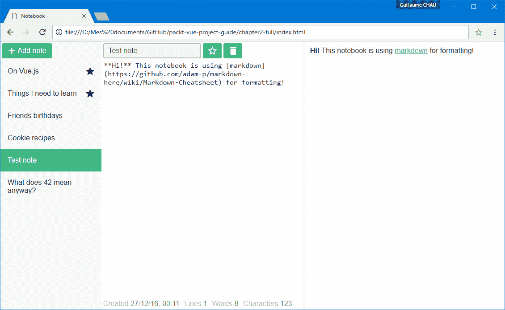
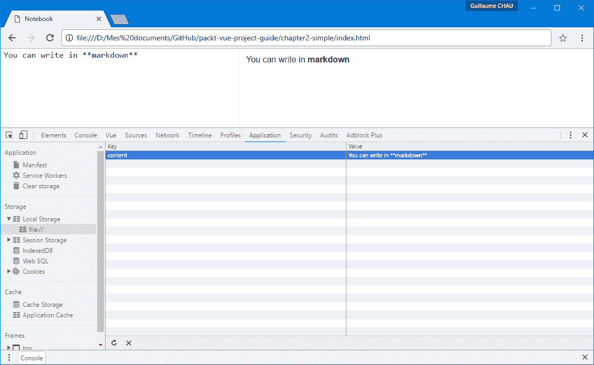
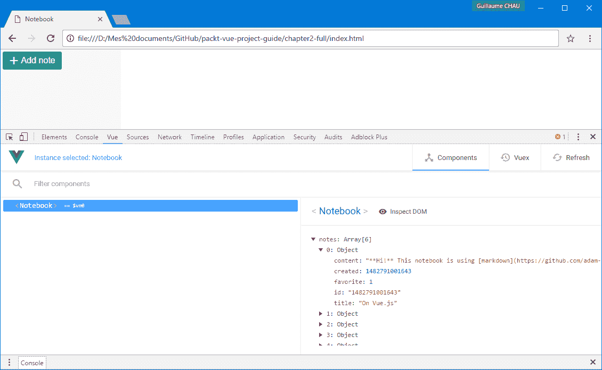
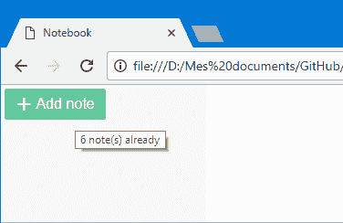
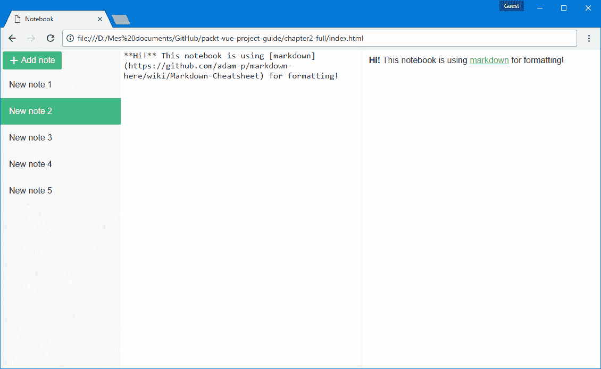
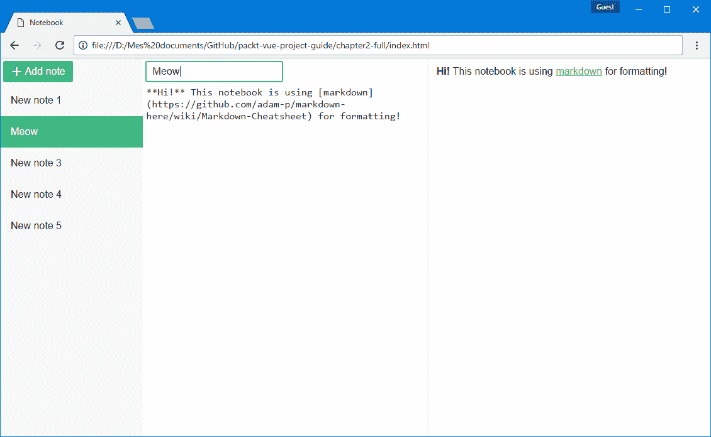
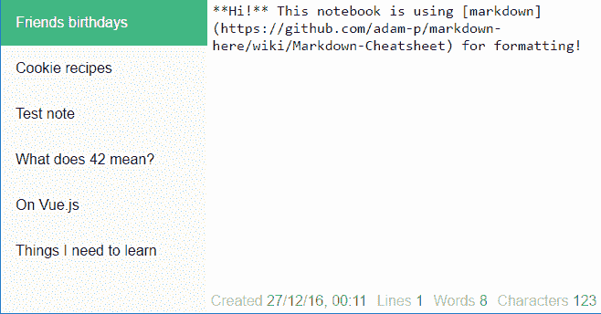

# 第二章：项目 1 - Markdown 笔记本

我们将创建的第一个应用是一个 Markdown 笔记本，逐步使用几个 Vue 功能。我们将重复使用我们在第一章中看到的内容，*使用 Vue 入门*，并在此基础上添加更多元素，如有用的指令，用户交互的事件，更多实例选项和用于处理值的过滤器。

在我们开始编写代码之前，让我们谈谈这个应用并回顾我们的目标：

+   笔记本应用将允许用户以 Markdown 格式编写笔记

+   Markdown 将实时预览

+   用户可以添加任意数量的笔记

+   下次用户访问应用时，笔记将被恢复

为了做到这一点，我们将把用户界面分成三个部分：

+   中间的主要部分，带有笔记编辑器

+   右侧窗格，预览当前笔记的 Markdown

+   左侧窗格，显示笔记列表和添加新笔记的按钮

在本章结束时，它将看起来像这样：



# 一个基本的笔记编辑器

我们将从一个非常简单的 Markdown 笔记应用开始，只在左侧显示文本编辑器和右侧显示 Markdown 预览。然后，我们将把它变成一个具有多个笔记支持的完整笔记本。

# 设置项目

对于这个项目，我们将准备好一些文件来帮助我们开始：

1.  首先，下载*simple-notebook*项目文件并将其解压缩到同一个文件夹中。打开`index.html`文件，并添加一个带有`notebook` ID 的`div`元素和一个带有`main`类的嵌套`section`元素。文件内应包含以下内容：

```js
      <html>
      <head>
        <title>Notebook</title>
        <!-- Icons & Stylesheets -->
        <link href="https://fonts.googleapis.com/icon?                   
        family=Material+Icons" rel="stylesheet">
        <link rel="stylesheet" href="style.css" />
      </head>
      <body>
        <!-- Include the library in the page -->
        <script src="https://unpkg.com/vue/dist/vue.js"></script>

        <!-- Notebook app -->
        <div id="notebook">

          <!-- Main pane -->
          <section class="main">

          </section>

        </div>

        <!-- Some JavaScript -->
        <script src="script.js"></script>
      </body>
      </html>
```

1.  现在，打开`script.js`文件添加一些 JavaScript。就像你在第一章中所做的那样，*使用 Vue 入门*，创建一个 Vue 实例，挂载在`#notebook`元素上，使用 Vue 构造函数：

```js
      // New VueJS instance
      new Vue({
        // CSS selector of the root DOM element
        el: '#notebook',
      })
```

1.  然后，添加一个名为`content`的数据属性，用于保存笔记的内容：

```js
      new Vue({
        el: '#notebook',

        // Some data
        data () {
          return {
            content: 'This is a note.',
          }
        },
      })
```

现在你已经准备好创建你的第一个真正的 Vue 应用了。

# 笔记编辑器

现在我们的应用正在运行，让我们添加文本编辑器。我们将使用一个简单的`textarea`元素和我们在第一章中看到的`v-model`指令，*使用 Vue 入门*。

创建一个`section`元素并将`textarea`放入其中，然后添加绑定到我们的`content`属性的`v-model`指令：

```js
<!-- Main pane -->
<section class="main">
  <textarea v-model="content"></textarea>
</section>
```

现在，如果你改变笔记编辑器中的文本，`content`的值应该会自动在 devtools 中改变。

`v-model`指令不仅限于文本输入。你还可以在其他表单元素中使用它，比如复选框、单选按钮，甚至是自定义组件，正如我们将在本书中看到的那样。

# 预览窗格

要将笔记 markdown 编译为有效的 HTML，我们将需要一个名为 Marked 的额外库（[`www.npmjs.com/package/marked`](https://www.npmjs.com/package/marked)）：

1.  在引用 Vue 的`script`标签后，将库包含在页面中：

```js
      <!-- Include the library in the page -->
      <script src="https://unpkg.com/vue/dist/vue.js"></script>
      <!-- Add the marked library: -->
      <script src="https://unpkg.com/marked"></script>
```

`marked`非常容易使用--只需用 markdown 文本调用它，它就会返回相应的 HTML。

1.  尝试使用一些 markdown 文本来测试库：

```js
      const html = marked('**Bold** *Italic* [link]   
      (http://vuejs.org/)')
      console.log(html)
```

你应该在浏览器控制台中看到以下输出：

```js
<p><strong>Bold</strong> <em>Italic</em>
<a href="http://vuejs.org/">link</a></p>
```

# 计算属性

Vue 非常强大的一个特性是**计算属性**。它允许我们定义新的属性，结合任意数量的属性并使用转换，比如将 markdown 字符串转换为 HTML--这就是为什么它的值由一个函数定义。计算属性具有以下特点：

+   该值被缓存，因此如果不需要，函数就不会重新运行，从而防止无用的计算

+   当函数内部使用的属性发生变化时，它会根据需要自动更新

+   计算属性可以像任何属性一样使用（你可以在其他计算属性中使用计算属性）

+   直到在应用程序的某个地方真正使用它之前，它都不会被计算。

这将帮助我们自动将笔记 markdown 转换为有效的 HTML，这样我们就可以实时显示预览。我们只需要在`computed`选项中声明我们的计算属性：

```js
// Computed properties
computed: {
  notePreview () {
    // Markdown rendered to HTML
    return marked(this.content)
  },
},
```

# 文本插值转义

让我们尝试使用文本插值在新窗格中显示我们的笔记：

1.  创建一个带有`preview`类的`<aside>`元素，显示我们的`notePreview`计算属性：

```js
      <!-- Preview pane -->
      <aside class="preview">
        {{ notePreview }}
      </aside>
```

现在我们应该在应用程序的右侧看到预览窗格显示我们的笔记。如果你在笔记编辑器中输入一些文本，你应该会看到预览自动更新。然而，我们的应用程序存在一个问题，当你使用 markdown 格式时会出现问题。

1.  尝试使用`**`将文本加粗，如下所示：

```js
      I'm in **bold**!
```

我们的计算属性应该返回有效的 HTML，并且我们的预览窗格中应该呈现一些粗体文本。相反，我们可以看到以下内容：

```js
I'm in <strong>bold</strong>!
```

我们刚刚发现文本插值会自动转义 HTML 标记。这是为了防止注入攻击并提高我们应用程序的安全性。幸运的是，有一种方法可以显示一些 HTML，我们马上就会看到。然而，这会迫使您考虑使用它来包含潜在有害的动态内容。

例如，您可以创建一个评论系统，任何用户都可以在您的应用页面上写一些评论。如果有人在评论中写入一些 HTML，然后在页面上显示为有效的 HTML，会怎么样？他们可以添加一些恶意的 JavaScript 代码，您的应用程序的所有访问者都会变得脆弱。这被称为跨站脚本攻击，或者 XSS 攻击。这就是为什么文本插值总是转义 HTML 标记。

不建议在应用程序的用户创建的内容上使用`v-html`。他们可以在`<script>`标签内编写恶意 JavaScript 代码，这将被执行。然而，通过正常的文本插值，您将是安全的，因为 HTML 不会被执行。

# 显示 HTML

现在我们知道出于安全原因文本插值无法渲染 HTML，我们将需要另一种方式来渲染动态 HTML--`v-html`指令。就像我们在第一章中看到的`v-model`指令一样，这是一个特殊的属性，为我们的模板添加了一个新功能。它能够将任何有效的 HTML 字符串渲染到我们的应用程序中。只需将字符串作为值传递，如下所示：

```js
<!-- Preview pane -->
<aside class="preview" v-html="notePreview">
</aside>
```

现在，markdown 预览应该可以正常工作，并且 HTML 会动态插入到我们的页面中。

我们`aside`元素内的任何内容都将被`v-html`指令的值替换。您可以使用它来放置占位内容。

这是您应该得到的结果：

对于文本插值，还有一个等效的指令`v-text`，它的行为类似于`v-html`，但会像经典文本插值一样转义 HTML 标记。

# 保存笔记

目前，如果关闭或刷新应用程序，您的笔记将丢失。在下次打开应用程序时保存和加载它是个好主意。为了实现这一点，我们将使用大多数浏览器提供的标准`localStorage` API。

# 观察变化

我们希望在笔记内容发生变化时立即保存笔记。这就是为什么我们需要一些在`content`数据属性发生变化时被调用的东西，比如**观察者**。让我们向我们的应用程序添加一些观察者！

1.  在 Vue 实例中添加一个新的`watch`选项。

这个选项是一个字典，其中键是被观察属性的名称，值是一个观察选项对象。这个对象必须有一个`handler`属性，它可以是一个函数或者一个方法的名称。处理程序将接收两个参数--被观察属性的新值和旧值。

这是一个带有简单处理程序的例子：

```js
new Vue({
  // ...

  // Change watchers
  watch: {
    // Watching 'content' data property
    content: {
      handler (val, oldVal) {
        console.log('new note:', val, 'old note:', oldVal)
      },
    },
  },
})
```

现在，当你在笔记编辑器中输入时，你应该在浏览器控制台中看到以下消息：

```js
new note: This is a **note**! old note: This is a **note**
```

这将在笔记发生变化时非常有帮助。

你可以在`handler`旁边使用另外两个选项：

+   `deep`是一个布尔值，告诉 Vue 递归地观察嵌套对象内的变化。这在这里并不有用，因为我们只观察一个字符串。

+   `immediate`也是一个布尔值，强制处理程序立即被调用，而不是等待第一次变化。在我们的情况下，这不会有实质性的影响，但我们可以尝试一下来注意它的影响。

这些选项的默认值是`false`，所以如果你不需要它们，你可以完全跳过它们。

1.  将`immediate`选项添加到观察者中：

```js
      content: {
        handler (val, oldVal) {
          console.log('new note:', val, 'old note:', oldVal)      
        },
        immediate: true,
      },
```

一旦你刷新应用程序，你应该在浏览器控制台中看到以下消息弹出：

```js
new note: This is a **note** old note: undefined
```

毫不奇怪，笔记的旧值是`undefined`，因为观察者处理程序在实例创建时被调用。

1.  我们这里真的不需要这个选项，所以继续删除它：

```js
      content: {
        handler (val, oldVal) {
          console.log('new note:', val, 'old note:', oldVal)
        },
      },
```

由于我们没有使用任何选项，我们可以通过跳过包含`handler`选项的对象来使用更短的语法：

```js
content (val, oldVal) {
  console.log('new note:', val, 'old note:', oldVal)
},
```

这是当你不需要其他选项时观察者的最常见语法，比如`deep`或`immediate`。

1.  让我们保存我们的笔记。使用`localStorage.setItem()` API 来存储笔记内容：

```js
      content (val, oldVal) {
        console.log('new note:', val, 'old note:', oldVal)
        localStorage.setItem('content', val)
      },
```

要检查这是否起作用，编辑笔记并在应用程序或存储选项卡中打开浏览器开发工具（取决于你的浏览器），你应该在本地存储部分下找到一个新的条目：



# 使用一个方法

有一个很好的编码原则说*不要重复自己*，我们真的应该遵循它。这就是为什么我们可以在可重用的函数中写一些逻辑，称为**methods**。让我们把我们的保存逻辑移到一个方法中：

1.  在 Vue 实例中添加一个新的`methods`选项，并在那里使用`localStorage` API：

```js
      new Vue({
        // ...

        methods: {
          saveNote (val) {
            console.log('saving note:', val)
            localStorage.setItem('content', val)
          },
        },
      })
```

1.  我们现在可以在观察者的`handler`选项中使用方法名：

```js
      watch: {
        content: {
          handler: 'saveNote',
        },
      },
```

或者，我们可以使用更短的语法：

```js
watch: {
  content: 'saveNote',
},
```

# 访问 Vue 实例

在方法内部，我们可以使用`this`关键字访问 Vue 实例。例如，我们可以调用另一个方法：

```js
methods: {
  saveNote (val) {
    console.log('saving note:', val)
    localStorage.setItem('content', val)
    this.reportOperation('saving')
  },
  reportOperation (opName) {
    console.log('The', opName, 'operation was completed!')
  },
},
```

在这里，`saveNote`方法将从`contentChanged`方法中调用。

我们还可以通过`this`访问 Vue 实例的其他属性和特殊函数。我们可以删除`saveNote`参数并直接访问`content`数据属性：

```js
methods: {
  saveNote () {
    console.log('saving note:', this.content)
    localStorage.setItem('content', this.content)
  },
},
```

这也适用于我们在*监视更改*部分创建的观察程序处理程序：

```js
watch: {
  content (val, oldVal) {
    console.log('new note:', val, 'old note:', oldVal)
    console.log('saving note:', this.content)
    localStorage.setItem('content', this.content)
  },
},
```

基本上，您可以在任何绑定到它的函数中使用`this`访问 Vue 实例：方法、处理程序和其他钩子。

# 加载保存的笔记

现在我们每次更改时保存笔记内容，当应用程序重新打开时，我们需要恢复它。我们将使用`localStorage.getItem()` API。在您的 JavaScript 文件末尾添加以下行：

```js
console.log('restored note:', localStorage.getItem('content'))
```

当您刷新应用程序时，您应该在浏览器控制台中看到保存的笔记内容。

# 生命周期钩子

恢复我们的笔记内容到 Vue 实例的第一种方式是在创建实例时设置内容数据属性。

每个 Vue 实例都遵循一个精确的生命周期，有几个步骤--它将被创建、挂载到页面上、更新，最后销毁。例如，在创建步骤期间，Vue 将使实例数据具有反应性。

钩子是一组特定的函数，在某个时间点自动调用。它们允许我们自定义框架的逻辑。例如，我们可以在创建 Vue 实例时调用一个方法。

我们有多个可用的钩子来在每个步骤发生时执行逻辑，或者在这些步骤之前执行逻辑：

+   `beforeCreate`：在 Vue 实例对象创建时调用（例如，使用`new Vue({})`），但在 Vue 对其进行任何操作之前调用。

+   `created`：在实例准备就绪并完全运行后调用。请注意，在此时，实例尚未在 DOM 中。

+   `beforeMount`：在实例添加（或挂载）到网页上之前调用。

+   `mounted`：当实例在页面上可见时调用。

+   `beforeUpdate`：当实例需要更新时调用（通常是在数据或计算属性发生变化时）。

+   `updated`：在数据更改应用到模板后调用。请注意，DOM 可能尚未更新。

+   `beforeDestroy`：在实例被拆除之前调用。

+   `destroyed`：在实例完全移除时调用。

目前，我们将仅使用`created`钩子来恢复笔记内容。要添加生命周期钩子，只需将具有相应名称的函数添加到 Vue 实例选项中：

```js
new Vue({
  // ...

  // This will be called when the instance is ready
  created () {
    // Set the content to the stored value
    // or to a default string if nothing was saved
    this.content = localStorage.getItem('content') || 'You can write in **markdown**'
  },
})
```

现在，当您刷新应用程序时，`created`钩子将在实例创建时自动调用。这将把`content`数据属性值设置为恢复的结果，或者如果结果为假，则设置为`'You can write in **markdown**'`，以防我们之前没有保存任何内容。

在 JavaScript 中，当值等于`false`、`0`、空字符串、`null`、`undefined`或`NaN`（不是一个数字）时，该值为假。在这里，如果对应的键在浏览器本地存储数据中不存在，`localStorage.getItem()`函数将返回`null`。

我们设置的观察者也被调用，因此笔记被保存，您应该在浏览器控制台中看到类似于这样的内容：

```js
new note: You can write in **markdown** old note: This is a note
saving note: You can write in **markdown**
The saving operation was completed!
```

我们可以看到，当调用 created 钩子时，Vue 已经设置了数据属性及其初始值（这里是*This is a note*）。

# 直接在数据中初始化

另一种方法是直接使用恢复的值初始化`content`数据属性：

```js
new Vue({
  // ...

  data () {
    return {
      content: localStorage.getItem('content') || 'You can write in **markdown**',
    }
  },

  // ...
})
```

在上述代码中，观察者处理程序不会被调用，因为我们初始化了`content`值而不是改变它。

# 多个笔记

只有一个笔记的笔记本并不那么有用，所以让我们将其变成一个多笔记本。我们将在左侧添加一个新的侧边栏，其中包含笔记列表，以及一些额外的元素，例如重命名笔记的文本字段和一个收藏切换按钮。

# 笔记列表

现在，我们将为包含笔记列表的侧边栏奠定基础：

1.  在主要部分之前添加一个带有`side-bar`类的新`aside`元素：

```js
      <!-- Notebook app -->
      <div id="notebook">

        <!-- Sidebar -->
        <aside class="side-bar">
          <!-- Here will be the note list -->
        </aside>

        <!-- Main pane -->
        <section class="main">
      ...
```

1.  添加一个名为`notes`的新数据属性--它将是包含所有笔记的数组：

```js
      data () {
        return {
          content: ...
          // New! A note array
          notes: [],
        }
      },
```

# 创建一个新笔记的方法

我们的每个笔记将是一个具有以下数据的对象：

+   `id`：这将是笔记的唯一标识符

+   `title`：这将包含在列表中显示的笔记名称

+   `content`：这将是笔记的 markdown 内容

+   `created`：这将是笔记创建的日期

+   `favorite`：这将是一个布尔值，允许将要在列表顶部显示的笔记标记为收藏

让我们添加一个方法，它将创建一个新的笔记并将其命名为`addNote`，它将创建一个具有默认值的新笔记对象：

```js
methods:{
  // Add a note with some default content and select it
  addNote () {
    const time = Date.now()
    // Default new note
    const note = {
      id: String(time),
      title: 'New note ' + (this.notes.length + 1),
      content: '**Hi!** This notebook is using [markdown](https://github.com/adam-p/markdown-here/wiki/Markdown-Cheatsheet) for formatting!',
      created: time,
      favorite: false,
    }
    // Add to the list
    this.notes.push(note)
  },
}
```

我们获取当前时间（这意味着自 1970 年 1 月 1 日 00:00:00 UTC 以来经过的毫秒数），这将是在每个笔记上具有唯一标识符的完美方式。我们还设置默认值，比如标题和一些内容，以及`created`日期和`favorite`布尔值。最后，我们将笔记添加到 notes 数组属性中。

# 使用 v-on 绑定按钮和点击事件

现在，我们需要一个按钮来调用这个方法。在具有 toolbar 类的`div`元素内创建一个新的按钮元素：

```js
<aside class="side-bar">
  <!-- Toolbar -->
  <div class="toolbar">
    <!-- Add note button -->
    <button><i class="material-icons">add</i> Add note</button>
  </div>
</aside>
```

当用户单击按钮时调用`addNote`方法时，我们将需要一个新的指令--`v-on`。值将是在捕获事件时调用的函数，但它还需要一个参数来知道要监听哪个事件。但是，你可能会问，我们如何将参数传递给指令呢？这很简单！在指令名称后添加一个`:`字符，然后是参数。这是一个例子：

```js
<button v-directive:argument="value">
```

在我们的情况下，我们正在使用`v-on`指令，事件名称作为参数，更具体地说，是`click`事件。它应该是这样的：

```js
<button v-on:click="callback">
```

当我们点击按钮时，我们的按钮应该调用`addNote`方法，所以继续修改我们之前添加的按钮：

```js
<button v-on:click="addNote"><i class="material-icons">add</i> Add note</button>
```

`v-on`指令还有一个可选的特殊快捷方式--`@`字符，允许你将前面的代码重写为以下内容：

```js
<button @click="addNote"><i class="material-icons">add</i> Add note</button>
```

现在我们的按钮已经准备好了，试着添加一些笔记。我们还没有在应用程序中看到它们，但你可以打开开发工具并注意到笔记列表的变化：



# 使用 v-bind 绑定属性

如果工具提示显示了我们在“添加笔记”按钮上已经有的笔记数量，那将会很有帮助，不是吗？至少我们可以介绍另一个有用的指令！

工具提示是通过 title HTML 属性添加的。这是一个例子：

```js
<button title="3 note(s) already">
```

在这里，它只是一个静态文本，但我们希望使它动态。幸运的是，有一个指令允许我们将 JavaScript 表达式绑定到属性--`v-bind`。像`v-on`指令一样，它需要一个参数，这个参数是目标属性的名称。

我们可以用 JavaScript 表达式重写前面的例子如下：

```js
<button v-bind:title="notes.length + ' note(s) already'">
```

现在，如果你把鼠标光标放在按钮上，你会得到笔记的数量：



就像`v-on`指令一样，`v-bind`有一个特殊的快捷语法（两者都是最常用的指令）--你可以跳过`v-bind`部分，只放置带有属性名称的`:`字符。示例如下：

```js
<button :title="notes.length + ' note(s) already'">
```

使用`v-bind`绑定的 JavaScript 表达式将在需要时自动重新评估，并更新相应属性的值。

我们也可以将表达式移到一个计算属性中并使用它。计算属性可以如下所示：

```js
computed: {
  ...

  addButtonTitle () {
    return notes.length + ' note(s) already'
  },
},
```

然后，我们将重写绑定的属性，如下所示：

```js
<button :title="addButtonTitle">
```

# 使用`v-for`显示列表

现在，我们将在工具栏下方显示笔记列表。

1.  在工具栏正下方，添加一个带有`notes`类的新的`div`元素：

```js
      <aside class="side-bar">
        <div class="toolbar">
          <button @click="addNote"><i class="material-icons">add</i>        
          Add note</button>
        </div>
        <div class="notes">
          <!-- Note list here -->
        </div>
      </aside>
```

现在，我们想要显示多个 div 元素的列表，每个笔记一个。为了实现这一点，我们需要`v-for`指令。它以`item of items`的形式接受一个特殊的表达式作为值，将迭代`items`数组或对象，并为模板的这一部分公开一个`item`值。以下是一个示例：

```js
<div v-for="item of items">{{ item.title }}</div>
```

你也可以使用`in`关键字代替`of`：

```js
<div v-for="item in items">{{ item.title }}</div>
```

假设我们有以下数组：

```js
data () {
  return {
    items: [
      { title: 'Item 1' },
      { title: 'Item 2' },
      { title: 'Item 3' },
    ]
  }
}
```

最终呈现的 DOM 将如下所示：

```js
<div>Item 1</div>
<div>Item 2</div>
<div>Item 3</div>
```

正如你所看到的，放置`v-for`指令的元素在 DOM 中重复出现。

1.  让我们回到我们的笔记本，并在侧边栏显示笔记。我们将它们存储在 notes 数据属性中，所以我们需要对它进行迭代：

```js
      <div class="notes">
        <div class="note" v-for="note of notes">{{note.title}}</div>
      </div>
```

现在，我们应该在按钮下方看到笔记列表显示出来：


使用按钮添加几个笔记，你应该看到列表正在自动更新！

# 选择一个笔记

当选择一个笔记时，它将成为应用程序中间和右侧窗格的上下文--文本编辑器修改其内容，预览窗格显示其格式化的 markdown。让我们实现这个行为！

1.  添加一个名为`selectedId`的新数据属性，它将保存所选笔记的 ID：

```js
      data () {
        return {
          content: localStorage.getItem('content') || 'You can write in         
          **markdown**',
          notes: [],
          // Id of the selected note
          selectedId: null,
        }
      },
```

我们也可以创建一个`selectedNote`属性，保存笔记对象，但这将使保存逻辑更复杂，没有任何好处。

1.  我们需要一个新的方法，当我们点击列表中的一个笔记时将被调用以选择 ID。让我们称之为`selectNote`：

```js
      methods: {
        ...

        selectNote (note) {
          this.selectedId = note.id
        },
      }
```

1.  就像我们为添加笔记按钮所做的那样，我们将使用`v-on`指令在列表中的每个笔记项上监听`click`事件：

```js
      <div class="notes">
        <div class="note" v-for="note of notes"         
        @click="selectNote(note)">{{note.title}}</div>
      </div>
```

现在，当你点击一个笔记时，你应该看到更新的`selectedId`数据属性。

# 当前的笔记

现在我们知道当前选中的笔记是哪一个，我们可以替换一开始创建的旧`content`数据属性。很有用的是，我们可以创建一个计算属性来轻松访问选中的笔记，所以我们现在将创建一个：

1.  添加一个新的计算属性叫做`selectedNote`，它返回与我们的`selectedId`属性匹配的笔记：

```js
      computed: {
        ...

        selectedNote () {
          // We return the matching note with selectedId
          return this.notes.find(note => note.id === this.selectedId)
        },
      }
```

`note => note.id === this.selectedId`是来自 ES2015 JavaScript 版本的箭头函数。在这里，它接受一个`note`参数，并返回`note.id === this.selectedId`表达式的结果。

我们需要在我们的代码中用`selectedNote.content`替换旧的`content`数据属性。

1.  首先修改模板中的编辑器：

```js
      <textarea v-model="selectedNote.content"></textarea>
```

1.  然后，将`notePreview`计算属性改为现在使用`selectedNote`：

```js
      notePreview () {
        // Markdown rendered to HTML
        return this.selectedNote ? marked(this.selectedNote.content) :          
        ''
      },
```

现在，当你在列表中点击一个笔记时，文本编辑器和预览窗格将显示所选的笔记。

你可以安全地移除不再在应用程序中使用的`content`数据属性、它的观察者和`saveNote`方法。

# 动态 CSS 类

当笔记在笔记列表中被选中时，添加一个`selected`CSS 类会很好（例如，显示不同的背景颜色）。幸运的是，Vue 有一个非常有用的技巧来帮助我们实现这一点--`v-bind`指令（`:`字符是它的简写）有一些魔法可以使 CSS 类的操作更容易。你可以传递一个字符串，也可以传递一个字符串数组：

```js
<div :class="['one', 'two', 'three']">
```

我们将在 DOM 中得到以下内容：

```js
<div class="one two three">
```

然而，最有趣的特性是你可以传递一个对象，其键是类名，值是布尔值，用于确定是否应该应用每个类。以下是一个例子：

```js
<div :class="{ one: true, two: false, three: true }">
```

这个对象表示法将产生以下 HTML：

```js
<div class="one three">
```

在我们的情况下，我们只想在笔记被选中时应用选中的类。因此，我们将简单地写成如下形式：

```js
<div :class="{ selected: note === selectedNote }">
```

笔记列表现在应该是这样的：

```js
<div class="notes">
  <div class="note" v-for="note of notes" @click="selectNote(note)"
  :class="{selected: note === selectedNote}">{{note.title}}</div>
</div>
```

你可以将静态的`class`属性与动态的属性结合起来。建议将非动态类放入静态属性中，因为 Vue 会优化静态值。

现在，当你点击列表中的一个笔记来选择它时，它的背景颜色会改变：


# 带有 v-if 的条件模板

在测试我们的更改之前，我们还需要最后一件事；如果没有选择笔记，主窗格和预览窗格不应该显示--对用户来说没有意义，让用户拥有指向空白的编辑器和预览窗格，并且会使我们的代码崩溃，因为`selectedNote`将是`null`。幸运的是，`v-if`指令可以在我们希望时动态地从模板中取出部分。它的工作原理就像 JavaScript 的`if`关键字一样，有一个条件。

在这个例子中，只要`loading`属性为假，`div`元素根本不会出现在 DOM 中：

```js
<div v-if="loading">
  Loading...
</div>
```

还有另外两个有用的指令，`v-else`和`v-else-if`，它们将按照你的预期工作：

```js
<div v-if="loading">
  Loading...
</div>

<div v-else-if="processing">
  Processing
</div>

<div v-else>
  Content here
</div>
```

回到我们的应用程序中，在主窗格和预览窗格中添加`v-if="selectedNote"`条件，以便它们在没有选择笔记时不会添加到 DOM 中：

```js
<!-- Main pane -->
<section class="main" v-if="selectedNote">
  ...
</section>

<!-- Preview pane -->
<aside class="preview" v-if="selectedNote" v-html="notePreview">
</aside>
```

这里的重复有点不幸，但 Vue 已经为我们做好了准备。你可以用一个特殊的`<template>`标签将两个元素包围起来，它的作用就像 JavaScript 中的大括号：

```js
<template v-if="selectedNote">
  <!-- Main pane -->
  <section class="main">
    ...
  </section>

  <!-- Preview pane -->
  <aside class="preview" v-html="notePreview">
  </aside>
</template>
```

此时，应用程序应该看起来像这样：

`<template>`标签不会出现在 DOM 中；它更像是一个幽灵元素，用于将真实元素聚集在一起。

# 使用深度选项保存笔记

现在，我们想要在会话之间保存和恢复笔记，就像我们为笔记内容所做的那样：

1.  让我们创建一个新的`saveNotes`方法。由于我们不能直接将对象数组保存到`localStorage` API 中（它只接受字符串），我们需要先用`JSON.stringify`将其转换为 JSON 格式：

```js
      methods: {
        ...

        saveNotes () {
          // Don't forget to stringify to JSON before storing
          localStorage.setItem('notes', JSON.stringify(this.notes))
```

```js
          console.log('Notes saved!', new Date())
        },
      },
```

就像我们为之前的`content`属性所做的那样，我们将监视`notes`数据属性的更改来触发`saveNotes`方法。

1.  在观察选项中添加一个观察者：

```js
      watch: {
        notes: 'saveNotes',
      }
```

现在，如果你尝试添加一些任务，你应该在控制台中看到类似这样的东西：

```js
Notes saved! Mon Apr 42 2042 17:40:23 GMT+0100 (Paris, Madrid)
Notes saved! Mon Apr 42 2016 17:42:51 GMT+0100 (Paris, Madrid)
```

1.  在`data`钩子中更改`notes`属性的初始化，从`localStorage`中加载存储的列表：

```js
      data () {
        return {
          notes: JSON.parse(localStorage.getItem('notes')) || [],
          selectedId: null,
        }
      },
```

刷新页面后，新添加的笔记应该被恢复。然而，如果你尝试更改一个笔记的内容，你会注意到它不会触发`notes`观察者，因此，笔记不会被保存。这是因为，默认情况下，观察者只观察目标对象的直接更改--分配简单值，向数组中添加、删除或移动项目。例如，以下操作将被默认检测到：

```js
// Assignment
this.selectedId = 'abcd'

// Adding or removing an item in an array
this.notes.push({...})
this.notes.splice(index, 1)

// Sorting an array
this.notes.sort(...)
```

然而，所有其他操作，比如这些，都不会触发观察者：

```js
// Assignment to an attribute or a nested object
this.myObject.someAttribute = 'abcd'
this.myObject.nestedObject.otherAttribute = 42

// Changes made to items in an array
this.notes[0].content = 'new content'
```

在这种情况下，您需要在观察者中添加`deep`选项：

```js
watch: {
  notes: {
    // The method name
    handler: 'saveNotes',
    // We need this to watch each note's properties inside the array
    deep: true,
  },
}
```

这样，Vue 也将递归地监视我们`notes`数组内部的对象和属性。现在，如果你在文本编辑器中输入，笔记列表应该被保存--`v-model`指令将修改所选笔记的`content`属性，并且使用`deep`选项，观察者将被触发。

# 保存选择

如果我们的应用程序能够选择上次选择的笔记，那将非常方便。我们只需要存储和加载`selectedId`数据属性，用于存储所选笔记的 ID。没错！再一次，我们将使用一个观察者来触发保存：

```js
watch: {
  ...

  // Let's save the selection too
  selectedId (val) {
    localStorage.setItem('selected-id', val)
  },
}
```

此外，我们将在属性初始化时恢复值：

```js
data () {
  return {
    notes: JSON.parse(localStorage.getItem('notes')) || [],
    selectedId: localStorage.getItem('selected-id') || null,
  }
},
```

好了！现在，当你刷新应用程序时，它应该看起来和你上次离开时一样，选择的笔记也是一样的。

# 带有额外功能的笔记工具栏

我们的应用程序仍然缺少一些功能，比如删除或重命名所选笔记。我们将在一个新的工具栏中添加这些功能，就在笔记文本编辑器的上方。继续创建一个带有`toolbar`类的新的`div`元素；放在主要部分内部：

```js
<!-- Main pane -->
<section class="main">
  <div class="toolbar">
    <!-- Our toolbar is here! -->
  </div>
  <textarea v-model="selectedNote.content"></textarea>
</div>
```

我们将在这个工具栏中添加三个新功能：

+   重命名笔记

+   删除笔记

+   将笔记标记为收藏

# 重命名笔记

这个第一个工具栏功能也是最简单的。它只包括一个与所选笔记的`title`属性绑定的文本输入，使用`v-model`指令。

在我们刚创建的工具栏`div`元素中，添加这个带有`v-model`指令和`placeholder`的`input`元素，以通知用户其功能：

```js
<input v-model="selectedNote.title" placeholder="Note title" />
```

你应该在文本编辑器上方有一个功能性的重命名字段，并且在输入时，你应该看到笔记名称在笔记列表中自动更改：

由于我们在`notes`观察者上设置了`deep`选项，所以每当您更改所选笔记的名称时，笔记列表都将被保存。

# 删除笔记

这个第二个功能有点复杂，因为我们需要一个新的方法：

1.  在重命名文本输入框后添加一个`button`元素：

```js
      <button @click="removeNote" title="Remove note"><i        
      class="material-icons">delete</i></button>
```

正如你所看到的，我们使用`v-on`简写（`@`字符）来监听`click`事件，调用我们即将创建的`removeNote`方法。此外，我们将适当的图标放在按钮内容中。

1.  添加一个新的`removeNote`方法，询问用户确认，然后使用`splice`标准数组方法从`notes`数组中删除当前选择的笔记：

```js
      removeNote () {
        if (this.selectedNote && confirm('Delete the note?')) {
          // Remove the note in the notes array
          const index = this.notes.indexOf(this.selectedNote)
          if (index !== -1) {
            this.notes.splice(index, 1)
          }
        }
      }
```

现在，如果您尝试删除当前笔记，您应该注意到以下三件事情发生了：

+   笔记从左侧的笔记列表中删除

+   文本编辑器和预览窗格被隐藏

+   笔记列表已根据浏览器控制台保存

# 收藏的笔记

最后一个工具栏功能是最复杂的。我们希望重新排列笔记列表，使收藏的笔记首先显示出来。为此，每个笔记都有一个`favorite`布尔属性，可以通过按钮切换。除此之外，笔记列表中还会显示一个星形图标，以明确显示哪些笔记是收藏的，哪些不是：

1.  首先，在删除笔记按钮之前的工具栏中添加另一个按钮：

```js
      <button @click="favoriteNote" title="Favorite note"><i        
      class="material-icons">{{ selectedNote.favorite ? 'star' :               
      'star_border' }}</i></button>
```

再次使用`v-on`简写来调用我们将在下面创建的`favoriteNote`方法。我们还将根据所选笔记的`favorite`属性的值显示一个图标--如果为`true`，则显示一个实心星形图标，否则显示一个轮廓星形图标。

最终结果将如下所示：


在左侧，有一个按钮，用于当笔记不是收藏时，右侧是当笔记是收藏时，点击它后。

1.  让我们创建一个非常简单的`favoriteNote`方法，它只是反转所选笔记上的`favorite`布尔属性的值：

```js
      favoriteNote () {
        this.selectedNote.favorite = !this.selectedNote.favorite
      },
```

我们可以使用异或运算符重写这个：

```js
favoriteNote () {
  this.selectedNote.favorite = this.selectedNote.favorite ^ true
},
```

这可以很好地简化，如下所示：

```js
favoriteNote () {
  this.selectedNote.favorite ^= true
},
```

现在，您应该能够切换收藏按钮，但它目前还没有任何实际效果。

我们需要以两种方式对笔记列表进行排序--首先，我们按创建日期对所有笔记进行排序，然后对它们进行排序，使收藏的笔记排在最前面。幸运的是，我们有一个非常方便的标准数组方法--`sort`。它接受一个参数，即一个具有两个参数的函数--要比较的两个项目。结果是一个数字，如下所示：

+   `0`，如果两个项目处于等价位置

+   `-1`，如果第一个项目应该在第二个项目之前

+   `1`，如果第一个项目应该在第二个项目之后

您不仅限于`1`这个数字，因为您可以返回任意的数字，正数或负数。例如，如果您返回`-42`，它将与`-1`相同。

第一个排序操作将通过这个简单的减法代码实现：

```js
sort((a, b) => a.created - b.created)
```

在这里，我们比较了两个笔记的创建日期，我们将其存储为毫秒数，感谢`Date.now()`。我们只需将它们相减，这样如果`b`在`a`之后创建，我们就会得到一个负数，或者如果`a`在`b`之后创建，我们就会得到一个正数。

第二次排序是用两个三元操作符完成的：

```js
sort((a, b) => (a.favorite === b.favorite)? 0 : a.favorite? -1 : 1)
```

如果两个笔记都是收藏的，我们不改变它们的位置。如果`a`是收藏的，我们返回一个负数将其放在`b`之前。在另一种情况下，我们返回一个正数，所以`b`会在列表中放在`a`之前。

最好的方法是创建一个名为`sortedNotes`的计算属性，它将被 Vue 自动更新和缓存。

1.  创建新的`sortedNotes`计算属性：

```js
      computed: {
        ...

        sortedNotes () {
          return this.notes.slice()
            .sort((a, b) => a.created - b.created)
            .sort((a, b) => (a.favorite === b.favorite)? 0
              : a.favorite? -1    
              : 1)
        },
      }
```

由于`sort`直接修改源数组，我们应该使用`slice`方法创建一个副本。这将防止`notes`观察者的不必要触发。

现在，我们可以在用于显示列表的`v-for`指令中简单地将`notes`替换为`sortedNotes`--它现在会自动按我们的预期对笔记进行排序：

```js
<div v-for="note of sortedNotes">
```

我们还可以使用之前介绍的`v-if`指令，只有在笔记被收藏时才显示星标图标：

```js
<i class="icon material-icons" v-if="note.favorite">star</i>
```

1.  使用上述更改修改笔记列表：

```js
      <div class="notes">
        <div class="note" v-for="note of sortedNotes"
        :class="{selected: note === selectedNote}"
        @click="selectNote(note)">
          <i class="icon material-icons" v-if="note.favorite">
          star</i> 
          {{note.title}}
        </div>
      </div>
```

应用程序现在应该如下所示：


# 状态栏

我们将添加到应用程序的最后一个部分是状态栏，在文本编辑器底部显示一些有用的信息--笔记创建日期，以及行数、单词数和字符数。

创建一个带有`toolbar`和`status-bar`类的新`div`元素，并将其放在`textarea`元素之后：

```js
<!-- Main pane -->
<section class="main">
  <div class="toolbar">
    <!-- ... -->
  </div>
  <textarea v-model="selectedNote.content"></textarea>
  <div class="toolbar status-bar">
    <!-- The new status bar here! -->
  </div>
</section>
```

# 带有过滤器的创建日期

我们现在将在状态栏中显示所选笔记的创建日期。

1.  在状态栏`div`元素中，创建一个新的`span`元素如下：

```js
      <span class="date">
        <span class="label">Created</span>
        <span class="value">{{ selectedNote.created }}</span>
      </span>
```

现在，如果你在浏览器中查看结果，你应该看到表示笔记创建日期的毫秒数：


这一点一点也不用户友好！

我们需要一个新的库来帮助我们将日期格式化为更易读的结果--`momentjs`，这是一个非常流行的时间和日期处理库。

1.  像我们为`marked`库所做的那样将其包含在页面中：

```js
      <script src="https://unpkg.com/moment"></script>
```

要格式化日期，我们首先会创建一个`moment`对象，然后我们将使用`format`方法，就像下面这样：

```js
      moment(time).format('DD/MM/YY, HH:mm')
```

现在是介绍本章最后一个 Vue 特性的时候--**过滤器**。这些是在模板内部使用的函数，用于在显示或传递给属性之前轻松处理数据。例如，我们可以有一个大写过滤器，将字符串转换为大写字母，或者一个货币过滤器，在模板中实时转换货币。该函数接受一个参数--要由过滤器处理的值。它返回处理后的值。

因此，我们将创建一个新的`date`过滤器，它将接受一个日期时间并将其格式化为人类可读的格式。

1.  使用`Vue.filter`全局方法注册此过滤器（在 Vue 实例创建代码之外，例如在文件开头）：

```js
 Vue.filter('date', time => moment(time)
        .format('DD/MM/YY, HH:mm'))
```

现在，我们可以在模板中使用这个`date`过滤器来显示日期。语法是 JavaScript 表达式，后跟一个管道运算符和过滤器的名称，就像我们之前使用的那样：

```js
{{ someDate | date }}
```

如果`someDate`包含一个日期，它将在 DOM 中输出类似于我们之前定义的`DD/MM/YY, HH:mm`格式的内容：

```js
12/02/17, 12:42
```

1.  将 stat 模板更改为这样：

```js
      <span class="date">
        <span class="label">Created</span>
        <span class="value">{{ selectedNote.created | date }}</span>
      </span>
```

我们应该在我们的应用程序中有一个格式良好的日期显示：


# 文本统计

我们可以显示的最后统计数据更多地面向“写作者”--行数、单词数和字符数：

1.  让我们为每个计数器创建三个新的计算属性，使用一些正则表达式来完成工作：

```js
      computed: {
        linesCount () {
          if (this.selectedNote) {
            // Count the number of new line characters
            return this.selectedNote.content.split(/\r\n|\r|\n/).length
          }
        },

        wordsCount () {
          if (this.selectedNote) {
            var s = this.selectedNote.content
            // Turn new line cahracters into white-spaces
            s = s.replace(/\n/g, ' ')
            // Exclude start and end white-spaces
            s = s.replace(/(^\s*)|(\s*$)/gi, '')
            // Turn 2 or more duplicate white-spaces into 1
            s = s.replace(/\s\s+/gi, ' ')
            // Return the number of spaces
            return s.split(' ').length
          }
        },

        charactersCount () {
          if (this.selectedNote) {
            return this.selectedNote.content.split('').length
          }
        },
      }
```

在这里，我们添加了一些条件，以防止代码在当前未选择任何笔记时运行。这将避免在这种情况下使用 Vue devtools 检查应用程序时出现崩溃，因为它将尝试计算所有属性。

1.  现在，您可以添加三个新的 stat `span`元素，带有相应的计算属性：

```js
      <span class="lines">
        <span class="label">Lines</span>
        <span class="value">{{ linesCount }}</span>
      </span>
      <span class="words">
        <span class="label">Words</span>
        <span class="value">{{ wordsCount }}</span>
      </span>
      <span class="characters">
        <span class="label">Characters</span>
        <span class="value">{{ charactersCount }}</span>
      </span>
```

最终的状态栏应该是这样的：



# 总结

在本章中，我们创建了我们的第一个真正的 Vue 应用程序，具有几个有用的功能，如实时的 Markdown 预览，笔记列表以及笔记的本地持久化。我们介绍了不同的 Vue 功能，比如计算属性，它们会根据需要自动更新和缓存，方法可以在函数内重复使用逻辑，观察者可以在属性更改时触发代码，生命周期钩子可以在 Vue 实例创建时执行代码，过滤器可以轻松处理模板中的表达式。我们还在模板中使用了许多 Vue 指令，比如`v-model`来绑定表单输入，`v-html`来显示来自 JavaScript 属性的动态 HTML，`v-for`来重复元素并显示列表，`v-on`（或`@`）来监听事件，`v-bind`（或`:`）来动态绑定 HTML 属性到 JavaScript 表达式或动态应用 CSS 类，以及`v-if`来根据 JavaScript 表达式包含或不包含模板部分。我们看到所有这些功能共同构建了一个完全功能的 Web 应用程序，Vue 的超能力帮助我们完成工作而不会妨碍。

在下一章中，我们将开始一个新项目——基于卡片的浏览器游戏。我们将介绍一些新的 Vue 功能，并将继续重复利用我们所知道的一切，以继续构建更好、更漂亮的 Web 应用程序。
