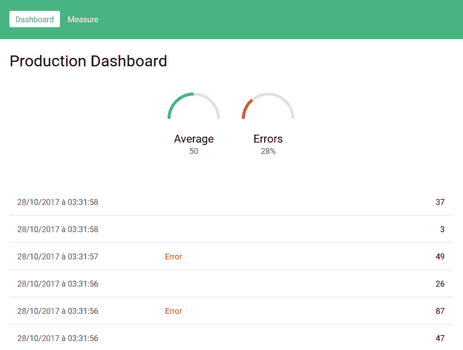
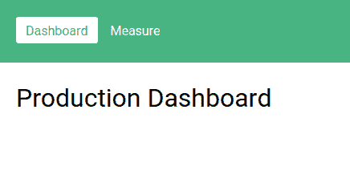
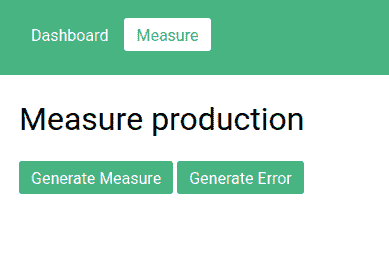
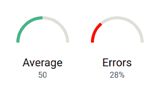

# 第八章：项目 6 - 使用 Meteor 的实时仪表板

在这最后一章中，我们将使用 Vue 与完全不同的堆栈--Meteor！

我们将发现这个全栈 JavaScript 框架，并构建一个实时监控一些产品生产的仪表板。我们将涵盖以下主题：

+   安装 Meteor 并设置项目

+   使用 Meteor 方法将数据存储到 Meteor 集合中

+   订阅集合并在我们的 Vue 组件中使用数据

该应用程序将有一个主页面，其中包含一些指标，例如：



它还将有另一个页面，其中有按钮可以生成虚假的测量数据，因为我们没有真正的传感器可用。

# 设置项目

在这第一部分中，我们将介绍 Meteor，并在该平台上运行一个简单的应用程序。

# 什么是 Meteor？

Meteor 是一个用于构建 Web 应用程序的全栈 JavaScript 框架。

Meteor 堆栈的主要元素如下：

+   Web 客户端（可以使用任何前端库，如 React 或 Vue）；它有一个名为 Minimongo 的客户端数据库

+   基于 nodejs 的服务器；支持现代的 ES2015+功能，包括`import/export`语法

+   在服务器上使用 MongoDB 的实时数据库

+   客户端和服务器之间的通信是抽象的；客户端和服务器端数据库可以轻松实时同步

+   可选的混合移动应用程序（Android 和 iOS），一条命令构建

+   集成开发工具，如强大的命令行实用程序和易于使用的构建工具

+   Meteor 特定的包（但您也可以使用 npm 包）

如您所见，JavaScript 随处可见。Meteor 还鼓励您在客户端和服务器之间共享代码。

由于 Meteor 管理整个堆栈，它提供了非常强大且易于使用的系统。例如，整个堆栈是完全反应式和实时的--如果客户端发送更新到服务器，所有其他客户端将接收新数据，并且他们的用户界面将自动更新。

Meteor 有自己的构建系统称为"IsoBuild"，并且不使用 Webpack。它专注于易用性（无需配置），但结果也较不灵活。

# 安装 Meteor

如果您的系统上没有 Meteor，您需要打开官方 Meteor 网站上的安装指南[`www.meteor.com/install`](https://www.meteor.com/install)。按照您的操作系统在那里安装 Meteor。

完成后，您可以使用以下命令检查 Meteor 是否已正确安装：

```js
meteor --version
```

应显示 Meteor 的当前版本。

# 创建项目

现在 Meteor 已安装，让我们设置一个新项目：

1.  让我们使用`meteor create`命令创建我们的第一个 Meteor 项目：

```js
 meteor create --bare <folder>
 cd <folder>
```

`--bare`参数告诉 Meteor 我们想要一个空项目。默认情况下，Meteor 会生成一些我们不需要的样板文件，因此这样可以避免我们不得不删除它们。

1.  然后，我们需要两个特定于 Meteor 的软件包——一个用于编译 Vue 组件，一个用于在这些组件内部编译 Stylus。使用`meteor add`命令安装它们：

```js
 meteor add akryum:vue-component akryum:vue-stylus
```

1.  我们还将从 npm 安装`vue`和`vue-router`软件包：

```js
 meteor npm i -S vue vue-router
```

请注意，我们使用`meteor npm`命令，而不是只用`npm`。这是为了与 Meteor（nodejs 和 npm 版本）保持相同的环境。

1.  要在开发模式下启动我们的 Meteor 应用程序，只需运行`meteor`命令：

```js
 meteor
```

Meteor 应该启动一个 HTTP 代理、一个 MongoDB 和 nodejs 服务器：


它还显示了应用程序可用的 URL；但是，如果您现在打开它，它将是空白的。

# 我们的第一个 Vue Meteor 应用程序

在本节中，我们将在我们的应用程序中显示一个简单的 Vue 组件：

1.  在项目目录中创建一个新的`index.html`文件，并告诉 Meteor 我们希望在页面主体中有`app` id 的`div`：

```js
      <head>
        <title>Production Dashboard</title>
      </head>
      <body>
        <div id="app"></div>
      </body>
```

这不是一个真正的 HTML 文件。这是一种特殊的格式，我们可以向最终 HTML 页面的`head`或`body`部分注入附加元素。在这里，Meteor 将在`head`部分添加一个`title`，在`body`部分添加`<div>`。

1.  在`client`文件夹中创建一个新的`components`子文件夹，并创建一个名为`App.vue`的新组件，其中包含一个简单的模板：

```js
      <!-- client/components/App.vue -->
      <template>
        <div id="#app">
          <h1>Meteor</h1>
        </div>
      </template>
```

1.  在`client`文件夹中下载（[`github.com/Akryum/packt-vue-project-guide/tree/master/chapter8-full/client`](https://github.com/Akryum/packt-vue-project-guide/tree/master/chapter8-full/client)）这个 stylus 文件，并将其添加到主`App.vue`组件中：

```js
      <style lang="stylus" src="../style.styl" />
```

1.  在`client`文件夹中创建一个`main.js`文件，该文件在`Meteor.startup`钩子内启动 Vue 应用程序：

```js
      import { Meteor } from 'meteor/meteor'
      import Vue from 'vue'
      import App from './components/App.vue'

      Meteor.startup(() => {
        new Vue({
          el: '#app',
          ...App,
        })
      })
```

在 Meteor 应用程序中，建议您在`Meteor.startup`钩子内创建 Vue 应用程序，以确保在启动前端之前所有 Meteor 系统都已准备就绪。此代码仅在客户端上运行，因为它位于`client`文件夹中。

现在您应该在浏览器中看到一个简单的应用程序。您还可以打开 Vue devtools 并检查页面上是否有 `App` 组件。

# 路由

让我们为应用程序添加一些路由；我们将有两个页面--带有指标的仪表板和一个带有生成虚假数据按钮的页面：

1.  在 `client/components` 文件夹中，创建两个新组件--`ProductionGenerator.vue` 和 `ProductionDashboard.vue`。

1.  在 `main.js` 文件旁边，创建一个 `router.js` 文件来创建路由：

```js
      import Vue from 'vue'
      import VueRouter from 'vue-router'

      import ProductionDashboard from 
      './components/ProductionDashboard.vue'
      import ProductionGenerator from 
      './components/ProductionGenerator.vue'

      Vue.use(VueRouter)

      const routes = [
        { path: '/', name: 'dashboard', component: ProductionDashboard 
        },
        { path: '/generate', name: 'generate',
          component: ProductionGenerator },
      ]

      const router = new VueRouter({
        mode: 'history',
        routes,
      })

      export default router
```

1.  然后，在 `main.js` 文件中导入路由并将其注入到应用程序中，就像我们在 第五章 中所做的那样，*项目 3 - 支持中心*。

1.  在 `App.vue` 主组件中，添加导航菜单和路由视图：

```js
      <nav>
        <router-link :to="{ name: 'dashboard' }" exact>Dashboard
          </router-link>
        <router-link :to="{ name: 'generate' }">Measure</router-link>
      </nav>
      <router-view />
```

我们应用程序的基本结构现在已经完成：



# 生产度量

我们将制作的第一个页面是度量页面，我们将在其中有两个按钮：

+   第一个将生成一个带有当前 `date` 和随机 `value` 的虚假生产度量

+   第二个将生成一个度量，但 `error` 属性设置为 `true`

所有这些度量将存储在一个名为 "Measures" 的集合中。

# Meteor 集合集成

Meteor 集合是一个响应式对象列表，类似于 MongoDB 集合（实际上，它在内部使用 MongoDB）。

我们需要使用一个 Vue 插件来将 Meteor 集合集成到我们的 Vue 应用程序中，以便自动更新它：

1.  添加 `vue-meteor-tracker` npm 包：

```js
 meteor npm i -S vue-meteor-tracker
```

1.  然后，将库安装到 Vue 中：

```js
      import VueMeteorTracker from 'vue-meteor-tracker'

      Vue.use(VueMeteorTracker)
```

1.  使用 `meteor` 命令重新启动 Meteor。

应用程序现在知道了 Meteor 集合，我们可以在我们的组件中使用它们，就像我们马上要做的那样。

# 设置数据

下一步是设置我们将存储度量数据的 Meteor 集合。

# 添加一个集合

我们将把我们的度量存储到一个 `Measures` Meteor 集合中。在项目目录中创建一个新的 `lib` 文件夹。该文件夹中的所有代码将首先在客户端和服务器上执行。创建一个 `collections.js` 文件，在其中我们将声明我们的 `Measures` 集合：

```js
import { Mongo } from 'meteor/mongo'

export const Measures = new Mongo.Collection('measures')
```

# 添加一个 Meteor 方法

`Meteor` 方法是一个特殊的函数，将在客户端和服务器上都被调用。这对于更新集合数据非常有用，并将改善应用程序的感知速度--客户端将在 minimongo 上执行，而不必等待服务器接收和处理它。

这种技术称为“乐观更新”，在网络质量不佳时非常有效。

1.  在`lib`文件夹中的`collections.js`文件旁边，创建一个新的`methods.js`文件。然后，添加一个`measure.add`方法，将新的测量插入到`Measures`集合中：

```js
      import { Meteor } from 'meteor/meteor'
      import { Measures } from './collections'

      Meteor.methods({
        'measure.add' (measure) {
          Measures.insert({
            ...measure,
            date: new Date(),
          })
        },
      })
```

我们现在可以使用`Meteor.call`函数调用这个方法：

```js
Meteor.call('measure.add', someMeasure)
```

该方法将在客户端（使用名为 minimongo 的客户端数据库）和服务器上运行。这样，客户端的更新将是即时的。

# 模拟测量

不要再拖延了，让我们构建一个简单的组件，调用这个`measure.add` Meteor 方法：

1.  在`ProductionGenerator.vue`的模板中添加两个按钮：

```js
      <template>
        <div class="production-generator">
          <h1>Measure production</h1>

          <section class="actions">
            <button @click="generateMeasure(false)">Generate 
            Measure</button>
            <button @click="generateMeasure(true)">Generate 
            Error</button>
          </section>
        </div>
      </template>
```

1.  然后，在组件脚本中，创建`generateMeasure`方法来生成一些虚拟数据，然后调用`measure.add` Meteor 方法：

```js
      <script>
      import { Meteor } from 'meteor/meteor'

      export default {
        methods: {
          generateMeasure (error) {
            const value = Math.round(Math.random() * 100)
            const measure = {
              value,
              error,
            }
            Meteor.call('measure.add', measure)
          },
        },
      }
      </script>
```

组件应该是这样的：



如果您点击按钮，不应该有任何可见的变化。

# 检查数据

有一种简单的方法可以检查我们的代码是否有效，并验证您是否可以在`Measures`集合中添加项目。我们可以用一条命令连接到`MongoDB`数据库。

在另一个终端中，运行以下命令连接到应用程序的数据库：

```js
meteor mongo
```

然后，输入这个 MongoDB 查询，以获取`measures`集合的文档（在创建`Measures`Meteor 集合时使用的参数）：

```js
db.measures.find({})
```

如果您点击了按钮，应该显示一列测量文档：


这意味着我们的 Meteor 方法有效，并且对象已插入到我们的 MongoDB 数据库中。

# 仪表板和报告

现在我们的第一页做好了，我们可以继续实时仪表板。

# 进度条库

为了显示一些漂亮的指示器，让我们安装另一个 Vue 库，允许沿 SVG 路径绘制进度条；这样，我们可以有半圆形的进度条：

1.  将`vue-progress-path`npm 包添加到项目中：

```js
 meteor npm i -S vue-progress-path
```

我们需要告诉 Meteor 的 Vue 编译器不要处理安装包的`node_modules`中的文件。

1.  在项目根目录创建一个新的`.vueignore`文件。这个文件像`.gitignore`一样工作：每一行都是忽略某些路径的规则。如果以斜杠`/`结尾，它将只忽略相应的文件夹。因此，`.vueignore`的内容应该如下所示：

```js
      node_modules/
```

1.  最后，在`client/main.js`文件中安装`vue-progress-path`插件：

```js
 import 'vue-progress-path/dist/vue-progress-path.css'
      import VueProgress from 'vue-progress-path'

      Vue.use(VueProgress, {
        defaultShape: 'semicircle',
      })
```

# Meteor 发布

为了同步数据，客户端必须订阅服务器上声明的发布。Meteor 发布是一个返回 Meteor 集合查询的函数。它可以接受参数来过滤将要同步的数据。

对于我们的应用程序，我们只需要一个简单的`measures`发布，它发送`Measures`集合的所有文档：

1.  这段代码应该只在服务器上运行。因此，在`project`文件夹中创建一个新的`server`，并在该文件夹内创建一个新的`publications.js`文件：

```js
      import { Meteor } from 'meteor/meteor'
      import { Measures } from '../lib/collections'

      Meteor.publish('measures', function () {
        return Measures.find({})
      })
```

这段代码只会在服务器上运行，因为它位于一个名为`server`的文件夹中。

# 创建仪表板组件

我们已经准备好构建我们的`ProductionDashboard`组件。由于我们之前安装的`vue-meteor-tracker`，我们有一个新的组件定义选项--`meteor`。这是一个描述需要订阅的发布和需要为该组件检索的集合数据的对象。

1.  添加以下带有`meteor`定义选项的脚本部分：

```js
      <script>
      export default {
        meteor: {
          // Subscriptions and Collections queries here
        },
      }
      </script>
```

1.  在`meteor`选项内，使用`$subscribe`对象订阅`measures`发布：

```js
      meteor: {
        $subscribe: {
          'measures': [],
        },
      },
```

空数组意味着我们没有向发布传递参数。

1.  使用`meteor`选项内的`Measures` Meteor 集合上的查询来检索测量值：

```js
      meteor: {
        // ...

        measures () {
          return Measures.find({}, {
            sort: { date: -1 },
          })
        },
      },
```

`find`方法的第二个参数是一个选项对象，非常类似于 MongoDB JavaScript API。在这里，我们通过选项对象的`sort`属性，按照它们的日期降序排序文档。

1.  最后，创建`measures`数据属性，并将其初始化为空数组。

组件的脚本现在应该是这样的：

```js
      <script>
      import { Measures } from '../../lib/collections'

      export default {
        data () {
          return {
            measures: [],
          }
        },

        meteor: {
          $subscribe: {
            'measures': [],
          },

          measures () {
            return Measures.find({}, {
              sort: { date: -1 },
            })
          },
        },
      }
      </script>
```

在浏览器开发工具中，您现在可以检查组件是否已从集合中检索到项目。

# 指标

我们将为仪表板指标创建一个单独的组件，如下所示：

1.  在`components`文件夹中，创建一个新的`ProductionIndicator.vue`组件。

1.  声明一个模板，显示进度条、标题和额外的信息文本：

```js
      <template>
        <div class="production-indicator">
          <loading-progress :progress="value" />
          <div class="title">{{ title }}</div>
          <div class="info">{{ info }}</div>
        </div>
      </template>
```

1.  添加`value`，`title`和`info`属性：

```js
      <script>
      export default {
        props: {
          value: {
            type: Number,
            required: true,
          },
          title: String,
          info: [String, Number],
        },
      }
      </script>
```

1.  回到我们的`ProductionDashboard`组件，让我们计算平均值和错误率：

```js
      computed: {
        length () {
          return this.measures.length
        },

        average () {
          if (!this.length) return 0
          let total = this.measures.reduce(
            (total, measure) => total += measure.value,
            0
          )
          return total / this.length
        },

        errorRate () {
          if (!this.length) return 0
          let total = this.measures.reduce(
            (total, measure) => total += measure.error ? 1 : 0,
            0
          )
          return total / this.length
        },
      },
```

在前面的代码片段中，我们使用`length`计算属性缓存了`measures`数组的长度。

1.  在模板中添加两个指标 - 一个用于平均值，一个用于错误率：

```js
      <template>
        <div class="production-dashboard">
          <h1>Production Dashboard</h1>

          <section class="indicators">
            <ProductionIndicator
              :value="average / 100"
              title="Average"
              :info="Math.round(average)"
            />
            <ProductionIndicator
              class="danger"
              :value="errorRate"
              title="Errors"
              :info="`${Math.round(errorRate * 100)}%`"
            />
```

```js
          </section>
        </div>
      </template>
```

不要忘记将`ProductionIndicator`导入到组件中！

指标应该是这样的：



# 列出测量

最后，我们将在指示器下方显示测量列表：

1.  为每个测量添加一个简单的`<div>`元素列表，如果有错误则显示日期和值：

```js
      <section class="list">
        <div
          v-for="item of measures"
          :key="item._id"
        >
          <div class="date">{{ item.date.toLocaleString() }}</div>
          <div class="error">{{ item.error ? 'Error' : '' }}</div>
          <div class="value">{{ item.value }}</div>
        </div>
      </section>
```

应用程序现在应该如下所示，带有导航工具栏、两个指示器和测量列表：


如果您在另一个窗口中打开应用程序并将窗口并排放置，您可以看到 Meteor 的全栈响应性。在一个窗口中打开仪表板，在另一个窗口中打开生成器页面。然后，添加虚拟测量，并观察另一个窗口中的数据实时更新。

如果您想了解更多关于 Meteor 的信息，请访问官方网站([`www.meteor.com/developers`](https://www.meteor.com/developers))和 Vue 集成存储库([`github.com/meteor-vue/vue-meteor`](https://github.com/meteor-vue/vue-meteor))。

# 总结

在这最后一章中，我们使用了一个名为 Meteor 的新全栈框架创建了一个项目。我们将 Vue 集成到应用程序中，并设置了一个 Meteor 响应式集合。使用 Meteor 方法，我们将文档插入到集合中，并实时在仪表板组件中显示数据。

这本书可能已经结束了，但你使用 Vue 的旅程才刚刚开始。我们从模板和响应式数据的基本概念开始，编写简单的应用程序，而无需任何构建工具。即使没有太多负担，我们也能制作一个 Mardown 笔记本，甚至是带有动画的浏览器卡牌游戏。然后，我们开始使用我们可以使用的全部工具来制作更大的应用程序。官方命令行工具--vue-cli--在搭建项目方面非常有帮助。单文件组件（`.vue`文件）使组件易于维护和演变。我们甚至可以非常轻松地使用预处理语言，比如 stylus。vue-router 官方库是管理多个页面的必备工具，就像我们在第五章中所做的那样，*项目 3-支持中心*，具有良好的用户系统和私有路由。接下来，我们通过使用官方的 Vuex 库，在可扩展和安全的方式上构建了具有高级功能的地理定位博客，比如 Google OAuth 和 Google Maps。然后，我们通过使用 ESLint 提高了我们在线商店代码的质量，并为我们的组件编写了单元测试。我们甚至为应用程序添加了本地化和服务器端渲染，所以现在它具有非常专业的感觉。

你现在可以通过改进我们构建的项目来练习，甚至可以开始你自己的项目。使用 Vue 将提高你的技能，但你也可以参加活动，在线与社区交流，参与其中（[`github.com/vuejs/vue`](https://github.com/vuejs/vue)），或帮助他人学习 Vue。分享你的知识只会增加你自己的知识，你会变得更擅长你所做的事情。
