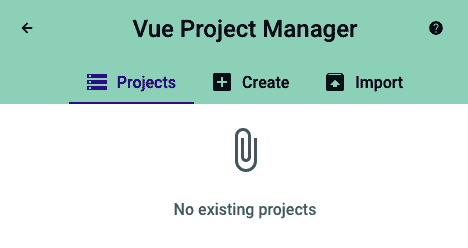
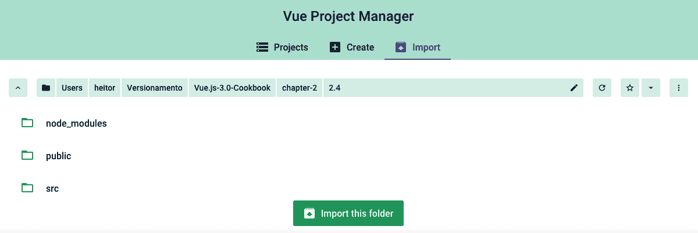
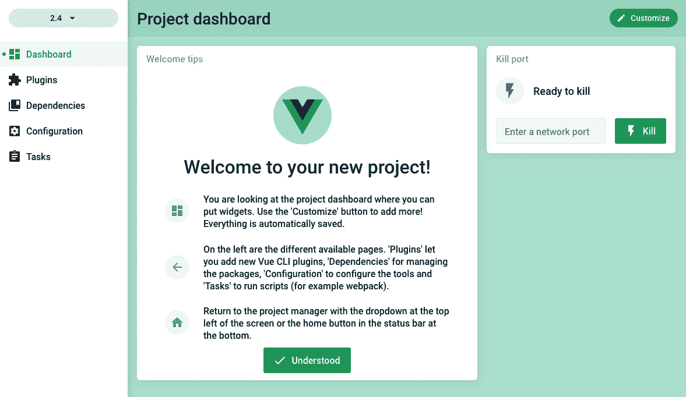
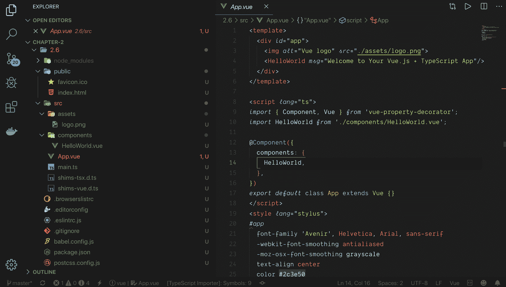

介绍 TypeScript 和 Vue 生态系统

TypeScript 是一种基于 Vue 的新语言，在**Vue 3**上得到了充分支持。现在可以使用类型化的 JSX（也称为 TSX），类型注解，代码的静态验证等等。

Vue 生态系统每天都在变得更加庞大，为了帮助我们，Vue 团队开发了一些工具来改善项目处理和管理。这些工具是 Vue CLI 和 Vue UI，它们是本地 Vue 开发的主要工具。

Vue CLI 工具是每个项目的开始；通过它，你可以选择基本功能或者你之前创建的预设，来创建一个新的 Vue 项目。项目创建后，你可以使用 Vue UI 来管理项目，添加新功能，检查项目的状态，以及几乎可以在命令行界面（CLI）中做的所有事情，还有更多功能。

在这些章节中，你将更多地了解 TypeScript 作为 JavaScript 的扩展，以及如何使用 Vue CLI 工具和 Vue UI 一起来启动和运行整个应用程序。

在本章中，我们将涵盖以下内容：

+   创建一个 TypeScript 项目

+   理解 TypeScript

+   创建你的第一个 TypeScript 类

+   使用 Vue CLI 创建你的第一个项目

+   使用 Vue UI 向 Vue CLI 项目添加插件

+   将 TypeScript 添加到 Vue CLI 项目中

+   使用`vue-class-component`创建你的第一个 TypeScript Vue 组件

+   使用`vue-class-component`创建自定义 mixin

+   使用`vue-class-component`创建自定义函数装饰器

+   将自定义钩子添加到`vue-class-component`

+   将`vue-property-decorator`添加到`vue-class-component`

# 第三章：技术要求

在本章中，我们将使用**Node.js**，**Vue CLI**和**TypeScript**。

注意，Windows 用户需要安装一个名为`windows-build-tools`的 npm 包，以便安装以下所需的包。要做到这一点，以管理员身份打开 PowerShell 并执行以下命令：

`> npm install -g windows-build-tools`。

要安装**Vue CLI**工具，打开终端（macOS 或 Linux）或命令提示符/PowerShell（Windows），执行以下命令：

```js
> npm install -g @vue/cli @vue/cli-service-global
```

要安装**TypeScript**，打开终端（macOS 或 Linux）或命令提示符/PowerShell（Windows），执行以下命令：

```js
> npm install -g typescript
```

# 创建一个 TypeScript 项目

TypeScript 是 JavaScript 的类型扩展，在编译时会生成纯 JavaScript 代码。它看起来像是一种新语言，但最终还是 JavaScript。

使用 TypeScript 的优势是什么？主要优势在于类型化的语法，有助于静态检查和代码重构。您仍然可以使用所有 JavaScript 库，并且可以直接使用最新的 ECMAScript 功能进行编程。

编译后，TypeScript 将生成一个纯 JavaScript 文件，可以在任何浏览器、Node.js 或任何能够执行 ECMAScript 3 或更新版本的 JavaScript 引擎上运行。

## 准备工作

要启动我们的项目，我们需要创建一个`npm`项目。打开终端（macOS 或 Linux）或命令提示符/PowerShell（Windows），并执行以下命令：

```js
> npm init -y
```

您还需要安装 TypeScript，因此打开终端（macOS 或 Linux）或命令提示符/PowerShell（Windows），并执行以下命令：

```js
> npm install typescript --only=dev
```

## 如何操作...

环境准备就绪后，我们需要启动我们的 TypeScript 项目。让我们创建一个`.ts`文件并进行编译：

1.  要启动我们的 TypeScript 项目，打开终端（macOS 或 Linux）或命令提示符/PowerShell（Windows），并执行以下命令：

```js
> tsc --init
```

这将在我们的文件夹中创建一个`tsconfig.json`文件。这是一个编译器设置文件。在这里，您可以定义目标，开发中可用的 JavaScript 库，目标 ECMAScript 版本，模块生成等等。

在为 Web 开发时，不要忘记在`tsconfig.json`文件的`compilerOption`属性中添加**文档对象模型**（**DOM**）库，这样在开发时就可以访问 window 和 document 对象。

1.  现在，我们需要创建我们的`index.ts`文件。让我们在`index.ts`文件中创建一些简单的代码，以便在终端中记录一个数学计算：

```js
function sum(a: number, b: number): number {
    return a + b;
}

const firstNumber: number = 10;

const secondNumber: number = 20;

console.log(sum(firstNumber, secondNumber));
```

这个函数接收两个参数，`a`和`b`，它们的类型都设置为`number`，并且函数预计返回一个`number`。我们创建了两个变量，`firstNumber`和`secondNumber`，在这种情况下都设置为`number`类型——分别是`10`和`20`，因此，将它们传递给函数是有效的。如果我们将它们设置为其他类型，比如字符串、布尔值、浮点数或数组，编译器会在变量和函数执行的静态类型检查方面抛出错误。

1.  现在，我们需要将这段代码编译成 JavaScript 文件。打开终端（macOS 或 Linux）或命令提示符/PowerShell（Windows），并执行以下命令：

```js
> tsc ./index.ts
```

编译后，我们可以在`index.js`中看到最终文件。如果我们查看文件内部，最终代码将类似于这样：

```js
function sum(a, b) {
    return a + b;
}
var firstNumber = 10;
var secondNumber = 20;
console.log(sum(firstNumber, secondNumber));
```

你可能会想：“我的类型在哪里？”由于 ECMAScript 是一种动态语言，TypeScript 的类型只存在于超集级别，并不会传递到 JavaScript 文件中。

你的最终 JavaScript 文件将以转译文件的形式存在，其中包含在`tsconfig.json`文件中定义的配置。

## 它是如何工作的...

当我们创建 TypeScript 项目时，一个名为`tsconfig.json`的文件会在我们的文件夹中创建。这个文件协调了编译器和开发过程中的静态类型检查的所有规则。所有的开发都基于这个文件中定义的规则。每个环境都依赖于需要导入的特定规则和库。

在开发过程中，我们可以直接为常量、变量、函数参数、返回值等分配类型。这些类型定义可以防止基本类型错误和代码重构。

开发完成并编译项目后，最终产品将是一个纯 JavaScript 文件。由于 JavaScript 的动态类型，这个文件不会有任何类型检查。

这个 JavaScript 文件被转译成目标模型，并在配置文件中定义，所以我们可以无问题地执行它。

## 另请参阅

您可以在[`www.typescriptlang.org/docs/home.html`](https://www.typescriptlang.org/docs/home.html)找到有关 TypeScript 的更多信息。

有一个关于从 JavaScript 迁移的指南在[`www.typescriptlang.org/docs/handbook/migrating-from-javascript.html`](https://www.typescriptlang.org/docs/handbook/migrating-from-javascript.html)。

可以在[`www.typescriptlang.org/docs/handbook/typescript-in-5-minutes.html`](https://www.typescriptlang.org/docs/handbook/typescript-in-5-minutes.html)找到一个关于 TypeScript 的 5 分钟课程。

# 了解 TypeScript

TypeScript 是一种基于类型的语言。它的很多功能来自于能够使用静态代码分析与 JavaScript。这得益于存在于 TypeScript 环境内的工具。

这些工具包括编译器，在开发过程中和编译后可以提供静态分析，以及 ECMAScript 转译器，可以使您的代码在几乎任何 JavaScript 引擎上运行。

让我们更多地了解这种语言，以及它是如何工作的。

## 准备好了吗？

首先，我们需要创建一个`npm`项目。打开 Terminal（macOS 或 Linux）或 Command Prompt/PowerShell（Windows）并执行以下命令：

```js
> npm init -y
```

您还需要安装 TypeScript，因此打开 Terminal（macOS 或 Linux）或 Command Prompt/PowerShell（Windows）并执行以下命令：

```js
> npm install typescript --only=dev
```

## 类型

使用 TypeScript 的主要特性是**类型**。在本节中，我们将学习有关类型的知识，如何声明它们以及如何使用它们。

这些是静态类型语言中的一些基本类型：

+   字符串

+   数字

+   布尔

+   数组

+   元组

+   枚举

+   任意

+   空

+   对象

让我们谈谈其中一些类型，并展示它们在 TypeScript 中的使用方式。

### 字符串

JavaScript 中的所有文本数据都将被视为**字符串**。要声明一个字符串，我们总是需要用双引号`(")`或单引号`(')`括起来，或者用反引号`(`)`，通常称为模板字符串。

在文本中声明模板字符串对 TypeScript 来说不是问题。模板字符串是 ECMAScript 中的一个功能，它使得可以在字符串中添加变量而无需进行连接：

```js
const myText: string = 'My Simple Text';
const myTextAgain: string = "My Simple Text";
const greeting: string = `Welcome back ${myName}!`;
```

### 数字

在 JavaScript 中，所有数字都是浮点值。在 TypeScript 中也是如此。这些数字得到了**数字**类型。除了十六进制和十进制数字外，ECMAScript 2015 中引入的二进制和八进制字面量也被视为数字：

```js
const myAge: number = 31;
const hexNumber: number = 0xf010d;
const binaryNumber: number = 0b1011;
const octalNumber: number = 0o744;
```

### 布尔

编程语言中最基本的类型是**布尔**值——简单的 1 或 0，true 或 false。这被称为**布尔**：

```js
const isTaskDone: boolean = false;
const isGreaterThen: boolean = 10 > 5;
```

### 数组

大多数语言中的一组元素通常被称为**数组**。在 TypeScript 中，我们可以以两种不同的方式声明它。

最简单的方法就是声明元素的类型，后面跟着`[]`（方括号）来表示它是一个声明类型的**数组**：

```js
const primeNumbers: number[] = [1, 3, 5, 7, 11];
```

或者，您可以使用`Array<type>`声明进行通用声明。这不是最常用的方式，但根据您正在开发的代码，您可能需要使用它：

```js
const switchInstructions: Array<boolean> = [true, false, false, true];
```

### 元组

**元组**是一种具有特定结构的变量类型。在结构上，元组是一个包含两个元素的数组；这两个元素由编译器和用户知道其类型，但这些元素不需要具有相同的类型：

```js
let person: [string, number];
person = ['Heitor', 31];

console.log(`My name is ${person[0]} and I am ${person[1]} years old`);
```

如果尝试访问已知索引之外的元素，将会收到错误。

### 枚举

**枚举**类似于 JavaScript 对象，但它们具有一些特殊的属性，可以帮助开发应用程序。您可以为数字值设置友好的名称，或者为函数可以接受的变量的常量提供更受控制的环境。

可以创建一个数字枚举而不需要任何声明。通过这样做，它将从`0`的初始值开始，并以最终索引号的值结束；或者，您可以通过传递枚举值的索引来获取枚举的名称：

```js
enum ErrorLevel { 
    Info, 
    Debug, 
    Warning, 
    Error, 
    Critical,
}

console.log(ErrorLevel.Error); // 3
console.log(ErrorLevel[3]); // Error
```

或者，可以声明一个带有值的枚举。它可以是 TypeScript 编译器将解释其余元素作为第一个元素的增量，或者是一个单独的声明：

```js
enum Color {
    Red = '#FF0000',
    Blue = '#0000FF',
    Green = '#00FF00',
}

enum Languages {
    JavaScript = 1,
    PHP,
    Python,
    Java = 10,
    Ruby,
    Rust,
    TypeScript,
}

console.log(Color.Red) // '#FF0000'
console.log(Languages.TypeScript) // 13
```

### 任意

由于 JavaScript 是一种动态语言，TypeScript 需要实现一个没有定义值的类型，因此它实现了**any**类型。any 类型最常用的情况是在使用来自第三方库的值时。在这种情况下，我们知道我们正在放弃类型检查：

```js
let maybeIs: any = 4;
maybeIs = 'a string?';
maybeIs = true;
```

任何类型的主要用途是当您将传统 JavaScript 项目升级到 TypeScript 时，您可以逐渐向变量和函数添加类型和验证。

### 空

与 any 相反，**void**是完全没有类型的。最常用的情况是在不返回任何值的函数中：

```js
function logThis(str: string): void{
    console.log(str);
}
```

使用 void 来对变量进行类型设置是没有意义的，因为它只能被赋值为 undefined 和 null。

### 对象

TypeScripts 中的**对象**有一种特殊的声明形式，因为它可以声明为接口，作为直接的**对象**，或者作为自己的类型。

将对象声明为接口时，您必须在使用之前声明接口，必须传递所有属性，并且需要设置类型：

```js
interface IPerson {
    name: string;
    age: number;
}

const person: IPerson = {
    name: 'Heitor',
    age: 31,
};
```

在将对象作为直接输入传递给函数时，有时是常见的：

```js
function greetingUser(user: {name: string, lastName: string}) {
    console.log(`Hello, ${user.name} ${user.lastName}`);
}
```

最后，它们用于声明对象的类型并重用它：

```js
type Person = {
    name: string,
    age: number,
};

const person: Person = {
    name: 'Heitor',
    age: 31,
};

console.log(`My name is ${person.name}, I am ${person.age} years old`);
```

### 函数

在 TypeScript 中，最难声明的类型之一是**函数**。它可以在一个简单的函数链的连接中变得非常复杂。

在 TypeScript 中声明函数是函数将接收的参数和函数将返回的最终类型的组合。

你可以在常量内声明一个简单的函数，就像这样：

```js
const sumOfValues: (a:number, b:number): number = (a: number, b: number): number => a + b;
```

一个更复杂的函数在常量内声明可以像这样声明：

```js
const complexFunction: (a: number) => (b:number) => number = (a: number): (b: number) => number => (b: number): number => a + b;
```

当声明一个函数作为普通函数时，其类型方式几乎与常量方式相同，但你不需要声明这些函数是一个函数。以下是一个例子：

```js
function foo(a: number, b:number): number{
    return a + b;
}
```

## 接口

TypeScript 检查变量的值是否是正确的类型，同样的原则也适用于类、对象或代码之间的合同。这通常被称为“鸭子类型”或“结构子类型”。接口存在是为了填补这个空间并定义这些合同或类型。

让我们尝试通过这个例子来理解一个**接口**：

```js
function greetingStudent(student: {name: string}){
    console.log(`Hello ${student.name}`);
}

const newStudent = {name: 'Heitor'};

greetingStudent(newStudent);
```

这个函数将知道对象上有一个名为 name 的属性，并且可以调用它是有效的。

我们可以使用接口类型来重写它，以便更好地管理代码：

```js
interface IStudent {
    name: string;
    course?: string;
    readonly university: string;
}

function greetingStudent(student: IStudent){
    console.log(`Hello ${student.name}`);
    if(student.course){
        console.log(`Welcome to the ${student.course}` semester`);
    }
}

const newStudent: IStudent = { name: 'Heitor', university: 'UDF' };

greetingStudent(newStudent);
```

正如你所看到的，我们有一个新的属性叫做`course`，在它上面声明了一个`?`。这表示这个属性可以是 null 或 undefined。这被称为可选属性。

有一个声明为只读属性的属性。如果我们在变量创建后尝试更改它，我们将收到一个编译错误，因为它使属性变为只读。

## 装饰器

ECMAScript 6 引入了一个新特性——类。随着这些特性的引入，装饰器的使用也成为了 JavaScript 引擎上的可能。

**装饰器**提供了一种在类声明及其成员上添加注解和元编程语法的方式。由于它已经在 TC-39 委员会（其中**TC**代表**技术委员会**）上处于最终批准状态，TypeScript 编译器已经可以使用它。

要启用它，你可以在`tsconfig.json`文件中设置标志：

```js
{
    "compilerOptions": {
        "target": "ES5",
        "experimentalDecorators": true
    }
}
```

装饰器是一种特殊的声明，可以附加到类、方法、存取器属性或参数上。它们以`@expression`的形式使用，其中表达式是一个在运行时将被调用的函数。

一个可以应用于类的装饰器的例子可以在以下代码片段中看到：

```js
function classSeal(constructor: Function) {
    Object.seal(constructor);
    Object.seal(constructor.prototype);
}
```

当你创建这个函数时，你是在说构造函数的对象和它的原型将被封闭。

在类内部使用它非常简单：

```js
@classSeal
class Animal {
    sound: string;
    constructor(sound: string) {
        this.sound = sound;
    }
    emitSound() {
        return "The animal says, " + this.sound;
    }
}
```

这些只是一些装饰器及其功能的例子，可以帮助你使用 TypeScript 进行**面向对象编程**（**OOP**）的开发。

## 总结

总之，类型只是在使用 TypeScript 和 JavaScript 进行开发过程中让我们的生活变得更加轻松的一种方式。

因为 JavaScript 是一种动态语言，没有静态类型，TypeScript 中声明的所有类型和接口都严格地只被 TypeScript 使用。这有助于编译器捕捉错误、警告，并且语言服务器可以帮助**集成开发环境**（**IDE**）在开发过程中分析你的代码。

这是 TypeScript 的基本介绍，涵盖了有关这种类型语言的基础知识，以及如何理解和使用它。关于它的使用还有很多要学习，比如泛型、模块、命名空间等等。

通过这个介绍，你可以了解新的**Vue 3**核心是如何工作的，以及如何在项目中使用 TypeScript 的基础知识，并利用项目中的类型语言。

关于 TypeScript，总是有更多的知识可以获取，因为它是建立在 JavaScript 之上的一种不断发展的“语言”，并且拥有一个不断增长的社区。

不要忘记查看 TypeScript 文档，以了解更多信息，以及它如何从现在开始改进你的代码。

## 另请参阅

你可以在[`www.typescriptlang.org/docs/handbook/basic-types.html`](https://www.typescriptlang.org/docs/handbook/basic-types.html)找到有关 TypeScript 基本类型的更多信息。

你可以在[`www.typescriptlang.org/docs/handbook/functions.html`](https://www.typescriptlang.org/docs/handbook/functions.html)找到有关 TypeScript 函数的更多信息。

你可以在[`www.typescriptlang.org/docs/handbook/enums.html`](https://www.typescriptlang.org/docs/handbook/enums.html)找到有关 TypeScript 枚举的更多信息。

你可以在[`www.typescriptlang.org/docs/handbook/advanced-types.html`](https://www.typescriptlang.org/docs/handbook/advanced-types.html)找到有关 TypeScript 高级类型的更多信息。

你可以在[`www.typescriptlang.org/docs/handbook/decorators.html`](https://www.typescriptlang.org/docs/handbook/decorators.html)找到有关 TypeScript 装饰器的更多信息。

在[`rmolinamir.github.io/typescript-cheatsheet/#types`](https://rmolinamir.github.io/typescript-cheatsheet/#types)上查看 TypeScript 类型的速查表。

# 创建你的第一个 TypeScript 类

在 TypeScript 中，没有一种主要的范式来编写程序。你可以选择面向对象的、结构化的，甚至是函数式的。

在大多数情况下，我们会看到使用面向对象编程范例。在这个配方中，我们将学习如何在 TypeScript 中创建一个类，它的继承，接口，以及代码中可以使用的其他属性。

## 做好准备

要开始我们的项目，我们需要创建一个`npm`项目。要做到这一点，打开终端（macOS 或 Linux）或命令提示符/PowerShell（Windows），并执行以下命令：

```js
> npm init -y
```

您还需要安装 TypeScript**。**要做到这一点，打开终端（macOS 或 Linux）或命令提示符/PowerShell（Windows），并执行以下命令：

```js
> npm install typescript --only=dev
```

## 如何做到这一点...

在 TypeScript 文件中编写类时，我们首先需要考虑这个类将做什么，这个类可以是什么，它如何通过继承被另一个类扩展，以及它如何在这个过程中受到影响。

想象一下，我们有一个基本的`Animal`类。这个类可以有一些基本属性，比如它的`name`，它是否发出`sound`，它的`family`，以及这种动物所吃的基本`food chain`。

1.  让我们从过程的基础开始，`food chain`。我们需要确保它是一个不可枚举的列表，并且每个使用它的文件最终都有相同的值。我们只需要调用一个常量变量：

```js
export enum FoodChainType {
    Carnivorous = 'carnivorous',
    Herbivorous = 'herbivorous',
    Omnivorous = 'omnivorous',
}
```

1.  现在，我们想为我们的动物制作基本的`interface`。我们知道我们的动物有一个`name`，可以发出一个`sound`，可以成为一个`family`的一部分，并且属于`food chain`类别。在类中使用接口，我们在类和将要暴露的内容之间建立了一个合同，有助于开发过程：

```js
interface IAnimal {
    name: string;
    sound?: string;
    family: string;
    foodChainType: FoodChainType;
}
```

1.  有了这一切，我们可以制作我们的`Animal`类。每个类都可以有它的构造函数。类构造函数可以很简单，只包含一些变量作为参数，也可以更复杂，有一个对象作为参数。如果你的构造函数将有任何参数，需要一个接口或声明每个参数的类型。在这种情况下，我们的构造函数将是一个对象，只有一个参数，与`Animal`相同，所以它将扩展`IAnimal`接口：

```js
interface IAnimalConstructor extends IAnimal { 
}
```

1.  现在，为了创建我们的类，我们声明了将要使用的接口和枚举。我们将首先声明该类将实现`IBasicAnimal`接口。为此，我们需要添加一些我们的类将具有的公共元素，并也声明这些元素。我们需要实现函数来显示它是什么动物以及它发出什么声音。现在，我们有了一个包含所有动物属性的基本类。它具有类和构造函数的单独接口。食物链的枚举以一种易于阅读的方式声明，因此该库的 JavaScript 导入可以无问题执行：

```js
interface IBasicAnimal extends IAnimal {
  whoAmI: () => void;
  makeSound: () => void;
}

export class Animal implements IBasicAnimal {
  public name: string;
  public sound: string;
  public family: string;
  public foodChainType: FoodChainType;

  constructor(params: IAnimalConstructor) {
    this.name = params.name;
    this.sound = params.sound || '';
    this.family = params.family;
    this.foodChainType = params.foodChainType;
  }

  public whoAmI(): void {
    console.log(`I am a ${this.name}, my family is ${this.family}. 
    My diet is ${this.foodChainType}.`);
    if (this.sound) {
      console.log([...Array(2).fill(this.sound)].join(', '));
    }
  }

  public makeSound(): void {
    console.log(this.sound);
  }
}
```

1.  让我们用几行代码扩展这个类，将这个`Animal`转换成`Dog`：

```js
import {Animal, FoodChainType} from './Animal';

class Dog extends Animal {
  constructor() {
    super({
      name: 'Dog',
      sound: 'Wof!',
      family: 'Canidae',
      foodChainType: FoodChainType.Carnivorous,
    });
  }n
}
```

这是一种简单的方式，通过扩展父类并使用父类的子类定义来组成一个几乎与父类具有相同接口的新类。

## 它是如何工作的...

TypeScript 中的类与 Java 或 C#等语言中的其他类一样工作。编译器在开发和编译过程中评估这些共同的原则。

在这种情况下，我们创建了一个简单的类，其中有一些公共属性是子类固有的。这些变量都是可读的，可以被改变。

## 还有更多...

在 TypeScript 中，我们有各种可能的类的用法，比如抽象类、特殊修饰符，以及将类用作接口。我们在这里只是涵盖了类的基础知识，为我们提供了一个良好的起点。如果你想深入了解，TypeScript 文档非常有帮助，并且有很多例子可以帮助学习过程。

## 另请参阅

您可以在[`www.typescriptlang.org/docs/handbook/classes.html`](https://www.typescriptlang.org/docs/handbook/classes.html)找到有关 TypeScript 类的更多信息。

在[`rmolinamir.github.io/typescript-cheatsheet/#classes`](https://rmolinamir.github.io/typescript-cheatsheet/#classes)上查看 TypeScript 类的速查表。

# 使用 Vue CLI 创建您的第一个项目

当 Vue 团队意识到开发人员在创建和管理他们的应用程序时遇到问题时，他们看到了一个机会，可以创建一个工具来帮助全世界的开发人员。Vue CLI 项目诞生了。

Vue CLI 工具是一个在终端命令中使用的 CLI 工具，如 Windows PowerShell、Linux Bash 或 macOS Terminal。它被创建为 Vue 开发的起点，开发人员可以开始一个项目并顺利地管理和构建它。Vue CLI 团队在开发时的重点是为开发人员提供更多时间来思考代码，花费更少的时间在工具上，以将他们的代码投入生产，添加新的插件或简单的`热模块重载`。

Vue CLI 工具被调整得无需在将其投入生产之前将您的工具代码弹出 CLI 之外。

当版本 3 发布时，Vue UI 项目被添加到 CLI 作为主要功能，将 CLI 命令转换为更完整的可视解决方案，并增加了许多新的功能和改进。

## 准备工作

此食谱的先决条件如下：

+   Node.js 12+

所需的 Node.js 全局对象如下：

+   `@vue/cli`

+   `@vue/cli-service-global`

## 如何做…

要创建 Vue CLI 项目，请按照以下步骤进行：

1.  我们需要打开 Terminal（macOS 或 Linux）或 Command Prompt/PowerShell（Windows）并执行以下命令：

```js
> vue create my-first-project
```

1.  CLI 将询问一些问题，这些问题将有助于创建项目。您可以使用箭头键进行导航，*Enter*键继续，*Spacebar*键选择选项：

```js
?  Please pick a preset: (Use arrow keys)  default (babel, eslint) ❯ **Manually select features** ‌
```

1.  有两种方法可以启动一个新项目。默认方法是一个基本的`babel`和`eslint`项目，没有任何插件或配置，还有`手动`模式，您可以选择更多的模式、插件、linters 和选项。我们将选择`手动`。

1.  现在，我们被问及我们将在项目中需要的功能。这些功能是一些 Vue 插件，如 Vuex 或 Router（Vue-Router）、测试工具、linters 等：

```js
?  Check the features needed for your project: (Use arrow keys)  ❯ Babel
 TypeScript Progressive Web App (PWA) Support Router Vuex  CSS Pre-processors  ❯  Linter / Formatter
 Unit Testing  ❯ **E2E Testing**
```

1.  对于这个项目，我们将选择`CSS 预处理器`并按*Enter*继续：

```js
?  Check the features needed for your project: (Use arrow keys) ❯ Babel
 TypeScript Progressive Web App (PWA) Support Router Vuex ❯ CSS Pre-processors ❯ **Linter / Formatter**
 Unit Testing **E2E Testing**
```

1.  可以选择要与 Vue 一起使用的主要**层叠样式表**（**CSS**）预处理器——`Sass`、`Less`和`Stylus`。由您选择哪种最适合您：

```js
?  Pick a CSS pre-processor (PostCSS, Autoprefixer and CSS Modules
  are supported by default): (Use arrow keys) Sass/SCSS (with dart-sass)  Sass/SCSS (with node-sass)  **Less** ❯ Stylus 
```

1.  现在是格式化您的代码的时候了。您可以在`AirBnB`、`Standard`和`Prettier`之间进行选择，并使用基本配置。那些在`ESLint`中导入的规则可以随时进行自定义，没有任何问题，并且有一个完美的规则适合您的需求。您知道什么对您最好：

```js
?  Pick a linter / formatter config: (Use arrow keys) ESLint with error prevention only ❯ **ESLint + Airbnb config** ESLint + Standard config 
  ESLint + Prettier
```

1.  设置完 linting 规则后，我们需要定义它们何时应用于您的代码。它们可以在保存时应用，也可以在提交时进行修复：

```js
?  Pick additional lint features: (Use arrow keys) **Lint on save** ❯ Lint and fix on commit
```

1.  在定义所有这些插件、linters 和处理器之后，我们需要选择设置和配置存储的位置。存储它们的最佳位置是在一个专用文件中，但也可以将它们存储在`package.json`文件中：

```js
?  Where do you prefer placing config for Babel, ESLint, etc.?  (Use arrow keys) ❯ **In dedicated config files** In package.json
```

1.  现在，您可以选择是否要将此选择设置为将来项目的预设，以便您无需再次重新选择所有内容：

```js
?  Save this as a preset for future projects?  (y/N) n
```

1.  CLI 将自动创建具有您在第一步中设置的名称的文件夹，安装所有内容并配置项目。

您现在可以浏览和运行项目了。Vue CLI 项目的基本命令如下：

+   `npm run serve`—用于在本地运行开发服务器

+   `npm run build`—用于构建和缩小应用程序以进行部署

+   `npm run lint`—对代码执行 lint

您可以通过 Terminal（macOS 或 Linux）或 Command Prompt/PowerShell（Windows）执行这些命令。

## 还有更多...

CLI 内部有一个名为 Vue UI 的工具，可帮助管理 Vue 项目的过程。该工具将处理项目的依赖关系、插件和配置。

Vue UI 工具中的每个`npm`脚本都被命名为任务，在这些任务中，您可以获得实时统计数据，例如资产、模块和依赖项的大小；错误或警告的数量；以及更深入的网络数据，以微调您的应用程序。

要进入 Vue UI 界面，您需要在 Terminal（macOS 或 Linux）或 Command Prompt/PowerShell（Windows）中执行以下命令：

```js
> vue ui
```

## 另请参阅

在[`cli.vuejs.org/guide/`](https://cli.vuejs.org/guide/)找到有关 Vue CLI 项目的更多信息。

请在[`cli.vuejs.org/dev-guide/plugin-dev.html`](https://cli.vuejs.org/dev-guide/plugin-dev.html)找到有关 Vue CLI 插件开发的更多信息。

# 使用 Vue UI 向 Vue CLI 项目添加插件

Vue UI 工具是 Vue 开发中最强大的附加工具之一。它可以让开发人员的生活更轻松，同时可以帮助管理 Vue 项目。

## 准备就绪

此配方的先决条件如下：

+   Node.js 12+

所需的 Node.js 全局对象如下：

+   `@vue/cli`

+   `@vue/cli-service-global`

## 操作步骤...

首先，我们需要创建我们的 Vue CLI 项目。要找到如何创建 Vue CLI 项目，请查看“使用 Vue CLI 创建您的第一个项目”食谱。我们可以使用上一个食谱中创建的项目，也可以开始一个新项目。现在，按照说明添加插件：

1.  打开 Vue UI 界面。打开终端（macOS 或 Linux）或命令提示符/PowerShell（Windows），并执行以下命令：

```js
> vue ui
```

1.  将会出现一个新的浏览器窗口，其中包含**Vue UI**界面：



在这里，您可以列出您的项目，创建一个新项目，或导入一个现有项目。

1.  现在，我们将导入我们创建的插件：



您需要找到您创建的文件夹，然后单击“导入此文件夹”。

1.  文件夹导入后，项目的默认仪表板将出现：



在这里，可以通过点击顶部的“自定义”按钮来自定义您的仪表板，添加新的小部件：


1.  要添加新插件，必须单击左侧边栏中的“插件”菜单：


您在 Vue CLI 工具中添加的基本插件将已列在此处。

1.  现在，我们将添加基本的 Vue 生态系统插件—**vuex **和 **vue-router**：

****

1.  如果您检查您的代码，您将看到`main.js`文件已更改，并且`vuex（store）`和`vue-router（router）`插件现在已导入并注入到 Vue 实例中：


## 工作原理...

Vue UI 插件与`npm`或`yarn`配合使用，自动安装项目中的软件包，然后在可能的情况下注入 Vue 实例所需的条件。

如果插件是一个可视化、指令或非直接实例化的插件，Vue UI 将安装并管理它，但您需要导入它以在应用程序中使用。

# 向 Vue CLI 项目添加 TypeScript

在 JavaScript 项目中使用 TypeScript，即使是用于静态类型检查，也是一个好的做法。它有助于最小化项目内部的错误和对象问题。

通过 Vue UI 的帮助向 Vue 项目添加 TypeScript 非常简单，您将能够使用 TypeScript 的 JavaScript 代码。

## 准备就绪

此食谱的先决条件如下：

+   Node.js 12+

所需的 Node.js 全局对象如下

+   `@vue/cli`

+   `@vue/cli-service-global`

## 如何做...

首先，我们需要创建我们的 Vue CLI 项目。要了解如何创建 Vue CLI 项目，请查看“使用 Vue CLI 创建您的第一个项目”食谱。我们可以使用上一个食谱中创建的项目，或者开始一个新项目。

要将 TypeScript 添加到 Vue CLI 项目中，请按照以下步骤进行：

1.  打开 Vue UI 界面。打开终端（macOS 或 Linux）或命令提示符/PowerShell（Windows），并执行以下命令：

```js
> vue ui
```

1.  在您的项目中，转到插件管理器，点击+添加插件，然后搜索`@vue/cli-plugin-typescript`：

****

1.  现在，点击页面底部的安装@vue/cli-plugin-typescript 按钮：


1.  在插件下载完成之后，在最终安装之前，会要求您进行一些配置设置：

+   **使用类样式组件语法？**使用 TypeScript 的`vue-class-component`插件。

+   **与 TypeScript 一起使用 Babel（现代模式所需，自动检测的 polyfill，转译 JSX）？**激活 Babel 以在 TypeScript 编译器之外转译 TypeScript。

+   **使用 ESLint？**将 ESLint 用作`.ts`和`.tsx`文件的检查器。

+   **将所有.js 文件转换为.ts 文件？**在安装过程中自动将所有`.js`文件转换为`.ts`文件。

+   **允许编译.js 文件？**激活`tsconfig.json`标志以接受编译器中的`.js`文件。

1.  选择您的选项后，点击完成安装。

1.  现在，您的项目是一个 TypeScript Vue 项目，所有文件都已配置好，准备好进行编码：



## 它是如何工作的...

Vue UI 作为插件管理器将为您下载为 Vue 制作的 TypeScript 包，并安装和配置它以符合您选择的设置。

您的项目将根据您的规格进行更改和修改，然后准备好进行开发。

## 另请参阅

在[`github.com/typescript-eslint/typescript-eslint`](https://github.com/typescript-eslint/typescript-eslint)找到有关 TypeScript ESLint 的更多信息

在[`github.com/vuejs/vue-class-component`](https://github.com/vuejs/vue-class-component)找到有关`vue-class-component`的更多信息。

# 使用 vue-class-component 创建您的第一个 TypeScript Vue 组件

由于 Vue 组件是基于对象的，并且与 JavaScript 对象的`this`关键字有着密切的关系，因此开发 TypeScript 组件会有点混乱。

`vue-class-component`插件使用 ECMAScript 装饰器提案将静态类型的值直接传递给 Vue 组件，并使编译器更容易理解发生了什么。

## 准备工作

这个配方的前提条件如下：

+   Node.js 12+

所需的 Node.js 全局对象如下：

+   `@vue/cli`

+   `@vue/cli-service-global`

## 如何做...

首先，我们需要创建我们的 Vue CLI 项目。我们可以使用上一个配方中创建的项目，或者开始一个新的项目。要了解如何在 Vue CLI 项目中添加 TypeScript，请查看'*向 Vue CLI 项目添加 TypeScript*'配方。

按照说明使用 Typescript 和`vue-class-component`创建你的第一个 Vue 组件：

1.  在`src/components`文件夹内创建一个名为`Counter.vue`的新文件。

1.  现在，让我们开始制作 Vue 组件的脚本部分。我们将创建一个包含数字数据的类，两个方法——一个用于增加，另一个用于减少——最后，一个计算属性来格式化最终数据：

```js
<script lang="ts">
import Vue from 'vue';
import Component from 'vue-class-component';

@Component
export default class Counter extends Vue {
  valueNumber: number = 0;

  get formattedNumber() {
    return `Your total number is: ${this.valueNumber}`;
  }

  increase() {
    this.valueNumber += 1;
  }

  decrease() {
    this.valueNumber -= 1;
  }
}
</script>
```

1.  现在是时候为这个组件创建模板和渲染了。这个过程与 JavaScript Vue 文件相同。我们将添加增加和减少数值的按钮，并显示格式化的文本：

```js
<template>
  <div>
    <fieldset>
      <legend>{{ formattedNumber }}</legend>
        <button @click="increase">Increase</button>
        <button @click="decrease">Decrease</button>
    </fieldset>
  </div>
</template>
```

1.  在`App.vue`文件中，我们需要导入刚刚创建的组件：

```js
<template>
  <div id="app">
    <Counter />
  </div>
</template>

<script lang="ts">
import { Component, Vue } from 'vue-property-decorator';
import Counter from './components/Counter.vue';

@Component({
  components: {
    Counter,
  },
})
export default class App extends Vue {

}
</script>
<style lang="stylus">
  #app
    font-family 'Avenir', Helvetica, Arial, sans-serif
    -webkit-font-smoothing antialiased
    -moz-osx-font-smoothing grayscale
    text-align center
    color #2c3e50
    margin-top 60px
</style>
```

1.  现在，当你在终端(macOS 或 Linux)或命令提示符/PowerShell(Windows)上运行`npm run serve`命令时，你将看到你的组件在屏幕上运行和执行：


## 工作原理...

`vue-class-component`插件利用装饰器的新提案来向 TypeScript 类注入和传递一些属性。

这种注入有助于简化使用与 Vue 常见对象相比更符合 TypeScript 语法的组件开发过程。

## 另请参阅

在[`github.com/vuejs/vue-class-component`](https://github.com/vuejs/vue-class-component)找到更多关于`vue-class-component`的信息。

# 使用 vue-class-component 创建自定义 mixin

在 Vue 中，`mixin`是一种在其他 Vue 对象中重用相同代码的方式，就像将`mixin`的所有属性混合到组件中一样。

在使用 mixin 时，Vue 首先声明`mixin`属性，然后是组件值，因此组件始终是最后且有效的值。此合并以深度模式进行，并且已在框架内声明了特定的方式，但可以通过特殊配置进行更改。

通过使用 mixin，开发人员可以编写小段的代码并在许多组件中重用它们。

这种方法简化了您的工作，并允许您更快地完成任务。

## 准备工作

此食谱的先决条件如下：

+   Node.js 12+

所需的 Node.js 全局对象如下：

+   `@vue/cli`

+   `@vue/cli-service-global`

## 如何做...

首先，我们需要创建我们的 Vue CLI 项目。我们可以使用上一个食谱中创建的项目，或者开始一个新项目。要了解如何使用 TypeScript 创建 Vue CLI 项目，请查看'*使用 vue-class-component 创建您的第一个 TypeScript Vue 组件*'食谱。

在这个食谱中，我们将其分为两个独立的部分。首先，我们将创建计数器组件，然后我们将使用共享的代码来创建 mixin。

### 创建计数器组件

现在，按照以下说明使用`vue-class-component`创建自定义 mixin：

1.  我们需要在`src/components`文件夹中创建一个名为`CounterByTen.vue`的新组件。

1.  现在，让我们开始制作 Vue 组件的脚本部分。我们将创建一个类，其中将有一个类型为数字的变量和默认值为`0`；两种方法，一种是增加`10`，另一种是减少`10`；最后，一个计算属性来格式化最终数据：

```js
<script lang="ts">
import Vue from 'vue';
import Component from 'vue-class-component';

@Component
export default class CounterByTen extends Vue {
  valueNumber: number = 0;

  get formattedNumber() {
    return `Your total number is: ${this.valueNumber}`;
  }

  increase() {
    this.valueNumber += 10;
  }

  decrease() {
    this.valueNumber -= 10;
  }
}
</script>
```

1.  是时候为这个组件创建模板和渲染了。该过程与 JavaScript Vue 文件相同。我们将添加增加和减少值的按钮以及显示格式化文本的按钮：

```js
<template>
  <div>
    <fieldset>
      <legend>{{ this.formattedNumber }}</legend>
        <button @click="increase">Increase By Ten</button>
        <button @click="decrease">Decrease By Ten</button>
    </fieldset>
  </div>
</template>
```

1.  在`App.vue`文件中，我们需要导入刚刚创建的组件：

```js
<template>
  <div id="app">
    <Counter />
    <hr />
    <CounterByTen />
  </div>
</template>

<script lang="ts">
import { Component, Vue } from 'vue-property-decorator';
import Counter from './components/Counter.vue';
import CounterByTen from './components/CounterByTen.vue';

@Component({
  components: {
    Counter,
    CounterByTen,
  },
})
export default class App extends Vue {

}
</script>
<style lang="stylus">
  #app
    font-family 'Avenir', Helvetica, Arial, sans-serif
    -webkit-font-smoothing antialiased
    -moz-osx-font-smoothing grayscale
    text-align center
    color #2c3e50
    margin-top 60px
</style>
```

### 提取相似的代码以用于 mixin

由于这两个组件具有相似的代码，我们可以提取这些相似的代码并创建一个 mixin。这个 mixin 可以在这两个组件中导入，它们的行为将是相同的：

1.  在`src/mixins`文件夹中创建一个名为`defaultNumber.ts`的文件。

1.  为了编写我们的 mixin，我们将从`vue-class-component`插件中导入`Component`和`Vue`修饰符，作为 mixin 的基础。我们需要采用类似的代码并将其放入 mixin 中：

```js
import Vue from 'vue';
import Component from 'vue-class-component';

@Component
export default class DefaultNumber extends Vue {
  valueNumber: number = 0;

  get formattedNumber() {
    return `Your total number is: ${this.valueNumber}`;
  }
}
```

1.  准备好 mixin 后，打开`src/components`文件夹中的`Counter.vue`组件并导入它。为此，我们需要从`vue-class-component`中导入一个特殊的导出，称为`mixins`，并将其与我们想要扩展的 mixin 扩展。这将删除`Vue`和`Component`装饰器，因为它们已经在 mixin 上声明了：

```js
<template>
  <div>
    <fieldset>
      <legend>{{ this.formattedNumber }}</legend>
      <button @click="increase">Increase By Ten</button>
      <button @click="decrease">Decrease By Ten</button>
    </fieldset>
  </div>
</template>

<script lang="ts">
import Vue from 'vue';
import Component, { mixins } from 'vue-class-component';
import DefaultNumber from '../mixins/defaultNumber';

@Component
export default class CounterByTen extends mixins(DefaultNumber) {
  increase() {
    this.valueNumber += 10;
  }

  decrease() {
    this.valueNumber -= 10;
  }
}
</script>
```

1.  现在，当您在终端（macOS 或 Linux）上运行`npm run serve`命令或在命令提示符/PowerShell（Windows）上运行时，您将看到您的组件在屏幕上运行和执行：


## 它是如何工作的...

使用 TypeScript 使用 mixins 的过程与使用 Vue 对象的过程相同。共享的代码可以拆分成更小的文件，并在组件中调用，以便更轻松地编码。

在使用 TypeScript 和`vue-class-component`时，需要在 mixins 上声明`Vue`和`Component`装饰器，因为将使用 mixin 的类已经具有此扩展，因为它扩展了此 mixin。

我们将相同的代码片段放在两个组件中，然后将其放在一个新文件中，然后在两个组件中调用它。

## 另请参阅

了解有关`vue-class-component` mixins 的更多信息，请访问[`github.com/vuejs/vue-class-component#using-mixins`](https://github.com/vuejs/vue-class-component#using-mixins)。

了解有关 Vue mixins 的更多信息，请访问[`v3.vuejs.org/guide/mixins.html`](https://v3.vuejs.org/guide/mixins.html)

# 使用 vue-class-component 创建自定义函数装饰器

装饰器是在 ECMAScript 2015 中引入的。装饰器是一种高阶函数，它用另一个函数包装一个函数。

这为代码带来了许多新的改进，以及更大的生产力，因为它采用了函数式编程的原则并简化了它。

## 准备工作

此处的先决条件如下：

+   Node.js 12+

所需的 Node.js 全局对象如下：

+   `@vue/cli`

+   `@vue/cli-service-global`

## 如何做...

首先，我们需要创建我们的 Vue CLI 项目。要了解如何创建 Vue CLI 项目，请查看“*使用 Vue CLI 创建您的第一个项目*”食谱。我们可以使用上一个食谱中创建的项目，或者开始一个新项目。

按照以下步骤使用`vue-class-component`创建自定义函数装饰器：

1.  在`src/decorators`文件夹中创建一个名为`componentMount.js`的文件。

1.  我们需要从`vue-class-component`中导入`createDecorator`函数，以便在基于`vue-class-component`的组件上使用它，并开始编写我们的装饰器：

```js
import { createDecorator } from 'vue-class-component';
import componentMountLogger from './componentLogger';

export default createDecorator((options) => {
  options.mixins = [...options.mixins, componentMountLogger];
});
```

`createDecorator`函数就像 Vue vm *(View-Model)*的扩展，因此它不会有 ECMAScript 装饰器的属性，但会作为 Vue 装饰器的功能。

1.  我们需要在我们的装饰器中使用`componentLogger.js`文件。这个函数将获取在“装饰”组件中设置的所有数据值，并对其添加一个监视器。每当它改变时，这个监视器将记录新值和旧值。这个函数只有在调试数据设置为`true`时才会执行：

```js
export default {
  mounted() {
    if (this.debug) {
      const componentName = this.name || '';
      console.log(`The ${componentName} was mounted 
                                       successfully.`);

      const dataKeys = Object.keys(this.$data);

      if (dataKeys.length) {
        console.log('The base data are:');
        console.table(dataKeys);

        dataKeys.forEach((key) => {
          this.$watch(key, (newValue, oldValue) => {
            console.log(`The new value for ${key} is: 
                            ${newValue}`);
            console.log(`The old value for ${key} is: 
                            ${oldValue}`);
          }, {
            deep: true,
          });
        });
      }
    }
  },
};
```

1.  现在，我们需要将装饰器导入到位于`src/components`文件夹中的`Counter.vue`组件文件中，并向其添加调试器数据：

```js
<template>
  <div>
    <fieldset>
      <legend>{{ this.formattedNumber }}</legend>
      <button @click="increase">Increase</button>
      <button@click="decrease">Decrease</button>
    </fieldset>
  </div>
</template>

<script lang="ts">
import Vue from 'vue';
import Component from 'vue-class-component';
import componentMount from '../decorators/componentMount';

@Component
@componentMount
export default class Counter extends Vue {
  valueNumber: number = 0;

  debug: boolean = true;

  get formattedNumber() {
    return `Your total number is: ${this.valueNumber}`;
  }

  increase() {
    this.valueNumber += 1;
  }

  decrease() {
    this.valueNumber -= 1;
  }
}
</script>
```

## 它是如何工作的...

`createDecorator`函数是一个工厂函数，它扩展了 Vue vm（View Model），产生了 Vue 组件的扩展，比如一个 Vue mixin。Vue mixin 是 Vue 组件的一个属性，可以用来在组件之间共享和重用代码。

当我们调用 mixin 时，它将当前组件作为第一个参数的选项（如果它附加到属性，则为键），以及它的索引。

我们添加了一个动态调试器，只有在存在调试数据并且设置为`true`时才会附加。这个调试器将记录当前数据，并为数据的更改设置监视器，每次数据更改时都会在控制台上显示日志。

## 还有更多...

在使用 linters 时，一些规则可能会成为装饰器的问题。因此，明智的做法是仅在出现规则问题的文件上禁用它们，这些规则是代码正常工作所必需的。

例如，在 AirBnB 风格中，`no-param-reassign`规则是必需的，因为装饰器使用选项作为传递值的引用。

## 另请参阅

在[`github.com/vuejs/vue-class-component#create-custom-decorators`](https://github.com/vuejs/vue-class-component#create-custom-decorators)找到有关使用`vue-class-component`创建自定义装饰器的更多信息。

在[`www.typescriptlang.org/docs/handbook/decorators.html`](https://www.typescriptlang.org/docs/handbook/decorators.html)找到有关 ECMAScript 装饰器的更多信息。

# 向 vue-class-component 添加自定义钩子

在 Vue 中，可以通过插件**应用程序编程接口（API）**向其生命周期添加钩子。最基本的例子是`vue-router`与导航守卫，例如`beforeRouterEnter`和`beforeRouterLeave`函数钩子。

钩子，顾名思义，是每次发生某事时调用的小函数。

您可以利用这些钩子，使它们更加强大，为您的组件添加新的功能，例如检查特殊安全访问、添加**搜索引擎优化**（**SEO**）甚至预取数据。

## 准备工作

此配方的先决条件如下：

+   Node.js 12+

所需的 Node.js 全局对象如下：

+   `@vue/cli`

+   `@vue/cli-service-global`

## 如何做...

首先，我们需要创建我们的 Vue CLI 项目。我们可以使用上一个配方中创建的项目，也可以开始一个新项目。要了解如何在 Vue CLI 项目中添加 TypeScript，请查看'*向 Vue CLI 项目添加 TypeScript*'配方。

现在，按照以下步骤，使用 TypeScript 和`vue-class-component`为您的 Vue 项目添加自定义钩子：

1.  我们需要将`vue-router`添加到项目中。这可以在创建 Vue CLI 项目时完成，也可以在创建项目后的 Vue UI 界面中完成。

如果提示选择模式，应该运行`vue-router`。请注意，选择**History**选项将在部署时需要特殊的服务器配置。

1.  打开终端（macOS 或 Linux）或命令提示符/PowerShell（Windows），执行`npm run serve`命令，您将看到`vue-router`正在工作，并且有两个工作路由器：`home`和`about`。

1.  让我们开始创建并命名我们的钩子以注册到主应用程序。为此，我们需要在`src/classComponentsHooks`文件夹中创建一个`vue-router.js`文件：

```js
import Component from 'vue-class-component';

Component.registerHooks([
  'beforeRouteEnter',
  'beforeRouteLeave',
]);
```

1.  我们需要将这个文件导入到`main.ts`文件中，因为它需要在应用程序最终构建之前被调用：

```js
import './classComponentsHooks/vue-router';

import Vue from 'vue';
import App from './App.vue';
import router from './router';

Vue.config.productionTip = false;

new Vue({
 router,
 render: h => h(App),
}).$mount('#app');
```

1.  现在，我们已经在`vue-class-component`中注册了这些钩子，并且它们可以在 TypeScript 组件中使用。

1.  我们需要在`src/views`文件夹中创建一个名为`Secure.vue`的新路由位置。安全页面将有一个输入密码，`vuejs`。当用户输入此密码时，路由守卫将授予权限，用户可以看到页面。如果密码错误，用户将被带回到主页。当他们离开页面时，警报将向用户显示一条消息：

```js
<template>
  <div class="secure">
    <h1>This is an secure page</h1>
  </div>
</template>

<script lang="ts">
import { Component, Vue } from 'vue-property-decorator';
import { Route, RawLocation } from 'vue-router';

type RouteNext = (to?: RawLocation | false | ((vm: Vue) => any) | 
   void) => void;

@Component
export default class Home extends Vue {
  beforeRouteEnter(to: Route, from: Route, next: RouteNext) {
    const securePassword = 'vuejs';

    const userPassword = prompt('What is the password?');

    if (userPassword === securePassword) {
      next();
    } else if (!userPassword) {
      next('/');
    }
  }

  beforeRouteLeave(to: Route, from: Route, next: RouteNext) {
    alert('Bye!');
    next();
  }
}
</script>
```

1.  现在我们的页面已经完成，我们需要将其添加到`router.ts`文件中，以便在 Vue 应用程序中调用它：

```js
import Vue from 'vue';
import Router from 'vue-router';
import Home from './views/Home.vue';

Vue.use(Router);

export default new Router({
  routes: [
    {
      path: '/',
      name: 'home',
      component: Home,
    },
    {
      path: '/about',
      name: 'about',
      component: () => import('./views/About.vue'),
    },
    {
      path: '/secure',
      name: 'secure',
      component: () => import('./views/Secure.vue'),
    },
  ],
});
```

1.  路由添加完成并创建视图后，最后一步是将链接添加到主`App.vue`文件中，这样我们就会得到一个集成了钩子的组件：

```js
<template>
  <div id="app">
    <div id="nav">
      <router-link to="/">Home</router-link> |
      <router-link to="/about">About</router-link> |
      <router-link to="/secure">Secure</router-link>
    </div>
    <router-view/>
  </div>
</template>
<style lang="stylus">
#app
  font-family 'Avenir', Helvetica, Arial, sans-serif
  -webkit-font-smoothing antialiased
  -moz-osx-font-smoothing grayscale
   text-align center
   color #2c3e50

#nav
  padding 30px
  a
    font-weight bold
    color #2c3e50
    &.router-link-exact-active
      color #42b983
</style>
```

## 它是如何工作的...

在执行 Vue 应用程序之前，类组件需要了解被添加到 Vue 原型的导航守卫是什么。因此，我们需要在`main.ts`文件的第一行导入自定义钩子。

在组件中，通过注册钩子，可以将它们添加为方法，因为`vue-class-component`已经将所有这些自定义导入转换为组件装饰器的基本方法。

我们使用了两个`vue-router`导航守卫的钩子。这些钩子在每次路由进入或离开时都会被调用。我们没有使用的前两个参数`to`和`from`是携带有关未来路由和过去路由的信息的参数。

`next`函数总是必需的，因为它执行路由更改。如果在函数中没有传递参数，路由将继续使用被调用的路由，但如果想要即时更改路由，可以传递参数来改变用户将要前往的位置。

## 另请参阅

在[`router.vuejs.org/guide/advanced/navigation-guards.html`](https://router.vuejs.org/guide/advanced/navigation-guards.html)中了解更多关于 vue-router 导航守卫的信息。

在[`github.com/vuejs/vue-class-component#adding-custom-hooks`](https://github.com/vuejs/vue-class-component#adding-custom-hooks)中了解更多关于 vue-class-component 钩子的信息。

# 将 vue-property-decorator 添加到 vue-class-component

Vue 中一些最重要的部分在`vue-class-component`中以 TypeScript 装饰器的形式缺失。因此，社区制作了一个名为`vue-property-decorator`的库，这个库得到了 Vue 核心团队的全力支持。

这个库引入了一些缺失的部分，如 ECMAScript 提案装饰器，比如`props`、`watch`、`model`、`inject`等。

## 准备工作

这个教程的先决条件如下：

+   Node.js 12+

所需的 Node.js 全局对象如下：

+   `@vue/cli`

+   `@vue/cli-service-global`

## 如何做...

首先，我们需要创建 Vue CLI 项目。我们可以使用上一个示例中创建的项目，也可以开始一个新项目。要了解如何使用 TypeScript 创建 Vue CLI 项目，请查看'*使用 vue-class-component 创建自定义 mixin*'示例。

按照以下步骤将`vue-property-decorator`添加到 Vue`基于类的组件`中：

1.  我们需要将`vue-property-decorator`添加到我们的项目中。打开终端（macOS 或 Linux）或命令提示符/PowerShell（Windows），并执行以下命令：

```js
> npm install -S vue-property-decorator
```

1.  在组件的 mixin 中，我们将添加一个装饰器来接收一个 prop，这将是我们计算的数字的值：

```js
import {
  Vue,
  Component,
  Prop,
} from 'vue-property-decorator';

@Component
export default class DefaultNumber extends Vue {
  valueNumber: number = 0;

  @Prop(Number) readonly value: number | undefined;

  get formattedNumber() {
    return `Your total number is: ${this.valueNumber}`;
  }
}
```

1.  有了这个数字，当值发生变化时，我们需要使观察者向父组件发出事件，并在父组件内部值发生变化时更新值。为此，我们需要在`src/mixins`文件夹内创建一个名为`numberWatcher.ts`的新文件：

```js
import {
  Watch,
  Mixins,
} from 'vue-property-decorator';
import DefaultNumber from './defaultNumber';

export default class NumberWatchers extends Mixins(DefaultNumber) {
  @Watch('valueNumber')
  onValueNumberChanged(val: number) {
    this.$emit('input', val);
  }

  @Watch('value', { immediate: true })
  onValueChanged(val: number) {
    this.valueNumber = val;
  }
}
```

在 Vue 中，`v-model`指令的工作原理类似于糖语法，它是 Vue `$emit`函数和 Vue `props`函数的组合。当值发生变化时，组件需要使用`'input'`名称进行`$emit`，并且组件需要在`props`函数中有一个`value`键，这将是从父组件传递到子组件的值。

1.  随着我们的 mixin 更新，我们的组件也需要更新。首先，我们将更新`Counter.vue`组件，将导入的 mixin 从`defaultNumber.ts`文件更改为`numberWatcher.ts`：

```js
<template>
  <div>
    <fieldset>
      <legend>{{ this.formattedNumber }}</legend>
      <button @click="increase">Increase</button>
      <button @click="decrease">Decrease</button>
    </fieldset>
  </div>
</template>

<script lang="ts">
import Vue from 'vue';
import Component, { mixins } from 'vue-class-component';
import NumberWatcher from '../mixins/numberWatcher';

@Component
export default class Counter extends mixins(NumberWatcher) {
  increase() {
    this.valueNumber += 1;
  }

  decrease() {
    this.valueNumber -= 1;
  }
}
</script>
```

1.  现在，我们将更新`CounterByTen.vue`组件，并添加新创建的 mixin：

```js
<template>
  <div>
    <fieldset>
      <legend>{{ this.formattedNumber }}</legend>
      <button @click="increase">Increase By Ten</button>
      <button @click="decrease">Decrease By Ten</button>
    </fieldset>
  </div>
</template>

<script lang="ts">
import Vue from 'vue';
import Component, { mixins } from 'vue-class-component';
import NumberWatcher from '../mixins/numberWatcher';

@Component
export default class CounterByTen extends mixins(NumberWatcher) {
  increase() {
    this.valueNumber += 10;
  }

  decrease() {
    this.valueNumber -= 10;
  }
}
</script>
```

1.  一切就绪后，我们只需要更新`App.vue`组件。这一次，我们将在组件中存储一个变量，该变量将传递给两个子组件，当组件发出更新事件时，此变量将自动更改，也会更新其他组件：

```js
<template>
  <div id="app">
    <Counter
      v-model="amount"
    />
    <hr />
    <CounterByTen
      v-model="amount"
    />
  </div>
</template>

<script lang="ts">
import { Component, Vue } from 'vue-property-decorator';
import Counter from './components/Counter.vue';
import CounterByTen from './components/CounterByTen.vue';

@Component({
  components: {
    Counter,
    CounterByTen,
  },
})
export default class App extends Vue {
  amount: number = 0;
}
</script>
<style lang="stylus">
  #app
    font-family 'Avenir', Helvetica, Arial, sans-serif
    -webkit-font-smoothing antialiased
    -moz-osx-font-smoothing grayscale
    text-align center
    color #2c3e50
    margin-top 60px
</style>
```

## 工作原理...

通过在`vue-class-components`中注入装饰器，`vue-property-decorator`帮助 TypeScript 编译器检查 Vue 代码的类型和静态分析。

我们使用了两个可用的装饰器，`@Watch`和`@Prop`装饰器。

当我们将代码的常见部分拆分成 mixin 的形式时，流程实现变得更加容易。

父组件向子组件传递了一个属性，传递了初始值和随后更新的值。

这个值在子组件内部进行检查和更新，用于更新计算函数使用的本地变量。当计算完成并且值发生变化时，watcher 会发出一个事件，传递给父组件，父组件更新主变量，循环继续。

## 还有更多...

还有另一个库，它与`vue-property-decorator`相同，但用于`vuex`插件，名为`vuex-class`。

这个库使用与`vue-property-decorator`相同的过程。它在组件中创建一个 inject 装饰器。这些装饰器帮助 TypeScript 编译器在开发过程中检查类型。

您可以在[`github.com/ktsn/vuex-class/`](https://github.com/ktsn/vuex-class/)找到有关这个库的更多信息。

## 另请参阅

您可以在[`github.com/kaorun343/vue-property-decorator`](https://github.com/kaorun343/vue-property-decorator)找到有关`vue-property-decorator`的更多信息。
