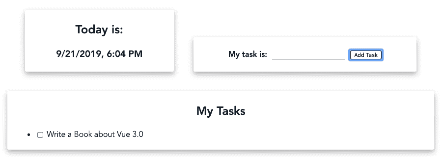
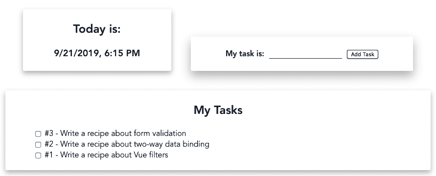
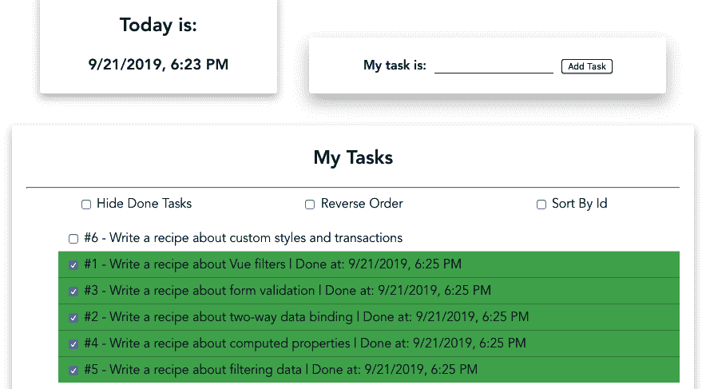
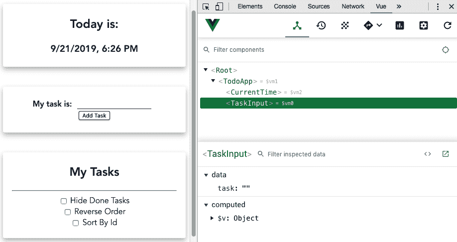
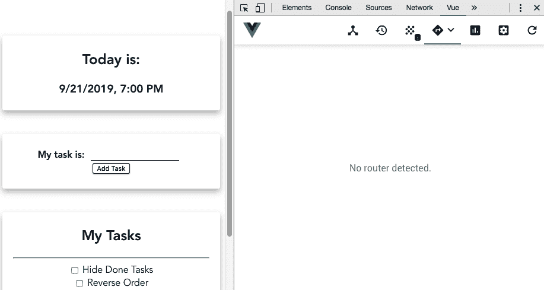
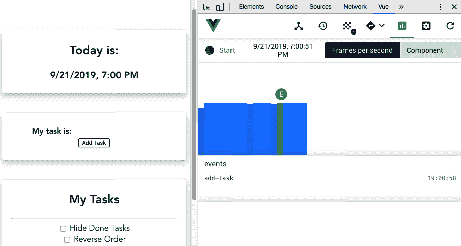
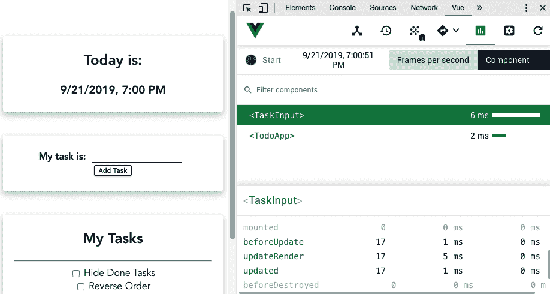
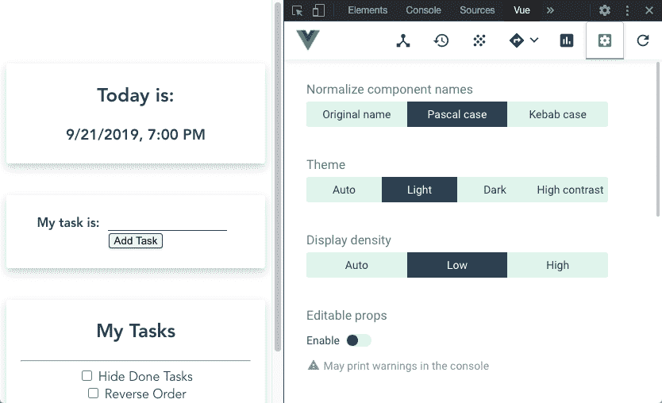

数据绑定、表单验证、事件和计算属性

数据是当今世界上最宝贵的资产，知道如何管理它是必须的。在 Vue 中，我们有权利选择如何收集这些数据，按照我们的意愿进行操作，并将其传递到服务器。

在本章中，我们将更多地了解数据处理和数据处理过程、表单验证、数据过滤、如何向用户显示这些数据以及如何以与我们应用程序内部不同的方式呈现它。

我们将学习如何使用`vue-devtools`深入了解 Vue 组件并查看我们的数据和应用程序发生了什么。

在本章中，我们将涵盖以下内容：

+   创建“hello world”组件

+   创建具有双向数据绑定的输入表单

+   向元素添加事件侦听器

+   从输入中删除 v-model

+   创建动态待办事项列表

+   创建计算属性并探索其工作原理

+   使用自定义过滤器显示更清晰的数据和文本

+   使用 Vuelidate 添加表单验证

+   为列表创建过滤器和排序器

+   创建条件过滤以对列表数据进行排序

+   添加自定义样式和过渡

+   使用`vue-devtools`调试您的应用程序

# 第四章：技术要求

在本章中，我们将使用**Node.js**和**Vue CLI**。

注意，Windows 用户需要安装一个名为`windows-build-tools`的`npm`包，以便安装以下所需的软件包。为此，请以管理员身份打开 PowerShell 并执行以下命令：

`> npm install -g windows-build-tools`。

要安装**Vue CLI**，您需要打开终端（macOS 或 Linux）或命令提示符/PowerShell（Windows）并执行以下命令：

```js
> npm install -g @vue/cli @vue/cli-service-global
```

# 创建“hello world”组件

Vue 应用程序是各种组件的组合，由 Vue 框架绑定在一起并进行编排。知道如何制作您的组件很重要。每个组件就像墙上的一块砖，需要以一种方式制作，以便在放置时不需要其他砖块以不同的方式重新塑造。我们将学习如何制作一个基本组件，其中包含一些侧重于组织和清晰代码的重要原则。

## 准备工作

本教程的先决条件如下：

+   Node.js 12+

所需的 Node.js 全局对象如下：

+   `@vue/cli`

+   `@vue/cli-service-global`

## 如何做到这一点... 

要启动我们的组件，我们可以使用 Vue CLI 创建我们的 Vue 项目，就像在“使用 Vue CLI 创建您的第一个项目”中学到的那样，或者开始一个新的项目。

要启动一个新的组件，打开终端（macOS 或 Linux）或命令提示符/PowerShell（Windows），并执行以下命令：

```js
> vue create my-component
```

**命令行界面**（**CLI**）将询问一些问题，这些问题将有助于创建项目。您可以使用箭头键导航，*Enter*键继续，*空格键*选择选项。选择**`default`**选项：

```js
?  Please pick a preset: **(Use arrow keys)** ❯ default (babel, eslint) 
  Manually select features  ‌
```

让我们创建我们的第一个“hello world”组件，按照以下步骤进行：

1.  让我们在`src/components`文件夹中创建一个名为`CurrentTime.vue`的新文件。

1.  在这个文件中，我们将从组件的`<template>`部分开始。它将是一个显示当前日期格式化的阴影框卡：

```js
<template>
  <div class='cardBox'>
    <div class='container'>
      <h2>Today is:</h2>
      <h3>{{ getCurrentDate }}</h3>
    </div>
  </div>
</template>
```

1.  现在，我们需要创建`<script>`部分。我们将从`name`属性开始。这将在使用`vue-devtools`调试我们的应用程序时使用，也有助于**集成开发环境**（**IDE**）。对于`getCurrentDate`计算属性，我们将创建一个`computed`属性，它将返回当前日期，由`Intl`浏览器函数格式化：

```js
<script>
export default {
  name: 'CurrentTime',
  computed: {
    getCurrentDate() {
      const browserLocale =
        navigator.languages && navigator.languages.length
          ? navigator.languages[0]
          : navigator.language;
      const intlDateTime = new Intl.DateTimeFormat(
        browserLocale, 
        {
          year: 'numeric',
          month: 'numeric',
          day: 'numeric',
          hour: 'numeric',
          minute: 'numeric'
        });

      return intlDateTime.format(new Date());
    }
  }
};
</script>
```

1.  为了为我们的框添加样式，我们需要在`src`文件夹中创建一个`style.css`文件，然后将`cardBox`样式添加到其中：

```js
.cardBox {
  box-shadow: 0 5px 10px 0 rgba(0, 0, 0, 0.2);
  transition: 0.3s linear;
  max-width: 33%;
  border-radius: 3px;
  margin: 20px;
}

.cardBox:hover {
  box-shadow: 0 10px 20px 0 rgba(0, 0, 0, 0.2);
}

.cardBox>.container {
  padding: 4px 18px;
}

[class*='col-'] {
  display: inline-block;
}

@media only screen and (max-width: 600px) {
  [class*='col-'] {
    width: 100%;
  }

  .cardBox {
    margin: 20px 0;
  }
}

@media only screen and (min-width: 600px) {
  .col-1 {width: 8.33%;}
  .col-2 {width: 16.66%;}
  .col-3 {width: 25%;}
  .col-4 {width: 33.33%;}
  .col-5 {width: 41.66%;}
  .col-6 {width: 50%;}
  .col-7 {width: 58.33%;}
  .col-8 {width: 66.66%;}
  .col-9 {width: 75%;}
  .col-10 {width: 83.33%;}
  .col-11 {width: 91.66%;}
  .col-12 {width: 100%;}
}

@media only screen and (min-width: 768px) {
  .col-1 {width: 8.33%;}
  .col-2 {width: 16.66%;}
  .col-3 {width: 25%;}
  .col-4 {width: 33.33%;}
  .col-5 {width: 41.66%;}
  .col-6 {width: 50%;}
  .col-7 {width: 58.33%;}
  .col-8 {width: 66.66%;}
  .col-9 {width: 75%;}
  .col-10 {width: 83.33%;}
  .col-11 {width: 91.66%;}
  .col-12 {width: 100%;}
}

@media only screen and (min-width: 992px) {
  .col-1 {width: 8.33%;}
  .col-2 {width: 16.66%;}
  .col-3 {width: 25%;}
  .col-4 {width: 33.33%;}
  .col-5 {width: 41.66%;}
  .col-6 {width: 50%;}
  .col-7 {width: 58.33%;}
  .col-8 {width: 66.66%;}
  .col-9 {width: 75%;}
  .col-10 {width: 83.33%;}
  .col-11 {width: 91.66%;}
  .col-12 {width: 100%;}
}

@media only screen and (min-width: 1200px) {
  .col-1 {width: 8.33%;}
  .col-2 {width: 16.66%;}
  .col-3 {width: 25%;}
  .col-4 {width: 33.33%;}
  .col-5 {width: 41.66%;}
  .col-6 {width: 50%;}
  .col-7 {width: 58.33%;}
  .col-8 {width: 66.66%;}
  .col-9 {width: 75%;}
  .col-10 {width: 83.33%;}
  .col-11 {width: 91.66%;}
  .col-12 {width: 100%;}
}
```

1.  在`App.vue`文件中，我们需要导入我们的组件才能看到它：

```js
<template>
  <div id='app'>
    <current-time />
  </div>
</template>

<script>
import CurrentTime from './components/CurrentTime.vue';

export default {
  name: 'app',
  components: {
    CurrentTime
  }
}
</script>
```

1.  在`main.js`文件中，我们需要导入`style.css`文件以包含在 Vue 应用程序中：

```js
import Vue from 'vue';
import App from './App.vue';
import './style.css';

Vue.config.productionTip = false

new Vue({
  render: h => h(App),
}).$mount('#app')
```

1.  要运行服务器并查看您的组件，您需要打开终端（macOS 或 Linux）或命令提示符/PowerShell（Windows），并执行以下命令：

```js
> npm run serve
```

这是您的组件呈现和运行的方式：


## 它是如何工作的...

Vue 组件几乎与 Node.js 包一样工作。要在代码中使用它，您需要导入组件，然后在要使用的组件的`components`属性中声明它。

就像一堵砖墙一样，Vue 应用程序由调用和使用其他组件的组件组成。

对于我们的组件，我们使用了`Intl.DateTimeFormat`函数，这是一个本机函数，可用于将日期格式化和解析为声明的位置。为了获得本地格式，我们使用了`navigator`全局变量。

## 另请参见

您可以在[`developer.mozilla.org/en-US/docs/Web/JavaScript/Reference/Global_Objects/DateTimeFormat`](https://developer.mozilla.org/en-US/docs/Web/JavaScript/Reference/Global_Objects/DateTimeFormat)找到有关`Intl.DateTimeFormat`的更多信息。

您可以在[`v3.vuejs.org/guide/single-file-component.html`](https://v3.vuejs.org/guide/single-file-component.html)找到有关 Vue 组件的更多信息

# 创建具有双向数据绑定的输入表单

为了收集网页上的数据，我们使用 HTML 表单输入。在 Vue 中，可以使用双向数据绑定方法，其中输入在**文档对象模型**（**DOM**）上的值传递到 JavaScript，反之亦然。

这使得 Web 表单更加动态，使您有可能在保存或发送数据回服务器之前管理、格式化和验证数据。

## 准备就绪

此处的先决条件如下：

+   Node.js 12+

所需的 Node.js 全局对象如下：

+   `@vue/cli`

+   `@vue/cli-service-global`

## 操作步骤...

要启动我们的组件，我们可以使用 Vue CLI 创建 Vue 项目，就像在第二章的“使用 Vue CLI 创建第一个项目”中学到的那样，或者使用“创建'hello world'组件”中的项目。

现在，让我们按照以下步骤创建具有双向数据绑定的输入表单：

1.  让我们在`src/components`文件夹中创建一个名为`TaskInput.vue`的新文件。

1.  在这个文件中，我们将创建一个组件，其中将包含一个文本输入和一个显示文本。这个文本将基于文本输入中键入的内容。在组件的`<template>`部分，我们需要创建一个 HTML 输入和一个`mustache`变量，用于接收和呈现数据：

```js
<template>
  <div class='cardBox'>
    <div class='container tasker'>
      <strong>My task is: {{ task }}</strong>
      <input 
        type='text'
        v-model='task'
        class='taskInput' />
    </div>
  </div>
</template>
```

1.  现在，在组件的`<script>`部分，我们将命名它并将任务添加到`data`属性中。由于数据始终需要返回一个`Object`，我们将使用箭头函数直接返回一个`Object`：

```js
<script>
export default {
  name: 'TaskInput',
  data: () => ({
    task: '',
  }),
};
</script>
```

1.  我们需要为这个组件添加一些样式。在组件的`<style>`部分，我们需要添加`scoped`属性，以便样式仅绑定到组件，不会与其他**层叠样式表**（**CSS**）规则混合：

```js
<style scoped>
  .tasker{
    margin: 20px;
  }
  .tasker .taskInput {
    font-size: 14px;
    margin: 0 10px;
    border: 0;
    border-bottom: 1px solid rgba(0, 0, 0, 0.75);
  }
  .tasker button {
    border: 1px solid rgba(0, 0, 0, 0.75);
    border-radius: 3px;
    box-shadow: 0 1px 2px 0 rgba(0, 0, 0, 0.2);
  }
</style>
```

1.  现在，我们需要将这个组件导入到我们的`App.vue`文件中：

```js
<template>
  <div id='app'>
    <current-time class='col-4' />
    <task-input class='col-6' />
  </div>
</template>

<script>
import CurrentTime from './components/CurrentTime.vue';
import TaskInput from './components/TaskInput';

export default {
  name: 'app',
  components: {
    CurrentTime,
    TaskInput,
  }
}
</script>
```

1.  要运行服务器并查看您的组件，您需要打开终端（macOS 或 Linux）或命令提示符/PowerShell（Windows）并执行以下命令：

```js
> npm run serve
```

这是您的组件呈现并运行的方式：


## 它是如何工作的...

当您创建一个 HTML`input`元素并为其添加`v-model`时，您正在传递一个内置于 Vue 中的指令，该指令检查输入类型并为我们提供输入的糖语法。这处理了变量值和 DOM 的更新。

这个模型被称为双向数据绑定。如果变量被代码改变，DOM 将重新渲染，如果它被 DOM 通过用户输入改变，比如`input-form`，那么 JavaScript 代码就可以执行一个函数。

## 另请参阅

在[`v3.vuejs.org/guide/forms.html`](https://v3.vuejs.org/guide/forms.html)找到有关表单输入绑定的更多信息

# 向元素添加事件监听器

在 Vue 中，父子通信最常见的方法是通过 props 和 events。在 JavaScript 中，通常会向 DOM 树的元素添加事件监听器，以便在特定事件上执行函数。在 Vue 中，可以添加监听器并根据需要命名，而不是坚持 JavaScript 引擎上存在的名称。

在这个配方中，我们将学习如何创建自定义事件以及如何发出它们。

## 准备就绪

这个配方的先决条件如下：

+   Node.js 12+

所需的 Node.js 全局对象如下：

+   `@vue/cli`

+   `@vue/cli-service-global`

## 如何做...

启动我们的组件，我们可以使用 Vue CLI 创建 Vue 项目，就像在“*使用 Vue CLI 创建您的第一个项目*”一章中学到的那样，或者使用“*使用双向数据绑定创建输入表单*”一章中的项目。

按照以下步骤在 Vue 中的元素上添加事件监听器：

1.  创建一个新组件或打开`TaskInput.vue`文件。

1.  在`<template>`部分，我们将添加一个按钮元素，并使用`v-on`指令为按钮点击事件添加事件监听器。我们将从组件中删除`{{ task }}`变量，因为从现在开始它将被发出并不再显示在组件上：

```js
<template>
  <div class='cardBox'>
    <div class='container tasker'>
      <strong>My task is:</strong>
      <input 
        type='text' 
        v-model='task' 
        class='taskInput' />
      <button 
        v-on:click='addTask'>
            Add Task
      </button>
    </div>
  </div>
</template>
```

1.  在组件的`<script>`部分，我们需要添加一个处理点击事件的方法。该方法将被命名为`addTask`。该方法将触发一个名为`add-task`的事件，并将任务发送到数据中。之后，组件上的任务将被重置：

```js
<script>
export default {
  name: 'TaskInput',
  data: () => ({
    task: '',
  }),
  methods: {
    addTask(){
      this.$emit('add-task', this.task);
      this.task = '';
    },
  }
};
</script>
```

1.  在`App.vue`文件中，我们需要在组件上添加一个事件监听器绑定。此侦听器将附加到`add-task`事件。我们将使用`v-on`指令的缩写版本`@`。当它被触发时，事件将调用`addNewTask`方法，该方法将发送一个警报，说明已添加了一个新任务：

```js
<template>
  <div id='app'>
    <current-time class='col-4' />
    <task-input 
      class='col-6'
      @add-task='addNewTask'
    />
  </div>
</template>
```

1.  现在，让我们创建`addNewTask`方法。这将接收任务作为参数，并向用户显示一个警报，显示任务已添加：

```js
<script>
import CurrentTime from './components/CurrentTime.vue';
import TaskInput from './components/TaskInput';

export default {
  name: 'app',
  components: {
    CurrentTime,
    TaskInput,
  },
  methods:{
    addNewTask(task){
      alert(`New task added: ${task}`);
    },
  },
}
</script>
```

1.  要运行服务器并查看您的组件，您需要打开终端（macOS 或 Linux）或命令提示符/PowerShell（Windows）并执行以下命令：

```js
> npm run serve
```

这是您的组件呈现并运行的方式：


## 它是如何工作的...

HTML 事件通过`v-on`事件处理指令由 Vue 读取。当我们将`v-on:click`指令附加到按钮时，我们向按钮添加了一个监听器，以便在用户单击按钮时执行一个函数。

该函数在组件方法中声明。该函数在调用时将发出一个事件，表示使用此组件作为子组件的任何组件都可以使用`v-on`指令监听它。

## 另请参阅

您可以在[`v3.vuejs.org/guide/events.html`](https://v3.vuejs.org/guide/events.html)找到有关事件处理的更多信息

# 从输入中删除 v-model

如果我告诉您，在`v-model`的魔术背后有很多代码，使我们的魔术糖语法发生？如果我告诉您，兔子洞可以深入到足以控制输入的事件和值发生的一切？

我们将学习如何提取`v-model`指令的糖语法，并将其转换为其背后的基本语法。

## 准备就绪

此配方的先决条件如下：

+   Node.js 12+

所需的 Node.js 全局对象如下：

+   `@vue/cli`

+   `@vue/cli-service-global`

## 如何做到...

要启动我们的组件，我们可以使用 Vue CLI 创建我们的 Vue 项目，就像在第二章*，介绍 TypeScript 和 Vue 生态系统*中学到的那样，或者使用“向元素添加事件侦听器”配方中的项目。

在接下来的步骤中，我们将从输入中删除`v-model`指令的语法糖：

1.  打开`TaskInput.vue`文件。

1.  在组件的`<template>`块中，找到`v-model`指令。我们将删除`v-model`指令。然后，我们需要向输入添加一个新的绑定，称为`v-bind:value`或缩写版本`:value`，以及一个事件侦听器到 HTML`input`元素。我们需要向`input`事件添加一个事件侦听器，使用`v-on:input`指令或缩写版本`@input`。输入绑定将接收任务值作为参数，事件侦听器将接收一个值赋值，其中它将使任务变量等于事件值的值。

```js
<template>
  <div class='cardBox'>
    <div class='container tasker'>
      <strong>My task is:</strong>
      <input 
        type='text' 
        :value='task' 
        @input='task = $event.target.value' 
        class='taskInput' 
      />
      <button v-on:click='addTask'>
        Add Task
      </button>
    </div>
  </div>
</template>
```

1.  要运行服务器并查看您的组件，您需要打开终端（macOS 或 Linux）或命令提示符/PowerShell（Windows）并执行以下命令：

```js
> npm run serve 
```

## 它是如何工作的...

作为一种语法糖，`v-model`指令可以自动为您声明绑定和元素的事件侦听器，但副作用是您无法完全控制可以实现的内容。

正如我们所见，绑定的值可以是变量、方法、计算属性或 Vuex getter，例如。对于事件侦听器，它可以是一个函数或一个变量赋值的直接声明。当事件被触发并传递给 Vue 时，`$event`变量用于传递事件。在这种情况下，就像在普通 JavaScript 中一样，要捕获输入的值，我们需要使用`event.target.value`值。

## 另请参阅

您可以在[`v3.vuejs.org/guide/events.html`](https://v3.vuejs.org/guide/events.html)找到有关事件处理的更多信息

# 创建一个动态的待办事项列表

每个程序员在学习一种新语言时创建的第一个项目之一就是待办事项列表。这样做可以让我们更多地了解围绕状态和数据操作的语言过程。

我们将使用 Vue 制作我们的待办事项列表。我们将使用我们在之前的配方中学到和创建的内容。

## 准备工作

这个配方的先决条件如下：

+   Node.js 12+

所需的 Node.js 全局对象如下：

+   `@vue/cli`

+   `@vue/cli-service-global`

## 如何做...

制作待办事项应用程序涉及一些基本原则——它必须有一个任务列表；这些任务可以标记为已完成和未完成，并且列表可以进行过滤和排序。现在，我们将学习如何将任务添加到任务列表中。

要启动我们的组件，我们可以使用 Vue CLI 创建 Vue 项目，就像在第二章*，介绍 TypeScript 和 Vue 生态系统*中学到的“使用 Vue CLI 创建你的第一个项目”一节中所述，或者使用“从输入中删除 v-model”一节中的项目。

现在，按照以下步骤使用 Vue 和之前的方法创建一个动态的待办事项列表：

1.  在`App.vue`文件中，我们将创建我们的任务数组。每当`TaskInput.vue`组件发出消息时，这个任务将被填充。我们将向这个数组添加一个带有任务和创建任务的当前日期的对象。目前，任务完成时的日期将是未定义的。为了做到这一点，在组件的`<script>`部分，我们需要创建一个接收任务并将该任务与当前日期添加到`taskList`数组中的方法：

```js
<script>
import CurrentTime from './components/CurrentTime.vue';
import TaskInput from './components/TaskInput';

export default {
  name: 'TodoApp',
  components: {
    CurrentTime,
    TaskInput,
  },
  data: () => ({
    taskList: [],
  }),
  methods:{
    addNewTask(task){
      this.taskList.push({
        task,
        createdAt: Date.now(),
        finishedAt: undefined,
      })
    },
  },
}
</script>
```

1.  现在，我们需要在`<template>`部分呈现这个列表。我们将使用 Vue 的`v-for`指令来迭代任务列表。当我们将这个指令与数组一起使用时，它会给我们访问两个属性——项目本身和项目的索引。我们将使用项目来呈现它，使用索引来创建元素的键以进行呈现。我们需要添加一个复选框，当选中时，调用一个函数来改变任务的状态和任务完成时的显示：

```js
<template>
  <div id='app'>
    <current-time class='col-4' />
    <task-input class='col-6' @add-task='addNewTask' />
    <div class='col-12'>
      <div class='cardBox'>
        <div class='container'>
          <h2>My Tasks</h2>
          <ul class='taskList'>
            <li 
              v-for='(taskItem, index) in taskList'
              :key='`${index}_${Math.random()}`'
            >
              <input type='checkbox' 
                :checked='!!taskItem.finishedAt' 
                @input='changeStatus(index)'
              /> 
              {{ taskItem.task }} 
              <span v-if='taskItem.finishedAt'>
                {{ taskItem.finishedAt }}
              </span>
            </li>
          </ul>
        </div>
      </div>
    </div>
  </div>
</template>
```

始终重要的是要记住迭代器中的键必须是唯一的。这是因为呈现函数需要知道哪些元素已经改变。在这个例子中，我们将`Math.random()`函数添加到索引中以生成一个唯一的键，因为当元素的数量减少时，数组的前几个元素的索引始终是相同的数字。

1.  我们需要在`App.vue`的`methods`属性上创建`changeStatus`函数。这个函数将接收任务的索引作为参数，然后去改变任务数组中的`finishedAt`属性，这是我们标记任务完成的标志：

```js
changeStatus(taskIndex){
  const task = this.taskList[taskIndex];
    if(task.finishedAt){
      task.finishedAt = undefined;
    } else {
      task.finishedAt = Date.now();
    }
}
```

1.  现在，我们需要将任务文本添加到屏幕的左侧。在组件的`<style>`部分，我们将使其具有作用域并添加自定义类：

```js
<style scoped>
  .taskList li{
    text-align: left;
  }
</style>
```

1.  要运行服务器并查看您的组件，您需要打开终端（macOS 或 Linux）或命令提示符/PowerShell（Windows）并执行以下命令：

```js
> npm run serve
```

这是您的组件渲染并运行的地方：



## 工作原理...

当我们从组件接收到发射的消息时，我们用更多的数据来填充消息，并将其推送到本地数组变量中。

在模板中，我们遍历这个数组，使其成为任务列表。这显示了我们需要做的任务，标记任务完成时的复选框以及任务完成的时间。

当用户点击复选框时，它会执行一个函数，将当前任务标记为已完成。如果任务已经完成，函数将把`finishedAt`属性设置为`undefined`。

## 另请参阅

您可以在[`v3.vuejs.org/guide/list.html#mapping-an-array-to-elements-with-v-for`](https://v3.vuejs.org/guide/list.html#mapping-an-array-to-elements-with-v-for)找到有关列表渲染的更多信息

您可以在[`v3.vuejs.org/guide/conditional.html#v-if`](https://v3.vuejs.org/guide/conditional.html#v-if)找到有关条件渲染的更多信息

您可以在[`developer.mozilla.org/en-US/docs/Web/JavaScript/Reference/Global_Objects/Math/random`](https://developer.mozilla.org/en-US/docs/Web/JavaScript/Reference/Global_Objects/Math/random)找到有关`Math.random`的更多信息。

# 创建计算属性并了解其工作原理

想象一下，每次您必须获取操作过的数据时，都需要执行一个函数。想象一下，您需要获取需要经过一些处理的特定数据，并且每次都需要通过函数执行它。这种类型的工作不容易维护。计算属性存在是为了解决这些问题。使用计算属性可以更容易地获取需要预处理甚至缓存的数据，而无需执行任何其他外部记忆函数。

## 准备工作

此示例的先决条件如下：

+   Node.js 12+

所需的 Node.js 全局对象如下：

+   `@vue/cli`

+   `@vue/cli-service-global`

## 操作步骤...

我们将继续我们的待办事项项目，或者您可以按照第二章中学到的'*使用 Vue CLI 创建您的第一个项目*'中的步骤创建一个新的 Vue 项目，介绍 TypeScript 和 Vue 生态系统。

现在，按照以下步骤创建计算属性并了解其工作原理：

1.  在`App.vue`文件的`<script>`部分，我们将在`data`和`method`之间添加一个名为`computed`的新属性。这是`computed`属性将被放置的地方。我们将创建一个名为`displayList`的新计算属性，它将用于在模板上呈现最终列表：

```js
<script>
import CurrentTime from './components/CurrentTime.vue';
import TaskInput from './components/TaskInput';

export default {
  name: 'TodoApp',
  components: {
    CurrentTime,
    TaskInput
  },
  data: () => ({
    taskList: []
  }),
  computed: {
    displayList(){
      return this.taskList;
    },
  },
  methods: {
    addNewTask(task) {
      this.taskList.push({
        task,
        createdAt: Date.now(),
        finishedAt: undefined
      });
    },
    changeStatus(taskIndex){
      const task = this.taskList[taskIndex];
      if(task.finishedAt){
        task.finishedAt = undefined;
      } else {
        task.finishedAt = Date.now();
      }
    }
  }
};
</script>
```

`displayList`属性目前只返回变量的缓存值，而不是直接的变量本身。

1.  现在，在`<template>`部分，我们需要更改列表的获取位置：

```js
<template>
  <div id='app'>
    <current-time class='col-4' />
    <task-input class='col-6' @add-task='addNewTask' />
    <div class='col-12'>
      <div class='cardBox'>
        <div class='container'>
          <h2>My Tasks</h2>
          <ul class='taskList'>
            <li 
              v-for='(taskItem, index) in displayList'
              :key='`${index}_${Math.random()}`'
            >
              <input type='checkbox' 
                :checked='!!taskItem.finishedAt' 
                @input='changeStatus(index)'
              /> 
              {{ taskItem.task }} 
              <span v-if='taskItem.finishedAt'>
                {{ taskItem.finishedAt }}
              </span>
            </li>
          </ul>
        </div>
      </div>
    </div>
  </div>
</template>
```

1.  要运行服务器并查看组件，您需要打开终端（macOS 或 Linux）或命令提示符/PowerShell（Windows）并执行以下命令：

```js
> npm run serve
```

## 它是如何工作的...

使用`computed`属性将值传递到模板时，该值现在被缓存。这意味着只有在值更新时才会触发渲染过程。同时，我们确保模板不使用变量进行渲染，因此它不能在模板上更改，因为它是变量的缓存副本。

使用这个过程，我们可以获得最佳性能，因为我们不会浪费处理时间重新渲染对数据显示没有影响的更改的 DOM 树。这是因为如果有什么变化，而结果是相同的，`computed`属性会缓存结果并不会更新最终结果。

## 另请参阅

您可以在[`v3.vuejs.org/guide/computed.html`](https://v3.vuejs.org/guide/computed.html)找到有关计算属性的更多信息。

# 使用自定义过滤器显示更清晰的数据和文本

有时您可能会发现用户甚至您自己无法阅读 Unix 时间戳或其他`DateTime`格式。我们如何解决这个问题？在 Vue 中渲染数据时，可以使用我们称之为过滤器的东西。

想象一系列管道，数据通过这些管道流动。数据以一种形式进入每个管道，以另一种形式退出。这就是 Vue 中的过滤器的样子。您可以在同一变量上放置一系列过滤器，因此它会被格式化，重塑，并最终以不同的数据显示，而代码保持不变。在这些管道中，初始变量的代码是不可变的。

## 准备工作

此食谱的先决条件如下：

+   Node.js 12+

所需的 Node.js 全局对象如下：

+   `@vue/cli`

+   `@vue/cli-service-global`

## 如何做...

我们将继续我们的待办事项列表项目，或者您可以像在第二章中学到的那样，使用 Vue CLI 创建一个新的 Vue 项目，介绍 TypeScript 和 Vue 生态系统。

按照以下步骤创建您的第一个自定义 Vue 过滤器：

1.  在`App.vue`文件的`<script>`部分，在方法中，创建一个`formatDate`函数。此函数将接收`value`作为参数并进入过滤器管道。我们可以检查`value`是否是一个数字，因为我们知道我们的时间是基于 Unix 时间戳格式的。如果它是一个数字，我们将根据当前浏览器位置进行格式化，并返回该格式化的值。如果传递的值不是一个数字，我们只需返回传递的值。

```js
<script>
  import CurrentTime from './components/CurrentTime.vue';
  import TaskInput from './components/TaskInput';

  export default {
    name: 'TodoApp',
    components: {
      CurrentTime,
      TaskInput
    },
    data: () => ({
      taskList: []
    }),
    computed: {
      displayList() {
        return this.taskList;
      }
    },
    methods: {
      formatDate(value) {
        if (!value) return '';
        if (typeof value !== 'number') return value;

        const browserLocale =
          navigator.languages && navigator.languages.length
            ? navigator.languages[0]
            : navigator.language;
        const intlDateTime = new Intl.DateTimeFormat(
          browserLocale, 
          {
            year: 'numeric',
            month: 'numeric',
            day: 'numeric',
            hour: 'numeric',
            minute: 'numeric'
          });

        return intlDateTime.format(new Date(value));
      },
      addNewTask(task) {
        this.taskList.push({
          task,
          createdAt: Date.now(),
          finishedAt: undefined
        });
      },
      changeStatus(taskIndex) {
        const task = this.taskList[taskIndex];
        if (task.finishedAt) {
          task.finishedAt = undefined;
        } else {
          task.finishedAt = Date.now();
        }
      }
    }
  };
</script>
```

1.  在组件的`<template>`部分，我们需要将变量传递给过滤器方法。为此，我们需要找到`taskItem.finishedAt`属性，并将其作为`formatDate`方法的参数。我们将添加一些文本来表示任务在日期开始时已完成：

```js
<template>
  <div id='app'>
    <current-time class='col-4' />
    <task-input class='col-6' @add-task='addNewTask' />
    <div class='col-12'>
      <div class='cardBox'>
        <div class='container'>
          <h2>My Tasks</h2>
          <ul class='taskList'>
            <li 
              v-for='(taskItem, index) in displayList'
              :key='`${index}_${Math.random()}`'
            >
              <input type='checkbox' 
                :checked='!!taskItem.finishedAt' 
                @input='changeStatus(index)'
              /> 
              {{ taskItem.task }} 
              <span v-if='taskItem.finishedAt'> | 
                Done at: 
                {{ formatDate(taskItem.finishedAt) }}
              </span>
            </li>
          </ul>
        </div>
      </div>
    </div>
  </div>
</template>
```

1.  要运行服务器并查看组件，请打开终端（macOS 或 Linux）或命令提示符/PowerShell（Windows），并执行以下命令：

```js
> npm run serve
```

这是您的组件呈现并运行的样子：


## 工作原理...

过滤器是接收一个值并必须返回一个值以在文件的`<template>`部分显示或在 Vue 属性中使用的方法。

当我们将值传递给`formatDate`方法时，我们知道它是一个有效的 Unix 时间戳，因此可以调用新的`Date`类构造函数，将`value`作为参数传递，因为 Unix 时间戳是一个有效的日期构造函数。

我们过滤器背后的代码是`Intl.DateTimeFormat`函数，这是一个原生函数，可用于格式化和解析日期到声明的位置。为了获得本地格式，我们使用`navigator`全局变量。

## 另请参阅

您可以在[`developer.mozilla.org/en-US/docs/Web/JavaScript/Reference/Global_Objects/DateTimeFormat`](https://developer.mozilla.org/en-US/docs/Web/JavaScript/Reference/Global_Objects/DateTimeFormat)找到有关`Intl.DateTimeFormat`的更多信息。

# 使用 Vuelidate 添加表单验证

最初，JavaScript 仅用于在将 HTML 表单发送到服务器之前验证这些表单；我们没有任何 JavaScript 框架或今天我们拥有的 JavaScript 生态系统。然而，有一件事仍然是相同的：在将表单发送到服务器之前，应该首先由 JavaScript 引擎进行表单验证。

我们将学习如何使用 Vue 生态系统中最受欢迎的库之一，在发送之前验证我们的输入表单。

## 准备工作

这个配方的先决条件如下：

+   Node.js 12+

所需的 Node.js 全局对象如下：

+   `@vue/cli`

+   `@vue/cli-service-global`

## 怎么做...

我们将继续我们的待办事项项目，或者您可以使用 Vue CLI 创建一个新的 Vue 项目，就像在第二章的“使用 Vue CLI 创建您的第一个项目”中学到的那样。

现在，按照以下步骤将表单验证添加到您的 Vue 项目和表单组件中：

1.  要安装**Vuelidate**，您需要打开终端（macOS 或 Linux）或命令提示符/PowerShell（Windows）并执行以下命令：

```js
> npm install vuelidate --save
```

1.  要将 Vuelidate 插件添加到 Vue 应用程序中，我们需要在`src`文件夹中的`main.js`文件中导入并添加它：

```js
import Vue from 'vue';
import App from './App.vue';
import Vuelidate from 'vuelidate';
import './style.css';

Vue.config.productionTip = false
Vue.use(Vuelidate);

new Vue({
  render: h => h(App),
}).$mount('#app')
```

1.  在`TaskInput.vue`文件中，我们将向 Vue 对象添加一个新属性。这个属性由安装的新插件解释。在对象的末尾，我们将添加`validations`属性，并在该属性内添加模型的名称。模型是插件将检查验证的数据或计算属性的直接名称：

```js
<script>
export default {
  name: 'TaskInput',
  data: () => ({
    task: ''
  }),
  methods: {
    addTask() {
      this.$emit('add-task', this.task);
      this.task = '';
    }
  },
  validations: {
    task: {}
  }
};
</script>
```

1.  现在，我们需要导入已经存在于我们想要使用的插件上的规则，这些规则将是`required`和`minLength`。导入后，我们将这些规则添加到模型中：

```js
<script>
import { required, minLength } from 'vuelidate/lib/validators';

export default {
  name: 'TaskInput',
  data: () => ({
    task: ''
  }),
  methods: {
    addTask() {
      this.$emit('add-task', this.task);
      this.task = '';
    }
  },
  validations: {
    task: {
      required,
      minLength: minLength(5),
    }
  }
};
</script>
```

1.  现在，我们需要在发出事件之前添加验证。我们将使用`$touch`内置函数告诉插件该字段已被用户触摸，并进行验证。如果有任何字段与用户有任何交互，插件将相应地设置标志。如果没有错误，我们将发出事件，并使用`$reset`函数重置验证。为此，我们将更改`addTask`方法：

```js
addTask() {
    this.$v.task.$touch();

    if (this.$v.task.$error) return false;

    this.$emit('add-task', this.task);
    this.task = '';
    this.$v.task.$reset();
    return true;
}
```

1.  为了提醒用户字段上存在一些错误，我们将使输入更改样式为完整的红色边框，并具有红色文本。为此，我们需要在输入字段上创建一个条件类。这将直接附加到模型的`$error`属性上：

```js
<template>
  <div class='cardBox'>
    <div class='container tasker'>
      <strong>My task is:</strong>
      <input 
        type='text' 
        :value='task' 
        @input='task = $event.target.value' 
        class='taskInput'
        :class="$v.task.$error ? 'fieldError' : ''" 
      />
      <button v-on:click='addTask'>Add Task</button>
    </div>
  </div>
</template>
```

1.  对于类，我们可以在`src`文件夹中的`style.css`文件中创建一个`fieldError`类：

```js
.fieldError {
  border: 2px solid red !important;
  color: red;
  border-radius: 3px;
}
```

1.  要运行服务器并查看您的组件，您需要打开终端（macOS 或 Linux）或命令提示符/PowerShell（Windows）并执行以下命令：

```js
> **npm run serve**
```

这是您的组件呈现并运行的方式：


## 它是如何工作的...

安装后，Vuelidate 插件会向 Vue 原型添加一个新的`$v`属性，并在 Vue 对象中检查一个名为`validations`的新对象属性。当定义了此属性并具有一些规则时，插件会在每次更新时检查模型的规则。

使用这个新的 Vue 原型，我们可以在我们的代码中检查我们定义的规则内的错误，并执行函数来告诉插件该字段已被用户触摸以标记为脏字段或重置它。使用这些功能，我们能够根据我们在任务模型上定义的规则添加一个新的条件类。

任务模型是必需的，并且至少有五个字符。如果不满足这些规则，插件将标记模型有错误。我们获取此错误并使用它来向用户显示任务字段有活动错误。当用户满足要求时，错误的显示消失，事件可以被触发。

## 另请参阅

您可以在[`vuelidate.netlify.com/`](https://vuelidate.netlify.com/)找到有关 Vuelidate 的更多信息。

您可以在[`v3.vuejs.org/guide/class-and-style.html`](https://v3.vuejs.org/guide/class-and-style.html)找到有关类和样式绑定的更多信息

# 为列表创建过滤器和排序器

在处理列表时，通常会发现自己有原始数据。有时，您需要对这些数据进行过滤，以便用户可以阅读。为此，我们需要一组计算属性来形成最终的过滤器和排序器。

在这个示例中，我们将学习如何创建一个简单的过滤器和排序器，来控制我们最初的待办任务列表。

## 准备工作

此示例的先决条件如下：

+   Node.js 12+

所需的 Node.js 全局对象如下：

+   `@vue/cli`

+   `@vue/cli-service-global`

## 如何做...

我们将继续我们的待办事项列表项目，或者您可以像在第二章中学到的那样，使用 Vue CLI 创建一个新的 Vue 项目，介绍 TypeScript 和 Vue 生态系统。

按照以下步骤添加一组过滤器和排序到您的列表中：

1.  在`App.vue`文件的`<script>`部分，我们将添加新的计算属性；这些将用于排序和过滤。我们将添加三个新的计算属性，`baseList`，`filteredList`和`sortedList`。`baseList`属性将是我们的第一个操作。我们将通过`Array.map`向任务列表添加一个`id`属性。由于 JavaScript 数组从零开始，我们将在数组的索引上添加`1`。`filteredList`属性将过滤`baseList`属性，并返回未完成的任务，`sortedList`属性将对`filteredList`属性进行排序，以便最后添加的`id`属性将首先显示给用户：

```js
<script>
import CurrentTime from "./components/CurrentTime.vue";
import TaskInput from "./components/TaskInput";

export default {
  name: "TodoApp",
  components: {
    CurrentTime,
    TaskInput
  },
  data: () => ({
    taskList: [],
  }),
  computed: {
    baseList() {
      return [...this.taskList]
        .map((t, index) => ({
            ...t,
            id: index + 1
          }));
    },
    filteredList() {
      return [...this.baseList]
            .filter(t => !t.finishedAt);
    },
    sortedList() {
      return [...this.filteredList]
          .sort((a, b) => b.id - a.id);
    },
    displayList() {
      return this.sortedList;
    }
  },
  methods: {
    formatDate(value) {
      if (!value) return "";
      if (typeof value !== "number") return value;

      const browserLocale =
        navigator.languages && navigator.languages.length
          ? navigator.languages[0]
          : navigator.language;
      const intlDateTime = new Intl.DateTimeFormat(browserLocale, {
        year: "numeric",
        month: "numeric",
        day: "numeric",
        hour: "numeric",
        minute: "numeric"
      });

      return intlDateTime.format(new Date(value));
    },
    addNewTask(task) {
      this.taskList.push({
        task,
        createdAt: Date.now(),
        finishedAt: undefined
      });
    },
    changeStatus(taskIndex) {
      const task = this.taskList[taskIndex];

      if (task.finishedAt) {
        task.finishedAt = undefined;
      } else {
        task.finishedAt = Date.now();
      }
    }
  }
};
</script>
```

1.  在`<template>`部分，我们将`Task ID`添加为指示器，并更改`changeStatus`方法发送参数的方式。因为现在索引是可变的，我们不能将其用作变量；它只是数组上的临时索引。我们需要使用任务`id`：

```js
<template>
  <div id="app">
    <current-time class="col-4" />
    <task-input class="col-6" @add-task="addNewTask" />
    <div class="col-12">
      <div class="cardBox">
        <div class="container">
          <h2>My Tasks</h2>
          <ul class="taskList">
            <li 
              v-for="(taskItem, index) in displayList"
              :key="`${index}_${Math.random()}`"
            >
              <input type="checkbox" 
                :checked="!!taskItem.finishedAt" 
                @input="changeStatus(taskItem.id)"
              /> 
              #{{ taskItem.id }} - {{ taskItem.task }} 
              <span v-if="taskItem.finishedAt"> | 
                Done at: 
                {{ formatDate(taskItem.finishedAt) }}
              </span>
            </li>
          </ul>
        </div>
      </div>
    </div>
  </div>
</template>
```

1.  在`changeStatus`方法中，我们也需要更新我们的函数。由于索引现在从`1`开始，我们需要将数组的索引减一，以获取更新前元素的真实索引：

```js
changeStatus(taskId) {
    const task = this.taskList[taskId - 1];

    if (task.finishedAt) {
    task.finishedAt = undefined;
    } else {
    task.finishedAt = Date.now();
    }
}
```

1.  要运行服务器并查看您的组件，您需要打开终端（macOS 或 Linux）或命令提示符/PowerShell（Windows），并执行以下命令：

```js
> npm run serve
```

这是您的组件呈现和运行的方式：



## 它是如何工作的...

`computed`属性一起作为列表的缓存工作，并确保对元素的操作没有副作用：

1.  在`baseList`属性中，我们创建了一个新数组，其中包含相同的任务，但为任务添加了一个新的`id`属性。

1.  在`filteredList`属性中，我们取出了`baseList`属性，并且只返回了未完成的任务。

1.  在`sortedList`属性上，我们按照它们的 ID，按降序对`filteredList`属性上的任务进行排序。

当所有操作完成时，`displayList`属性将返回被操作的数据的结果。

## 另请参阅

您可以在[`developer.mozilla.org/en-US/docs/Web/JavaScript/Reference/Global_Objects/Array/map`](https://developer.mozilla.org/en-US/docs/Web/JavaScript/Reference/Global_Objects/Array/map)找到有关`Array.prototype.map`的更多信息。

您可以在[`developer.mozilla.org/en-US/docs/Web/JavaScript/Reference/Global_Objects/Array/filter`](https://developer.mozilla.org/en-US/docs/Web/JavaScript/Reference/Global_Objects/Array/filter)找到有关`Array.prototype.filter`的更多信息。

您可以在[`developer.mozilla.org/en-US/docs/Web/JavaScript/Reference/Global_Objects/Array/sort`](https://developer.mozilla.org/en-US/docs/Web/JavaScript/Reference/Global_Objects/Array/sort)找到有关`Array.prototype.sort`的更多信息。

# 创建条件过滤器以对列表数据进行排序

完成上一个食谱后，您的数据应该已经被过滤和排序，但您可能需要检查过滤后的数据或需要更改排序方式。在这个食谱中，我们将学习如何创建条件过滤器并对列表上的数据进行排序。

使用一些基本原则，可以收集信息并以许多不同的方式显示它。

## 准备工作

此食谱的先决条件如下：

+   Node.js 12+

所需的 Node.js 全局对象如下：

+   `@vue/cli`

+   `@vue/cli-service-global`

## 如何做...

我们将继续我们的待办事项列表项目，或者您可以按照*在第二章*中学到的，在 Vue CLI 中创建一个新的 Vue 项目，介绍 TypeScript 和 Vue 生态系统。

现在，按照以下步骤添加条件过滤器以对列表数据进行排序：

1.  在`App.vue`文件的`<script>`部分，我们将更新`computed`属性，`filteredList`，`sortedList`和`displayList`。我们需要向我们的项目添加三个新变量，`hideDone`，`reverse`和`sortById`。所有三个变量都将是布尔变量，并且默认值为`false`。`filteredList`属性将检查`hideDone`变量是否为`true`。如果是，它将具有相同的行为，但如果不是，它将显示整个列表而不进行任何过滤。`sortedList`属性将检查`sortById`变量是否为`true`。如果是，它将具有相同的行为，但如果不是，它将按任务完成日期对列表进行排序。`displayList`属性将检查`reverse`变量是否为`true`。如果是，它将颠倒显示的列表，但如果不是，它将具有相同的行为：

```js
<script>
import CurrentTime from "./components/CurrentTime.vue";
import TaskInput from "./components/TaskInput";

export default {
  name: "TodoApp",
  components: {
    CurrentTime,
    TaskInput
  },
  data: () => ({
    taskList: [],
    hideDone: false,
    reverse: false,
    sortById: false,
  }),
  computed: {
    baseList() {
      return [...this.taskList]
        .map((t, index) => ({
            ...t,
            id: index + 1
          }));
    },
    filteredList() {
      return this.hideDone
        ? [...this.baseList]
            .filter(t => !t.finishedAt)
        : [...this.baseList];
    },
    sortedList() {
      return [...this.filteredList]
          .sort((a, b) => (
            this.sortById
              ? b.id - a.id
              : (a.finishedAt || 0) - (b.finishedAt || 0)
          ));
    },
    displayList() {
      const taskList = [...this.sortedList];

      return this.reverse 
      ? taskList.reverse() 
      : taskList;
    }
  },
  methods: {
    formatDate(value) {
      if (!value) return "";
      if (typeof value !== "number") return value;

      const browserLocale =
        navigator.languages && navigator.languages.length
          ? navigator.languages[0]
          : navigator.language;

      const intlDateTime = new Intl.DateTimeFormat(browserLocale, {
        year: "numeric",
        month: "numeric",
        day: "numeric",
        hour: "numeric",
        minute: "numeric"
      });

      return intlDateTime.format(new Date(value));
    },
    addNewTask(task) {
      this.taskList.push({
        task,
        createdAt: Date.now(),
        finishedAt: undefined
      });
    },
    changeStatus(taskId) {
      const task = this.taskList[taskId - 1];

      if (task.finishedAt) {
        task.finishedAt = undefined;
      } else {
        task.finishedAt = Date.now();
      }
    }
  }
};
</script>
```

1.  在`<template>`部分，我们需要为这些变量添加控制器。我们将创建三个复选框，直接通过`v-model`指令与变量链接：

```js
<template>
  <div id="app">
    <current-time class="col-4" />
    <task-input class="col-6" @add-task="addNewTask" />
    <div class="col-12">
      <div class="cardBox">
        <div class="container">
          <h2>My Tasks</h2>
          <hr /> 
          <div class="col-4">
            <input 
              v-model="hideDone"
              type="checkbox"
              id="hideDone"
              name="hideDone"
            />
            <label for="hideDone">
              Hide Done Tasks
            </label>
          </div>
          <div class="col-4">
            <input 
              v-model="reverse"
              type="checkbox"
              id="reverse"
              name="reverse"
            />
            <label for="reverse">
              Reverse Order
            </label>
          </div>
          <div class="col-4">
            <input 
              v-model="sortById"
              type="checkbox"
              id="sortById"
              name="sortById"
            />
            <label for="sortById">
              Sort By Id
            </label>
          </div>
          <ul class="taskList">
            <li 
              v-for="(taskItem, index) in displayList"
              :key="`${index}_${Math.random()}`"
            >
              <input type="checkbox" 
                :checked="!!taskItem.finishedAt" 
                @input="changeStatus(taskItem.id)"
              /> 
              #{{ taskItem.id }} - {{ taskItem.task }} 
              <span v-if="taskItem.finishedAt"> | 
                Done at: 
                {{ formatDate(taskItem.finishedAt) }}
              </span>
            </li>
          </ul>
        </div>
      </div>
    </div>
  </div>
</template>
```

1.  要运行服务器并查看您的组件，您需要打开终端（macOS 或 Linux）或命令提示符/PowerShell（Windows）并执行以下命令：

```js
> npm run serve
```

这是您的组件呈现和运行的方式：


## 工作原理...

`computed`属性一起作为列表的缓存工作，并确保在元素操作中没有任何副作用。通过条件处理，可以通过变量更改过滤和排序规则，并且显示会实时更新：

1.  在`filteredList`属性处，我们取出了`baseList`属性，并返回了未完成的任务。当`hideDone`变量为`false`时，我们返回整个列表而不进行任何过滤。

1.  在`sortedList`属性处，我们对`filteredList`属性上的任务进行了排序。当`sortById`变量为`true`时，列表按 ID 降序排序；当为`false`时，按任务完成时间升序排序。

1.  在`displayList`属性处，当`reverse`变量为`true`时，最终列表被颠倒。

当所有操作都完成时，`displayList`属性返回了被操作的数据的结果。

这些`computed`属性由用户屏幕上的复选框控制，因此用户可以完全控制他们可以看到什么以及如何看到它。

## 另请参阅

您可以在[`developer.mozilla.org/en-US/docs/Web/JavaScript/Reference/Global_Objects/Array/map`](https://developer.mozilla.org/en-US/docs/Web/JavaScript/Reference/Global_Objects/Array/map)找到有关`Array.prototype.map`的更多信息。

您可以在[`developer.mozilla.org/en-US/docs/Web/JavaScript/Reference/Global_Objects/Array/filter`](https://developer.mozilla.org/en-US/docs/Web/JavaScript/Reference/Global_Objects/Array/filter)找到有关`Array.prototype.filter`的更多信息。

您可以在[`developer.mozilla.org/en-US/docs/Web/JavaScript/Reference/Global_Objects/Array/sort`](https://developer.mozilla.org/en-US/docs/Web/JavaScript/Reference/Global_Objects/Array/sort)找到有关`Array.prototype.sort`的更多信息。

# 添加自定义样式和过渡效果

在组件中添加样式是一个很好的做法，因为它可以让用户更清楚地看到发生了什么。通过这样做，您可以向用户显示视觉响应，也可以为您的应用程序提供更好的体验。

在这个示例中，我们将学习如何添加一种新的条件类绑定。我们将使用 CSS 效果与每个新的 Vue 更新带来的重新渲染相结合。

## 准备就绪

此处的先决条件如下：

+   Node.js 12+

所需的 Node.js 全局对象如下：

+   `@vue/cli`

+   `@vue/cli-service-global`

## 如何做...

我们将继续我们的待办事项清单项目，或者您可以像在第二章“使用 Vue CLI 创建您的第一个项目”中学到的那样，使用 Vue CLI 创建一个新的 Vue 项目。

按照以下步骤为您的组件添加自定义样式和过渡效果：

1.  在`App.vue`文件中，我们将为已完成的任务的列表项添加一个条件类：

```js
<template>
  <div id="app">
    <current-time class="col-4" />
    <task-input class="col-6" @add-task="addNewTask" />
    <div class="col-12">
      <div class="cardBox">
        <div class="container">
          <h2>My Tasks</h2>
          <hr /> 
          <div class="col-4">
            <input 
              v-model="hideDone"
              type="checkbox"
              id="hideDone"
              name="hideDone"
            />
            <label for="hideDone">
              Hide Done Tasks
            </label>
          </div>
          <div class="col-4">
            <input 
              v-model="reverse"
              type="checkbox"
              id="reverse"
              name="reverse"
            />
            <label for="reverse">
              Reverse Order
            </label>
          </div>
          <div class="col-4">
            <input 
              v-model="sortById"
              type="checkbox"
              id="sortById"
              name="sortById"
            />
            <label for="sortById">
              Sort By Id
            </label>
          </div>
          <ul class="taskList">
            <li 
              v-for="(taskItem, index) in displayList"
              :key="`${index}_${Math.random()}`"
              :class="!!taskItem.finishedAt ? 'taskDone' : ''"
            >
              <input type="checkbox" 
                :checked="!!taskItem.finishedAt" 
                @input="changeStatus(taskItem.id)"
              /> 
              #{{ taskItem.id }} - {{ taskItem.task }} 
              <span v-if="taskItem.finishedAt"> | 
                Done at: 
                {{ formatDate(taskItem.finishedAt) }}
              </span>
            </li>
          </ul>
        </div>
      </div>
    </div>
  </div>
</template>
```

1.  在组件的`<style>`部分，我们将为`taskDone`的 CSS 类创建 CSS 样式表类。我们需要让列表项之间有一个分隔符；然后，我们将使列表具有条纹样式；当它们被标记为完成时，背景将发生变化。要在行之间添加分隔符和条纹列表或斑马样式，我们需要添加一个 CSS 样式表规则，适用于我们列表的每个`even nth-child`：

```js
<style scoped>
  .taskList li {
    list-style: none;
    text-align: left;
    padding: 5px 10px;
    border-bottom: 1px solid rgba(0,0,0,0.15);
  }

  .taskList li:last-child {
    border-bottom: 0px;
  }

  .taskList li:nth-child(even){
    background-color: rgba(0,0,0,0.05);
  }
</style>
```

1.  在`<style>`部分的末尾添加 CSS 动画关键帧，指示背景颜色变化，并将此动画应用于`.taskDone` CSS 类，以在任务完成时添加背景效果

```js
<style scoped>
  .taskList li {
    list-style: none;
    text-align: left;
    padding: 5px 10px;
    border-bottom: 1px solid rgba(0,0,0,0.15);
  }

  .taskList li:last-child {
    border-bottom: 0px;
  }

  .taskList li:nth-child(even){
    background-color: rgba(0,0,0,0.05);
  }

  @keyframes colorChange {
    from{
      background-color: inherit;
    }
    to{
      background-color: rgba(0, 160, 24, 0.577); 
    }
  }

  .taskList li.taskDone{
    animation: colorChange 1s ease;
    background-color: rgba(0, 160, 24, 0.577);
  }
</style>
```

1.  要运行服务器并查看您的组件，您需要打开终端（macOS 或 Linux）或命令提示符/PowerShell（Windows）并执行以下命令：

```js
> npm run serve
```

这是您的组件呈现和运行的地方：



## 它是如何工作的...

每当我们的应用程序中的新项目被标记为已完成时，`displayList`属性都会更新并触发组件的重新渲染。

因此，我们的`taskDone` CSS 类附加了一个在渲染时执行的动画，显示绿色背景。

## 另请参阅

您可以在[`developer.mozilla.org/en-US/docs/Web/CSS/CSS_Animations/Using_CSS_animations`](https://developer.mozilla.org/en-US/docs/Web/CSS/CSS_Animations/Using_CSS_animations)找到有关 CSS 动画的更多信息。

您可以在[`v3.vuejs.org/guide/class-and-style.html`](https://v3.vuejs.org/guide/class-and-style.html)找到有关类和样式绑定的更多信息

# 使用 vue-devtools 调试您的应用程序

`vue-devtools`对于每个 Vue 开发人员都是必不可少的。这个工具向我们展示了 Vue 组件、路由、事件和 vuex 的深度。

借助`vue-devtools`扩展程序，可以调试我们的应用程序，在更改代码之前尝试新数据，执行函数而无需直接在代码中调用它们，等等。

在这个配方中，我们将学习如何使用 devtools 找到有关您的应用程序的更多信息，以及如何使用它来帮助您的调试过程。

## 准备就绪

此配方的先决条件如下：

+   Node.js 12+

所需的 Node.js 全局对象如下：

+   `@vue/cli`

+   `@vue/cli-service-global`

您需要在浏览器中安装`vue-devtools`扩展程序：

+   Chrome 扩展程序-[`bit.ly/chrome-vue-devtools`](http://bit.ly/chrome-vue-devtools)

+   Firefox 扩展程序-[`bit.ly/firefox-vue-devtools`](http://bit.ly/firefox-vue-devtools)

## 如何做...

我们将继续进行待办事项列表项目，或者您可以按照第二章*，介绍 TypeScript 和 Vue 生态系统*中学到的内容，使用 Vue CLI 创建一个新的 Vue 项目。

在开发任何 Vue 应用程序时，始终最好使用`vue-devtools`进行开发。

按照这些步骤来了解如何使用`vue-devtools`以及如何正确调试 Vue 应用程序：

1.  要进入`vue-devtools`，首先需要在浏览器中安装它，所以请查看本教程的“准备就绪”部分，获取 Chrome 或 Firefox 的扩展链接。在 Vue 开发应用程序中，进入**浏览器开发者检查器**模式。一个名为 Vue 的新标签页必须出现：


1.  您首先看到的是**组件**标签页。该标签页显示了您的应用程序组件树。如果单击组件，您将能够查看所有可用数据，计算属性，以及由插件（如`vuelidate`，`vue-router`或`vuex`）注入的额外数据。您可以编辑数据以实时查看应用程序中的更改：



1.  第二个标签页是用于**vuex 开发**的。该标签页将显示变化的历史记录、当前状态和 getter。可以检查每个变化传递的有效负载，并进行时间旅行变化，以在 vuex 状态中“回到过去”：


1.  第三个标签页专门用于应用程序中的**事件发射器**。在此处显示了应用程序中发射的所有事件。您可以通过单击事件来检查发射的事件。您可以查看事件的名称、类型，事件的来源（在本例中是一个组件），以及有效负载：


1.  第四个标签页专门用于**vue-router**插件。在那里，您可以查看导航历史记录，以及传递给新路由的所有元数据。您可以查看应用程序中所有可用的路由：



1.  第五个标签页是**性能**标签页。在这里，您可以检查组件的加载时间，应用程序运行的每秒帧数，以及实时发生的事件。第一张截图显示了当前应用程序的每秒帧数，以及所选组件的每秒帧数：



第二张截图显示了组件生命周期钩子的性能，以及执行每个钩子所需的时间：



1.  第六个标签是您的**设置**标签；在这里，您可以管理扩展程序，更改外观，内部行为以及在 Vue 插件中的行为方式：



1.  最后一个标签是`vue-devtools`的刷新按钮。有时，当`hot-module-reload`发生或者应用程序组件树中发生一些复杂事件时，扩展程序可能会失去对发生情况的跟踪。这个按钮强制扩展程序重新加载并再次读取 Vue 应用程序状态。

## 另请参阅

您可以在[`github.com/vuejs/vue-devtools`](https://github.com/vuejs/vue-devtools)找到有关`vue-devtools`的更多信息。
