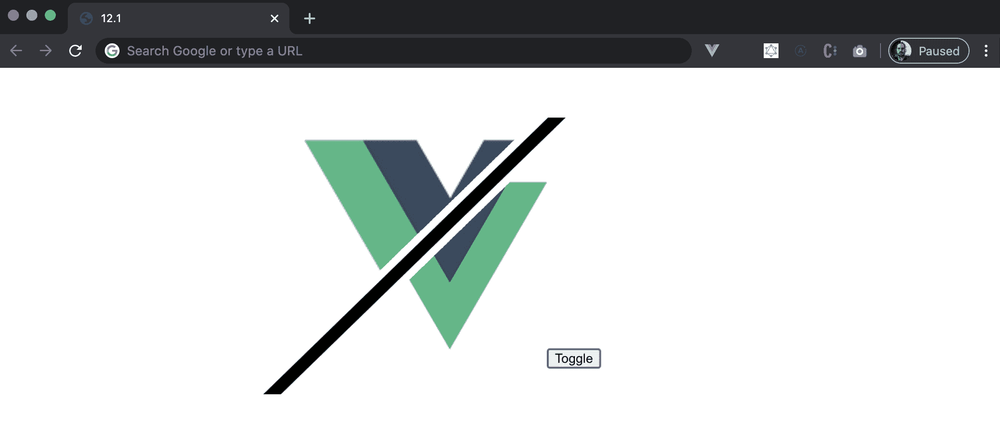
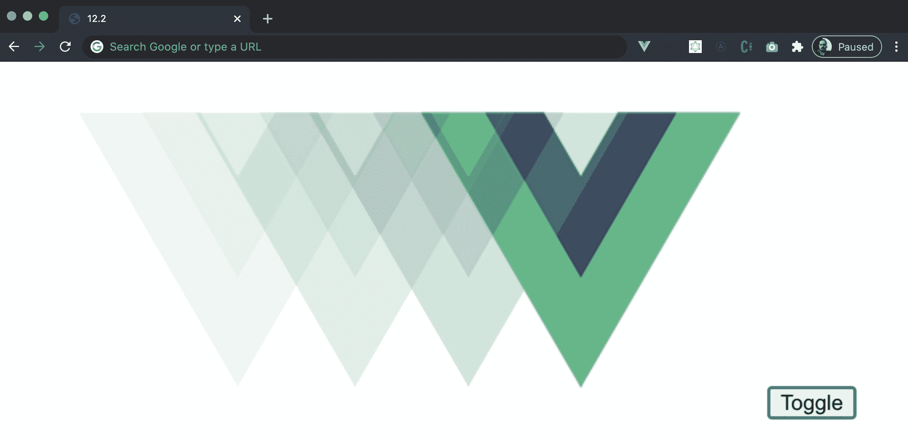
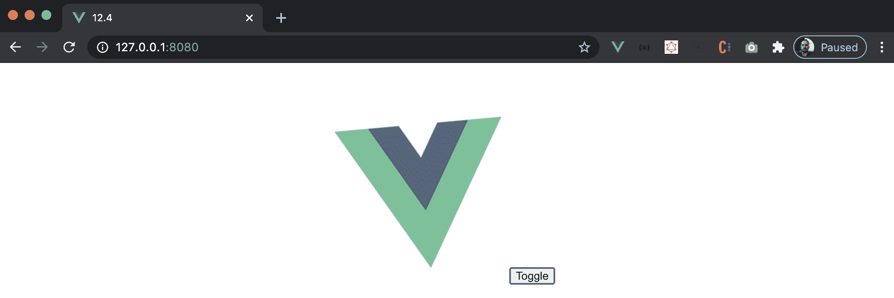
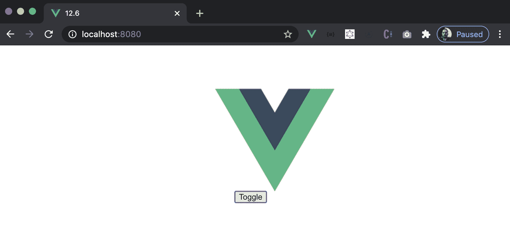
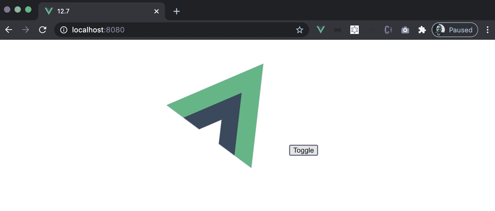

使用过渡和 CSS 为您的应用程序添加动画

为了使应用程序更加动态并吸引用户的全部注意力，使用动画是至关重要的。如今，CSS 动画出现在提示、横幅、通知甚至输入字段中。

有些情况下，您需要创建特殊的动画，称为过渡，并完全控制页面上发生的事情。为此，您必须使用自定义组件，并让框架帮助您渲染应用程序。

使用 Vue，我们可以使用两个自定义组件来帮助我们在应用程序中创建动画和过渡，这些组件是`Transition`和`TransitionGroup`。

在这一章中，我们将学习如何创建 CSS 动画，使用 Animate.css 框架创建自定义过渡，使用`Transition`组件钩子执行自定义函数，创建在组件渲染时执行的动画，为组和列表创建动画和过渡，创建可重用的自定义过渡组件，并在组件之间创建无缝过渡。

在这一章中，我们将涵盖以下内容：

+   创建你的第一个 CSS 动画

+   使用 Animate.css 创建自定义过渡类

+   使用自定义钩子创建交易

+   在页面渲染时创建动画

+   为列表和组创建动画

+   创建自定义过渡组件

+   在元素之间创建无缝过渡

# 第九章：技术要求

在这一章中，我们将使用**Node.js**和**Vue-CLI**。

注意 Windows 用户！您需要安装一个名为`windows-build-tools`的 NPM 包，以便能够安装以下所需的包。为此，请以管理员身份打开 PowerShell 并执行

`> npm install -g windows-build-tools` 命令。

要安装**Vue-CLI**，您需要打开终端（macOS 或 Linux）或命令提示符/PowerShell（Windows）并执行以下命令：

```js
> npm install -g @vue/cli @vue/cli-service-global
```

## 创建基础项目

在这一章中，我们将使用此项目作为每个配方的基础。在这里，我将指导您如何创建基础项目：

1.  打开终端（macOS 或 Linux）或命令提示符/PowerShell（Windows）并执行以下命令：

```js
> vue create {replace-with-recipe-name}
```

1.  Vue-CLI 将要求您选择预设；使用*空格键*选择`手动选择功能`：

```js
?  Please pick a preset: (Use arrow keys) default (babel, eslint) ❯ **Manually select features**
```

1.  现在，Vue-CLI 将询问您希望安装哪些功能。您需要选择`CSS 预处理器`作为默认功能之外的附加功能：

```js
?  Check the features needed for your project: (Use arrow keys) ❯ Babel
 TypeScript Progressive Web App (PWA) Support Router Vuex ❯ CSS Pre-processors ❯ Linter / Formatter
 Unit Testing E2E Testing
```

1.  继续这个过程，选择一个 linter 和 formatter。在我们的情况下，我们将选择“ESLint + Airbnb 配置”：

```js
?  Pick a linter / formatter config: (Use arrow keys) ESLint with error prevention only ❯ **ESLint + Airbnb config** ESLint + Standard config 
  ESLint + Prettier
```

1.  选择 linter 的附加功能。在我们的情况下，选择“保存时进行 lint”和“提交时进行 lint 和修复”：

```js
?  Pick additional lint features: (Use arrow keys)  Lint on save ❯ Lint and fix on commit
```

1.  选择要放置 linter 和 formatter 配置文件的位置。在我们的情况下，我们将选择“在专用配置文件中”：

```js
?  Where do you prefer placing config for Babel, ESLint, etc.?  (Use arrow keys) ❯ **In dedicated config files****In package.json** 
```

1.  最后，CLI 会询问您是否要保存未来项目的设置；选择`N`。之后，Vue-CLI 将为您创建文件夹并安装依赖项：

```js
?  Save this as a preset for future projects?  (y/N) n
```

1.  从创建的项目中，打开位于`src`文件夹中的`App.vue`文件。在单文件组件的`<script>`部分，删除`HelloWorld`组件。添加一个`data`属性，并将其定义为一个返回具有名为`display`的属性和默认值为`true`的 JavaScript 对象的单例函数：

```js
<script> export default {
  name: 'App',
  data: () => ({
  display: true,
  }), }; </script>
```

1.  在单文件组件的`<template>`部分，删除`HelloWorld`组件，并添加一个带有文本`Toggle`的`button` HTML 元素。在`img` HTML 元素中，添加一个绑定到`display`变量的`v-if`指令。最后，在`button` HTML 元素中，添加一个`click`事件。在事件监听器中，将值定义为一个将`display`变量设置为`display`变量的否定的匿名函数：

```js
<template>
 <div id="app">
    <button @click="display = !display">
      Toggle
    </button>
   </div> </template> 
```

有了这些说明，我们可以为本章中的每个示例创建一个基础项目。

# 创建您的第一个 CSS 动画

借助 CSS，我们可以在不需要手动通过 JavaScript 编程 DOM 元素的更改的情况下为我们的应用程序添加动画。使用专门用于控制动画的特殊 CSS 属性，我们可以实现美丽的动画和过渡效果。

要使用 Vue 中可用的动画，当将动画应用于单个元素时，我们需要使用一个名为`Transition`的组件，或者当处理组件列表时，需要使用一个名为`TransitionGroup`的组件。

在这个示例中，我们将学习如何创建一个 CSS 动画，并将此动画应用于 Vue 应用程序中的单个元素。

## 准备工作

以下是此示例的先决条件：

+   Node.js 12+

+   一个名为`cssanimation`的 Vue-CLI 基础项目

所需的 Node.js 全局对象如下：

+   `@vue/cli`

+   `@vue/cli-service-global`

## 如何做...

使用基础项目，为这个示例创建一个名为`cssanimation`的新项目，并打开项目文件夹。现在，按照以下步骤进行操作：

1.  打开`App.vue`文件。在单文件组件的`<template>`部分中，使用`Transaction`组件包装`img` HTML 元素。在`Transaction`组件中，添加一个`name`属性，其值为`"image"`：

```js
<transition name="image">
  </transition>
```

1.  在单文件组件的`<style>`部分中，创建一个`.image-enter-active`类，其中包含一个值为`bounce-in .5s`的`animation`属性。然后，创建一个`.image-leave-active`类，其中包含一个值为`bounce-in .5s reverse`的`animation`属性：

```js
.image-enter-active {
  animation: bounce-in .5s; } .image-leave-active {
  animation: bounce-in .5s reverse; }
```

1.  最后，创建一个`@keyframes bounce-in` CSS 规则。在其中，执行以下操作：

+   创建一个`0%`规则，其中包含属性变换和值为`scale(0)`。

+   创建一个`50%`规则，其中包含属性变换和值为`scale(1.5)`。

+   创建一个`100%`规则，其中包含属性变换和值为`scale(1)`：

```js
@keyframes bounce-in {
  0% {
  transform: scale(0);
  }
  50% {
  transform: scale(1.5);
  }
  100% {
  transform: scale(1);
  } }
```

完成此操作后，当第一次按下切换按钮时，您的图像将放大并消失。再次按下时，动画完成后，图像将放大并保持正确的比例：



## 它是如何工作的...

首先，我们将 Vue 动画包装器添加到我们想要添加过渡效果的元素上，然后添加将在过渡中使用的 CSS 类的名称。

`Transition`组件使用预先制作的命名空间来要求必须存在的 CSS 类。这些是`-enter-active`，用于组件进入屏幕时，以及`-leave-active`，用于组件离开屏幕时。

然后，在`<style>`中创建 CSS 类，用于元素离开和进入屏幕的过渡，以及`bounce-in`动画的`keyframe`规则集，以定义其行为方式。

## 另请参阅

您可以在[`v3.vuejs.org/guide/transitions-overview.html#class-based-animations-transitions`](https://v3.vuejs.org/guide/transitions-overview.html#class-based-animations-transitions)找到有关使用 Vue 类进行基于类的动画和过渡的更多信息。

您可以在[`developer.mozilla.org/en-US/docs/Web/CSS/@keyframes`](https://developer.mozilla.org/en-US/docs/Web/CSS/@keyframes)找到有关 CSS 关键帧的更多信息。

# 使用 Animate.css 创建自定义过渡类

在`Transition`组件中，可以定义在每个过渡步骤中使用的 CSS 类。通过使用此属性，我们可以使`Transition`组件在过渡动画中使用 Animate.css。

在这个示例中，我们将学习如何在组件中使用 Animate.css 类与`Transition`组件，以创建自定义过渡效果。

## 准备工作

以下是此示例的先决条件：

+   Node.js 12+

+   一个名为`animatecss`的 Vue-CLI 基础项目

所需的 Node.js 全局对象如下：

+   `@vue/cli`

+   `@vue/cli-service-global`

## 如何做...

使用基础项目，为此示例创建一个名为`animatecss`的新项目，并打开项目文件夹。现在，按照以下步骤进行操作：

1.  在项目文件夹中，打开终端（macOS 或 Linux）或命令提示符/PowerShell（Windows），并执行以下命令安装 Animate.css 框架：

```js
> npm install animate.css@3.7.2
```

1.  打开`src`文件夹中的`main.js`文件并导入 Animate.css 框架：

```js
import Vue from 'vue'; import App from './App.vue'; import 'animate.css';
```

1.  打开`src`文件夹中的`App.vue`文件，并将`Transition`组件添加为`img` HTML 元素的包装器。在`Transition`组件中，添加一个名为`enter-active-class`的属性，并将其定义为`"animated bounceInLeft"`。然后，添加另一个名为`leave-active-class`的属性，并将其定义为`"animated bounceOutLeft"`：

```js
<transition
  enter-active-class="animated bounceInLeft"
  leave-active-class="animated bounceOutLeft" >
  </transition>
```

完成此操作后，当第一次按下切换按钮时，您的图像将向左滑出并消失。再次按下时，它将从左侧滑入：



## 工作原理...

`Transition`组件最多可以接收六个属性，可以为交易的每个步骤设置自定义类。这些属性是`enter-class`、`enter-active-class`、`enter-to-class`、`leave-class`、`leave-active-class`和`leave-to-class`。在这个示例中，我们使用了`enter-active-class`和`leave-active-class`；这些属性定义了元素在屏幕上可见或离开屏幕时的自定义类。

为了使用自定义动画，我们使用了 Animate.css 框架，该框架提供了预先制作并准备好供使用的自定义 CSS 动画。我们使用了`bounceInLeft`和`bounceOutLeft`来使元素从屏幕中滑入和滑出。

## 还有更多...

您可以尝试更改`enter-active-class`和`leave-active-class`属性的类，以查看 CSS 动画在浏览器上的行为。

您可以在 Animate.css 文档中找到可用类的完整列表[`animate.style/`](https://animate.style/)。

## 另请参阅

您可以在[`v3.vuejs.org/guide/transitions-overview.html#class-based-animations-transitions`](https://v3.vuejs.org/guide/transitions-overview.html#class-based-animations-transitions)找到有关基于类的动画和 Vue 类的过渡的更多信息。

您可以在[`animate.style/`](https://animate.style/)找到有关 Animate.css 的更多信息。

# 使用自定义钩子创建交易

`Transaction`组件具有每个动画生命周期的自定义事件发射器。这些可以用于附加自定义函数和方法，以在动画周期完成时执行。

我们可以使用这些方法在页面交易完成或按钮动画结束后执行数据获取，从而按特定顺序链接动画，这些动画需要根据动态数据依次执行。

在这个配方中，我们将学习如何使用`Transaction`组件的自定义事件发射器来执行自定义方法。

## 准备就绪

以下是此配方的先决条件：

+   Node.js 12+

+   名为`transactionhooks`的 Vue-CLI 基础项目

所需的 Node.js 全局对象如下：

+   `@vue/cli`

+   `@vue/cli-service-global`

## 如何做到...

使用基础项目，为此配方创建一个名为`transactionhooks`的新项目，并打开项目文件夹。现在，按照以下步骤：

1.  在项目文件夹中，打开终端（macOS 或 Linux）或命令提示符/PowerShell（Windows），并执行以下命令以安装 Animate.css 框架：

```js
> npm install animate.css@3.7.2
```

1.  在`src`文件夹中打开`main.js`文件并导入 Animate.css 框架：

```js
import Vue from 'vue'; import App from './App.vue'; import 'animate.css';
```

1.  在`src`文件夹中打开`App.vue`文件。在单文件组件的`<script>`部分，在数据属性中，在单例函数中，添加一个名为`status`的新属性，并将其值定义为`"appeared"`：

```js
data: () => ({
  display: true,
  status: 'appeared', }),
```

1.  创建一个`methods`属性，并将其定义为 JavaScript 对象。在对象内部，添加两个名为`onEnter`和`onLeave`的属性。在`onEnter`属性中，将其定义为一个函数，并在其中将数据`status`变量设置为`"appeared"`。在`onLeave`属性中，将其定义为一个函数，并在其中将数据`status`变量设置为`"disappeared"`：

```js
methods: {
  onEnter() {
  this.status = 'appeared';
  },
  onLeave() {
  this.status = 'disappeared';
  }, },
```

1.  在单文件组件的`<template>`部分，添加一个`Transition`组件作为`img`HTML 元素的包装器。在`Transition`组件中，执行以下操作：

+   添加一个名为`enter-active-class`的属性，并将其定义为`"animated rotateIn"`。

+   添加另一个名为`leave-active-class`的属性，并将其定义为`"animated rotateOut"`。

+   添加事件监听器`after-enter`绑定并将其附加到`onEnter`方法。

+   添加事件监听器`after-leave`绑定并将其附加到`onLeave`方法：

```js
<transition
  enter-active-class="animated rotateIn"
  leave-active-class="animated rotateOut"
  @after-enter="onEnter"
  @after-leave="onLeave" >
  </transition>
```

1.  创建一个`h1` HTML 元素作为`Transition`组件的兄弟元素，并添加文本`The image {{ status }}`：

```js
<h1>The image {{ status }}</h1>
```

现在，当点击按钮时，文本将在动画完成时更改。 它将显示动画完成后出现的图像和动画完成后消失的图像：


## 工作原理...

`Transition`组件有八个自定义钩子。 这些钩子由 CSS 动画触发，当它们被触发时，它们会发出自定义事件，可以被父组件使用。 这些自定义事件是`before-enter`，`enter`，`after-enter`，`enter-cancelled`，`before-leave`，`leave`，`after-leave`和`leave-cancelled`。

在使用`after-enter`和`after-leave`钩子时，当 CSS 动画完成时，屏幕上的文本会相应地更改为每个钩子的事件监听器上定义的函数。

## 另请参阅

您可以在[`v3.vuejs.org/guide/transitions-enterleave.html#javascript-hooks`](https://v3.vuejs.org/guide/transitions-enterleave.html#javascript-hooks)找到有关转换钩子的更多信息。

您可以在[`animate.style/`](https://animate.style/)找到有关 Animate.css 的更多信息。 

# 在页面渲染时创建动画

在页面渲染时使用页面转换动画或自定义动画是常见的，有时需要引起应用程序用户的注意。

在 Vue 应用程序中可以创建此效果，无需刷新页面或重新渲染屏幕上的所有元素。 您可以使用`Transition`组件或`TransitionGroup`组件来实现这一点。

在本教程中，我们将学习如何使用`Transition`组件，以便在页面渲染时触发动画。

## 准备工作

本文档的先决条件如下：

+   Node.js 12+

+   一个名为`transactionappear`的 Vue-CLI 基础项目

所需的 Node.js 全局对象如下：

+   `@vue/cli`

+   `@vue/cli-service-global`

## 如何做...

使用基础项目，为本教程创建一个名为`transactionappear`的新项目，并打开项目文件夹。 现在，按照以下步骤：

1.  在项目文件夹中，打开 Terminal（macOS 或 Linux）或 Command Prompt/PowerShell（Windows），并执行以下命令以安装 Animate.css 框架：

```js
> npm install animate.css@3.7.2
```

1.  在`src`文件夹中的`main.js`文件中导入 Animate.css 框架：

```js
import Vue from 'vue'; import App from './App.vue'; import 'animate.css';
```

1.  在`src`文件夹中的`App.vue`文件中，为`img` HTML 元素添加一个`Transition`组件作为包装器。在`Transition`组件中，执行以下操作：

+   添加一个名为`appear-active-class`的属性，并将其定义为`"animated jackInTheBox"`.

+   添加一个名为`enter-active-class`的属性，并将其定义为`"animated jackInTheBox"`。

+   添加另一个名为`leave-active-class`的属性，并将其定义为`"animated rollOut"`。

+   添加`appear`属性并将其定义为`true`：

```js
<transition
  appear
 appear-active-class="animated jackInTheBox"
  enter-active-class="animated jackInTheBox"
  leave-active-class="animated rollOut" >
  </transition>
```

页面打开时，Vue 标志将像一个爆米花盒一样摇晃，并在动画完成后保持静止：



## 工作原理...

`Transition`组件有一个特殊属性叫做`appear`，当启用时，使元素在屏幕上呈现时触发动画。该属性带有三个控制动画 CSS 类的属性，分别为`appear-class`、`appear-to-class`和`appear-active-class`。

还有四个与此属性一起执行的自定义钩子，分别为`before-appear`、`appear`、`after-appear`和`appear-cancelled`。

在我们的案例中，当组件在屏幕上呈现时，我们使组件执行 Animate.css 框架中的`jackInTheBox`动画。

## 另请参阅

您可以在[`v3.vuejs.org/guide/transitions-enterleave.html#transitions-on-initial-render`](https://v3.vuejs.org/guide/transitions-enterleave.html#transitions-on-initial-render)找到有关初始渲染过渡的更多信息。

您可以在[`animate.style/`](https://animate.style/)找到有关 Animate.css 的更多信息。

# 为列表和组创建动画

有一些动画需要在一组元素或列表中执行。这些动画需要包装在`TransitionGroup`元素中才能工作。

该组件具有一些与`Transition`组件中相同的属性，但要使其工作，您必须为子元素和特定于该组件的组件定义一组特殊指令。

在此示例中，我们将创建一个动态图像列表，当用户点击相应按钮时将添加图像。这将在图像出现在屏幕上时执行动画。

## 准备工作

以下是此示例的先决条件：

+   Node.js 12+

+   一个名为`transactiongroup`的 Vue-CLI 基础项目

所需的 Node.js 全局对象如下：

+   `@vue/cli`

+   `@vue/cli-service-global`

## 如何做...

使用基础项目，为此示例创建一个名为`transactiongroup`的新项目并打开项目文件夹。现在，按照以下步骤进行：

1.  在项目文件夹中，打开 Terminal（macOS 或 Linux）或 Command Prompt/PowerShell（Windows），并执行以下命令来安装 Animate.css 框架：

```js
> npm install animate.css@3.7.2
```

1.  打开`src`文件夹中的`main.js`文件并导入 Animate.css 框架：

```js
import Vue from 'vue'; import App from './App.vue'; import 'animate.css';
```

1.  打开`src`文件夹中的`App.vue`文件。在单文件组件的`<script>`部分中，在`data`单例上返回一个名为`count`且值为`0`的属性：

```js
data: () => ({
  count: 0, }),
```

1.  在单文件组件的`<template>`部分中，删除`div#app` HTML 元素内的所有内容。然后，作为`div#app` HTML 元素的子元素，创建一个带有`tag`属性定义为`"ul"`和`enter-active-class`属性定义为`"animated zoomIn"`的`TransitionGroup`组件：

```js
<div id="app">
 <transition-group
  tag="ul"
  enter-active-class="animated zoomIn"
  ></transition-group>
</div>
```

1.  作为`TransitionGroup`组件的子元素，创建一个带有`v-for`指令的`li` HTML 元素，对`count`变量进行迭代，定义一个名为`key`的变量属性，其值为`i`，并定义一个`style`属性，其值为`"float: left"`。作为`li` HTML 组件的子元素，创建一个带有`src`属性定义为`"https://picsum.photos/100"`的`img` HTML 组件：

```js
<li
  v-for="i in count"
  :key="i"
  style="float: left" >
  </li>
```

1.  然后，作为`TransitionGroup`组件的兄弟元素，创建一个带有`style`属性定义为`"clear: both"`的`hr` HTML 元素：

```js
<hr style="clear: both"/>
```

1.  最后，作为`hr` HTML 元素的兄弟，创建一个带有`click`事件的`button` HTML 元素，将`1`添加到当前的`count`变量，并将文本设置为`Increase`：

```js
<button
  @click="count = count + 1" >
  Increase
</button>
```

现在，当用户点击相应的按钮以增加列表时，它将向列表添加一个新项目，并触发放大动画：


## 它是如何工作的...

`TransitionGroup`元素通过`tag`属性中声明的标记创建一个包装器元素。这将通过检查子元素的唯一键来管理将触发动画的自定义元素。因此，`TransitionGroup`组件内的所有子元素都需要声明一个`key`并且必须是唯一的。

在我们的案例中，我们使用`ul`和`li` HTML 元素创建了一个 HTML 列表，其中`TransitionGroup`是使用`ul`标签定义的，子元素是使用`li` HTML 元素定义的。然后，我们对数字进行了虚拟迭代。这意味着将有一个项目列表，并根据该列表上的项目数量在屏幕上显示图像。

为了增加我们的列表，我们创建了一个`button` HTML 元素，每次按下时都会将`count`变量的计数增加一。

## 另请参阅

您可以在[`v3.vuejs.org/guide/transitions-list.html#reusable-transitions`](https://v3.vuejs.org/guide/transitions-list.html#reusable-transitions)找到有关转换组的更多信息。

您可以在[`animate.style/`](https://animate.style/)找到有关 Animate.css 的更多信息。

# 创建自定义过渡组件

使用框架创建应用程序很好，因为您可以创建可重用的组件和可共享的代码。使用这种模式对简化应用程序的开发非常有帮助。

创建可重用的过渡组件与创建可重用组件相同，可以使用更简单的方法，因为它可以与函数渲染一起使用，而不是正常的渲染方法。

在本教程中，我们将学习如何创建一个可在我们的应用程序中使用的可重用的函数组件。

## 准备工作

本章的先决条件如下：

+   Node.js 12+

+   一个名为`customtransition`的 Vue-CLI 基本项目

所需的 Node.js 全局对象如下：

+   `@vue/cli`

+   `@vue/cli-service-global`

## 如何做...

使用基本项目，为本教程创建一个名为`customtransition`的新项目，并打开项目文件夹。现在，按照以下步骤进行操作：

1.  在项目文件夹中，打开终端（macOS 或 Linux）或命令提示符/PowerShell（Windows），并执行以下命令来安装 Animate.css 框架：

```js
> npm install animate.css@3.7.2
```

1.  在`src`文件夹中的`main.js`文件中导入 Animate.css 框架：

```js
import Vue from 'vue'; import App from './App.vue'; import 'animate.css';
```

1.  在`src/components`文件夹中创建一个名为`CustomTransition.vue`的新文件，并打开它。在单文件组件的`<template>`部分，添加`functional`属性以启用组件的函数渲染。然后，创建一个`Transition`组件，将`appear`变量属性定义为`props.appear`。将`enter-active-class`属性定义为`"animated slideInLeft"`，将`leave-active-class`属性定义为`"animated slideOutRight"`。最后，在`Transition`组件内部，添加一个`<slot>`占位符：

```js
<template functional>
 <transition
  :appear="props.appear"
  enter-active-class="animated slideInLeft"
  leave-active-class="animated slideOutRight"
  >
 <slot />
 </transition> </template>
```

1.  在`src`文件夹中的`App.vue`文件中打开。在单文件组件的`<script>`部分，导入新创建的`CustomTransition`组件。在 Vue 对象上，添加一个名为`components`的新属性，将其定义为 JavaScript 对象，并添加导入的`CustomTransition`组件：

```js
<script> import CustomTransition from './components/CustomTransition.vue';   export default {
  name: 'App',
  components: {
  CustomTransition,
 },  data: () => ({
  display: true,
 }), }; </script>
```

1.  最后，在单文件组件的`<template>`部分，使用`CustomTransition`组件包装`img` HTML 元素：

```js
<custom-transition>
  </custom-transition>
```

使用这个自定义组件，可以在不需要在组件上重新声明`Transition`组件和过渡 CSS 类的情况下重用过渡：



## 它是如何工作的...

首先，我们使用函数组件方法创建了一个自定义组件，不需要声明单文件组件的`<script>`部分。

在这个自定义组件中，我们使用`Transaction`组件作为基础组件。然后，我们使用注入的函数上下文`prop.appear`定义了`appear`属性，并为过渡添加了动画类，使其在组件呈现时从左侧滑入，销毁时从右侧滑出。

然后，在主应用程序中，我们使用这个自定义组件来包装`img` HTML 元素，并使其作为`Transition`组件工作。

## 另请参阅

您可以在[`v3.vuejs.org/guide/transitions-list.html#reusable-transitions`](https://v3.vuejs.org/guide/transitions-list.html#reusable-transitions)找到有关可重用过渡组件的更多信息。

您可以在[`animate.style/`](https://animate.style/)找到有关 Animate.css 的更多信息。

# 在元素之间创建无缝过渡

当两个组件之间有动画和过渡时，它们需要是无缝的，这样用户在将组件放置在屏幕上时就看不到 DOM 抖动和重绘。为了实现这一点，我们可以使用`Transition`组件和过渡模式属性来定义过渡的方式。

在这个示例中，我们将使用`Transition`组件和过渡模式属性来创建图像之间的过渡动画。

## 准备工作

本章的先决条件如下：

+   Node.js 12+

+   一个名为`seamlesstransition`的 Vue-CLI 基础项目

所需的 Node.js 全局对象如下：

+   `@vue/cli`

+   `@vue/cli-service-global`

## 如何做...

使用基础项目，为这个示例创建一个名为`seamlesstransition`的新项目，并打开项目文件夹。现在，按照以下步骤进行操作：

1.  在`src`文件夹中打开`App.vue`文件。在单文件组件的`<style>`部分，创建一个名为`.rotate-enter-active,.rotate-leave-active`的属性，并将`transition` CSS 样式属性定义为`transform .8s ease-in-out;`。然后，创建一个名为`.rotate-enter,.rotate-leave-active`的属性，并将`transform` CSS 样式属性定义为`rotate( -180deg );`，并将`transition`定义为`.8s ease-in-out;`：

```js
.rotate-enter-active, .rotate-leave-active {
  transition: transform .8s ease-in-out; }   .rotate-enter, .rotate-leave-active {
  transform: rotate( -180deg );
  transition: transform .8s ease-in-out; }
```

1.  在单文件组件的`<template>`部分，用`Transition`组件包裹`img` HTML 元素。然后，将`name`属性定义为`rotate`，`mode`属性定义为`out-in`：

```js
<transition
  name="rotate"
  mode="out-in" ></transition>
```

1.  在`Transition`组件中，对`img` HTML 元素添加一个`key`属性，并将其定义为`up`。然后，添加另一个`img` HTML 元素并添加一个`v-else`指令。添加一个`key`属性并将其定义为`down`，添加一个`src`属性并将其定义为`"./assets/logo.png"`，最后添加一个`style`属性并将其定义为`"transform: rotate(180deg)"`：

```js
 
```

当用户切换元素时，将执行离开动画，然后在完成后，进入动画将立即开始。这样就可以实现旧元素和新元素之间的无缝过渡：



## 它是如何工作的...

`Transition`组件有一个特殊的属性叫做`mode`，在这里可以定义元素过渡动画的行为。这种行为将创建一组规则，控制动画步骤在`Transition`组件内部的发生方式。在组件中可以使用`"in-out"`或`"out-in"`模式：

+   在`"in-out"`行为中，新元素的过渡将首先发生，当它完成后，旧元素的过渡将开始。

+   在`"out-in"`行为中，旧元素的过渡将首先发生，然后新元素的过渡将开始。

在我们的案例中，我们创建了一个动画，将 Vue 标志旋转到倒置状态。然后，为了处理这个无缝的变化，我们使用了`"out-in"`模式，这样新元素只会在旧元素完成过渡后才会显示出来。

## 另请参阅

您可以在[`v3.vuejs.org/guide/transitions-enterleave.html`](https://v3.vuejs.org/guide/transitions-enterleave.html)找到有关过渡模式的更多信息。
