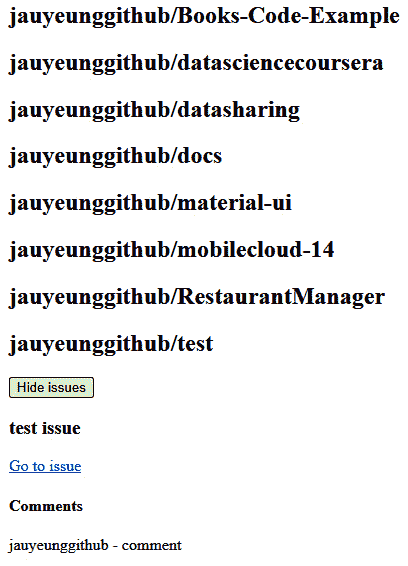
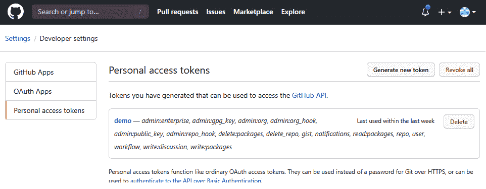
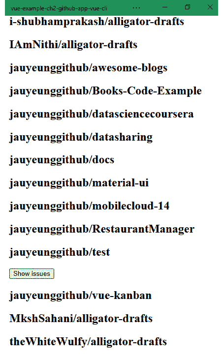
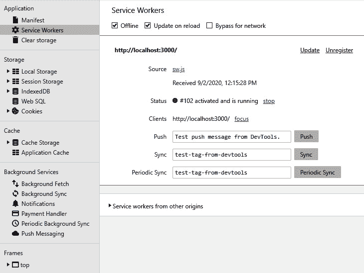

# 第二章：*第二章*：构建 Vue 3 渐进式 Web 应用

在本章中，我们将学习如何使用 Vue 3 创建 GitHub **渐进式 Web 应用**（**PWA**）。在构建项目的过程中，我们将深入了解 Vue 应用的内部工作原理，查看基本构建块。我们将使用组件创建 Vue 应用，并在创建过程中，我们将查看组件的组成部分以及它们的工作原理。

在需要时，我们还将使用更高级的功能，比如指令。指令让我们能够操纵**文档对象模型**（**DOM**）而不会使组件的代码混乱。它们为我们提供了一种干净的方式来访问 DOM 元素并以可重用的方式处理它们。这有助于简化测试，并帮助我们模块化我们的代码。

Vue 3 带有许多内置指令，我们将使用它们。在上一章中，我们简要概述了这些指令。在本章中，我们将更详细地了解它们的工作原理。这些指令提供了易于使用的抽象，使许多事情对我们来说更容易，并且是 Vue 3 的基本特性，我们无法离开它们。

我们将使用组件来显示我们想要的数据，它们将通过 props 接收输入，以便我们可以获取适当的数据并显示它。在每个组件中，我们将添加自己的方法，并利用一些组件生命周期方法。为了减少代码的重复，我们使用混入来抽象出组件中常用的功能，并将它们合并到我们的组件中。

在本章中，我们将学习以下主题：

+   组件和 PWA 的基本理论

+   介绍 GitHub 作品集应用程序

+   创建 PWA

+   提供 PWA 服务

# 技术要求

本章的代码可以在[`github.com/PacktPublishing/-Vue.js-3-By-Example/tree/master/Chapter02`](https://github.com/PacktPublishing/-Vue.js-3-By-Example/tree/master/Chapter02)找到。

# 组件和 PWA 的基本理论

在开始构建 Vue 应用之前，让我们先熟悉一下组件和 PWA。Vue 3 允许我们使用组件构建前端 Web 应用。通过组件，我们可以将应用程序分成小的、可重用的部分，然后将它们组合在一起形成一个大应用程序。这种组合是通过嵌套实现的。为了使应用程序的不同部分组合在一起，我们可以在它们之间传递数据。组件可以来自库，也可以由我们自己创建。

组件由几个部分组成；它包括模板、脚本和样式。模板是在屏幕上呈现的内容。它包含**超文本标记语言**（**HTML**）元素、指令和组件。组件和 HTML 元素可以添加属性和事件监听器。属性用于从父组件传递数据到子组件。

**事件监听器**让我们可以监听从子组件到父组件发出的事件。事件可以携带有效负载，其中包含数据。这使我们能够实现子组件到父组件的通信。将这两者结合起来，我们就有了一个完整的系统，可以在父子组件之间进行通信。

任何非平凡的应用程序都会有多个需要相互通信的组件。

PWAs 是特殊的网络应用程序，可以安装在用户的计算机上，浏览器管理这些安装的应用程序。它们与常规网络应用程序不同，因为它们让我们可以原生地访问一些计算机硬件。当我们在浏览器中访问 PWA 时，我们可以选择安装 PWA，然后可以从应用商店中打开我们的应用程序。

PWAs 不需要特殊的捆绑或分发程序。这意味着它们可以像任何其他网络应用程序一样部署到服务器上。许多现代浏览器——如 Mozilla Firefox、Google Chrome、Apple Safari 和 Microsoft Edge——都支持 PWAs。这意味着我们可以使用它们安装应用程序。

PWAs 的特殊特性包括能够为每个用户工作，无论浏览器选择如何。它们还具有响应式，这意味着它们可以在任何设备上工作，例如台式机、笔记本电脑、平板电脑或移动设备。初始加载也很快，因为它们应该在第一次加载时被缓存。

它们也应该能够在没有互联网连接的情况下工作。服务工作者在后台运行，让我们可以在离线或低质量网络上使用 PWAs。这也是 PWAs 可用的缓存的另一个好处。

尽管 PWAs 是从浏览器中运行的，但它们的行为就像应用程序一样。它们具有类似应用程序的交互和导航样式。显示的内容也始终是最新的，因为服务工作者在后台运行以更新数据。

PWAs 的另一个重要好处是安全性。它们只能通过**HTTP 安全**（**HTTPS**）提供，因此外部人员无法窥视连接。这样，我们就知道连接没有被篡改。

PWA 还支持推送通知，以便与用户互动并通知他们更新。

它们也可以从**统一资源定位符**（**URL**）链接，并且 PWA 在我们可以使用它之前不需要安装过程——安装是完全可选的。安装后，它会在我们的浏览器上提供一个主屏幕图标，这样我们就可以点击它并开始使用它。

Vue 3 有一个`@vue/cli-plugin-pwa`插件，让我们可以在 Vue 3 项目中添加 PWA 功能，而无需进行任何手动配置。我们只需运行一个命令，所有文件和配置就会自动添加给我们。有了这个插件，我们可以使用 Vue 3 开发我们的 PWA，并且包含的服务工作者将在生产中运行。既然我们已经解决了这个问题，我们将看看如何创建可重用的组件。

# 介绍 GitHub 作品集应用程序

本章的主要项目是一个 GitHub 作品集应用程序。它是一个 PWA，这意味着它具有本章*组件和 PWA 的基本理论*部分列出的所有功能。这些功能是由`@vue/cli-plugin-pwa`插件自动提供的。我们可以通过一个命令添加我们需要的代码，以添加服务工作者和任何其他所需的配置。这样，当我们创建 Vue 项目时，我们就不必从头开始自己配置所有东西了。

为了开始我们的应用项目，我们将使用 Vite 来创建它。我们进入我们想要项目的文件夹，然后运行 Vite 来创建 Vue 3 应用项目。为此，我们使用**Node Package Manager**（**npm**）运行以下命令：

1.  第一个命令，在下面的代码片段中显示，运行 npm 全局安装 Vue **命令行界面**（**CLI**）：

```js
npm install -g @vue/cli@next
```

1.  我们运行 Vue CLI 来创建 Vue 3 项目。我们的项目文件夹名称是`vue-example-ch2-github-app`。需要运行以下命令来创建项目文件夹，并添加所有文件和设置，以便我们不必自己添加它们。这个命令进入我们刚创建的项目文件夹，并在询问时选择 Vue 3 项目：

```js
npm vue create vue-example-ch2-github-app 
```

1.  然后，我们运行以下命令来运行开发服务器，这样我们就可以在浏览器中看到项目，并在编写代码时刷新应用程序预览：

```js
npm run serve
```

或者，我们可以使用**另一种资源协商器**（**YARN**）运行以下命令：

1.  我们运行`yarn global add`来全局安装 Vue CLI，如下所示：

```js
yarn global add @vue/cli@next
```

1.  要创建 Vue 3 项目，我们运行以下命令，并在被询问时选择 Vue 3 项目：

```js
yarn create vue-example-ch2-github-app
```

1.  然后，我们运行以下命令来启动开发服务器，这样我们就可以在浏览器中看到项目，并在编写代码时刷新应用程序预览：

```js
yarn serve
```

所有前述命令都是相同的，它们都以相同的方式创建项目；只是我们想要使用哪个包管理器来创建我们的 Vue 3 项目的问题。此时，项目文件夹将包含我们的 Vue 3 项目所需的文件。

我们的 GitHub 作品集应用是一个渐进式 Web 应用程序，我们可以使用现有的 Vue CLI 插件轻松创建这个应用程序。创建项目后，我们可以开始创建我们的 Vue 3 PWA。

# 创建 PWA

首先，我们需要一种简单的方式通过其**表述状态转移**（**REST**）**应用程序编程接口**（**API**）访问 GitHub 数据。幸运的是，一位名为*Octokit*的开发人员制作了一个 JavaScript 客户端，让我们可以使用我们创建的访问令牌访问 GitHub REST API。我们只需要从**内容分发网络**（**CDN**）导入该包，就可以从浏览器中访问 GitHub REST API。它还有一个 Node 包，我们可以安装和导入。然而，Node 包只支持 Node.js 应用程序，因此无法在我们的 Vue 3 应用程序中使用。

Vue 3 是一个客户端 Web 框架，这意味着它主要在浏览器上运行。我们不应该混淆只在 Node 上运行的包和支持浏览器的包，否则当我们在浏览器中使用不受支持的包时，就会出现错误。

要开始，我们对现有文件进行一些更改。首先，我们从`index.css`中删除样式代码。在这个项目中，我们专注于应用程序的功能，而不是样式。此外，我们将`index.html`文件中的标题标签内文本重命名为`GitHub App`。

然后，为了使我们构建的应用成为 PWA，我们必须运行另一个命令来添加服务工作者，以整合诸如硬件访问支持、安装和离线使用支持等功能。为此，我们使用`@vue/cli-plugin-pwa`插件。我们可以通过运行以下命令来添加这个插件：

```js
vue add pwa
```

这将添加我们需要整合的所有文件和配置，使我们的 Vue 3 项目成为 PWA 项目。

Vue CLI 创建了一个使用单文件组件并对大部分应用程序使用**ECMAScript 6**（**ES6**）模块的 Vue 项目。当我们构建项目时，这些文件被捆绑在一起，然后在 Web 服务器上提供并在浏览器上运行。使用 Vue CLI 创建的项目以`main.js`作为入口点，它运行创建 Vue 应用所需的所有代码。

我们的`main.js`文件应包含以下代码：

```js
import { createApp } from 'vue'
import App from './App.vue'
import './registerServiceWorker'
createApp(App).mount('#app')
```

该文件位于`src`文件夹的根目录，Vue 3 将在应用程序首次加载或刷新时自动运行此文件。`createApp`函数将通过传入入口点组件来创建 Vue 3 应用程序。入口点组件是我们首次加载应用程序时首先运行的组件。在我们的项目中，我们导入了`App`并将其传递给`createApp`。

此外，`index.css`文件是从同一文件夹导入的。这是我们应用程序的全局样式，这是可选的，所以如果我们不想要任何全局样式，我们可以省略它。然后导入`registerServiceWorker.js`文件。仅使用文件名导入意味着文件中的代码直接运行，而不是我们从模块中导入任何内容。

`registerServiceWorker.js`文件应包含以下代码：

```js
/* eslint-disable no-console */
import { register } from 'register-service-worker'
if (process.env.NODE_ENV === 'production') {
...
    offline () {
      console.log('No internet connection found. App is running          in offline mode.')
    },
    error (error) {
      console.error('Error during service worker          registration:', error)
    }
  })
}
```

这是我们运行`vue add pwa`时创建的。如果应用程序处于`production`模式，我们调用`register`函数来注册服务工作者。当我们运行`npm run build`命令时，服务工作者将被创建，我们可以使用创建的服务工作者让用户从我们提供的构建代码中访问功能，例如缓存和硬件访问。服务工作者仅在`production`模式下创建，因为我们不希望在开发环境中缓存任何内容。我们始终希望看到显示最新数据，以便我们可以创建代码并调试它，而不会被缓存所困扰。

我们需要做的另一件事是从`src/components`文件夹中删除`HelloWorld.vue`组件，因为我们的应用程序不需要这个。我们稍后还将删除`App.vue`中对`HelloWorld`组件的任何引用。

现在我们已经对现有代码文件进行了编辑，我们可以创建新文件。为此，我们执行以下步骤：

1.  在`components`文件夹中，我们添加了一个`repo`文件夹；在`repo`文件夹中，我们添加了一个`issue`文件夹。在`repo`文件夹中，我们添加了`Issues.vue`组件文件。

1.  在`components/repo/issue`文件夹中，我们添加`Comments.vue`文件。`Issues.vue`用于显示 GitHub 代码存储库的问题。`Comments.vue`用于显示添加到代码存储库问题的评论。

1.  在`components`文件夹本身，我们添加`GitHubTokenForm.vue`文件以便我们输入和存储 GitHub 令牌。

1.  我们还将`Repos.vue`文件添加到相同的文件夹中，以显示 GitHub 访问令牌所指向的用户的代码存储库。最后，我们将`User.vue`文件添加到`components`文件夹中，以便显示用户信息。

1.  在`src`文件夹中创建一个`mixins`文件夹以添加一个 mixin，让我们使用 GitHub 访问令牌创建 Octokit GitHub 客户端。

我们将`octokitMixin.js`文件添加到`mixins`文件夹中以添加空的 mixin。现在，我们将它们全部留空，因为我们准备添加文件。

## 为我们的应用程序创建 GitHub 客户端

我们通过创建 GitHub `Client`对象来启动项目，该对象将在整个应用程序中使用。

首先，在`src/mixins/octokitMixin.js`文件中，我们添加以下代码：

```js
import { Octokit } from "https://cdn.skypack.dev/@octokit/rest";
export const octokitMixin = {
  methods: {
    createOctokitClient() {
      return new Octokit({
        auth: localStorage.getItem("github-token"),
      });
    }
  }
}
```

上述文件是一个 mixin，它是一个我们合并到组件中以便我们可以在组件中正确使用它的对象。Mixin 具有与组件相同的结构。添加`methods`属性以便我们可以创建并合并到组件中的方法。为了避免命名冲突，我们应该避免在我们的组件中命名任何方法为`createOctokitClient`，否则我们可能会得到意外的错误或行为。`createOctokitClient()`方法使用 Octokit 客户端通过获取`github-token`本地存储项来创建客户端，然后将其设置为`auth`属性。`auth`属性是我们的 GitHub 访问令牌。

`Octokit`构造函数来自我们从[`github.com/octokit/rest.js/releases?after=v17.1.0`](https://github.com/octokit/rest.js/releases?after=v17.1.0)添加的`octokit-rest.min.js`文件。我们找到`v16.43.1`标题，点击**Assets**，下载`octokit-rest.min.js`文件，并将其添加到`public`文件夹中。然后，在`public/index.html`中，我们添加一个`script`标签来引用该文件。我们应该在`index.html`文件中有以下代码：

```js
<!DOCTYPE html>
<html lang="en">
  <head>
    <meta charset="utf-8">
    <meta http-equiv="X-UA-Compatible" content="IE=edge">
    <meta name="viewport" content="width=device-
      width,initial-scale=1.0">
    <link rel="icon" href="<%= BASE_URL %>favicon.ico">
    <title><%= htmlWebpackPlugin.options.title %></title>
    <script src="<%= BASE_URL %>octokit-rest.min.js">
      </script>
  </head>
  <body>
    <noscript>
      <strong>We're sorry but <%= htmlWebpackPlugin.
          options.title %> doesn't work properly without 
           JavaScript enabled. Please enable it to 
            continue.</strong>
    </noscript>
    <div id="app"></div>
    <!-- built files will be auto injected -->
  </body>
</html>
```

## 添加问题和评论的显示

然后，在`src/components/repo/issue/Comments.vue`文件中，我们添加以下代码：

```js
<template>
  <div>
    <div v-if="comments.length > 0">
      <h4>Comments</h4>
      <div v-for="c of comments" :key="c.id">
        {{c.user && c.user.login}} - {{c.body}}
      </div>
    </div>
  </div>
...
        repo,
        issue_number: issueNumber,
      });
      this.comments = comments;
    }
  },
  watch: {
    owner() {
      this.getIssueComments();
    },
    repo() {
      this.getIssueComments();
    },
    issueNumber() {
      this.getIssueComments();
    }
  }
};
</script>
```

在这个组件中，我们有一个`template`部分和一个`script`部分。`script`部分包含了从问题中获取评论的逻辑。`name`属性包含了我们组件的名称。我们可以在其他组件中使用这个名称来引用我们的组件。`props`属性包含了组件接受的 props，如下面的代码片段所示：

```js
  props: {
    owner: {
      type: String,
      required: true,
    },
    repo: {
      type: String,
      required: true,
    },
    issueNumber: {
      type: Number,
      required: true,
    },
  },
```

该组件接受`owner`、`repo`和`issueNumber`三个 props。我们使用一个对象来定义 props，这样我们可以通过`type`属性轻松验证类型。`owner`和`repo`的类型值为`String`，因此它们必须是字符串。`issueNumber`属性的类型值设置为`Number`，因此它必须是一个数字。

`required`属性被设置为`true`，这意味着当我们在另一个组件中使用`Comments`组件时，必须设置这个`prop`。

`data()`方法用于返回一个具有响应式属性初始值的对象。`comments`响应式属性的初始值设置为空数组。

`mixins`属性让我们设置要合并到我们应用程序中的 mixin。由于`octokitMixin`有一个`methods`属性，其中的内容将被添加到我们组件的`methods`属性中，以便我们可以直接调用组件，就像我们将在这个组件的`methods`属性中所做的那样。

我们将 mixin 合并到我们的组件对象中，如下所示：

```js
mixins: [octokitMixin],
```

在`methods`属性中，我们的`Comments`组件有一个方法。我们使用`getIssueComments()`方法来获取问题的评论。其代码如下所示：

```js
  ...
  methods: {  
    ...
    async getIssueComments(owner, repo, issueNumber) {
      if (
        typeof owner !== "string" ||
        typeof repo !== "string" ||
        typeof issueNumber !== "number"
      ) {
        return;
      }
      const octokit = this.createOctokitClient();
      const { data: comments } = await 
        octokit.issues.listComments({
        owner,
        repo,
        issue_number: issueNumber,
      });
      this.comments = comments;
    },
    ...
  }
  ...
}
```

我们需要`owner`、`repo`和`issueNumber`属性。`owner`参数是拥有存储库的用户的用户名，`repo`参数是存储库名称，`issueNumber`参数是问题的问题编号。

我们检查每个类型，以确保它们是我们期望的类型，然后才使用`octokit.issue.listComments()`方法发出获取问题的请求。Octokit 客户端是通过我们的 mixin 的`createOctokitClient()`方法创建的。`listComments()`方法返回一个解析带有评论数据的问题的 promise。

之后，我们有 `watch` 属性来添加我们的监视器。属性的键是我们正在监视的 props 的名称。每个对象都有一个 `immediate` 属性，它使监视器在组件加载时立即开始监视。`handler` 方法具有在 prop 值更改或组件加载时运行的处理程序，因为我们将 `immediate` 属性设置为 `true`。

我们从此处的属性中传入所需的值，以及 `val` 来调用 `getIssueComments()` 方法。`val` 参数具有我们正在监视的任何 prop 的最新值。这样，如果我们设置了所有 prop 的值，我们总是可以获得最新的评论。

在模板中，我们通过引用 `comments` 响应式属性来加载评论。值是由在监视器中运行的 `getIssueComments()` 方法设置的。使用 `v-for` 指令，我们循环遍历每个项目并呈现值。`c.user.login` 属性具有发布评论的用户的用户名，`c.body` 具有评论的正文。

接下来，我们将以下代码添加到 `src/components/Issues.vue` 文件中：

```js
...
<script>
import { octokitMixin } from "../../mixins/octokitMixin";
import IssueComments from "./issue/Comments.vue";
export default {
  name: "RepoIssues",
  components: {
    IssueComments,
  },
  props: {
    owner: {
      type: String,
      required: true,
    },
    repo: {
      type: String,
      required: true,
    },
  },
  mixins: [octokitMixin],
  ...
};
</script>
```

上述代码为显示问题添加了一个组件。在 `Comments.vue` 组件中我们有类似的代码。我们使用相同的 `octokitMixin` 混合来整合来自混合的 `createOctokitClient()` 方法。

不同之处在于我们有 `getRepoIssues()` 方法来获取给定 GitHub 存储库的问题，而不是给定问题的评论，并且我们有两个 props 而不是三个。`owner` 和 `repo` props 都是字符串，并且我们以相同的方式将它们设置为必需的并验证它们的类型。

在 `data()` 方法中，我们有 `issues` 数组，当我们调用 `getRepoIssues` 时设置。这在以下代码片段中显示：

src/components/Issues.vue

```js
  data() {
    return {
      issues: [],
      showIssues: false,
    };
  },
```

`octokit.issues.listForRepo()` 方法返回一个解析给定存储库的问题的 promise。`showIssue` 响应式属性让我们切换是否显示问题。

我们还有获取 GitHub 问题的方法，如下面的代码片段所示：

src/components/Issues.vue

```js
  methods: {
    async getRepoIssues(owner, repo) {
      const octokit = this.createOctokitClient();
      const { data: issues } = await 
        octokit.issues.listForRepo({
        owner,
        repo,
      });
      this.issues = issues;
    },
  },
```

`showIssues` 响应式属性由 **显示问题** 按钮控制。我们使用 `v-if` 指令在 `showIssues` 响应式属性为 `true` 时显示问题。外部的 `div` 标签用于检查问题的长度属性，这样当长度大于 `0` 时，我们只显示 **显示问题** 按钮和问题列表。

该方法由观察者触发，如下所示：

src/components/Issues.vue

```js
  watch: {
    owner: {
      handler(val) {
        this.getRepoIssues(val, this.repo);
      },
    },
    repo: {
      handler(val) {
        this.getRepoIssues(this.owner, val);
      },
    },
  },
  created () {
    this.getRepoIssues(this.owner, this.repo);
  }
```

在`components`属性中，我们将导入的`IssueComments`组件（之前创建的组件）放入我们的组件对象中。如果我们将组件放入`components`属性中，那么它将在组件中注册，我们可以在模板中使用它。

接下来，我们按如下方式将模板添加到文件中：

src/components/Issues.vue

```js
<template>
  <div v-if="issues.length > 0">
    <button @click="showIssues = !showIssues">{{showIssues 
       ? 'Hide' : 'Show'}} issues</button>
    <div v-if="showIssues">
      <div v-for="i of issues" :key="i.id">
        <h3>{{i.title}}</h3>
        <a :href="i.url">Go to issue</a>
        <IssueComments :owner="owner" :repo="repo" 
          :issueNumber="i.number" />
      </div>
    </div>
  </div>
</template>
```

当我们使用`v-for`指令时，需要包括`key`属性，以便正确显示条目，以便 Vue 3 跟踪它们。`key`的值必须是唯一的 ID。我们在模板中引用了我们注册的`IssueComments`组件，并向其传递了`props`。`:`符号是`v-bind`指令的简写，表示我们正在向组件传递 props，而不是设置属性。

## 让用户使用 GitHub 令牌访问 GitHub 数据

接下来，我们将在`src/components/GitHubTokenForm.vue`文件上进行工作，如下所示：

```js
<template>
  <form @submit.prevent="saveToken">
    <div>
      <label for="githubToken">Github Token</label>
      <br />
      <input id="githubToken" v-model="githubToken" />
    </div>
    <div>
      <input type="submit" value="Save token" />
      <button type="button" @click="clearToken">Clear token
         </button>
...
    clearToken() {
      localStorage.clear();
    },
  },
};
</script>
```

我们有一个表单，其中有一个输入框，让我们输入 GitHub 访问令牌。这样，我们可以在提交表单时保存它。此外，我们还有一个类型为`submit`的输入框。它的`value`属性显示为**提交**按钮的文本。我们还有一个按钮，可以让我们清除令牌。`@submit.prevent`指令让我们运行`saveToken`提交处理程序，并同时调用`event.preventDefault()`。`@`符号是`v-on`指令的简写，它监听表单发出的提交事件。

文本输入框具有`v-model`指令，将输入值绑定到`githubToken`响应式属性。为了使我们的输入对屏幕阅读器可访问，我们有一个带有`for`属性的标签，引用输入框的 ID。标签之间的文本显示在标签中。

表单提交后，`saveToken()`方法将运行，将输入的值保存到本地存储中，键为`github-token`字符串。`created()`方法是一个生命周期钩子，让我们可以从本地存储中获取值。通过访问具有`github-token`键的项目，可以获取保存的令牌。

`clearToken()`方法用于清除令牌，并在单击**清除令牌**按钮时运行。

接下来，我们将以下代码添加到`src/components/Repos.vue`组件中：

```js
<template>
  <div>
    <h1>Repos</h1>
    <div v-for="r of repos" :key="r.id">
      <h2>{{r.owner.login}}/{{r.name}}</h2>
      <Issues :owner="r.owner.login" :repo="r.name" />
    </div>
  </div>
</template>
<script>
import Issues from "./repo/Issues.vue";
import { octokitMixin } from "../mixins/octokitMixin";
export default {
  name: "Repos",
  components: {
    Issues,
  },
  data() {
    return {
      repos: [],
    };
  },
  mixins: [octokitMixin],
  async mounted() {
    const octokit = this.createOctokitClient();
    const { data: repos } = await 
       octokit.request("/user/repos");
    this.repos = repos;
  },
};
</script>
```

我们使用`octokit.request()`方法向 GitHub REST API 的`/user/repos`端点发出请求。再次，`octokit`对象是使用之前使用的相同的 mixin 创建的。我们注册`Issues`组件，以便我们可以使用它来显示代码存储库的问题。我们循环遍历`repos`响应式属性，该属性被分配了`octokit.request()`方法的值。

数据在模板中呈现。`r.owner.login`属性具有 GitHub 存储库所有者的用户名，`r.name`属性具有存储库名称。我们将这两个值作为 props 传递给`Issues`组件，以便`Issues`组件加载给定存储库的问题。

同样，在`src/components/User.vue`文件中，我们编写以下代码：

```js
<template>
  <div>
    <h1>User Info</h1>
    <ul>
      <li>
        
      </li>
      <li>username: {{userData.login}}</li>
      <li>followers: {{userData.followers}}</li>
      <li>plan: {{userData.pla && userData.plan.name}}</li>
    </ul>
  </div>
...
    const { data: userData } = await 
      octokit.request("/user");
    this.userData = userData;
  },
};
</script>
<style scoped>
#avatar {
  width: 50px;
  height: 50px;
}
</style>
```

`scoped`关键字意味着样式仅应用于当前组件。

该组件用于显示我们可以从 GitHub 访问令牌访问的用户信息。我们使用相同的 mixin 为 Octokit 客户端创建`octokit`对象。通过调用`request()`方法，向用户端点发出请求以获取用户数据。

然后，在模板中，我们使用`avatar_url`属性显示用户数据。`username.login`属性具有令牌所有者的用户名，`userData.followers`属性具有用户的关注者数量，`userData.plan.name`属性具有计划名称。

最后，为了将整个应用程序放在一起，我们在`App.vue`组件中使用`GitHubTokenForm`，`User`和`Repo`组件。`App.vue`组件是加载应用程序时加载的`root`组件。

在`src/App.vue`文件中，我们编写以下代码：

```js
<template>
  <div>
    <h1>Github App</h1>
    <GitHubTokenForm />
    <User />
    <Repos />
  </div>
</template>
<script>
import GitHubTokenForm from "./components/GitHubTokenForm.vue";
import Repos from "./components/Repos.vue";
import User from "./components/User.vue";
export default {
  name: "App",
  components: {
    GitHubTokenForm,
    Repos,
    User,
  },
};
</script>
```

我们通过将它们放在`components`属性中注册所有三个组件来注册它们。然后，我们在模板中使用它们。

现在，我们应该看到以下屏幕：



图 2.1 - 仓库列表

我们看到显示的存储库列表，如果有为它们记录的问题，我们会看到**显示问题**按钮，让我们看到给定存储库的任何问题。这可以在以下截图中看到：


图 2.2 - 显示问题按钮

我们可以点击**隐藏问题**来隐藏它们。如果有任何评论，那么我们应该在问题下面看到它们。

# 提供 PWA

现在我们已经构建了应用程序，我们可以提供它，以便我们可以在浏览器中安装它。让我们开始，如下所示：

1.  要构建该应用程序，我们运行以下命令：

```js
npm run build
```

1.  我们可以使用`browser-sync`包，通过运行以下命令来安装它：

```js
npm install –g browser-sync
```

上述命令将安装一个 Web 服务器。

1.  我们可以进入`dist`文件夹，其中包含构建的文件，并运行`browser-sync`来提供 PWA。

1.  现在，要运行应用程序，我们需要从我们的 GitHub 帐户获取 GitHub 身份验证令牌。如果您没有 GitHub 帐户，那么您将不得不注册一个。

1.  一旦我们创建了一个帐户，那么我们就可以获得令牌。要获取令牌，请登录到您的 GitHub 帐户。

1.  前往[`github.com/settings/tokens`](https://github.com/settings/tokens)。

1.  页面加载完成后，点击**个人访问令牌**链接。

1.  点击**生成新令牌**以生成令牌。一旦创建，将令牌复制到某个地方，以便我们可以通过在应用程序中输入它来使用它。

我们应该看到类似这样的东西：



图 2.3 – 获取令牌的屏幕

1.  一旦您获得了令牌，返回到我们在浏览器中加载的应用程序。

1.  将令牌输入到**GitHub Token**输入中，点击**保存令牌**，然后刷新页面。如果有任何存储库以及相关问题和评论，它们应该显示在页面中。

1.  一旦我们在浏览器中，我们应该在 URL 栏的右侧看到一个加号（**+**）标志。这个按钮让我们安装 PWA。

1.  一旦我们安装它，我们应该在主屏幕上看到它。我们可以转到`chrome://apps` URL，以查看我们刚刚安装的应用程序，如下截图所示：

图 2.4 – 我们 PWA 中的 GitHub 存储库列表

1.  如果您使用的是 Chrome 或任何其他 Chromium 浏览器，如 Edge，您可以按下*F12*打开开发者控制台。

1.  点击**应用程序**选项卡，然后点击左侧的**服务工作者**链接，让我们测试服务工作者，如下截图所示：

图 2.5 – 应用程序选项卡中的服务工作者部分

1.  我们可以选中**离线**复选框，模拟它在离线时的行为。选中**重新加载时更新**将在刷新页面时重新加载应用程序，并获取最新的数据。URL 应该与您的应用程序运行的 URL 相同。这是我们的 GitHub PWA 注册的服务工作者。

1.  **注销**链接将注销服务工作者。当我们再次运行应用程序时，应该重新注册它。

我们现在已经完成了使用 Vue 3 创建我们的渐进式 Web 应用程序。我们可以在浏览器中安装它，然后像设备上的任何其他应用程序一样使用它。

# 总结

通过构建 GitHub PWA，我们学会了如何创建可重用的组件。我们还研究了如何添加 props，以便从父组件向子组件传递数据。在子组件中，我们通过检查数据类型并指定 prop 是否必需来验证 props。这样，我们可以轻松地看到 prop 是否具有意外的值。

我们还研究了如何使用观察者来监视响应式属性值的变化。观察者可以添加以监视任何响应式属性的变化。我们可以监视本地被改变的数据，也可以监视 props 的值。它们都是响应式的，因此它们都会触发观察者方法。我们可以在观察者中运行异步代码，这是计算属性无法做到的。

此外，我们还研究了组件的生命周期钩子。每个组件也有自己的生命周期钩子。我们可以向生命周期方法中添加我们自己的代码，以便在需要时运行代码。组件生命周期的各个阶段都有生命周期钩子，包括加载时的开始阶段，更新和销毁。

最后，我们学会了如何使用命令行插件将我们的 Vue 3 web 应用程序转换为 PWA。我们可以向我们的 Vue 项目添加插件来创建 PWA。通过它，服务工作者将在我们的应用程序中注册，以处理不同的连接类型和缓存。

在下一章中，我们将使用 Vue 3 创建一个滑块拼图，并编写自动化测试来测试应用程序的每个部分。
