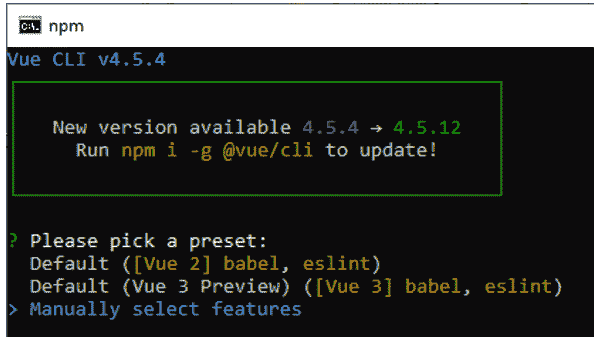
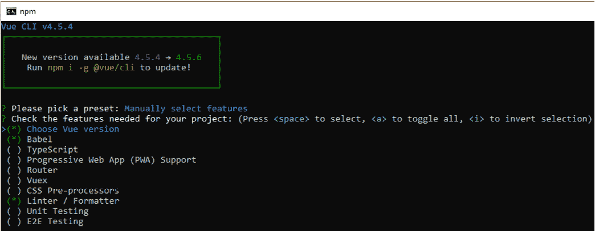
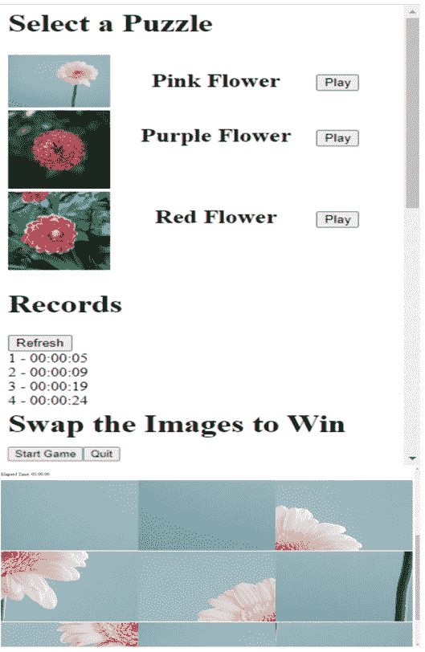
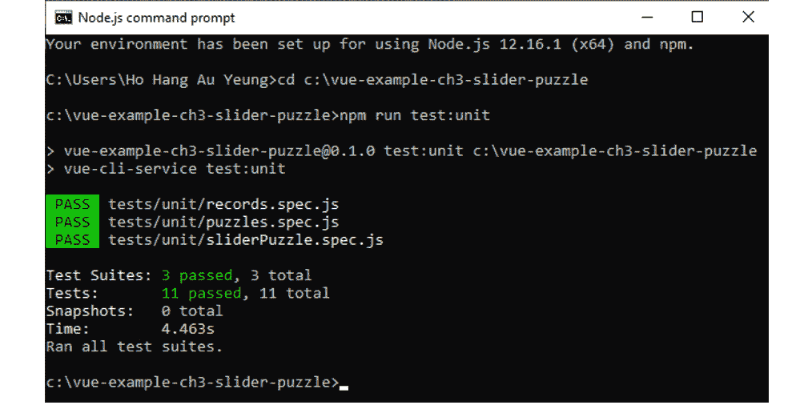

# 第三章：使用测试构建滑块拼图游戏

在上一章中，我们使用 Vue 创建了一个简单的 GitHub 应用，并添加了一些组件。在本章中，我们将构建一个简单的滑块拼图游戏。游戏的目标是重新排列图片的部分，直到它看起来像我们期望的样子。它将有一个计时器来计算经过的时间，并在屏幕上显示出来。一旦我们正确地重新排列了图像的部分，我们将看到一个“你赢了”的消息，并且如果它是前 10 名最快的时间，经过的时间将被记录在本地存储中。我们有多个拼图可以选择，这样我们的游戏就会更加有趣。这比只有一个拼图更有趣。

为了构建应用程序，我们将构建具有计算属性和计时器的组件来计算经过的时间。此外，一些组件将从本地存储中获取和设置数据。每当我们从本地存储中获取数据时，结果将被显示出来。我们将使用本地存储来存储最快的时间。本地存储只能存储字符串，因此我们将把结果转换为字符串并存储起来。

我们将使用计时器来计时玩家赢得游戏的时间，并使用计算属性来确定玩家赢得游戏的时间。此外，为了确保我们的游戏能够正常运行，我们将为每个部分添加单元测试，以自动测试每个组件。

在本章中，我们将深入研究组件，并涵盖以下主题：

+   理解组件和混合的基础知识

+   设置我们的 Vue 项目

+   创建用于洗牌图片的组件

+   让用户重新排列幻灯片

+   根据时间计算得分

+   使用 Jest 进行单元测试

# 技术要求

本章的源代码位于[`github.com/PacktPublishing/-Vue.js-3-By-Example/tree/master/Chapter03`](https://github.com/PacktPublishing/-Vue.js-3-By-Example/tree/master/Chapter03)。

# 理解组件和混合的基础知识

组件还有比我们在*第二章*中所做的更多，*构建一个 Vue 3 渐进式 Web 应用*，来创建 GitHub 渐进式 Web 应用。这些组件是最基本的部分。我们将在我们的组件中使用定时器，而不仅仅是获取数据并显示它的组件。此外，我们将看看何时以及如何使用计算属性，以便我们可以创建从其他响应式属性派生值的响应式属性。这样可以避免创建我们不需要的额外方法或不必要地使用指令。

此外，我们将看看如何使用计算属性来返回从其他响应式属性派生的值。**计算属性**是返回值的方法，这些值是从一个或多个其他响应式属性派生而来的。它们本身也是响应式属性。它们最常见的用法是作为 getter。然而，计算属性既可以有 getter 也可以有 setter。它们的返回值被缓存，以便在一个或多个响应式属性的值更新之前不会运行。它们可用于以高效的方式替换复杂的模板表达式和方法。

组件还可以发出自定义事件。一个事件可以包含一个或多个与事件一起发出的有效负载。它们有自己的事件名称，我们可以通过使用`v-on`指令来监听事件。我们可以使用`$event`变量或事件处理程序方法的参数来获取发出的有效负载。

Vue 3 应用的另一个重要部分是**测试**。当我们提到测试时，通常是指自动化测试。测试有许多形式，对捕捉各种类型的错误都很有用。它们经常用于捕捉回归，即在我们更改已经成为应用一部分的代码后创建的错误。我们可以通过几种测试来检查回归。我们可以创建的最小测试是**单元测试**，它测试一个组件及其部分的隔离。它通过在测试环境中挂载我们的组件来工作。任何阻止我们的测试隔离运行的依赖项都被模拟，以便我们可以在隔离环境中运行我们的测试。这样，我们可以在任何环境和任何顺序下运行我们的测试。

每个测试都是独立的，所以我们不应该在任何地方运行它们时出现任何问题，即使没有互联网连接。这很重要，因为它们应该是可移植的。此外，诸如 API 数据和定时器之类的外部资源非常不稳定。它们也是异步的，这使它们难以测试。因此，我们必须确保我们的测试不需要它们，因为我们希望结果是一致的。

Vue 支持 JavaScript 测试框架，如**Jest**和**Mocha**。这是使用 Vue CLI 创建 Vue 项目的一个巨大好处。我们不必自己创建所有测试代码的脚手架。

另一种测试是*端到端*测试。这些测试模拟用户如何使用我们的应用程序。我们通常会创建一个从头开始然后关闭的环境来运行这些测试。这是因为我们希望我们的测试中始终有新鲜的数据。测试必须能够以一致的方式运行。如果我们要像用户一样使用应用程序，我们需要一致的数据来完成这项工作。

在本章中，我们将主要关注前端应用程序的单元测试。它们可以提供类似于端到端测试的 DOM 交互，但它们更快速，体积更小。它们也运行得更快，因为我们不必每次运行测试时都创建一个干净的环境。环境的创建和用户交互测试总是比单元测试慢。因此，我们应该有许多单元测试和少量端到端测试，用于测试应用程序最关键的部分。

# 设置 Vue 项目

现在我们已经学会了计算属性和 getter 和 setter 的基础知识，我们准备深入研究我们将需要的组件部分并创建项目。

要创建项目，我们再次使用 Vue CLI。这次，我们必须选择一些选项，而不是选择默认选项。但在这之前，我们将创建一个名为`vue-example-ch3-slider-puzzle`的项目文件夹。然后，我们必须进入文件夹并使用`npm`运行以下命令：

1.  首先，我们必须全局安装 Vue CLI，以便我们可以使用它创建和运行我们的项目：

```js
npm install -g @vue/cli@next
```

1.  现在，我们可以进入我们的项目文件夹并运行以下命令来创建我们的项目：

```js
vue create .
```

同样地，我们可以使用 Yarn 运行以下命令：

1.  首先，我们必须全局安装 Vue CLI，以便我们可以使用它创建和运行我们的项目：

```js
yarn global add @vue/cli@next
```

1.  然后，我们可以进入我们的项目文件夹并运行以下命令来创建我们的项目：

```js
yarn create .
```

无论哪种情况，我们都应该看到 Vue CLI 命令行程序并获得如何选择项目的说明。如果我们被问及是否要在当前文件夹中创建项目，我们可以输入*Y*并按*Enter*来执行。然后，我们应该看到我们可以使用的项目类型，我们应该选择`Manually select features`，然后选择`Vue 3`来创建一个 Vue 3 项目：



图 3.1 - 在 Vue CLI 向导中创建项目类型的选择

在下一个屏幕上，我们应该看到我们可以添加到项目中的内容。选择`Unit` `Testing`，然后您需要选择`Testing` `with` `Jest`，这样我们就可以为我们的应用程序添加测试。

一旦我们完成了编写代码，这个项目将为许多组件提供测试：



图 3.2 - 我们应该为这个项目选择的选项

一旦我们让 Vue CLI 完成项目的创建，我们应该在`src`文件夹中看到代码文件。测试应该在`tests/unit`文件夹中。Vue CLI 为我们节省了大量精力，因为我们不需要自己编写测试代码。它带有一个我们可以扩展的示例测试。

一旦我们选择了这些选项，我们就可以开始创建我们的应用程序。在这个项目中，我们将从 Unsplash 获取一些图片，该网站为我们提供了免版税的图片。然后，我们将获取这些图片并将它们分成九个部分，以便我们可以在`slider puzzle`组件中显示它们。我们需要整张图片和切割后的部分。在这个例子中，我们将从以下链接获取图片：

+   [`unsplash.com/photos/EfhCUc_fjrU`](https://unsplash.com/photos/EfhCUc_fjrU)

+   [`unsplash.com/photos/CTvtrspsPQs`](https://unsplash.com/photos/CTvtrspsPQs)

+   [`unsplash.com/photos/XoCyW2JVmiE`](https://unsplash.com/photos/XoCyW2JVmiE)

当我们进入每个页面时，我们必须点击**下载**按钮来下载图片。一旦我们下载了图片，我们必须转到[`www.imgonline.com.ua/eng/cut-photo-into-pieces.php`](https://www.imgonline.com.ua/eng/cut-photo-into-pieces.php)自动将图片切成九块。

在*section 1*中，我们选择我们的图片文件。在*section 2*中，我们将**宽度分成的部分**和**高度分成的部分**都设置为`3`。这样，我们可以将我们的图片分成九个部分。一旦我们做到了这一点，我们就可以下载生成的 ZIP 文件，然后将所有的图片提取到一个文件夹中。这应该对每个图片都重复进行。

一旦我们有了所有的整个和切割的图像片段，我们应该把它们都放到我们刚刚创建的 Vue 3 项目文件夹的`src/assets`文件夹中。这样，我们就可以从我们的应用程序访问并显示这些图像。第一张图片显示了一朵粉色的花，所以整个图片被命名为`pink.jpg`，切割后的图片在`cut-pink`文件夹中。生成的切割图片的文件名保持不变。第二张图片是一朵紫色的花，所以整个图片被命名为`purple.jpg`，切割后的图片文件夹被命名为`cut-purple`。第三张图片是一朵红色的花。因此，它被命名为`red.jpg`，包含图像切割片段的文件夹被命名为`cut-red`。

现在我们已经处理了图片，我们可以创建我们的组件。

首先，我们必须从`src/components`文件夹中删除`HelloWorld.vue`，因为我们不再需要它了。我们还必须从`App.vue`文件中删除对它的任何引用。

接下来，在`components`文件夹中，我们必须创建`Puzzles.vue`文件，以便让我们选择拼图。它有一个模板，这样我们就可以显示我们选择的拼图。在`component options`对象中，我们有一个包含要显示的拼图数据的数组。此外，我们有一个方法，让我们向我们的父组件发出事件，即`App.vue`组件。这样，我们就可以在我们将创建的滑块拼图组件中显示正确的拼图。为此，在`src/components/Puzzles.vue`中，我们必须添加以下模板代码：

```js
<template>
  <div>
    <h1>Select a Puzzle</h1>
    <div v-for="p of puzzles" :key="p.id" class="row">
      <div>
        
      </div>
      <div>
        <h2>{{p.title}}</h2>
      </div>
      <div class="play-button">
        <button @click="selectPuzzle(p)">Play</button>
      </div>
    </div>
  </div>
</template>
```

然后，我们必须添加以下脚本和样式标签：

```js
<script>
export default {
  data() {
    return {
      puzzles: [
        { id: 'cut-pink', image: "pink.jpg", title: "Pink 
          Flower" },
        { id: 'cut-purple', image: "purple.jpg", title: 
          "Purple Flower" },
        { id: 'cut-red', image: "red.jpg", title: "Red 
          Flower" },
      ],
    };
  },
...
<style scoped>
.row {
  display: flex;
  max-width: 90vw;
  flex-wrap: wrap;
  justify-content: space-between;
}
.row img {
  width: 100px;
}
.row .play-button {
  padding-top: 25px;
}
</style>
```

在脚本标签之间，我们有`component options`对象，其中包含`data()`方法，以及在脚本标签之间的拼图的响应属性。它有一个包含`id`、`image`和`title`属性的对象数组。`id`属性是一个唯一的 ID，我们在使用`v-for`指令渲染条目时使用它。我们还向`App.vue`发出 ID，这样我们就可以从那里将其作为属性传递给我们的滑块拼图组件。`title`是我们以人类可读的方式在模板中显示的标题。

在`methods`属性中，我们有一个`selectPuzzle()`方法，它接受谜题对象作为参数。它调用`this.$emit`来触发 puzzle-changed 事件。第一个参数是`name`。第二个参数是我们想要在事件中触发的`payload`属性。我们可以通过在父组件中为元素添加`v-on`指令来监听事件，无论这个组件在哪里被引用。

在模板中，我们使用`h1`组件显示`title`。`v-for`指令循环遍历谜题的`array`响应属性中的项目并显示它们。像往常一样，我们需要为每个条目设置`key`属性，以便为 Vue 3 正确跟踪值设置唯一 ID。我们还必须添加一个`class`属性，以便我们可以样式化行。要显示图像，我们可以调用`require`，这样 Vue 3 可以直接解析路径。Vue CLI 使用 Webpack，因此它可以将图像作为模块加载。我们可以将其设置为`src`属性的值，它将显示图像。我们加载整个图像并显示它们。

此外，在行中，我们有一个按钮，当我们点击它时调用`selectPuzzle()`方法。这将设置谜题的选择并将其传播到我们将创建的滑块谜题组件，以便我们可以看到正确的谜题显示。

`.row img select`的宽度设置为`100px`，以显示整个图像的缩略图。此外，我们可以以一种与其他子元素对齐的方式显示按钮。

接下来，我们必须创建`src/components/Records.vue`文件，以添加一个包含速度记录的组件。这提供了一个最快完成游戏的时间列表。最快的时间记录存储在本地存储中，以便轻松访问。在这个组件中，我们只是显示组件。

要创建这个组件，我们必须在`src/components/Records.vue`中编写以下代码：

```js
<template>
  <div>
    <h1>Records</h1>
    <button @click="getRecords">Refresh</button>
    <div v-for="(r, index) of records" :key="index">{{
      index + 1}} - {{r.elapsedTime}}</div>
  </div>
</template>
<script>
export default {
  data() {
    return {
      records: [],
    };
  },
  created() {
    this.getRecords();
  },
  methods: {
    getRecords() {
      const records = JSON.parse(localStorage.getItem(
        "records")) || [];
      this.records = records;
    },
  },
};
</script>
```

在`component`对象中，我们有`getRecords()`方法，它从本地存储中获取最快的时间记录。`localStorage.getItem()`方法通过其键获取数据。参数是映射到我们想要获取的数据的键。它返回一个包含数据的字符串。因此，为了将字符串转换为对象，我们必须调用`JSON.parse`将 JSON 字符串解析为对象。它应该是一个数组，因为我们将创建一个数组并将其字符串化为 JSON 字符串，然后记录它。本地存储只能保存字符串；因此，这是一个必需的步骤。

一旦我们从本地存储中检索到记录，我们可以将其设置为`this.records`响应式属性的值。如果本地存储中没有带有`records`键的项目，我们必须将默认值设置为空数组。这样，我们总是将一个数组分配给`this.records`。

此外，我们还有`beforeMount`钩子，它让我们在组件挂载之前获取记录。这样，当组件挂载时，我们将看到记录。

在模板中，我们使用`v-for`指令显示速度记录，以循环遍历项目并显示它们。数组条目中的`v-for`指令在括号中有第一个项目。括号中的第二个项目是索引。我们可以将`key`属性设置为索引，因为它们是唯一的，而且我们不会移动条目。我们在列表中显示两者。

此外，我们有一个按钮，当我们点击它时调用`getRecords`方法以获取最新条目。

现在我们已经创建了最简单的组件，我们可以继续创建滑块拼图组件。

# 创建洗牌图片的组件

滑块拼图游戏提供了滑块拼图，玩家将拼图洗牌成图片以赢得比赛，显示经过的时间，重新排列拼图的逻辑，检查我们是否赢得比赛的逻辑，以及计算自游戏开始以来经过的时间的计时器。

为了轻松计算经过的时间，我们可以使用`moment`库。要安装该库，我们可以运行`npm install moment`。一旦我们安装了包，我们就可以开始编写必要的代码。

让我们创建`src/components/SliderPuzzle.vue`文件。该文件的完整代码可以在[`github.com/PacktPublishing/-Vue.js-3-By-Example/blob/master/Chapter03/src/components/SliderPuzzle.vue`](https://github.com/PacktPublishing/-Vue.js-3-By-Example/blob/master/Chapter03/src/components/SliderPuzzle.vue)找到。

我们将首先通过`script`标签创建组件：

```js
<script>
import moment from "moment";
const correctPuzzleArray = [
  "image_part_001.jpg",
  "image_part_002.jpg",
  "image_part_003.jpg",
  "image_part_004.jpg",
  "image_part_005.jpg",
  "image_part_006.jpg",
  "image_part_007.jpg",
  "image_part_008.jpg",
  "image_part_009.jpg",
];
...
</script>
```

首先，我们导入`moment`库来计算经过的时间。接下来，我们定义`correctPuzzleArray`变量，并将其分配给一个具有文件正确顺序的数组。我们根据这个数组来确定玩家是否赢得了比赛。

然后，我们开始创建组件选项的对象。`props`属性包含我们自己的属性。`puzzleId`是一个包含玩家正在玩的谜题的 ID 的字符串。我们必须确保它是一个字符串。我们将其默认值设置为`'cut-pink'`，这样我们就始终有一个谜题集。

`data()`方法包含我们的初始状态。我们返回一个包含它们的对象。这样，我们可以确保响应属性的值始终与我们应用程序中的其他组件隔离。`correctPuzzleArray`响应属性就是我们之前定义的。我们只是将其设置为一个属性，使其成为一个响应属性。这使它可以与我们的`isWinning`计算属性一起使用，因为我们希望在此数组更新时更新值：

```js
<script>
...
export default {
  name: "SliderPuzzle",
  props: {
    puzzleId: {
      type: String,
      default: "cut-pink",
    },
  },
  data() {
    return {
      correctPuzzleArray,
      shuffledPuzzleArray: [...correctPuzzleArray].sort(
        () => Math.random() - 0.5
      ),
      indexesToSwap: [],
      timer: undefined,
      startDateTime: new Date(),
      currentDateTime: new Date(),
    };
  },
  ...
};
</script>
```

`shuffledPuzzleArray`是`correctPuzzleArray`响应属性的副本，但项目被洗牌，以便玩家必须重新排列项目才能赢得游戏。为了创建属性的值，首先我们必须用扩展运算符复制`correctPuzzleArray`数组。然后，我们必须使用`callback`调用`sort`。`callback`是一个使用`Math.random()`生成介于`-0.5`和`0.5`之间的数字的函数。我们需要一个在这个范围内的随机数，以便值随机排序。`callback`是一个比较函数。它可以接受两个参数；也就是说，前一个和当前数组条目，这样我们就可以比较它们：

```js
<script>
...
export default {
  ...
  computed: {
    isWinning() {
      for (let i = 0; i < correctPuzzleArray.length; i++) {
        if (correctPuzzleArray[i] !== 
          this.shuffledPuzzleArray[i]) {
          return false;
        }
      }
      return true;
    },
    elapsedDiff() {
      const currentDateTime = moment(this.currentDateTime);
      const startDateTime = moment(this.startDateTime);
      return currentDateTime.diff(startDateTime);
    },
    elapsedTime() {
      return moment.utc(this.elapsedDiff).format(
        "HH:mm:ss");
    },
  },
};
</script>
```

由于我们是随机排序物品，所以不需要进行任何比较。如果比较器回调返回负数或`0`，则项目的顺序不变。否则，我们要排序的数组中的项目顺序会改变。`sort()`方法返回一个按顺序排列的新数组。

`indexesToSwap`响应属性用于添加我们想要交换的图像文件名的索引。当我们点击`swap()`方法时，我们向`indexesToSwap`响应属性推送一个新值，这样当`indexesToSwap`数组中有两个项目时，我们就可以交换这两个项目。

`timer`响应属性可能包含由`setInterval`函数返回的计时器对象。`setInterval`函数让我们周期性地运行代码。它接受一个包含我们想要运行的代码的回调作为第一个参数。第二个参数是回调之间的时间间隔，以毫秒为单位。

`startDateTime`响应属性包含游戏开始时的日期和时间。它是一个包含当前时间的`Date`实例。`currentDateTime`响应属性具有当前日期和时间的`Date`实例。随着游戏在我们传递给`setInterval`函数的`callback`属性中进行处理，它会被更新。

`data()`方法包含了所有响应式属性的初始值。

`computed`属性包含了计算属性。计算属性是同步函数，返回一些基于其他响应式属性的值。计算属性本身也是响应式属性。当计算属性函数中引用的响应式属性更新时，它们的值也会更新。在这个组件中，我们定义了三个计算属性：`isWinning`、`elapsedDiff`和`elapsedTime`。

`isWinning`计算属性是包含游戏状态的属性。如果它返回`true`，那么玩家赢得了游戏。否则，玩家还没有赢得游戏。为了检查玩家是否赢得了游戏，我们循环遍历`correctPuzzleArray`响应式属性，并检查它的每个条目是否与`shuffledPuzzleArray`响应式属性数组中的条目相同。

`correctPuzzleArray`包含了正确的项目列表。因此，如果`shuffledPuzzleArray`数组的每个项目与`correctPuzzleArray`中的条目匹配，那么我们知道玩家已经赢了。否则，玩家还没有赢。因此，如果`correctPuzzleArray`和`shuffledPuzzleArray`之间有任何差异，那么它返回 false。否则，返回 true。

`elapsedDiff`计算属性计算了经过的时间（毫秒）。这是我们使用`moment`库从`startDateTime`到`currentDateTime`计算经过时间的地方。我们使用`moment`库来进行这个计算，因为它让我们的工作变得更容易。它有一个`diff()`方法，我们可以用它来计算这个和另一个`moment`对象之间的差异。以毫秒为单位返回差异。

一旦我们计算出`elapsedDiff`计算属性，我们就可以使用它来使用`moment`格式化经过的时间为人类可读的时间格式，即 HH:mm:ss。`elapsedTime`计算属性返回一个字符串，其中包含格式化后的经过时间。`moment.utc()`方法是一个函数，它接受一个 UTC 时间段，然后返回一个`moment`对象，我们可以调用`format()`方法来计算时间。

现在我们已经定义了所有的响应式和计算属性，我们可以定义我们的方法，这样我们就可以将幻灯片重新排列成正确的图片。

# 重新排列幻灯片

我们可以通过编写以下代码为`SliderPuzzle.vue`组件添加所需的`methods`：

```js
<script>
...
export default {
  ...
  methods: {
    swap(index) {
      if (!this.timer) {
        return;
      }
      if (this.indexesToSwap.length < 2) {
        this.indexesToSwap.push(index);
      }
      if (this.indexesToSwap.length === 2) {
...
      this.resetTime();
      clearInterval(this.timer);
    },
    resetTime() {
      this.startDateTime = new Date();
      this.currentDateTime = new Date();
    },
    recordSpeedRecords() {
      let records = JSON.parse(localStorage.getItem(
        "records")) || [];
...
      localStorage.setItem("records", stringifiedRecords);
    },
  },
};
</script>
```

逻辑定义在`methods`属性中。我们有`swap()`方法让我们交换切割图像幻灯片。`start()`方法让我们将响应式属性重置为初始状态，洗牌切割照片幻灯片，然后启动计时器计算经过的时间。我们还在每次运行计时器代码时检查玩家是否获胜。`stop()`方法让我们停止计时器。`resetTime()`方法让我们将`startDateTime`和`currentDateTime`重置为它们的当前日期时间。`recordSpeedRecords()`方法让我们记录玩家赢得游戏所花费的时间，如果他们进入前 10 名。

我们从逻辑上交换幻灯片开始，定义`swap()`方法。它接受一个参数，即我们想要交换的幻灯片之一的索引。当玩家点击幻灯片时，将调用此方法。这样，我们将要与另一个幻灯片交换的项目之一的索引添加到`indexesToSwap`计算属性中。因此，如果玩家点击两张幻灯片，它们的位置将彼此交换。

`swap()`方法体检查`indexesToSwap`响应式属性是否包含少于两个幻灯片索引。如果少于两个，则调用`push`将幻灯片追加到`indexesToSwap`数组中。接下来，如果`indexesToSwap`响应式属性数组中有索引，则进行交换。

为了进行交换，我们从`indexToSwap`响应式属性中解构索引。然后，我们再次使用解构赋值进行交换：

```js
[this.shuffledPuzzleArray[index1], this.shuffledPuzzleArray[index2]] = [this.shuffledPuzzleArray[index2], this.shuffledPuzzleArray[index1]];
```

要交换数组中的项目，我们只需将`shuffledPuzzleArray`的`index2`分配给`index1`的项目。然后，原本在`shuffledPuzzleArray`的`index1`处的项目以相同的方式放入`shuffledPuzzleArray`的`index2`槽中。最后，我们确保清空`indexesToSwap`数组，以便让玩家交换另一对幻灯片。由于`shuffledPuzzleArray`是一个响应式属性，它会随着模板中的`v-for`指令更新而自动呈现在模板中。

`start()`方法让我们可以启动计时器，计算从点击**开始**按钮开始游戏到游戏结束或用户点击**退出**按钮时的经过时间。首先，该方法通过将这些值设置为当前日期时间来重置`startDateTime`和`currentDateTime`响应式属性，我们通过实例化`Date`构造函数来获取当前日期时间。然后，我们通过复制`correctPuzzleArray`，然后调用 sort 来对`correctPuzzle`数组的副本进行排序来洗牌幻灯片。此外，我们将`indexesToSwap`属性设置为空数组，以清除任何已存在的项目，使我们可以重新开始。

一旦我们完成了所有重置，我们就可以调用`setInterval`来启动计时器。这将使用当前日期和时间更新`currentDateTime`响应式属性，以便我们可以计算`elapsedDiff`和`elapsedTime`计算属性。接下来，我们检查`isWinning`响应式属性是否为 true。如果是，那么我们就调用`this.recordSpeedRecords`方法来记录玩家获胜时的最快时间。

如果玩家获胜，即`isWinning`为`true`，我们还可以调用`stop()`方法来停止计时器。`stop()`方法只是调用`resetTime()`方法来重置所有时间。然后，它调用`clearInterval`来清除计时器。

要显示滑块拼图，我们可以添加`template`标签：

```js
<template>
  <div>
    <h1>Swap the Images to Win</h1>
    <button @click="start" id="start-button">Start 
      Game</button>
    <button @click="stop" id="quit-button">Quit</button>
    <p>Elapsed Time: {{ elapsedTime }}</p>
    <p v-if="isWinning">You win</p>
    <div class="row">
      <div
        class="column"
        v-for="(s, index) of shuffledPuzzleArray"
        :key="s"
        @click="swap(index)"
      >
        
      </div>
    </div>
  </div>
</template>
```

然后，我们可以通过编写以下代码来添加所需的样式：

```js
<style scoped>
.row {
  display: flex;
  max-width: 90vw;
  flex-wrap: wrap;
}
.column {
  flex-grow: 1;
  width: 33%;
}
.column img {
  max-width: 100%;
}
</style>
```

在`styles`标签中，我们有用于样式化滑块拼图的样式。我们需要滑块拼图，这样我们就可以在一行中显示三个幻灯片，总共三行。这样，我们可以在 3x3 的网格中显示所有幻灯片。`row`类的属性设置为`flex`，这样我们就可以使用 flexbox 来布局幻灯片。我们还将`flex-wrap`属性设置为`wrap`，这样我们就可以将任何溢出的项目包装到下一行。`max-width`设置为`90vw`，这样滑块拼图网格就会保持在屏幕上。

`column`类的`flex-grow`属性设置为`1`，这样它就是在一行中显示的三个项目之一。

在模板中，我们使用`h1`元素显示游戏的`title`。我们有一个**开始游戏**按钮，当我们点击按钮开始游戏计时器时，它调用`start()`方法。此外，我们有一个**退出**按钮，当我们点击它停止计时器时，它调用`stop()`方法。`elapsedTime`计算属性显示方式与其他响应属性相同。如果用户获胜，即`isWinning`响应属性返回 true，我们将看到**'You Win'**消息。

要显示幻灯片，我们只需使用`v-for`指令循环遍历所有`shuffledPuzzleArray`响应属性，并呈现所有幻灯片。当我们点击每个幻灯片时，将调用`swap()`方法并传入索引。一旦我们在`indexesToSwap`响应属性中有两个索引，我们就交换幻灯片。由于它们是唯一的，所以将`key`属性设置为文件名。要显示幻灯片图像，我们使用图像路径调用`require`，以便显示图像。

由于我们有 flexbox 样式来以三行三列的方式显示项目，所有九个图像将自动显示在 3x3 的网格中。现在我们已经完成了滑块拼图游戏逻辑，我们只需要添加记录时间得分的逻辑到本地存储中。

# 根据时间计算得分

这是在`recordSpeedRecords()`方法中完成的。它通过从本地存储中获取具有*键*记录的本地存储项来获取记录。然后，我们获取`elapsedTime`和`elapsedDiff`响应属性的值，并将它们推入`records`数组中。

接下来，我们使用`sort()`方法对记录进行排序。这一次，我们不是随机排序项目，而是按照`elapsedDiff`响应属性的时间跨度进行排序，该时间以毫秒为单位。我们传入一个带有`a`和`b`参数的回调函数，它们分别是先前和当前的数组条目，然后返回它们之间的差异。这样，如果它返回一个负数或 0，那么它们之间的顺序不变。否则，我们交换顺序。然后，我们调用`slice`方法，使用第一个和最后一个索引来包含它在分配给`sortedRecords`常量的返回数组中。`slice()`方法返回一个包含第一个索引的项目一直到最后一个索引减去 1 的数组。

最后，我们使用`JSON.stringify()`方法将数组*stringify*为字符串，将`sortedRecords`数组转换为字符串。然后，我们调用`localStorage.setItem`将该项放入具有`'records'`键的项中。

最后，我们必须将`App.vue`文件的内容更改为以下内容：

```js
<template>
  <div>
    <Puzzles @puzzle-changed="selectedPuzzleId = $event" />
    <Records />
    <SliderPuzzle :puzzleId="selectedPuzzleId" />
  </div>
</template>
<script>
import SliderPuzzle from "./components/SliderPuzzle.vue";
import Puzzles from "./components/Puzzles.vue";
import Records from "./components/Records.vue";
export default {
  name: "App",
  components: {
    SliderPuzzle,
    Puzzles,
    Records,
  },
  data() {
    return {
      selectedPuzzleId: "cut-pink",
    };
  },
};
</script>
```

我们将之前创建的组件添加到屏幕上进行渲染。`selectedPuzzleId`默认情况下具有我们选择的拼图的 ID。

现在我们已经有了所有的代码，如果我们还没有运行过项目，我们可以在项目文件夹中运行`npm run serve`来运行项目。然后，当我们访问 Vue CLI 指示的 URL 时，我们将看到以下内容：



图 3.3 - 滑块拼图游戏的屏幕截图

现在我们已经完成了 Web 应用的代码，我们必须找到一种简单的方法来测试它的所有部分。

# 使用 Jest 进行单元测试

测试是任何应用程序的重要部分。当我们提到测试时，通常指的是自动化测试。这些是我们可以快速重复运行的测试，以确保我们的代码没有出错。当任何测试失败时，我们知道我们的代码没有像以前那样工作。要么我们创建了一个 bug，要么测试已经过时。因为我们可以快速运行它们，所以我们可以编写许多测试并在构建代码时运行它们。

这比手动测试要好得多，手动测试必须由一个人一遍又一遍地执行相同的操作。手动测试对测试人员来说很无聊，容易出错，而且非常慢。这对任何人来说都不是一种愉快的体验。因此，最好尽可能多地编写自动化测试，以最小化手动测试。

如果按照 Vue CLI 中显示的说明进行操作，很容易在不进行任何额外工作的情况下添加骨架测试代码。单元测试文件应该会自动生成给我们。我们的代码中应该有一个`tests/unit`文件夹，用于将我们的测试代码与我们的生产代码分开。

**Jest**是一个 JavaScript 测试框架，我们可以用它来运行单元测试。它为我们提供了一个有用的 API，让我们描述我们的测试组并定义我们的测试。此外，我们还可以轻松地模拟通常使用的任何外部依赖项，如定时器、本地存储和状态。要模拟`localStorage`依赖项，我们可以使用`jest-localstorage-mock`包。我们可以通过运行`npm install jest-localstorage-mock –save-dev`来安装它。`–save-dev`标志让我们将包保存为开发依赖项，因此它只会安装在开发环境中，而不会安装在其他地方。此外，在`package.json`文件中，我们将添加一个`jest`属性作为`root`属性。为此，我们可以编写以下代码：

```js
"jest": {
"setupFiles": [
"jest-localstorage-mock"
  ]
}
```

我们在`package.json`中有这些属性，这样当我们运行我们的测试时，`localStorage`依赖项将被模拟，以便我们可以检查它的方法是否已被调用。连同其他属性一起，我们的`package.json`文件应该看起来像以下内容：

```js
{
  "name": "vue-example-ch3-slider-puzzle",
  "version": "0.1.0",
  "private": true,
  "scripts": {
    "serve": "vue-cli-service serve",
    "build": "vue-cli-service build",
    "test:unit": "vue-cli-service test:unit",
    "lint": "vue-cli-service lint"
  },
  "dependencies": {
    "core-js": "³.6.5",
    "lodash": "⁴.17.20",
    "moment": "².28.0",
    "vue": "³.0.0-0"
  },
  "devDependencies": {
...
    "eslint-plugin-vue": "⁷.0.0-0",
    "jest-localstorage-mock": "².4.3",
    "typescript": "~3.9.3",
    "vue-jest": "⁵.0.0-0"
  },
  "jest": {
    "setupFiles": [
      "jest-localstorage-mock"
    ]
  }
}
```

完成后，我们可以添加我们的测试。

## 为 Puzzles.vue 组件添加测试

首先，我们必须从`tests/unit`文件夹中删除现有文件。然后，我们可以开始编写我们的测试。我们可以先为`Puzzles.vue`组件编写测试。为此，我们必须创建`tests/unit/puzzles.spec.js`文件并编写以下代码：

```js
import { mount } from '@vue/test-utils'
import Puzzles from '@/components/Puzzles.vue'
describe('Puzzles.vue', () => {
  it('emit puzzled-changed event when Play button is 
    clicked', () => {
    const wrapper = mount(Puzzles)
    wrapper.find('.play-button button').trigger('click');
    expect(wrapper.emitted()).toHaveProperty('puzzle-
      changed');
  })
  it('emit puzzled-changed event with the puzzle ID when 
    Play button is clicked', () => {
    const wrapper = mount(Puzzles)
    wrapper.find('.play-button button').trigger('click');
    const puzzleChanged = wrapper.emitted('puzzle-
      changed');
    expect(puzzleChanged[0]).toEqual([wrapper.vm.puzzles[0].id]
 );
  })
})
```

`describe`函数接受一个字符串，其中包含测试组的描述。第二个参数是一个包含测试的回调函数。`describe`函数创建一个块，将几个相关的测试组合在一起。它的主要目的是使测试结果在屏幕上更容易阅读。

`it()`函数让我们描述我们的测试。它也被称为`test()`方法。它的第一个参数是测试的`name`属性，以字符串形式表示。第二个参数是带有测试代码的回调函数。它还接受一个可选的第三个参数，其中包含毫秒为单位的`timeout`，以便我们的测试不会永远运行下去。默认超时时间为 5 秒。

如果从`it`或`test`函数返回一个`promise`，Jest 将等待`promise`解析完成后再完成测试。如果我们在`it`或`test`函数中提供一个参数，通常称为`done`，Jest 也会等待。如果在`it`或`test`回调中添加了`done`参数，则调用`done`函数表示测试已完成。

`it`或`test`函数不一定要在我们传递给`describe`的回调函数内部。它也可以被**独立调用**。然而，最好将相关的测试与`describe`一起分组，这样我们可以更容易地阅读结果。

第一个测试测试了当点击**播放**按钮时，会发出`puzzle-changed`事件。正如我们从`Puzzles.vue`组件中所看到的，`puzzle-changed`事件是通过`this.$emit()`方法发出的。为了创建我们的测试，我们调用`mount`来挂载我们的组件。它以我们要测试的组件作为参数。它还接受第二个参数，其中包含我们想要覆盖的组件选项的对象。在这个测试中，因为我们没有覆盖任何内容，所以我们没有传入任何东西作为第二个参数。

`mount()`方法返回`wrapper`对象，这是我们正在测试的组件的`wrapper`对象。它有一些方便的方法，我们可以用来进行测试。在这个测试中，我们调用`find()`方法来获取具有给定选择器的 HTML 元素。它返回 HTML DOM 对象，我们将调用`trigger()`方法来触发我们在测试中想要的事件。

这样，我们可以触发键盘和鼠标事件，以模拟用户交互。因此，以下代码用于获取具有`.play-button button`选择器的元素，然后触发其上的点击事件：

```js
wrapper.find('.play-button button').trigger('click');
```

测试的最后一行用于检查是否发出了`puzzle-changed`事件。`emitted()`方法返回一个具有名称的属性的对象。这些是发出的事件的事件名称。`toHaveProperty()`方法让我们检查作为参数传入的属性名称是否在返回的对象中。这是由`expect()`方法返回的对象的属性。

在第二个测试中，我们再次挂载组件并在同一元素上触发`click`事件。然后，我们使用事件名称调用`emitted()`方法，以便通过返回的对象获取与事件一起发出的有效负载。`puzzleChanged`数组包含作为第一个元素发出的有效负载。然后，为了检查是否发出了`puzzles[0].id`属性，我们在最后一行进行检查。`wrapper.vm`属性包含挂载的组件对象。因此，`wrapper.vm.puzzles`是`Puzzles`组件的拼图的响应属性。因此，这意味着我们正在检查`Puzzles`组件中拼图的响应属性的`id`属性是否已发出。

## 为 Records 组件添加测试

接下来，我们必须为`Records`组件编写测试。为此，我们必须创建`tests/unit/records.spec.js`文件，并编写以下代码：

```js
import { shallowMount } from '@vue/test-utils'
import 'jest-localstorage-mock';
import Records from '@/components/Records.vue'
describe('Records.vue', () => {
  it('gets records from local storage', () => {
    shallowMount(Records, {})
    expect(localStorage.getItem).       toHaveBeenCalledWith('records');
  })
})
```

这是我们使用`jest-localstorage-mock`包的地方。我们只需导入包文件；然后，文件中的代码将运行并为我们模拟`localStorage`依赖项。在测试中，我们调用`shallowMount`来挂载我们的`Records`组件，然后我们可以检查`localStorage.getItem`是否使用`'records'`参数调用。使用`jest-localstorage-mocks`包，我们可以直接传递`localStorage.getItem`以期望它进行检查。`toHaveBeenCalledWith()`方法让我们检查它所调用的参数。

由于我们在`beforeMount()`方法中调用了`localStorage.getItem()`方法，因此这个测试应该通过，因为我们在加载组件时调用了它。

## 为 SliderPuzzle 组件添加测试

最后，我们必须为`SliderPuzzle`组件编写一些测试。我们将添加`tests/unit/sliderPuzzle.spec.js`文件，并编写以下代码：

```js
import { mount } from '@vue/test-utils'
import SliderPuzzle from '@/components/SliderPuzzle.vue'
import 'jest-localstorage-mock';
jest.useFakeTimers();
describe('SliderPuzzle.vue', () => {
  it('inserts the index of the image to swap when we click 
    on an image', () => {
    const wrapper = mount(SliderPuzzle)
    wrapper.find('#start-button').trigger('click')
...
    expect(firstImage).toBe(newSecondImage);
    expect(secondImage).toBe(newFirstImage);
  })
  ...
  })
  afterEach(() => {
    jest.clearAllMocks();
  });
})
```

在“在单击图像时插入要交换的图像的索引”测试中，我们挂载`SliderPuzzle`组件，然后在`img`元素上触发`click`事件。`img`元素是滑块拼图的第一张幻灯片。应调用`swap()`方法，以便`indexesToSwap`响应属性具有添加的第一张图像的索引。`toBeGreaterThan()`方法让我们检查我们期望的返回值是否大于某个数字。

在“当点击 2 个图像时交换图像顺序”测试中，我们再次挂载`SliderPuzzle`组件。然后，我们获取`wrapper.vm.shuffledPuzzleArray`以获取早期数组中的索引并解构它们的值。我们将在稍后使用它来比较来自同一数组的值，以查看在我们点击了两个图像后它们是否已经被交换。

接下来，我们使用`wrapper.get()`方法触发幻灯片上的点击，以获取图像元素。然后，我们调用`trigger()`方法来触发点击事件。接着，我们检查在交换完成后`indexesToSwap`响应属性的长度是否为`0`。然后，在最后三行中，我们再次从`wrapper.vm.shuffledPuzzleArray`中获取项目并比较它们的值。由于条目在两个幻灯片之后应该被交换，我们有以下代码来检查交换是否真的发生了：

```js
expect(firstImage).toBe(newSecondImage);
expect(secondImage).toBe(newFirstImage);
```

在“启动方法调用时启动计时器”测试中，我们再次挂载`SliderPuzzle`组件。这次，我们调用`start()`方法来确保计时器实际上是通过`setInterval`创建的。我们还检查`setInterval`函数是否以函数和 1,000 毫秒的方式调用。为了让我们轻松测试任何与计时器有关的内容，包括测试任何调用`setTimeout`或`setInterval`的内容，我们调用`jest.useFakeTimers()`来模拟这些函数，以便我们的测试不会干扰其他测试的操作：

```js
import { mount } from '@vue/test-utils'
import SliderPuzzle from '@/components/SliderPuzzle.vue'
import 'jest-localstorage-mock';
jest.useFakeTimers();
describe('SliderPuzzle.vue', () => {
  ...
  it('starts timer when start method is called', () => {
    const wrapper = mount(SliderPuzzle);
    wrapper.vm.start();
    expect(setInterval).toHaveBeenCalledTimes(1);
    expect(setInterval).toHaveBeenLastCalledWith(expect.any(
      Function), 1000);
  })
  ...
  afterEach(() => {
    jest.clearAllMocks();
  });
})
```

`toHaveBeenCalledTimes()`方法检查我们传递给`expect()`方法的函数是否被调用了指定次数。由于我们调用了`jest.useFakeTimers()`，`setInterval`实际上是真正`setInterval`函数的一个间谍，而不是真正的版本。我们只能在函数与`expect`、`toHaveBeenCalledTimes`和`toHaveBeenCalledWith`一起使用间谍。所以，我们的代码将起作用。`toHaveBeenLastCalledWith()`方法用于检查我们的函数间谍被调用的参数类型。我们确保第一个参数是一个函数，第二个参数是 1,000 毫秒。

在“停止方法调用时停止计时器”测试中，我们通过挂载组件然后调用`stop()`方法来做类似的事情。我们确保在调用`stop()`方法时实际上调用了`clearInterval`。

```js
import { mount } from '@vue/test-utils'
import SliderPuzzle from '@/components/SliderPuzzle.vue'
import 'jest-localstorage-mock';
jest.useFakeTimers();
describe('SliderPuzzle.vue', () => {
  ...
  it('stops timer when stop method is called', () => {
    const wrapper = mount(SliderPuzzle);
    wrapper.vm.stop();
    expect(clearInterval).toHaveBeenCalledTimes(1);
  })
  it('shows the elapsed time', () => {
    const wrapper = mount(SliderPuzzle, {
      data() {
        return {
          currentDateTime: new Date(2020, 0, 1, 0, 0, 1),
          startDateTime: new Date(2020, 0, 1, 0, 0, 0),
        }
      }
    });
    expect(wrapper.html()).toContain('00:00:01')
  })
  ...
  afterEach(() => {
    jest.clearAllMocks();
  });
})
```

接下来，我们添加`'将记录保存到本地存储'`的测试。我们再次利用`jest-localstorage-mock`库来模拟`localStorage`依赖项。在这个测试中，我们以不同的方式挂载`SliderPuzzle`组件。第二个参数是一个包含`data()`方法的对象。这是我们在组件的`options`对象中拥有的`data()`方法。我们用传入的值覆盖了组件原始的响应式属性值，以便设置日期，以便我们可以对其进行测试。

然后，我们调用`wrapper.vm.recordSpeedRecords()`方法来测试是否调用了`localStorage.setItem()`方法。我们调用了挂载组件中的方法。然后，我们创建了`stringifiedRecords` JSON 字符串，以便我们可以将其与`localStrorage.setItem`调用进行比较。`toHaveBeenCalledWith`只适用于`localStorage.setItem`，因为我们导入了`jest-localstorage-mock`库来从实际的`localStorage.setItem()`方法创建一个间谍。这让 Jest 可以检查方法是否被调用以及给定的参数。

为了测试当点击**开始**按钮时计时器是否启动，我们有`'点击开始按钮启动计时器'`的测试。我们只需使用`get()`方法按其 ID 获取**开始**按钮，并在其上触发`click`事件。然后，我们检查`setInterval`函数是否被调用。与`localStorage`一样，我们使用`jest.useFakeTimers()`方法模拟`setInterval`函数，以从实际的`setInterval`函数创建一个间谍。这让我们可以检查它是否被调用。

类似地，我们有`'点击退出按钮停止计时器'`的测试，以检查是否在点击**退出**按钮时调用了`clearInterval`函数。

最后，我们有`'显示经过的时间'`的测试，以使用不同的值挂载组件的`currentDateTime`和`startDateTime`响应式属性。它们被设置为我们想要的值，并且它们在测试中保持不变。然后，为了检查`elapsedTime`计算属性是否正确显示，我们调用`wrapper.html()`方法来返回包装组件中呈现的 HTML，并检查其中是否包含我们正在寻找的经过的时间字符串。

为了在每个测试后清理模拟，以便在每个测试后重新开始，我们调用 `jest.clearAllMocks()` 方法来清除每个测试后的所有模拟。`afterEach` 函数接受一个在每个测试完成后运行的回调函数。

## 运行所有测试

运行测试，我们运行 `npm run test:unit`。通过这样做，我们会看到类似以下的内容：



图 3.4 - 我们的单元测试结果

由于所有测试都通过了，我们项目中的代码正在按照我们的预期运行。运行所有测试只需要大约 4 秒，比手动测试我们的代码要快得多。

# 总结

在本章中，我们通过在组件中定义计算属性来更深入地了解组件。此外，我们为组件添加了测试，以便可以单独测试组件的各个部分。通过 Vue CLI，在我们的应用程序中轻松添加了测试文件和依赖项。

在我们的组件内部，我们可以使用 `this.$emit()` 方法发出传播到父组件的事件。它接受一个事件名称的字符串。其他参数是我们希望从父组件传递到子组件的有效负载。

为了向我们的 Vue 3 应用程序添加单元测试并运行测试，我们使用了 Jest 测试框架。Vue 3 为 Jest 添加了自己特定的 API，以便我们可以使用它来测试 Vue 3 组件。为了测试组件，我们使用 `mount` 和 `shallowMount` 函数来挂载组件。`mount` 函数让我们挂载组件本身，包括嵌套组件。`shallowMount` 函数只挂载组件本身，而不包括子组件。它们都返回我们组件的 `wrapper`，以便我们可以使用它与组件交互进行测试。

我们应该确保我们的测试是独立运行的。这就是为什么我们要模拟外部依赖关系。我们不希望运行任何需要外部测试和项目代码可用的代码。此外，如果需要，我们必须确保在测试中清理任何依赖关系。如果有任何模拟，我们必须清理它们，以便它们不会传递到另一个测试中。否则，我们可能会有依赖于其他测试的测试，这会使故障排除测试变得非常困难。

在下一章中，我们将学习如何创建一个照片库应用程序，通过将要保存的数据发送到后端 API 来保存数据。我们将介绍使用 Vue Router，以便我们可以导航到不同的页面。
