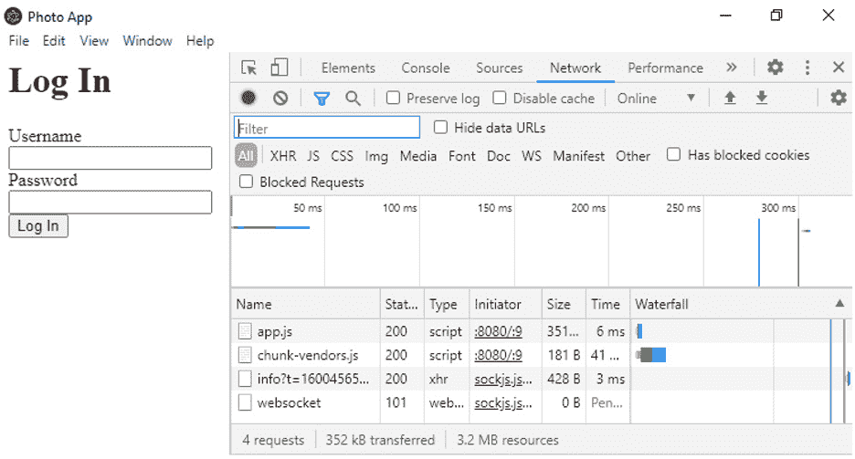
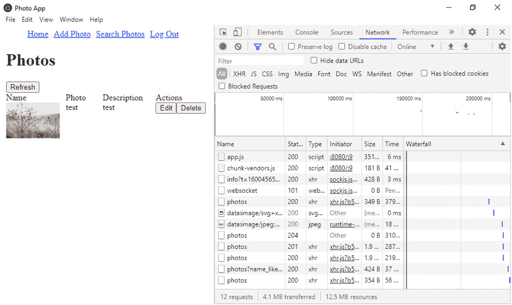
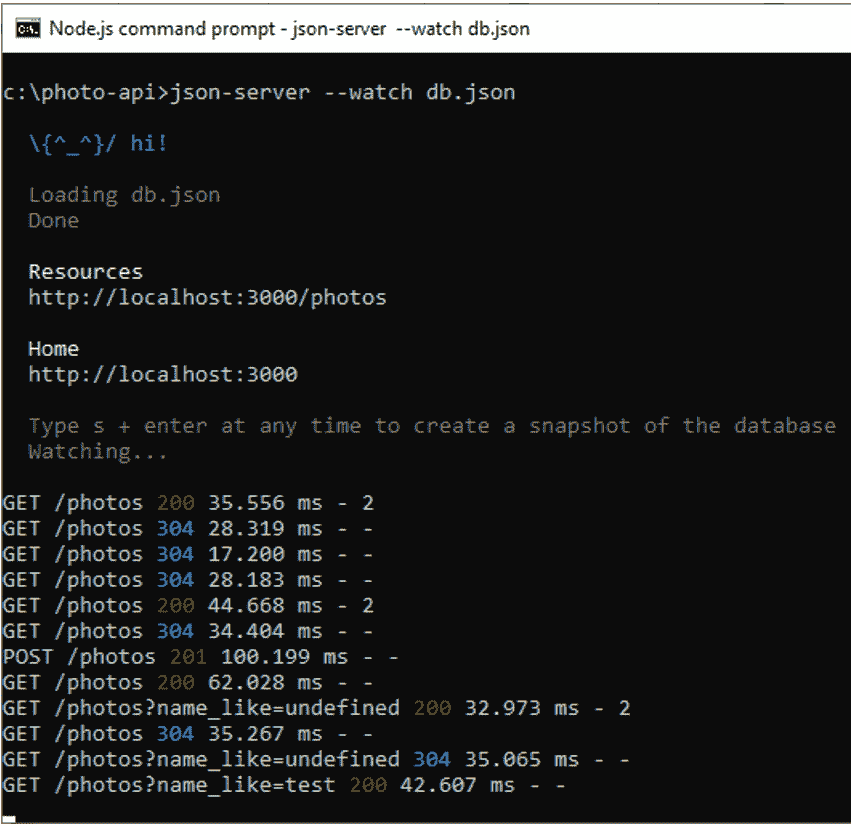
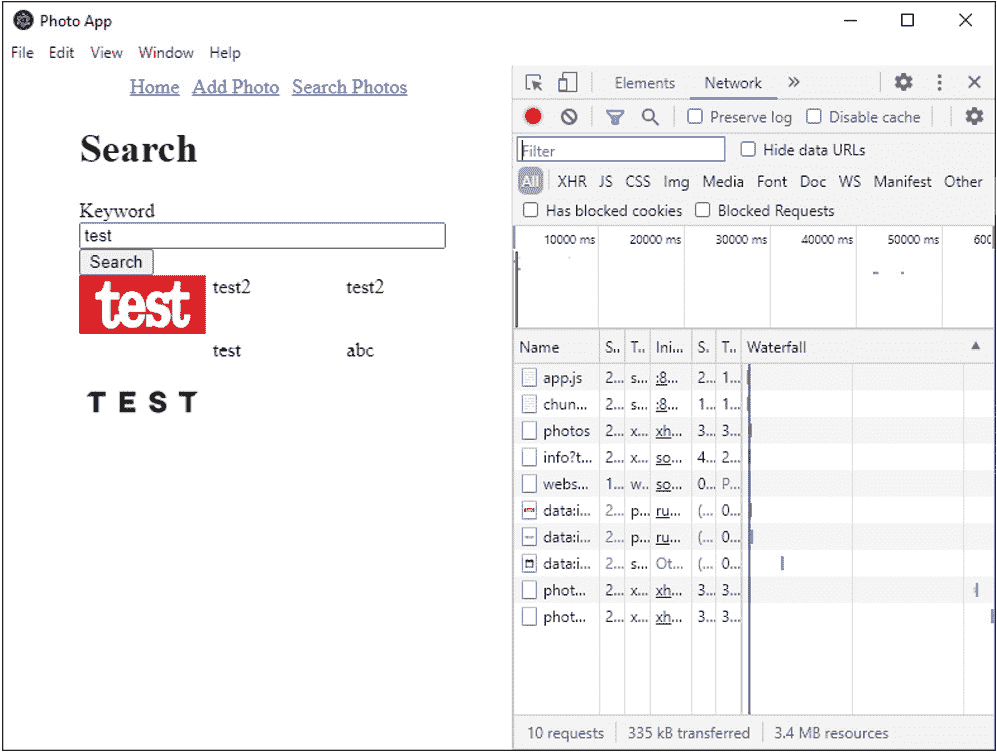

# 第四章：构建照片管理桌面应用程序

到目前为止，我们只构建了使用 Vue 3 的 Web 应用程序。在本章中，我们将使用 Vue Electron 插件构建照片管理桌面应用程序。我们将学习如何使用 Electron 和 Vue 轻松构建跨平台桌面应用程序。这很有用，因为我们可以在不费太多额外努力的情况下构建跨平台桌面应用程序。这将节省我们时间并获得良好的结果。

在本章中，我们将重点关注以下主题：

+   理解组件

+   使用 Vue CLI 插件 Electron Builder 创建项目

+   添加照片提交 UI

+   添加照片显示

+   为照片管理器应用程序添加路由

+   使用我们的应用程序与照片管理 API

# 技术要求

要理解本章，您应该已经知道如何做以下事情：

+   创建基本的 Vue 组件

+   使用 Vue CLI 创建项目

您可以在[`github.com/PacktPublishing/-Vue.js-3-By-Example/tree/master/Chapter04`](https://github.com/PacktPublishing/-Vue.js-3-By-Example/tree/master/Chapter04)找到本章的所有代码。

# 理解组件

**组件**内部只能有这么多东西。它们从父组件中获取 props，因此我们可以定制它们的行为。此外，它们可以具有计算属性和观察者来监视响应式属性并返回数据或执行我们希望它们执行的操作。它们还可以具有允许我们对其进行特定操作的方法。组件应该简单；也就是说，它们内部不应该有太多东西。模板中应该只有少量元素和组件，以保持其简单。组件还具有一些内置指令，供我们操纵**文档对象模型**（**DOM**）并进行数据绑定。

除此之外，组件无法做太多事情。如果我们只有几个组件而且没有 URL 导航的方式，那么构建任何非平凡复杂度的东西将是不可能的。

如果我们的应用程序只有组件，那么在它变得太复杂之前，我们只能嵌套其中的一些组件。此外，如果我们有大量嵌套的组件，那么导航将变得困难。大多数应用程序有不同的页面，如果没有某种路由机制，就无法进行导航。

使用 Vue Router，我们可以在转到特定 URL 时呈现我们想要的组件。我们还可以使用 Vue Router 提供的`router-link`组件导航到路由。Vue Router 具有许多功能。它可以将 URL 与路由匹配。URL 可以具有查询字符串和 URL 参数。此外，我们可以使用它添加嵌套路由，以便我们可以将路由嵌套在不同的组件内。映射到 URL 的组件显示在 Vue Router 的`router-view`组件中。如果我们有嵌套路由，那么我们需要在父路由中使用`router-view`组件。这样，子路由将被显示。

为了导航到不同的路由，Vue Router 提供了 JavaScript History API 的包装器，该 API 内置在几乎所有现代浏览器中。使用此 API，我们可以轻松返回到不同的页面，转到历史记录，或者转到我们想要的 URL。Vue Router 还支持 HTML5 模式，以便我们可以拥有不带井号的 URL，以将其与服务器端呈现的路由区分开来。

此外，支持过渡效果，当我们在不同路由之间导航时，我们可以看到这些效果。当链接是已导航到并且处于活动状态时，样式也可以应用于链接。

# 理解 Vue CLI 插件 Electron Builder

我们可以使用 Electron 将 JavaScript 客户端 Web 应用程序转换为桌面应用程序。Vue CLI 插件 Electron Builder 使我们能够在桌面应用程序中构建 Vue 3 应用程序的文件和设置，而无需进行太多手动更改。基本上，Electron 应用程序是在 Chromium 浏览器包装器内运行的 Web 应用程序，它显示我们的 Web 应用程序。因此，它可以做任何我们需要它做的事情，使用浏览器。这包括一些有限的硬件交互，例如使用麦克风和摄像头。此外，它提供一些本机功能，例如在流行操作系统的通知区域中显示项目和显示本机通知。它旨在成为从不需要低级硬件访问的 Web 应用程序构建桌面应用程序的简单方法。

Vue CLI 插件 Electron Builder 是从 Vue 应用程序创建 Electron 应用程序的最快方式，因为它支持一些本地代码。我们还可以在我们的代码中包含本地模块；我们只需包含我们想要包含的具有本地代码的 Node.js 模块的位置。此外，我们可以包含环境变量，以便根据不同的环境构建我们的代码。由于这是由 Chromium 支持的，因此还支持 Web workers。我们可以使用它来运行后台任务，这样当我们想要运行长时间运行或 CPU 密集型任务时，就不必阻塞主浏览器线程。所有这些都可以通过常规 Vue 应用程序代码或通过配置更改来完成。Electron 支持的其他功能也不受 Vue CLI 插件 Electron Builder 支持。这意味着它在功能上更有限。使用此插件时，诸如本地菜单之类的功能是不可用的。但是，我们可以在多个平台上构建桌面应用程序。

在本章中，我们将构建一个在 Windows 上运行的照片管理器桌面应用程序。该应用程序将包括一个页面，用于显示您添加的所有照片。此外，它将允许用户添加照片并存储它们；它将具有一个表单，使用户能够添加照片。我们将使用 Vue Router 让我们手动或自动地浏览页面。

## 使用 Vue CLI 插件 Electron Builder 创建项目

使用 Vue 3 和 Vue CLI 插件 Builder 创建项目是一项简单的任务。执行以下步骤：

1.  要创建项目，请创建一个名为`vue-example-ch4-photo-manager`的项目文件夹。然后，进入文件夹并使用`npm`运行以下命令：

```js
npm install -g @vue/cli@next
npm vue create
```

或者，您可以使用`yarn`运行以下命令：

```js
yarn global add @vue/cli@next
yarn create
```

运行完命令后，您应该会看到一个菜单，其中列出了您可以创建的项目类型。

1.  选择默认的 Vue 3 项目选项来创建一个 Vue 3 项目。然后，将 Vue CLI 插件 Electron Builder 添加到我们的 Vue 应用程序中。

1.  要添加 Vue CLI Electron Builder 插件，请在项目文件夹中运行`vue add electron-builder`。运行`cd <folder path>`以导航到文件夹。所有文件和设置都将被添加到项目中。

运行命令后，我们应该在项目中看到一些新的东西。现在我们有了 `background.js` 文件，其中包含显示 Electron 窗口的代码。我们还在 `package.json` 文件中添加了一些新的脚本命令。`electron:build` 脚本命令允许我们为生产环境构建应用程序。`electron:server` 命令允许我们使用开发服务器为 Electron 应用程序提供服务，以便我们可以使用它开发我们的应用程序。我们自动获得了热重载功能，以便我们可以在浏览器和 Electron 桌面应用程序窗口中实时看到所有更改。由于它只是浏览器的包装器，我们可以在应用程序的桌面窗口中看到最新的更改。

在桌面窗口中，我们还应该看到与浏览器中相同的 Chromium 开发控制台。为了使调试更容易，我们建议在浏览器窗口中进行调试，因为我们可以检查元素并在开发控制台中进行任何想要的操作。

`background.js` 文件的内容可以在 [`github.com/PacktPublishing/-Vue.js-3-By-Example/blob/master/Chapter04/src/background.js`](https://github.com/PacktPublishing/-Vue.js-3-By-Example/blob/master/Chapter04/src/background.js) 找到。

`BrowserWindow` 构造函数默认创建一个宽度为 800 像素，高度为 600 像素的浏览器窗口。我们可以通过拖动窗口来改变窗口大小，就像我们在其他桌面应用程序中所做的那样。`win.loadURL()` 方法加载我们应用的主页，也就是 `index.html` 文件。`index.html` 文件位于 `dist-electron` 文件夹中。否则，我们调用 `win.loadURL()` 方法来加载 `webpack-dev-server` 的 URL，以便在开发环境中在窗口中查看应用程序。这是因为 `webpack-dev-server` 只在开发环境中运行时才将应用程序加载到内存中。

`win.webContents.openDevTools()` 方法在开发环境中打开 Chromium 开发控制台。`app.quit()` 方法退出桌面应用程序。当程序在 Windows 下运行时，我们监听消息事件，如 `process.platform === 'win32'` 表达式所示。否则，Electron 监听 SIGTERM 事件，并在发出该事件时关闭窗口。当我们结束程序时，将发出 SIGTERM 事件。

要更改窗口的标题，我们只需更改 `public/index.html` 文件中的 `title` 标签。例如，我们可以写如下内容：

```js
<!DOCTYPE html>
<html lang="en">
  <head>
    <meta charset="utf-8">
    <meta http-equiv="X-UA-Compatible" content="IE=edge">
    <meta name="viewport" content="width=device-width,       initial-scale=1.0">
    <link rel="icon" href="<%= BASE_URL %>favicon.ico">
    <title>Photo App</title>
  </head>
  <body>
    <noscript>
      <strong>We're sorry but <%= htmlWebpackPlugin.options
        .title %> doesn't work properly without JavaScript 
          enabled. Please enable it to continue.</strong>
    </noscript>
    <div id="app"></div>
    <!-- built files will be auto injected -->
  </body>
</html>
```

我们只需将`title`标签的内容更改为我们想要的内容，文本就会显示为窗口的标题。

然后，一旦我们运行`vue add electron-builder`命令，我们就会添加文件和设置。要启动开发服务器并在屏幕上显示 Electron 应用程序，我们运行`yarn electron:serve`或`npm run electron:serve`命令，这些命令由 Vue CLI 插件 Electron Builder 提供。您应该在屏幕上看到一个窗口显示（请参阅*图 4.1*）。当我们对现有文件进行任何更改或添加或删除文件时，它将自动刷新。现在我们几乎准备好开始构建我们的应用程序了：



图 4.1 – Electron 应用程序窗口

我们将安装一些我们在 Vue 应用程序中需要使用的包，以及 Vue Router 库以向我们的应用程序添加路由。我们将用它来进行路由链接，也可以通过编程方式进行导航。我们还将使用 Axios HTTP 客户端轻松地向我们的 API 发送 HTTP 请求。要安装这些包，我们可以运行`npm install axios vue-router@4.0.0-beta.9`或`yarn add axios vue-router@4.0.0-beta.9`命令。

我们安装 Axios，这样我们就可以方便地进行 HTTP 请求。现在我们准备构建我们的应用程序。

# 添加照片提交界面

要构建应用程序，我们首先将添加我们的组件和文件以存储我们在整个应用程序中需要的常量。首先，我们删除`components/HelloWorld.vue`文件。然后，我们删除`App.vue`文件中对它的任何引用，包括`import`和`components`属性以注销该组件。现在我们将向我们的应用程序添加一些新组件。

首先，我们将`PhotoFormPage.vue`组件文件添加到`src/components`文件夹中。在文件中，我们添加以下模板：

```js
<template>
  <div class="form">
    <h1>{{ $route.params.id ? "Edit" : "Add" }} Photo</h1>
    <form @submit.prevent="submit">
      <div>
        <label for="name">Name</label>
        <br />
        <input
          type="text"
          v-model="form.name"
          name="name"
          id="name"
          class="form-field"
        />
...
        <label for="dateTaken">Date Taken</label>
        <br />
        <input
          type="datetime-local"
          name="dateTaken"
          id="dateTaken"
          v-model="form.dateTaken"
        />
      </div>
      ...
    </form>
  </div>
</template>
```

此模板具有用于添加和编辑照片的输入。`name`和`description`是文本输入。`Date Taken`字段是日期输入。

然后，我们将照片字段添加为文件输入：

```js
<template>
  <div class="form">
    <h1>{{ $route.params.id ? "Edit" : "Add" }} Photo</h1>
    <form @submit.prevent="submit">
      ...
      <div>
        <label for="photoFile">Photo</label>
        <br />
        <input type="file" name="photoFile" id="photoFile" 
          @change="onChange" />
        <br />
        
      </div>
    </form>
  </div>
</template>
```

我们将选定的文件读入 base64 字符串，以便我们可以使用 HTTP 请求轻松保存数据。我们还使用 base64 字符串在`img`元素中预览图像。

然后，我们将`script`标签添加到`PhotoFormPage.vue`中：

```js
<script>
import axios from "axios";
import { APIURL } from "../constant";
export default {
  name: "PhotoForm",
  data() {
    return {
      form: {
        name: "",
        description: "",
        dateTaken: "",
        photoFile: undefined,
      },
    };
  },
...
      reader.onload = () => {
        this.form.photoFile = reader.result;
      };
    },
  },
  async beforeMount() {
    const { id } = this.$route.params;
    if (id) {
      const { data } = await 
        axios.get(`${APIURL}/photos/${id}`);
      this.form = data;
    }
  },
};
</script>
```

通过检查`id`参数是否设置，确定我们是编辑现有照片还是创建新照片。如果设置了，那么我们正在编辑。否则，我们正在创建新照片。这个逻辑在`submit`方法和`beforeMount`钩子中使用。

`submit()`方法的`id`用于向 API 发出 HTTP 请求以保存条目。我们通过编写以下内容从路由中获取`id`参数：

```js
const { id } = this.$route.params;
```

然后，我们在下面立即添加一个`if`语句来检查它是否设置。如果设置了，我们将发出*PUT*请求来更新现有条目。否则，我们将发出*POST*请求来创建新条目。

在这个组件中，我们有一个表单，允许我们在应用程序中添加和编辑照片。根据`edit`属性的值，我们显示**添加**或**编辑**文本。然后，我们有一个包含许多字段的表单。`form`元素具有提交事件侦听器，当我们点击**提交**`input`按钮时运行`submit()`方法。`prevent`修饰符在`submit`处理程序内部自动运行`event.preventDefault()`方法，我们不需要自己添加。我们需要这样做，因为我们不希望浏览器执行默认的`submit`行为，这会直接将我们的表单数据提交到服务器。我们希望使用我们自己的客户端代码在客户端处理数据。

在这个项目中，我们不会创建自己的 API，也不会在服务器端进行任何数据验证。

此外，修饰符使我们不必自己输入它，也使我们的代码更短。指令语法足够常见，有一个符号代表它。`@`符号也可以替换为`v-on`指令，因为`@`是`v-on`指令的简写。

在`form`标签内部，我们有带有`v-model`指令的`input`元素，它绑定到`form`响应属性的各种属性。`label` HTML 元素是每个输入的标签。`label`具有`for`属性，允许它将标签映射到`input`元素的`id`参数。这对于辅助功能很有用，因为屏幕阅读器会捕捉并向用户朗读它。这对我们应用程序的视障用户非常有帮助。我们将在`textarea`标签中使用非常相似的代码。

日期和时间选择器是通过将`type`属性设置为`datetime-local`创建的本机日期和时间选择器。这使我们能够添加一个日期和时间选择器，该选择器设置为设备的时区。然后，我们将`v-model`指令设置为将日期和时间选择器的值绑定到用户在浏览器或桌面应用程序窗口中选择的值。大多数现代浏览器都支持这种类型的输入，因此我们可以使用它来使用户选择日期和时间。`type`属性也可以设置为`date`以添加仅日期选择器。此外，我们可以将类型设置为`datetime`以添加设置为 UTC 的日期和时间选择器。

`file`输入更复杂。输入的`type`属性设置为`file`，以便我们可以看到文件输入。此外，它具有一个 change 事件监听器，运行`onChange()`方法将二进制图像文件转换为 base64 字符串。这将图像保存到我们的 API 中作为文本字符串。对于像这样的小型应用程序，我们可以直接将图像保存为字符串。

然而，如果我们正在构建一个具有大量用户使用应用程序并进行大量文件上传的生产质量应用程序，那么将文件保存在第三方存储服务中，如 Dropbox 或 Amazon S3，将是一个好主意。然后，我们可以从 URL 中获取文件，而不是作为 base64 字符串。HTTP URL 和 base64 URL 是等效的。我们可以将两者都设置为`img`标签的`src`属性的值以显示图像。在这种情况下，我们将`src`属性设置为`img`标签中的 base64 URL。

在表单底部，我们有一个`type`属性设置为`submit`的输入。这允许我们通过在表单输入元素上按*Enter*或单击**提交输入**按钮来提交输入。

接下来，我们添加`data()`方法。这将返回`form`响应属性的初始值。`form`响应属性包括`name`、`description`、`dateTaken`和`photoFile`属性。`name`属性是我们照片的名称。`description`属性是我们照片的描述。`dateTaken`属性包含拍摄照片的日期和时间的字符串。`photoFile`属性是照片文件的 base64 字符串表示。

接下来，我们在这个组件中有一些方法。首先，我们有`submit()`方法，它可以进行*PUT*请求，更新现有的照片条目，或者进行*POST*请求，创建新的照片条目。在进行任何 HTTP 请求之前，我们检查`this.form`响应式属性的所有属性是否都填充了非假值。我们希望所有字段都填写完整。如果有任何属性的值被设置为假值，那么我们会显示一个警报，告诉用户填写所有字段。

为了使获取属性的过程更简短，我们解构了`this.form`响应式属性的属性，然后进行检查。之后，我们检查`edit`属性是否为`true`。如果是，则使用*PUT*请求来更新现有条目。`id`属性设置为`$route.params.id`的值，以便从 URL 中获取 ID URL 参数的值。

如果`edit`响应式属性为`true`，那么我们会向我们的 API 发出*PUT*请求，以更新现有的照片条目。为了进行*PUT*请求，我们调用`axios.put()`方法。这将 URL 作为第一个参数，并将请求体内容作为第二个参数的对象。否则，我们调用`axios.post()`，使用相同的参数进行*POST*请求，以创建新的照片条目。*PUT*请求的 URL 末尾附加了照片条目的 ID，以便 API 可以识别要更新的条目：

```js
{ 
  methods: {    
    async submit() {
      const { name, description, dateTaken, photoFile } = 
        this.form;
      if (!name || !description || !dateTaken || 
        !photoFile) {
        alert("All fields are required");
        return;
      }
      if (this.edit) {
        await axios.put(`${APIURL}/photos/${this.id}`, 
          this.form);
      } else {
        await axios.post(`${APIURL}/photos`, this.form);
      }
      this.$router.push("/");
    },
    onChange(ev) {
      const reader = new FileReader();
      reader.readAsDataURL(ev.target.files[0]);
      reader.onload = () => {
        this.form.photoFile = reader.result;
      };
    },
  }
}
```

我们还定义了`onChange()`方法，用作文件输入的更改事件监听器。当我们选择一个文件时，将运行此方法。在方法体中，我们创建一个新的`FileReader`实例，将所选的图像文件读入 base64 字符串。参数中有一个事件对象，其中包含我们选择的文件。`ev.target.files`属性是一个类似数组的对象，其中包含所选的文件。由于我们只允许用户选择一个文件，因此我们可以使用`0`属性来获取第一个文件。`0`是一个属性名，而不是索引，因为`files`属性是一个类似数组的对象；也就是说，它看起来像一个数组，但不像一个数组。但是，它是一个可迭代的对象，因此我们可以使用`for-of`循环或`spread`运算符来循环遍历项目或将它们转换为数组。

为了将所选文件读入 base64 字符串，我们使用文件对象调用`reader.readAsDataURL`方法来将文件读入 base64 字符串。然后，我们通过监听`reader`对象发出的 load 事件来获取结果。我们通过将事件处理程序设置为`onload`属性的值来实现这一点。读取的结果在`result`属性中。它设置为`this.form.photoFile`属性，以便我们可以在文件输入下面的`img`标签中显示图像，并在提交后将其存储在我们的数据库中。

然后，我们在`beforeMount`钩子中添加一些代码。我们检查`this.edit`属性的值，如果`this.edit`属性的值为`true`，则从我们的 API 中获取照片条目。我们只需要在挂载此组件时进行检查，因为我们在`route`组件中使用此组件。另外，当我们转到映射到该组件的 URL 时，`route`组件会被挂载。当我们转到另一个 URL 时，该组件将被卸载。因此，我们不需要监视器来监视`edit`或`id`属性的值。我们将检索到的数据设置为`form`响应属性，以便用户可以在表单字段中看到数据并根据需要进行编辑。

`axios.post()`，`axios.put()`和`axios.get()`方法都返回一个解析为响应数据的 promise。`data`属性具有响应数据。因此，我们可以使用`async`或`await`语法来使我们的 promise 代码更简洁，就像我们在整个组件中所做的那样。

在`style`标签中，我们有几种样式可以用来设置表单的样式。我们通过在`form`类中添加`margin`属性并将其设置为`0 auto`来将表单显示在屏幕中心附近。宽度设置为`70vw`，这样它只占视口宽度的 70％，而不是整个宽度。`form-field`类的`width`属性设置为 100％，以便表单字段填满整个表单的宽度。否则，它们将显示为默认宽度，非常短。`photo-preview` ID 分配给我们用于预览的`img`标签。我们将其`width`属性设置为`200px`，这样我们只显示图像的缩略图预览。

```js
<style scoped>
.form {
  margin: 0 auto;
  width: 70vw;
}
.form-field {
  width: 100%;
}
#photo-preview {
  width: 200px;
}
</style>
```

在这个文件中，我们发出请求，允许我们编辑或删除照片条目。

接下来，我们为我们的主页创建一个组件。我们将在`src/components`文件夹中创建一个`HomePage.vue`文件，并在其中编写以下代码：

```js
<template>
  <div>
    <h1>Photos</h1>
    <button @click="load">Refresh</button>
    <div class="row">
      <div>Name</div>
      <div>Photo</div>
      <div>Description</div>
      <div>Actions</div>
    </div>
...
<script>
import axios from "axios";
import { APIURL } from "../constant";
export default {
  data() {
    return {
      photos: [],
    };
  },
  methods: {
    ...
  }
</script>
<style scoped>
  ...
</style>
```

这个文件比我们之前创建的组件更复杂。在`component options`对象中，我们有一个`data()`方法，返回我们响应属性的初始值。在这个组件中，我们只有一个用于保存照片的响应属性。`photos`响应属性将具有文件。在`methods`属性中，我们有一些方法，用于填充响应属性。`load`方法使用`axios.get()`方法从`photos`端点获取数据。`APIURL`来自我们稍后将创建的`constants.js`文件。它只是一个包含端点基本 URL 的字符串，我们可以向其发出 HTTP 请求。

`axios.get()`方法返回一个解析为对象的 promise。该对象具有 HTTP 请求。`data`属性具有响应主体。我们将主体数据分配给`this.photos`响应属性，以在模板中显示照片条目。

以下代码用于检索照片：

```js
{  
  ...
  methods: {
    async load() {
      const { data } = await axios.get(`${APIURL}/photos`);
      this.photos = data;
    },
    ...
  },
  beforeMount() {
    this.load();
  },
};
```

`edit()`方法调用`this.$router.push()`方法，并带有我们要转到的 URL 路径的对象。此外，`path`属性具有我们要转到的路由的基本路径以及我们要添加到路径末尾的 URL 参数。`id`参数是我们附加到路径的 URL 参数。它具有照片条目的 ID：

```js
{  
  ...
  methods: {
    ...
    edit(id) {
      this.$router.push({ path: `/edit-photo-form/${id}` });
    },
    ...
  },
  ...
};
```

`deletePhoto()`方法也接受`id`参数。它与`edit()`方法的参数相同。在此方法中，我们调用`axios.delete()`方法，向`photos`端点发出*DELETE*请求，并使用`id`参数作为 URL 参数，以标识要删除的条目。一旦项目被删除，我们调用`this.load()`方法从 API 重新加载最新条目：

```js
{
  ...
  methods: {
    ...
    async deletePhoto(id) {
      await axios.delete(`${APIURL}/photos/${id}`);
      this.photos = [];
      this.load();
    },
  },
  ...
}
```

在`template`部分，我们使用`v-for`指令将`photos`响应属性数组的条目呈现为表格。`key`属性是必需的，用于识别具有唯一 ID 的唯一项目。`key`属性非常重要，因为当用户单击**删除**按钮时，我们将从列表中删除项目。这意味着每个条目必须具有唯一的 ID，以便 Vue 3 在我们正确删除一个项目后能够正确识别所有项目。这样最新的项目才能正确呈现。

我们使用`v-for`循环渲染照片：

```js
   ... 
   <div v-for="p of photos" class="row" :key="p.id">
      <div>
        
      </div>
      <div>{{p.name}}</div>
      <div>{{p.description}}</div>
      <div>
        <button @click="edit(p.id)">Edit</button>
        <button @click="deletePhoto(p.id)">Delete</button>
      </div>
    </div>
    ...
```

要渲染图像，我们使用具有`src`属性的`img`标签。`photoFile`属性是图像的文本形式的 base64 URL。其他属性是我们直接在表格中呈现的字符串。在最右侧的列中，我们有两个按钮 - **编辑**和**删除**。**编辑**按钮在点击时调用`edit()`，并传递照片条目的`id`属性。这将导航我们到稍后将创建的照片编辑表单。**删除**按钮将调用`deletePhoto()`方法，并传递照片条目的`id`属性以进行删除。项目将在删除项目后重新加载：



图 4.2 - 编辑和删除按钮

在`style`标签中，我们有一些 CSS 来将`div`标签显示为表格。`row`类具有`display`属性设置为`flex`，以便我们可以将其用作`flexbox`容器。`flex-wrap`属性设置为`wrap`，以便我们可以包裹任何溢出的内容。通常，在这个模板中我们不会有任何溢出的内容。`justify-content`设置为`space-between`，以便在`flexbox`容器中均匀分布子元素。

`row`类中的`div`标签具有`width`属性设置为`25%`，以便我们可以均匀分布行中的子元素。这允许我们将行内的四个`div`标签并排显示。`row`类中的`div`标签内的`img`元素具有`width`属性设置为`100px`，以便我们可以在照片列表中查看小缩略图预览。

`style`标签具有`scoped`属性，这意味着样式不会影响我们项目中的其他组件：

```js
<style scoped>
.row {
  display: flex;
  flex-wrap: wrap;
  justify-content: space-between;
}
.row div {
  width: 25%;
}
.row img {
  width: 100px;
}
</style>
```

接下来，在我们的应用程序中创建一个导航栏。为此，我们进入`src/components`文件夹，并添加`NavBar.vue`组件文件。创建文件后，我们可以添加以下代码：

```js
<template>
  <nav>
    <ul>
      <li>
        <router-link to="/">Home</router-link>
      </li>
      <li>
        <router-link to="/add-photo-form">Add Photo
          </router-link>
      </li>
      <li>
        <router-link to="/search">Search Photos
          </router-link>
      </li>
    </ul>
  </nav>
</template>
```

在这里，我们添加了一个`ul`元素来添加一个无序列表。这样，我们就不会在每个`li`元素的左边看到任何数字显示。在`li`元素内部，我们有来自 Vue Router 的`router-link`组件，用于显示允许我们导航应用程序的链接。我们使用`router-link`而不是常规的`a`标签。这是因为 Vue Router 将解析`router-link`组件的`to`属性，以正确的路径显示我们期望的组件，如果在 URL 模式中找到匹配的话。

由于我们尚未注册 Vue Router 插件或任何路由，也没有将`NavBar`添加到任何组件中，因此在导航栏中看不到任何内容。`style`标签具有一些样式，可以使链接水平显示而不是垂直显示。

此外，我们有一个**登出**链接，用于退出应用。`logout()`方法使用`localStorage.clear()`方法清除本地存储。然后，通过调用`this.$router.push()`方法并使用`/login`路径重定向回登录页面：

```js
<script>
export default {
  methods: {
    logOut() {
      localStorage.clear();
      this.$router.push("/login");
    },
  },
};
</script>
```

`ul` `li`选择器将`list-style`属性设置为`none`，这样我们就看不到`NavBar`项目左侧显示的项目符号。我们使用`display`属性将它们水平显示为`inline`。然后，我们添加`margin-right`属性并将其设置为`10px`，这样我们在链接之间有一些空间。

`ul`选择器将`margin`属性设置为`0 auto`，这样我们可以水平居中链接。`width`为`70vw`，这样它们就更靠近屏幕中心，而不是将项目放在左边。

```js
<nav>
    <ul>
      <li>
        <router-link to="/">Home</router-link>
      </li>
      <li>
        <router-link to="/add-photo-form">Add Photo
          </router-link>
      </li>
      <li>
        <router-link to="/search">Search Photos
          </router-link>
      </li>
    </ul>
  </nav>
<script>
export default {
  methods: {
    logOut() {
      localStorage.clear();
      this.$router.push("/login");
    },
  },
};
</script>
<style scoped>
ul li {
  list-style: none;
  display: inline;
  margin-right: 10px;
}
ul {
  margin: 0 auto;
  width: 70vw;
}
</style>...
```

现在我们已经完成了允许我们保存照片的表单，让我们看看如何在页面上显示添加的照片。

# 添加照片显示

在这里，我们添加了一个搜索页面，以便可以通过名称搜索照片条目。为此，我们将`SearchPage.vue`组件文件添加到项目的`src/components`文件夹中。

`SearchPage.vue`组件比`PhotoForm`组件简单。它有一个表单元素和一个表单字段。表单字段用于接受用户的关键字来搜索我们的照片集。输入的`type`属性设置为`text`，因此我们的代码中有一个常规文本输入。与其他输入一样，我们使用`v-model`指令将输入值绑定到一个响应式属性。设置`id`参数，以便我们可以在标签中使用`for`属性。表单还有一个**搜索**按钮，其`input`类型设置为`submit`：

```js
<template>
  <div>
    <h1>Search</h1>
    <form @submit.prevent="submit">
      <div>
        <label for="name">Keyword</label>
        <br />
        <input type="text" v-model="keyword" name="keyword"
          id="keyword" class="form-field" />
      </div>
      <div>
        <input type="submit" value="Search" />
      </div>
    </form>
    <div v-for="p of photos" class="row" :key="p.id">
      <div>
        
      </div>
      <div>{{p.name}}</div>
      <div>{{p.description}}</div>
    </div>
  </div>
</template>
```

然后，搜索结果以`row`类显示，使项目按行排列。这类似于我们在`HomePage`组件中显示照片的方式。`img`的 base64 URL 设置为`src`属性的值。此外，我们在其右侧有`name`和`description`属性。`v-for`指令循环遍历`photos`响应式属性数组，使我们能够显示数据。再次，我们将`key`属性设置为唯一 ID，以便按 ID 显示项目。

在`component options`对象中，我们使用`data()`方法来初始化我们的响应式属性。它们包括`keyword`和`photos`。`keyword`响应式属性用于搜索关键字。`photos`响应式属性用于存储照片集搜索结果：

```js
<script>
import axios from "axios";
import { APIURL } from "../constant";
export default {
  name: "SearchPage",
  data() {
    return {
      keyword: "",
      photos: [],
    };
  },
...
  watch: {
    $route: {
      immediate: true,
      handler() {
        this.keyword = this.$route.query.q;
        this.search();
      },
    },
  },
};
</script>
```

在`methods`属性中，我们有一些可以使用的方法。`search()`方法允许我们使用`axios.get()`方法获取数据。这个方法使用查询字符串发出*GET*请求，因此我们可以获取我们正在寻找的条目。`this.$route.query.q`属性用于从 URL 中获取`q`查询参数。这个属性是可用的，因为我们将注册 Vue Router 插件，以便我们可以从这个属性获取`query`参数。一旦我们获取了响应数据，我们就将其分配给`this.photos`响应式属性。

`submit()`方法在表单提交时运行，无论是点击**搜索**按钮还是按下*Enter*键。由于我们监听表单中的`submit`事件，这个方法将被运行。和其他表单一样，我们在`@submit`指令中添加了`prevent`修饰符。这样我们就可以调用`event.preventDefault()`方法来阻止数据被提交到服务器端。在这个方法中，我们调用`this.$router.push()`方法将页面重定向到带有查询字符串的`/search`路径。`/search`路径将映射到当前组件，因此我们只需使用 URL 中的新查询字符串重新挂载这个组件。这样，我们就可以设置`this.$router.query.q`属性来获取带有键的查询字符串参数，以获取查询字符串的值并使用它。

`name_like` URL 查询参数将被 API 捕获，这样我们就可以搜索我们在`name`字段中设置为值的文本。

最后，我们为`$route`响应式属性设置了一个监视器。我们需要将`immediate`属性设置为`true`，这样我们才能获取`query`参数的最新值，然后运行`search()`方法来从*GET*请求中获取数据，当这个组件挂载时。`handler()`方法有一个在`$route`对象改变时运行的方法。`query`属性的更改将被捕获。因此，在方法内部，我们将`keyword`响应式属性设置为`this.$route.query.q`的值，以显示输入框中`q`查询字符串的最新值。另外，我们调用`this.search()`方法，根据查询字符串获取最新的搜索结果。

`styles`标签中有一些样式，我们可以用它们来为我们的表单和行设置样式。它们与我们以前使用的样式类似。我们使表单字段变宽，并将表单显示在靠近中心的位置。行以 flexbox 容器显示，行内的所有单元格宽度均匀：

```js
<style scoped>
.form-field {
  width: 100%;
}
.row {
  display: flex;
  flex-wrap: wrap;
  justify-content: space-between;
}
.row div {
  width: 25%;
}
.row img {
  width: 100px;
}
</style>
```

最后，我们需要创建一个文件来导出一个`APIURL`变量，以便组件可以引用它们。到目前为止，我们在大多数已创建的组件中都使用了这些。在`src`文件夹中，我们创建`constants.js`文件，并编写以下代码来导出`APIURL`变量：

```js
export const APIURL = 'http://localhost:3000'
```

现在，我们可以正确地将`SearchPage.vue`导入到所有组件中，并添加一个搜索页面。

# 将路由添加到照片管理器应用程序

没有 Vue Router 插件，我们无法在应用程序内显示页面组件。链接将无法工作，我们也无法重定向到任何地方。要添加 Vue Router 插件，我们需要注册它，然后添加路由。我们在`src/main.js`文件中添加以下代码：

```js
import { createApp } from 'vue'
import App from './App.vue'
import { createRouter, createWebHistory } from 'vue-router'
import PhotoFormPage from './components/PhotoFormPage';
import SearchPage from './components/SearchPage';
import HomePage from './components/HomePage';
const routes = [
  { path: '/add-photo-form', component: PhotoFormPage },
  { path: '/edit-photo-form/:id', component: PhotoFormPage },
  { path: '/search', component: SearchPage },
  { path: '/', component: HomePage },
]
const router = createRouter({
  history: createWebHistory(),
  routes
})
const app = createApp(App)
app.use(router);
app.mount('#app') ...
```

在这个文件中，我们导入所有页面组件，然后将它们放入`routes`数组中。`routes`数组包含路由。数组中的每个对象都有`path`和`component`属性。路径具有我们想要与组件匹配的 URL 模式，`component`属性具有我们想要在 URL 模式与路径中的内容匹配时加载的`component`对象。路径是一个带有 URL 模式的字符串。我们的字符串中有一个 URL 参数占位符。`:id`字符串具有`id URL`参数的 URL 占位符。在我们的`EditPhotoFormPage`组件中，我们通过使用`this.$route.params.id`属性来检索`id URL`参数。它将作为字符串返回。

`createRouter()` 函数使我们能够创建一个路由器对象，我们可以使用 `app.use()` 方法在我们的应用程序中注册它。这是 Vue Router 4 的新功能，与 Vue Router 3 不同。我们注册 Vue Router 插件和路由的方式与 Vue Router 3 不同。因此，Vue Router 4 是唯一可以与 Vue 3 一起使用的版本。`createWebHistory()` 函数允许我们使用 HTML5 模式。使用这个，我们可以删除基本 URL 段和 URL 其余部分之间的井号。这样做使 URL 看起来更好，更符合用户的习惯。`routes` 属性具有我们之前创建的路由数组。然后，为了注册路由和 Vue Router 插件，我们调用 `app.use(router)` 来注册两者。现在 `router-link` 组件和重定向应该可以工作了。

`beforeEnter()` 方法是一个每个路由的导航守卫。我们需要这个方法，这样我们只能在登录后访问可用的页面。在这个方法中，我们检查具有键值为 `true` 的本地存储项。然后，如果是 `false`，我们通过调用 `next()` 函数并将 `path` 属性设置为 `login` 来重定向到登录页面。在调用 `next` 之前需要使用 `return` 关键字，因为我们不希望运行函数的其余代码。否则，我们只需调用 `next` 来继续导航到目标路由，即 `path` 属性的值。我们还将 `beforeEnter()` 方法添加到我们想要应用的路由对象中：

```js
const beforeEnter = (to, from, next) => {
  const loggedIn = localStorage.getItem('logged-in') ===     'true';
  if (!loggedIn) {
    return next({ path: 'login' });
  }
  next();
}
```

然后，在 `src/App.vue` 中，我们通过以下代码添加了 `router-view` 组件和 `NavBar` 组件：

```js
<template>
  <div id="app">
    <nav-bar v-if="!$route.fullPath.includes
      ('login')"></nav-bar>
    <router-view></router-view>
  </div>
</template>
<script>
import NavBar from "./components/NavBar.vue";
export default {
  name: "App",
  components: {
    NavBar,
  },
};
</script>
<style scoped>
#app {
  margin: 0 auto;
  width: 70vw;
}
</style>
```

我们导入 `NavBar.vue` 组件，然后通过将其放入 `components` 属性中注册它。然后，我们添加了 `nav-bar` 组件来显示带有路由链接组件的导航栏。`router-view` 组件通过将 URL 模式与 `routes` 数组中的模式进行比较，显示与 Vue Router 匹配的组件。

现在，当我们单击链接或成功提交表单时，我们将看到加载的路由。

当我们在登录页面时，我们不必显示 `nav-bar` 组件。因此，我们添加了一个检查 `$route.fullPath.includes()` 方法，以检查我们是否在登录页面上。`$route.fullPath` 属性具有当前页面的完整路径，不包括基本 URL。

# 使用我们的应用程序与照片管理 API

在之前的部分中，我们看了照片显示的客户端部分。要从 API 返回照片，我们必须添加一个后端 API，这将使我们能够存储和检索我们应用程序的数据。由于本书主要关注于使用 Vue 3 进行客户端应用程序开发，而不是服务器端应用程序开发，我们将使用一个简单的 API 解决方案来使用 JSON 存储我们的数据，这样我们就不必创建自己的 API。所有数据都存储在一个平面文件数据库中，完全是 JSON。为此，我们使用 JSON Server 包。这是一个不需要配置的包，我们可以在一分钟内让它运行起来。我们所有的字段都存储为 JSON 对象属性，因此它们需要是文本，包括图像。这个包是为需要快速原型化我们应用程序的前端开发人员而设计的后端。

首先，我们运行 `npm i –g json-server` 来安装 JSON Server 包。这样，我们可以从任何文件夹访问 JSON Server 包。一旦我们这样做了，我们创建一个 `photo-api` 文件夹来存储我们的照片数据库。然后，在文件夹内，我们添加 `db.json` 文件。接下来，我们创建 `photo-api` 文件夹，转到我们刚创建的文件夹，并运行 `json-server --watch db.json` 来运行服务器。在文件夹内，我们添加以下代码：

```js
{
  "photos": []
}
```

在 `db.json` 文件中，我们将拥有我们在 Vue 3 应用程序中指向的所有端点。服务器应该监听端口 `3000`，因此，API 的基本 URL 是 `localhost:3000`。现在，我们应该可以访问以下 API 端点：

+   `GET /photos`

+   `GET /photos/1`

+   `POST /photos`

+   `PUT /photos/1`

+   `PATCH /photos/1`

+   `DELETE /photos/1`

`GET /photos` 端点允许我们获取 `photos` JSON 数组中的所有项目。`GET /photos/1` 端点返回 ID 为 `1` 的单个照片条目。我们可以用任何 ID 替换它。`POST /photos` 端点使我们能够在 `photos` JSON 数组中添加新条目。`PUT /photos/1` 和 `PATCH /photos/1` 允许我们更新 ID 为 `1` 的照片条目。`DELETE /photos` 路由允许我们删除 ID 为 `1` 的照片。

*GET* 请求也可以带有查询字符串。为了搜索具有特定文本的字段，我们可以向 URL 发出 *GET* 请求，例如 `GET /photos?tname_like=foo`。这使我们能够搜索每个条目的 Name 字段，并找到包含文本的 Name 字段值的 `photos` 条目。

现在，我们应该能够发出客户端 API 中的请求，以获取我们想要的内容。整个 JSON 数组以 JSON 格式返回，以便我们可以轻松呈现这些项目。JSON 服务器包将监视 JSON 的任何更新，因此我们将始终获得最新数据。此外，我们可以使用`port`标志更改端口。因此，我们可以编写诸如`run json-server --watch db.json –port 3005`这样的内容来在端口`3005`上运行 JSON 服务器。`APIURL`变量也必须相应更改。

当服务器运行时，我们应该在命令提示符中看到类似以下内容：



图 4.3 - JSON 服务器输出

现在，我们的 Electron 桌面应用程序窗口显示了 Vue 3 照片管理应用程序，我们可以随心所欲地操作我们的照片收藏。我们现在应该能够查看我们的应用程序如下：


图 4.4 - 照片应用程序表单

我们可以在以下截图中查看搜索页面：



图 4.5 - 搜索页面

照片应用程序项目现在已经完成。我们添加了表单，以便用户添加照片条目。我们使用 Vue Router 允许我们添加具有多个页面的应用程序，并在它们之间轻松导航。我们还添加了 Vue CLI Electron 插件，以便我们可以轻松地使用 Vue 3 构建跨平台桌面应用程序。

# 总结

因此，我们可以使用 Vue Router 构建超出简单应用的应用程序，这允许我们将不同的 URL 映射到不同的组件。这样，我们可以转到不同的 URL 并呈现不同的组件。URL 可以在其中包含查询字符串、哈希和 URL 参数，并且 Vue Router 会自动解析它们。它们将与路由定义数组中列出的路由模式匹配。

路由可以嵌套，并且它们可以具有名称，以便我们可以根据它们的名称而不是它们的路由模式来识别它们。此外，我们可以有一个 catchall 或 404 路由，以便在我们的路由定义中列出的路由模式都不匹配时显示一些内容。

Vue Router 还具有用于编程导航的方法，这些方法的命名方式与浏览器历史 API 中的方法相同，并且可以使用相同的参数进行调用。

此外，我们学会了如何限制某些路由在满足特定条件之前不显示。为了限制用户何时可以看到路由组件，我们可以使用导航守卫在进入路由之前进行检查。导航守卫也可以添加以在路由加载后运行。它们也可以全局应用或应用于单个路由。如果我们单独应用导航守卫，那么对导航的检查可以针对每个路由进行定制。此外，我们可以对一个路由应用多个路由导航守卫。这使我们比使用全局导航守卫时拥有更多的灵活性。

然后，我们看了如何将我们的 Vue 3 web 应用程序转换为桌面应用程序。使用 Electron，我们可以从浏览器应用程序构建桌面应用程序。这非常方便，因为我们可以构建基于 Web 的业务应用程序，并轻松将它们转换为桌面应用程序。这些应用程序是跨平台的，我们可以像使用常规桌面应用程序一样轻松地完成许多工作。例如，我们可以像在浏览器应用程序中一样，对硬件进行有限访问，如摄像头和麦克风。此外，我们可以向用户显示原生通知，就像在桌面应用程序中一样，因为这受到 Chromium 浏览器引擎的支持。Electron 只是在 Chromium 浏览器中运行我们的应用程序。Vue CLI Electron Builder 插件让我们可以用一条命令将 Vue 应用程序转换为 Electron 应用程序。

在下一章中，我们将使用 Ionic 构建一个计算器移动应用程序。
