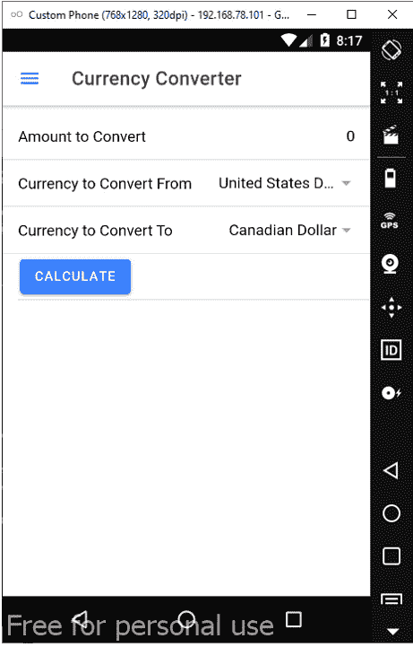
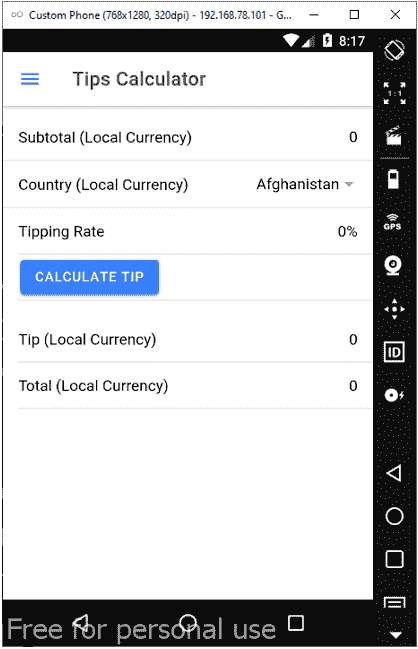
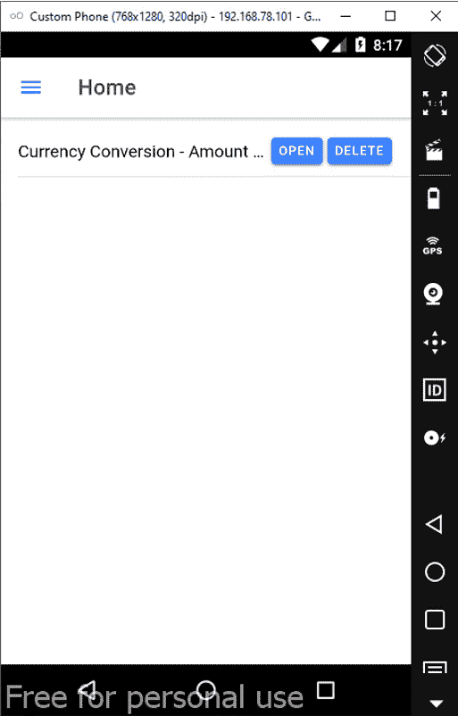

# 第五章：使用 Ionic 构建多功能计算器移动应用

在前四章中，我们使用 Vue 3 构建了各种类型的 Web 应用程序。我们也可以使用 Vue 3 创建移动应用程序，但不能仅使用 Vue 3 创建它们。我们可以使用将 Vue 3 作为基础框架的移动应用程序框架来创建移动应用程序。在第四章《构建照片管理桌面应用程序》中，我们使用 Vue Router 构建了一个 Web 应用程序，以便我们的应用程序可以拥有多个页面。Vue Router 让我们能够创建稍微复杂的应用程序。

在本章中，我们将进一步从构建 Web 应用程序的知识中迈出，以便开始构建移动应用程序。我们将构建一个计算器应用程序，让我们能够转换货币和计算小费。它还会记住我们所做的计算，因此我们可以轻松地返回重新进行。

此外，我们还将涵盖以下主题：

+   介绍 Ionic Vue

+   创建我们的 Ionic Vue 移动应用项目

+   安装项目的包

+   将计算器添加到我们的计算器应用程序中

# 技术要求

本章项目的源代码可以在[`github.com/PacktPublishing/-Vue.js-3-By-Example/tree/master/Chapter05`](https://github.com/PacktPublishing/-Vue.js-3-By-Example/tree/master/Chapter05)找到。

# 介绍 Ionic Vue

**Ionic Vue**是一个移动应用程序框架，让我们能够使用 TypeScript 和 Vue 构建应用程序。它还有基于 React 和 Angular 的版本。它配备了许多组件，我们可以像其他 UI 框架一样将其添加到我们的应用程序中。它们包括常见的输入、菜单、图标、列表等等。编译后的 Ionic 应用程序在 Web 视图中运行，因此我们可以在我们的应用程序中使用本地存储、地理位置和其他浏览器 API 等 Web 技术。

它还配备了内置工具，让我们能够自动构建移动应用程序，无需从头开始设置所有内容。Ionic Vue 默认创建使用组合 API 的组件，因此我们将使用它来构建更模块化并且与 TypeScript 更好地配合的 Vue 应用程序。

## 理解组合 API

Composition API 更适合与 TypeScript 一起使用，因为它不引用具有动态结构的`this`关键字。相反，Composition API 的所有部分，包括其库，都与具有清晰参数和返回类型的函数兼容。这使我们可以轻松为它们定义 TypeScript 类型定义。Vue Router 4 和 Vuex 4 与 Vue 3 的 Composition API 兼容，因此我们可以在 Ionic Vue 应用程序中一起使用它们。

使用 Composition API，我们仍然有组件对象，但其结构与选项 API 中的完全不同。选项和 Composition API 之间唯一相同的属性是`components`属性。它们都允许我们在两个 API 中注册组件。我们的组件逻辑主要在`setup()`方法中。这是我们定义响应式属性、计算属性、观察者和方法的地方。第三方库还可以为我们提供钩子，这些钩子是我们可以在 setup 函数中调用的函数，以便从库中获得我们想要的功能。例如，Vuex 4 为我们提供了`useStore`钩子，以便我们可以访问存储。Vue Router 4 带有`useRouter`钩子，让我们在应用程序中导航。

我们定义响应式和计算属性的方式与选项 API 不同。在选项 API 中，我们在`data()`方法中定义和初始化我们的响应式属性。在 Composition API 中，我们调用`ref`函数来定义持有原始值的响应式属性；然后我们调用`reactive`来定义具有对象值的响应式属性。要在 Composition API 中定义计算属性，我们调用带有回调的`computed`函数，该回调引用其他响应式属性以创建计算属性。

观察者是使用`watch`函数创建的。它接受一个回调来返回我们想要观察值的响应式属性。我们传递给`watch`函数的第二个参数是一个回调，让我们在观察的值发生变化时执行某些操作。我们可以使用回调的第一个参数获取被观察的响应式属性的最新值。第三个参数包含观察者的选项。我们可以在其中设置深度和立即属性，就像在选项 API 中观察者一样。

方法也被添加到`setup`函数中。我们可以使用箭头函数或常规函数来定义它们，因为 this 的值并不重要。响应式属性和方法必须在我们在`setup()`方法中返回的对象中返回，以便在模板中使用它们。这样，它们可以在我们的代码中使用。

## 理解 TypeScript

**TypeScript**是微软开发的一种语言，它是 JavaScript 的扩展。它为我们的代码提供了编译时的数据类型检查。然而，它并没有为我们提供额外的运行时数据类型检查，因为 TypeScript 在运行之前会编译成 JavaScript。在组合 API 中，我们的组件不引用`this`关键字，因此我们不必担心它具有错误的值。

使用 TypeScript 的好处是确保原始值、对象和变量的类型安全，这在 JavaScript 中是不存在的。在 JavaScript 中，我们可以将任何东西赋给任何变量。这当然会成为一个问题，因为我们可能会将东西赋给我们通常不会使用的数据类型。此外，函数可以接受任何参数，我们可以以任何顺序传递任何参数给函数，因此如果我们传递函数不期望的参数，可能会遇到问题。此外，任何地方都可能变成`null`或`undefined`，因此我们必须确保只有我们期望为 null 或 undefined 的地方才有这些值。JavaScript 函数也可以返回任何东西，因此 TypeScript 也可以限制这一点。

TypeScript 的另一个重要特性是我们可以创建接口来限制对象的结构。我们可以指定对象属性及其类型，以便限制对象具有给定的属性，并且属性具有我们指定的数据类型。这可以防止我们将对象分配给我们不期望的变量和参数，并且还为我们提供了在支持 TypeScript 的文本编辑器中无法获得的自动完成功能。这是因为对象的结构是固定的。接口可以具有可选和动态属性，以便让我们保持 JavaScript 对象的灵活性。

为了保持 JavaScript 的灵活性，TypeScript 带有联合和交集类型。**联合**类型是指我们使用逻辑 OR 运算符将多个类型组合在一起的情况。具有联合类型的变量意味着变量可以是联合类型列表中的一个类型。**交集**类型是使用逻辑 AND 运算符将多个类型组合在一起的情况。将类型设置为交集类型的变量必须具有交集中所有类型的成员。

为了保持类型规范的简洁，TypeScript 带有`type`关键字，它允许我们创建类型别名。类型别名可以像常规类型一样使用，因此我们可以将类型别名分配给变量、属性、参数、返回类型等等。

在我们的移动应用中，我们将为小费计算器、货币转换器和一个带有过去计算列表的主页添加页面。我们将我们所做的任何计算都保存在本地存储中，以便以后可以返回到它们。历史记录通过`vuex-persistedstate`插件保存到本地存储中。该插件与 Vuex 4 兼容，它允许我们直接将 Vuex 状态保存到本地存储中，而无需编写任何额外的代码来实现这一点。

现在我们已经了解了 Vue 的组合 API、TypeScript 和 Ionic 的基础知识，我们可以开始用它构建我们的应用程序。

# 创建我们的 Ionic Vue 移动应用项目

我们可以通过安装 Ionic CLI 来创建我们的 Ionic Vue 项目。首先，我们必须通过运行以下命令来安装 Ionic CLI：

```js
npm install -g @ionic/cli
```

然后，我们必须通过转到我们想要运行项目文件夹的文件夹来创建我们的 Ionic Vue 项目。我们可以使用以下命令来做到这一点：

```js
ionic start calculator-app sidemenu --type vue
```

`sidemenu`选项允许我们创建一个带有侧边菜单的 Ionic 项目。这将在创建菜单和页面时节省我们的时间。`--type vue`选项允许我们创建一个 Ionic Vue 项目。

我们可以使用以下命令获取所有选项的帮助，并查看每个选项的解释：

+   `ionic –help`

+   `ionic <command> --help`

+   `ionic <command><subcommand> --help`

我们应该在我们的项目目录中运行`ionic <command> --help`。

## 使用 Capacitor 和 Genymotion

Ionic Vue 项目使用 Capacitor 进行服务和构建。Capacitor 将在 Android Studio 中打开项目；然后，我们可以从那里启动并在模拟器或设备中预览我们的应用程序。对于这个项目，我们将使用 Genymotion 模拟器预览我们的应用程序。它速度快，并且有一个插件，让我们可以从 Android Studio 中启动。我们可以从 [`www.genymotion.com/download/`](https://www.genymotion.com/download/) 下载 Genymotion 模拟器，而 Android Studio 可以从 [`developer.android.com/studio`](https://developer.android.com/studio) 下载。

安装了 Genymotion 后，我们必须从 Genymotion UI 中创建一个虚拟机。为此，我们可以点击 *加号* 按钮，然后添加我们想要的设备。我们应该添加一个具有较新版本的 Android（如 Android 7 或更高版本）的设备。其他选项可以根据我们的喜好选择。要安装 Android Studio 的 Genymotion 插件，请按照 [`www.genymotion.com/plugins/`](https://www.genymotion.com/plugins/) 上的说明进行操作。这将让我们在 Genymotion 中运行我们的 Android Studio 项目。

接下来，在我们项目的 `package.json` 文件中，如果在脚本部分看不到 `ionic:serve` 和 `ionic:build` 脚本，我们可以通过在 `package.json` 文件的脚本部分中写入以下代码来添加它们：

```js
"ionic:serve": "vue-cli-service serve",
"ionic:build": "vue-cli-service build"
```

然后，我们可以运行 `ionic build` 来构建我们的代码，以便稍后使用 Capacitor 进行服务。

完成后，我们可以运行以下命令为 Android 项目添加依赖项：

```js
npx cap add android
npx cap sync
```

这也是必需的，这样我们才能将我们的项目作为 Android 应用程序运行。

完成这些命令后，我们可以运行以下命令，以便我们可以使用实时重新加载运行我们的应用程序，并从 Genymotion 中进行网络访问。

```js
ionic capacitor run android --livereload --external --address=0.0.0.0
```

这样，我们就可以像任何其他应用程序一样访问互联网。它还运行 `ionic:serve` 脚本，这样我们就可以在浏览器中预览我们的应用程序。在浏览器中预览我们的应用程序比在模拟器中更快，所以我们可能会想要这样做：


图 5.1 – Genymotion 模拟器

如果我们想在 Genymotion 中预览，我们可以转到 Android Studio，一旦我们运行 `ionic capacitor run` 命令，它应该会自动打开。然后，我们可以按 *Alt*+*Shift*+*F10* 打开运行应用程序对话框，然后选择要运行的应用程序。

现在我们已经设置好了 Vue Ionic 项目，我们必须安装一些额外的软件包，以便创建我们的移动应用程序。

# 为我们的项目安装包

我们必须安装一些项目中需要的依赖项，但它们尚未安装。我们可以使用 Axios 来进行 HTTP 请求以获取汇率。`uuid`模块让我们可以为我们的历史记录生成唯一的 ID。Vuex 不随 Ionic 项目一起提供，因此我们必须安装它。我们还必须安装`vuex-persistedstate`模块，以便我们可以将 Vuex 状态数据保存到本地存储中。

要安装这些包，请运行以下命令：

```js
npm install axios uuid vuex@next vuex-persistedstate
```

下一个版本的 Vuex 是 4.x 版本，与 Vue 3 兼容。

# 将计算器添加到我们的计算器应用程序中

现在我们的项目准备好了，我们可以开始在我们的应用程序上工作。我们首先添加路由定义，将 URL 路径映射到我们将创建的页面组件。然后我们将为每个功能添加组件。然后我们将添加 Vuex 存储，其中包含将存储数据持久化到本地存储的代码，这样我们可以随时使用数据。

## 添加路由

首先，我们将致力于为我们的计算器应用程序添加路由。在`src/router/index.ts`文件中，编写以下代码：

```js
import { createRouter, createWebHistory } from '@ionic/vue-
 router';
import { RouteRecordRaw } from 'vue-router';
const routes: Array<RouteRecordRaw> = [
  {
    path: '/',
    component: () => import('../views/Home.vue')
  },
  {
    path: '/currency-converter',
    component: () => 
      import('../views/CurrencyConverter.vue')
  },
  {
    path: '/tips-calculator',
    component: () => import('../views/TipsCalculator.vue')
  }
]
const router = createRouter({
  history: createWebHistory(process.env.BASE_URL),
  routes
})
export default router
```

在这个文件中，我们有`routes`数组，我们可以用它来添加我们将要添加到计算器应用程序中的页面的路由。`routes`数组的类型是`Array<RouteRecordRaw>`。这意味着`routes`数组中的对象必须具有路径和组件属性。`path`属性必须是一个字符串，而组件可以是一个组件或返回一个解析为组件的 promise 的函数。如果对象不符合`Array<RouteRecordRaw>`指定的结构，TypeScript 编译器在构建代码时会给我们一个错误。

每当我们更改任何代码文件时，代码都会被构建，因为我们设置了`livereload`选项，所以我们几乎立即会得到编译器错误。这可以防止大多数与数据类型相关的错误在运行时发生。类型定义内置在`vue-router`模块中，因此我们不必担心缺少数据类型。

## 添加货币转换器页面

接下来，我们将添加货币转换器页面。要添加它，首先创建`src/views/CurrencyConverter.vue`文件。然后，我们必须通过编写以下代码将标题添加到模板中：

```js
<template>
  <ion-page>
    <ion-header translucent>
      <ion-toolbar>
        <ion-buttons slot="start">
          <ion-menu-button></ion-menu-button>
        </ion-buttons>
        <ion-title>Currency Converter</ion-title>
      </ion-toolbar>
    </ion-header>
    ...
  </ion-page>
</template>
```

`ion-page`组件是页面容器，让我们可以在其中添加内容。`ion-toolbar`组件在页面顶部添加了一个工具栏。`ion-buttons`组件是按钮的容器，在其中，我们必须在开始插槽中添加`ion-menu-button`，这样我们就可以在屏幕左上角添加一个菜单按钮。当我们点击它时，`ion-menu-button`组件将打开左侧菜单。`ion-title`组件包含页面标题。它位于左上角。

接下来，我们必须添加`ion-content`组件，以在货币转换页面上添加内容。例如，我们可以编写以下代码：

```js
<template>
  <ion-page>
    ...
    <ion-content fullscreen>
      <div id="container">
        <ion-list>
          <ion-item>
            <ion-label :color="!amountValid ? 'danger' : 
              undefined">
              Amount to Convert
            </ion-label>
            <ion-input
              class="ion-text-right"
              type="number"
              v-model="amount"
              required
              placeholder="Amount"
            ></ion-input>
          </ion-item>
          ...
        </ion-list>
        ...
      </div>
    </ion-content>
  </ion-page>
</template>
```

在这里，我们添加了`ion-list`组件，以便在我们的页面上添加一个列表。它让我们可以向我们的应用程序添加一个项目列表。在`ion-list`中，我们添加`ion-item`以添加列表项组件。`ion-label`让我们将标签添加到列表项中。标签文本的`color`属性由`color`属性设置。`amountValid`属性是一个计算属性，用于检查`amount`响应式属性是否有效。`ion-input`组件将输入呈现到我们的应用程序中。我们将`type`设置为`number`，以使输入成为数字输入。

`placeholder`属性让我们可以向我们的应用程序添加占位符。`ion-text-right`类让我们把输入放在右侧。这是 Ionic 框架提供的一个类。`v-model`指令让我们将`amount`响应式属性绑定到输入值，这样我们就可以在组件代码中使用输入的值。

`ion-content`的`fullscreen`属性使页面全屏。

接下来，我们将向`ion-list`组件添加更多项目：

```js
<template>
  <ion-page>
...
    ...
    <ion-content fullscreen>
      <div id="container">
        <ion-list>
          ...
          <ion-item>
            <ion-label> Currency to Convert From
              </ion-label>
            <ion-select
              v-model="fromCurrency"
              ok-text="Okay"
              cancel-text="Dismiss"
            >
              <ion-select-option
                :value="c.abbreviation"
                v-for="c of fromCurrencies"
                :key="c.name"
              >
                {{ c.name }}
              </ion-select-option>
            </ion-select>
          </ion-item>
          ...
        </ion-list>
        ...
      </div>
    </ion-content>
  </ion-page>
</template>
```

在这里，我们向我们的`ion-list`添加了更多`ion-items`。`ion-select`组件让我们可以从下拉菜单中添加要转换的货币，这样我们就可以选择金额所在的货币。我们将`fromCurrency`绑定到我们在下拉菜单中选择的值，以在组件代码中获取所选项目。`ok-text`属性设置下拉菜单中的确定文本，而`cancel-text`属性包含取消按钮的文本。`ion-select`组件让我们显示一个带有单选按钮的对话框，让我们显示可供我们选择的项目。然后，当我们点击或轻触**确定**按钮时，我们可以选择该项目。

`ion-select-option`组件让我们向选择对话框框添加选项。我们使用`v-for`指令循环遍历`fromCurrencies`响应式属性，这是我们从**要转换的货币**对话框中筛选出的`selected`选项创建的计算属性，稍后我们将添加。这样，我们就不能在两个下拉菜单中选择相同的货币，因此货币转换是有意义的。

接下来，我们将添加另一个选择对话框，让我们选择要将金额转换为的货币。为此，我们可以编写以下代码：

```js
<template>
  <ion-page>
    ...
    <ion-content fullscreen>
      <div id="container">
        <ion-list>
          ...
...
                {{ c.name }}
              </ion-select-option>
            </ion-select>
          </ion-item>
          <ion-item>
            <ion-button size="default" 
              @click.stop="calculate">
              Calculate
            </ion-button>
          </ion-item>
        </ion-list>
        ...
      </div>
    </ion-content>
  </ion-page>
</template>
```

`toCurrencies`响应式属性是一个计算属性，其中包含一个条目，其值为从`fromCurrency`中筛选出的值。这意味着我们不能在两个下拉菜单中选择相同的货币。

我们还添加了**Calculate**按钮，这样我们就可以计算转换后的金额。我们将很快添加`calculate()`方法。

接下来，我们将添加另一个`ion-list`。这将添加一个列表，用于显示转换后的金额的标签。为此，我们可以编写以下代码：

```js
<template>
  <ion-page>
    <ion-header translucent>
      <ion-toolbar>
        <ion-buttons slot="start">
          <ion-menu-button></ion-menu-button>
        </ion-buttons>
        <ion-title>Currency Converter</ion-title>
      </ion-toolbar>
    </ion-header>
    <ion-content fullscreen>
      <div id="container">
        ...
        <ion-list v-if="result">
          <ion-item>
            <ion-label>Result</ion-label>
            <ion-label class="ion-text-right">
              {{ amount }} {{ fromCurrency }} is {{ 
                result.toFixed(2) }}
              {{ toCurrency }}
            </ion-label>
          </ion-item>
        </ion-list>
      </div>
    </ion-content>
  </ion-page>
</template>
```

在这里，我们显示了输入的金额和`fromCurrency`。我们还显示了结果和我们选择的`toCurrency`选项。我们调用了带有参数`2`的`toFixed`来将结果四舍五入到两位小数。

## 添加脚本标签

接下来，我们将添加一个带有`lang`属性设置为`ts`的`script`标签，以便我们可以添加 TypeScript 代码。首先，我们将添加`import`语句，以便添加我们在代码中将使用的组件和其他项目：

```js
<script lang="ts">
import {
  IonButtons,
  IonContent,
  IonHeader,
  ...
} from "@ionic/vue";
import { computed, reactive, ref, watch } from "vue";
import { currencies as currenciesArray } from "../constants";
import axios from "axios";
import { useStore } from "vuex";
import { CurrencyConversion } from "@/interfaces";
import { v4 as uuidv4 } from "uuid";
import { useRoute } from "vue-router";
...
</script>
```

请参阅本书的 GitHub 存储库，了解可以注册的完整组件列表。

`computed`函数让我们可以创建与 Composition API 一起使用的计算属性。`reactive`函数让我们可以创建具有对象值的响应式属性。`ref`属性让我们可以创建具有原始值的计算属性。`watch`函数让我们可以创建与 Composition API 一起使用的观察者。

`currenciesArray`变量是一个货币数组，我们将使用它来创建`fromCurrencies`和`toCurrencies`计算属性。`axios`对象让我们可以使用 Axios HTTP 客户端进行 HTTP 请求。`useStore`变量是一个函数，让我们可以访问我们的 Vuex 存储。`CurrencyConversion`接口提供了我们用来限制添加到历史记录列表的对象结构的接口。`uuidv4`变量是一个函数，让我们可以创建 UUID，这是我们分配给历史记录条目以标识它们的唯一 ID。`useRoute`函数让我们可以访问路由对象，以获取当前 URL 路径和 URL 的其他部分。

接下来，我们将通过将导入的组件添加到`components`属性中来注册组件。为此，我们可以编写以下代码：

```js
<script lang="ts">
...
export default {
  name: "CurrencyConverter",
  components: {
    IonButtons,
    ...
  },
  ...
};
</script>
```

请查看此书的 GitHub 存储库，以获取可以注册的所有组件的完整列表。我们只需将所有`import`组件放入`component`属性中进行注册。

## 在`setup`方法上工作

接下来，我们将开始在`setup()`方法上工作，并向其中添加响应式和计算属性。我们还将添加 watchers，它们让我们可以观察路由的变化。首先，我们将编写以下代码：

```js
<script lang="ts">
...
export default {
  ...
  setup() {
    const amount = ref(0);
    const fromCurrency = ref("USD");
    const toCurrency = ref("CAD");
    const result = ref(0);
    const currencies = reactive(currenciesArray);
    const store = useStore();
    const route = useRoute();
    ...
    return {
      amount,
      fromCurrency,
      toCurrency,
      currencies,
      fromCurrencies,
      toCurrencies,
      amountValid,
      calculate,
      result,
      addToHistory,
    };
  },
};
</script>
```

我们调用`useStore()`方法返回存储对象，其中包含 Vuex 存储。我们需要 Vuex 存储来提交 mutations，这让我们可以向历史记录中添加条目。因为我们将向 Vuex 存储添加`vuex-persistsedstate`插件，历史记录条目将自动添加到本地存储中。同样，我们调用`useRoute`函数返回路由对象，让我们可以访问路由对象。我们需要路由对象来让我们观察`id query`参数的查询字符串。如果我们通过 ID 找到项目，那么我们可以使用它们从本地存储中获取的值，从而设置`fromCurrency`、`toCurrency`和`amount`的值。

此外，我们调用`ref`函数来创建`amount`响应式属性，它们是数字值。`fromCurrency`和`toCurrency`响应式属性是字符串值，它们包含我们选择的货币的货币代码。`currencies`响应式属性是一个响应式数组，其初始值设置为`currenciesArray`。我们传递给`ref`和`reactive`的参数是每个响应式属性的初始值。

接下来，我们可以通过编写以下代码来添加计算属性：

```js
<script lang="ts">
...
export default {
  ...
  setup() {
    ...
    const fromCurrencies = computed(() => {
      return currencies.filter(
        ({ abbreviation }) => abbreviation !== 
          toCurrency.value
      );
    });
...
    return {
      amount,
      fromCurrency,
      toCurrency,
      currencies,
      fromCurrencies,
      toCurrencies,
      amountValid,
      calculate,
      result,
      addToHistory,
    };  },
};
</script>
```

我们调用`computed`函数并使用回调来创建计算属性。与选项 API 一样，我们返回我们想要的计算属性的值。唯一不同的是，我们使用`value`属性获取基本值响应式属性的值。`fromCurrencies`响应式属性是通过筛选具有与`toCurrency`相同值的缩写的货币条目创建的。`toCurrencies`是通过筛选具有与`fromCurrency`值相同的缩写值的货币条目创建的。

`amountValid`计算属性让我们确定在`ion-input`中输入的金额是否有效。我们希望它是至少为`0`的数字，因此我们返回该条件，以便我们可以检查这一点。

接下来，我们将通过向`setup()`方法添加更多项目来向`CurrencyConverter`组件添加这些方法：

```js
<script lang="ts">
...
export default {
  ...
  setup() {
    ...
    const addToHistory = (entry: CurrencyConversion) =>
      store.commit("addToHistory", entry);
    const calculate = async () => {
      result.value = 0;
      if (!amountValid.value) {
        return;
      ...
      });
      result.value = amount.value * 
        rates[toCurrency.value];
    };    
    ...
    return {
      amount,
      fromCurrency,
      toCurrency,
      currencies,
      fromCurrencies,
      toCurrencies,
      amountValid,
      calculate,
      result,
      addToHistory,
    };  },
};
</script>
```

`addToHistory()`方法让我们向 Vuex 存储和本地存储添加历史记录条目，以便我们可以在**主页**上显示活动。这样，我们以后可以选择它们并进行相同的计算。在签名中，我们使用`CurrencyConversion`接口注释条目参数的类型，以便我们知道我们向 Vuex 存储和本地存储添加了正确的内容。我们将`addToHistory`提交到存储，并将历史记录条目作为有效负载。

## 正在处理计算方法

在`calculate()`方法中，我们将结果的值重置为`0`。然后，我们调用`addToHistory`将条目添加到历史记录中。`id`属性是从`uuidv4`函数生成的，用于为条目生成唯一 ID。我们从响应式属性值设置其他属性。`value`属性是访问基本值响应式属性所必需的。

然后，我们使用 Axios 从免费使用的汇率 API 获取汇率。我们只需将基本查询参数设置为我们要转换的货币代码。最后，我们通过将从 API 检索到的汇率乘以金额来计算转换值的结果。

然后，为了完成`CurrencyConverter`组件，我们添加了查询字符串的监视器。我们监视`queryID`参数，如果我们从主页打开历史记录条目，它将发生变化。要添加监视器，我们可以编写以下代码：

```js
<script lang="ts">
...
export default {
  ...
  setup() {
    ...
    watch(
      () => route.query,
      (query) => {
        const { id: queryId } = query;
        const { history } = store.state;
        const entry = history.find(
          ({ id }: CurrencyConversion) => id === queryId
        );
        if (!entry) {
          return;
        }
      ...
      fromCurrency,
      toCurrency,
      currencies,
      fromCurrencies,
      toCurrencies,
      amountValid,
      calculate,
      result,
      addToHistory,
    };
  },
};
</script>
```

要创建观察者，我们传入一个返回`route.query`的函数来返回查询对象。`route`变量被分配给我们之前调用的`useRoute`函数的返回值。然后，我们从函数的第二个参数中获取查询对象的值。我们从查询对象中获取`id`属性。然后，我们从存储中获取历史状态，其中包含我们在本地存储中存储的所有条目。本地存储会自动由`vuex-persistedstate`同步到 Vuex 存储中。

我们调用`history.find()`方法来通过其`id`查找条目。然后，返回一个条目，并将`retrieved`属性值设置为响应式属性值。当我们从历史记录中选择条目时，它会自动填充它们。

在第三个参数中，我们有一个对象，其中的 immediate 属性设置为`true`，以便在组件挂载时立即运行观察者。

我们使用`return`语句返回要在模板中公开的所有内容。我们包括所有的响应式属性、计算属性和方法，以便它们可以在模板中使用。

项目完成后，货币转换器应如下所示：



图 5.2 - 货币转换器

## 添加小费计算器

接下来，我们将添加`TipsCalculator`页面组件。要添加它，我们必须添加`src/views/TipCalculator.vue`文件。在其中，我们将首先添加模板和标题：

```js
<template>
  <ion-page>
    <ion-header translucent>
      <ion-toolbar>
        <ion-buttons slot="start">
          <ion-menu-button></ion-menu-button>
        </ion-buttons>
        <ion-title>Tips Calculator</ion-title>
      </ion-toolbar>
    </ion-header>
    ...
  </ion-page>
</template>
```

`ion-header`与`CurrencyConverter`几乎相同，只是`ion-title`内容不同。

接下来，我们添加`ion-content`组件以添加页面内容。为此，我们可以编写以下代码：

```js
<template>
  <ion-page>
    ...
    <ion-content fullscreen>
      <div id="container">
        <form>
          <ion-list>
            <ion-item>
              <ion-label :color="!amountValid ? 'danger' : 
                undefined">
                  ...
                  {{ c.name }}
                </ion-select-option>
              </ion-select>
            </ion-item>
      ...            
          </ion-list>
          ...
        </form>
      </div>
    </ion-content>
  </ion-page>
</template>
```

在上述代码中，我们添加了`ion-list`和表单控件的 ion 项。我们可以在页面上输入小费前的金额。第二个`ion-item`组件让我们添加`country ion-select`控件。它让我们选择一个国家，以便我们可以获得该国家的小费率。小费率是从`tippingRate`计算属性计算出来的。`ion-select-option`是从`countries`响应式数组属性创建的，它提供了我们可以选择的国家列表，以获取它们的小费率。

接下来，我们将添加小费率的显示和**计算小费**按钮。为此，我们将编写以下代码：

```js
<template>
  <ion-page>
    ...
    <ion-content fullscreen>
      <div id="container">
        <form>
          <ion-list>
            ...
            <ion-item>
              <ion-label>Tipping Rate</ion-label>
              <ion-label class="ion-text-right">{{"> {{ 
                tippingRate }}% </ion-label>
            </ion-item>
            <ion-item>
              <ion-button size="default" 
                @click="calculateTip">
                Calculate Tip
              </ion-button>
            </ion-item>
          </ion-list>
...
          ...
        </form>
      </div>
    </ion-content>
  </ion-page>
</template>
```

我们只显示`tippingRate`计算属性的值和**计算小费**按钮。我们通过添加`@click`指令并将其设置为`calculateTip()`方法来添加点击处理程序。

模板的最后部分是计算结果。我们向组件添加`ion-list`来添加结果。我们显示小费和合计。要添加它，我们可以编写以下代码：

```js
<template>
  <ion-page>
    ...
    <ion-content fullscreen>
      <div id="container">
        <form>
          ...
          <ion-list>
            <ion-item>
              <ion-label>Tip (Local Currency)</ion-label>
              <ion-label class="ion-text-right">{{"> {{ 
                result.tip }} </ion-label>
            </ion-item>
            <ion-item>
              <ion-label>Total (Local Currency)</ion-label>
              <ion-label class="ion-text-right">{{"> {{ 
                result.total }} </ion-label>
            </ion-item>
          </ion-list>
        </form>
      </div>
    </ion-content>
  </ion-page>
</template>
```

接下来，我们将为`TipsCalculator`组件添加 TypeScript 代码。它的结构类似于`CurrencyConverter`组件。首先，我们通过编写以下代码添加导入：

```js
<script lang="ts">
import {
  IonButtons,
  IonContent,
  IonHeader,
  IonMenuButton,
  IonPage,
  IonTitle,
  IonToolbar,
  IonSelect,
  IonSelectOption,
  IonInput,
  IonLabel,
  IonButton,
  IonList,
  IonItem,
} from "@ionic/vue";
import { computed, reactive, ref, watch } from "vue";
import { countries as countriesArray } from "../constants";
import { useStore } from "vuex";
import { TipCalculation } from "@/interfaces";
import { v4 as uuidv4 } from "uuid";
import { useRoute } from "vue-router";
...
</script>
```

我们像在`CurrencyConverter.vue`中一样导入所有组件和库。

然后，我们像在`CurrencyConverter`中一样注册组件：

```js
<script lang="ts">
...
export default {
  name: "TipsCalculator",
  components: {
    IonButtons,
    IonContent,
    IonHeader,
    IonMenuButton,
    IonPage,
    IonTitle,
    IonToolbar,
    IonSelect,
    IonSelectOption,
    IonInput,
    IonLabel,
    IonButton,
    IonList,
    IonItem,
  },
  ...
};
</script>
```

然后，我们在`setup()`方法中定义响应式属性并获取存储和路由：

```js
<script lang="ts">
...
export default {
...
  ...
  setup() {
    const store = useStore();
    const route = useRoute();
    const subtotal = ref(0);
    const countries = reactive(countriesArray);
    const country = ref("Afghanistan");
    ...
    return {
      subtotal,
      country,
      countries,
      tippingRate,
      amountValid,
      result,
      calculateTip,
    };
  },
};
</script>
```

我们像在`CurrencyConverter`中一样调用`useStore`和`useRoute`。然后，我们使用`ref`函数创建`subtotal`响应式属性。由于它的值是一个数字，我们使用`ref`函数来创建它。`country`数组的响应式属性是用`reactive`函数创建的。

接下来，我们必须通过编写以下代码来添加一些计算属性：

```js
<script lang="ts">
...
export default {
  ...
  setup() {
    ...
    const tippingRate = computed(() => {
      if (["United States"].includes(country.value)) {
        return 20;
      } else if (
        ["Canada", "Jordan", "Morocco", "South 
          Africa"].includes(country.value)
      ) {
        return 15;
      } else if (["Germany", "Ireland", 
         "Portugal"].includes(country.value)) {
        return 5;
      }
      return 0;
    });
    const amountValid = computed(() => {
      return +subtotal.value >= 0;
    });
    ...
    return {
      subtotal,
      country,
      countries,
      tippingRate,
      amountValid,
      result,
      calculateTip,
    };
  },
};
</script>
```

在这里，我们根据所选的国家计算小费率。

`amountValid` 计算属性让我们检查`subtotal`值是否有效。我们希望它为`0`或更大。

接下来，我们将把其余的项目添加到组件中：

```js
<script lang="ts">
...
export default {
  ...
  setup() {
    ...
    const result = reactive({
      tip: 0,
      total: 0,
    });
    const addToHistory = (entry: TipCalculation) =>
      store.commit("addToHistory", entry);
      ...
      tippingRate,
      amountValid,
      result,
      calculateTip,
    };
  },
};
</script>
```

`result` 响应式属性包含小费计算的结果。`tip` 属性包含小费金额。最后，`total` 属性包含`subtotal`和`tip`的总和。

`calculateTip()` 方法让我们计算小费。`result` 属性的值首先被初始化为`0`。然后，我们检查`amountValid`是否为真。如果不是，我们停止运行该函数。否则，我们使用`addToHistory`函数将历史记录条目添加到存储和本地存储中。接下来，我们在`calculateTip()`方法的最后两行进行小费计算。

最后，我们通过编写以下代码将观察者添加到`setup()`方法中：

```js
<script lang="ts">
...
export default {
...
  setup() {
    ...
    watch(
      () => route.query,
      (query) => {
        const { id: queryId } = query;
        const { history } = store.state;
        const entry = history.find(({ id }: TipCalculation)
         => id === queryId);
        if (!entry) {
          return;
        }
        const {
          subtotal: querySubtotal,
          country: queryCountry,
        }: TipCalculation = entry;
        subtotal.value = querySubtotal;
        country.value = queryCountry;
      },
      { immediate: true }
    );
    return {
      subtotal,
      country,
      countries,
      tippingRate,
      amountValid,
      result,
      calculateTip,
    };
  },
};
</script>
```

就像在`CurrencyConverter.vue`中一样，我们监视解析的查询字符串对象，并在找到时从历史记录条目中填充值。

最后，我们使用`return`语句返回所有要暴露给模板的项目，包括任何响应式和计算属性以及方法。完成项目后，我们应该看到以下屏幕：



图 5.3 - 小费计算器

## 添加主页

接下来，我们将添加`Home.vue`页面组件，这将让我们查看到目前为止我们所做的计算。我们可以通过打开页面重新进行计算，使用历史记录中填充的数值。为了添加计算历史列表，我们将从其模板开始：

```js
<template>
  <ion-page>
    <ion-header translucent>
      <ion-toolbar>
        <ion-buttons slot="start">
          <ion-menu-button></ion-menu-button>
        </ion-buttons>
        <ion-title>Home</ion-title>
      </ion-toolbar>
    </ion-header>
    <ion-content fullscreen>
        ...
        </ion-list>
      </div>
    </ion-content>
  </ion-page>
</template>
```

我们使用了与其他页面相同的标题，但这个页面有不同的标题。

然后，我们渲染`historyWithTypes`计算属性来渲染历史记录中的项目。如果`type`属性设置为`tip`，我们渲染小费计算数据。否则，我们显示货币转换数据。在每一行中，我们有**打开**按钮，当我们点击它时调用`go()`方法。这将带我们到页面，该页面由`CurrencyCoverter`或`TipsCalculator`的`watchers`填充了历史记录中给定的数值。**删除**按钮调用`deleteEntry()`方法，通过其索引删除条目。我们必须记得为每个条目设置`key`属性为唯一 ID，以便 Vue 可以正确跟踪它们。

接下来，我们将通过编写以下代码来添加导入：

```js
<script lang="ts">
import {
  IonButtons,
  IonContent,
  IonHeader,
  IonMenuButton,
  IonPage,
  IonTitle,
  IonToolbar,
  IonLabel,
  IonButton,
  IonList,
  IonItem,
} from "@ionic/vue";
import { useStore } from "vuex";
import { computed } from "vue";
import { CurrencyConversion, TipCalculation } from 
 "@/interfaces";
import { useRouter } from "vue-router";
...
</script>
```

然后，我们将为我们的历史记录条目添加`type`别名，并通过编写以下代码注册组件代码：

```js
<script lang="ts">
...
type HistoryEntry = CurrencyConversion | TipCalculation;
export default {
  name: "Home",
  components: {
    IonButtons,
    IonContent,
    IonHeader,
    IonMenuButton,
    IonPage,
    IonTitle,
    IonToolbar,
    IonLabel,
    IonButton,
    IonList,
    IonItem,
  },
  ...
};
</script>
```

我们创建`HistoryEntry` TypeScript 类型别名，它是`CurrencyConversion`和`TipCalculation`接口的联合。`HistoryEntry`类型的对象必须具有`CurrencyConversion`或`TipCalculation`接口的结构。然后，我们像注册其他组件一样注册组件。

接下来，我们将添加`setup()`方法来添加组件的逻辑：

```js
<script lang="ts">
...
export default {
  ...
  setup() {
    const store = useStore();
    const router = useRouter();
    const history = computed(() => store.state.history);
    const historyWithTypes = computed(() => {
      return history.value.map((history: HistoryEntry): 
        HistoryEntry & {
        type: string;
      } => {
        if ("subtotal" in history) {
          return {
            ...history,
            type: "tip",
          };
        }
        return {
          ...history,
          type: "conversion",
        };
      });
    });
    const go = (history: HistoryEntry & { type: string }) 
     => {
      const { type, id } = history;
      if (type === "tip") {
        router.push({ path: "/tips-calculator", query: { id
         } });
      } else {
        router.push({ path: "/currency-converter", query: { 
         id } });
      }
    };
    const deleteEntry = (index: number) => {
      store.commit("removeHistoryEntry", index);
    };
    return {
      history,
      historyWithTypes,
      go,
      deleteEntry,
    };  
  },
};
</script>
```

我们像往常一样使用 `useStore` 和 `useRouter` 获取存储和路由。然后，我们使用 Vuex 存储中的 `history` 计算属性获取历史状态。然后，我们使用 `history` 计算属性创建 `historyWithTypes` 计算属性。这使我们可以向对象添加 `type` 属性，以便我们可以轻松地在模板中区分项目的类型。在 `map` 回调中，我们将返回类型设置为 `HistoryEntry & { type: string }`，以创建与 `HistoryEntry` 组成的接口和 `{ type: string }` 类型的交集类型。`HistoryEntry & { type: string` } 与 `CurrencyConversion & { type: string } | TipCalculation & { type: string }` 相同，因为 `&` 运算符在与联合 `(|)` 运算符一起使用时会分发。

`go()` 方法允许我们使用 `id` 属性作为 `id` 查询参数的值导航到正确的页面，当我们调用 `router.push` 时。`path` 属性包含了我们在路由定义中指定的 URL 路径，而 `query` 属性包含了用于在路径之后形成查询字符串的对象。

`deleteEntry()` 方法允许我们通过提交 `removeHistoryEntry` 突变来删除条目。

我们返回所有方法和计算属性，以便它们可以在模板中使用。**主页** 应该如下截图所示：



图 5.4 – 主屏幕

## 创建 Vuex 存储

现在，我们需要创建 Vuex 存储。为此，我们将创建 `src/vue/index.ts` 文件并编写以下代码：

```js
import { createStore } from 'vuex'
import createPersistedState from "vuex-persistedstate";
import {
  CurrencyConversion,
  TipCalculation
} from '../interfaces'
type HistoryEntry = CurrencyConversion | TipCalculation
const store = createStore({
  plugins: [createPersistedState()],
  state() {
    return {
      history: []
    }
  },
  mutations: {
    addToHistory(state: { history: HistoryEntry[] }, entry:
      HistoryEntry) {
      state.history.push(entry)
    },
    removeHistoryEntry(state: { history: HistoryEntry[] },
     index: number) {
      state.history.splice(index, 1)
    },
  }
})
export default store
```

在这里，我们有与 `Home.vue` 相同的接口和类型别名。我们使用 `createStore` 函数创建了 Vuex 存储。`plugins` 属性设置为 `createPersistedState` 函数返回的数组，以便我们将存储状态保存到本地存储中。我们在 `state()` 方法中有历史状态。`mutations()` 方法有 `addToHistory` 突变，它允许我们向历史数组状态添加条目。我们还有 `removeHistoryEntry`，它允许我们根据索引从历史状态中删除历史项目。我们必须记得在最后导出存储，以便我们以后可以导入它。

然后，我们需要添加国家和货币列表。为了添加它们，我们将创建 `src/constants.ts` 文件并添加以下代码：

```js
import { Choice } from "./interfaces";
export const countries: Choice [] = [
  {
    "name": "Afghanistan",
    "abbreviation": "AF"
  },
  {
    "name ": "Åland Islands",
    "abbreviation": "AX"
  },
  ...
]
export const currencies: Choice[] = [
  {
    "name": "United States Dollar",
    "abbreviation": "USD"
  },
  {
    "name": "Canadian Dollar",
    "abbreviation": "CAD"
  },
  {
    "name": "Euro",
    "abbreviation": "EUR"
  },
]
```

完整的文件内容可以在[`github.com/PacktPublishing/-Vue.js-3-By-Example/blob/master/Chapter05/src/constants.ts`](https://github.com/PacktPublishing/-Vue.js-3-By-Example/blob/master/Chapter05/src/constants.ts)找到。

现在，我们将通过添加`src/interfaces.ts`文件并添加以下代码来添加我们导入的接口：

```js
export interface Choice {
  name: string,
  abbreviation: string
}
export interface CurrencyConversion {
  id: string,
  amount: number,
  fromCurrency: string,
  toCurrency: string,
}
export interface TipCalculation {
  id: string,
  subtotal: number,
  country: string,
}
```

在`main.ts`中，我们必须通过编写以下代码向我们的应用程序添加存储：

```js
...
const app = createApp(App)
  .use(IonicVue)
  .use(router)
  .use(store);
...
```

我们添加了`.use(store)`，这样我们就可以在我们的应用程序中使用存储。

最后，在`App.vue`中，我们必须更新左侧菜单的项目。在模板中，我们必须编写以下内容：

```js
<template>
  <IonApp>
    <IonSplitPane content-id="main-content">
      <ion-menu content-id="main-content" type="overlay">
        <ion-content>
          <ion-list id="unit-list">
            <ion-list-header>Calculator</ion-list-header>
            <ion-menu-toggle
...
      <ion-router-outlet id="main-content"></ion-router-
        outlet>
    </IonSplitPane>
  </IonApp>
</template>
```

`ion-menu-toggle`组件包含我们可以点击或轻触以转到给定页面的菜单项，由`router-link`属性指定。`ion-router-outlet`组件是我们之前创建的页面所在的位置。`ion-icon`组件让我们显示每个条目的图标。

接下来，我们将通过编写以下代码为`App.vue`添加导入项：

```js
<script lang="ts">
import {
  IonApp,
  IonContent,
  IonIcon,
  IonItem,
  IonLabel,
  IonList,
  IonListHeader,
  IonMenu,
  IonMenuToggle,
  IonRouterOutlet,
  IonSplitPane,
} from "@ionic/vue";
import { computed, defineComponent, ref, watch } from 
 "vue";
import { RouterLink, useLink, useRoute } from "vue-router";
import { cashOutline, homeOutline } from "ionicons/icons";
...
</script>
```

现在，我们将通过编写以下代码添加组件逻辑：

```js
export default defineComponent({
  name: "App",
  components: {
    IonApp,
    IonContent,
    IonIcon,
    IonItem,
    IonLabel,
    IonList,
    IonListHeader,
    IonMenu,
    IonMenuToggle,
    IonRouterOutlet,
    IonSplitPane,
  },
  setup() {
    const selectedIndex = ref(0);
    const appPages = [
      ...
      {
        title: "Tips Calculator",
        url: "/tips-calculator",
        iosIcon: cashOutline,
        mdIcon: cashOutline,
      },
    ];
    const route = useRoute();
    return {
      selectedIndex,
      appPages,
      cashOutline,
      route,
    };
  },
});
```

在这里，我们注册了组件并添加了`appPages`属性来渲染项目。它不是一个响应式属性，因为我们没有使用 reactive 创建它，但是我们可以在模板中使用它，因为我们返回了它。现在，我们将通过编写以下代码添加一些样式：

```js
<style scoped>
...
.selected {
  font-weight: bold;
}
</style>
```

接下来，我们将通过编写以下代码添加一些全局样式：

```js
<style>
ion-menu-button {
  color: var(--ion-color-primary);
}
#container {
  text-align: center;
  position: absolute;
  left: 0;
  right: 0;
}
#container strong {
  font-size: 20px;
  line-height: 26px;
}
#container p {
  font-size: 16px;
  line-height: 22px;
  color: #8c8c8c;
  margin: 0;
}
#container a {
  text-decoration: none;
}
</style>
```

通过创建项目，我们学会了如何使用 Composition API，这是 Ionic 用来创建 Vue 项目的。我们还学会了如何在 JavaScript 代码中添加 TypeScript 类型注释，以防止代码中的数据类型错误。最后，我们学会了如何从 Web 应用程序创建移动应用程序。

# 总结

使用 Ionic Vue，我们可以轻松地使用 Vue 3 创建移动应用程序。它利用组合 API、TypeScript 和 Vue Router，以及 Ionic 提供的组件，创建出外观良好的应用程序，可以作为 Web 应用程序或移动应用程序运行。它还配备了所有必要的工具，可以在设备或模拟器中预览应用程序，并将其构建成应用程序包，我们可以部署到应用商店。

使用 Composition API，我们可以像使用 Vue Options API 一样添加逻辑，但我们可以使用函数而不是引用它们来添加所有逻辑。Ionic Vue 还将 TypeScript 作为组件的默认语言。这使我们能够在编译时防止类型错误，减少类型错误在运行时发生的几率。这是一个方便的功能，可以减少 JavaScript 开发中的挫败感。我们利用接口、联合和交集类型以及类型别名来定义对象的类型。

在下一章中，我们将看看如何使用 PrimeVue 和 Express 构建旅行预订应用程序。
