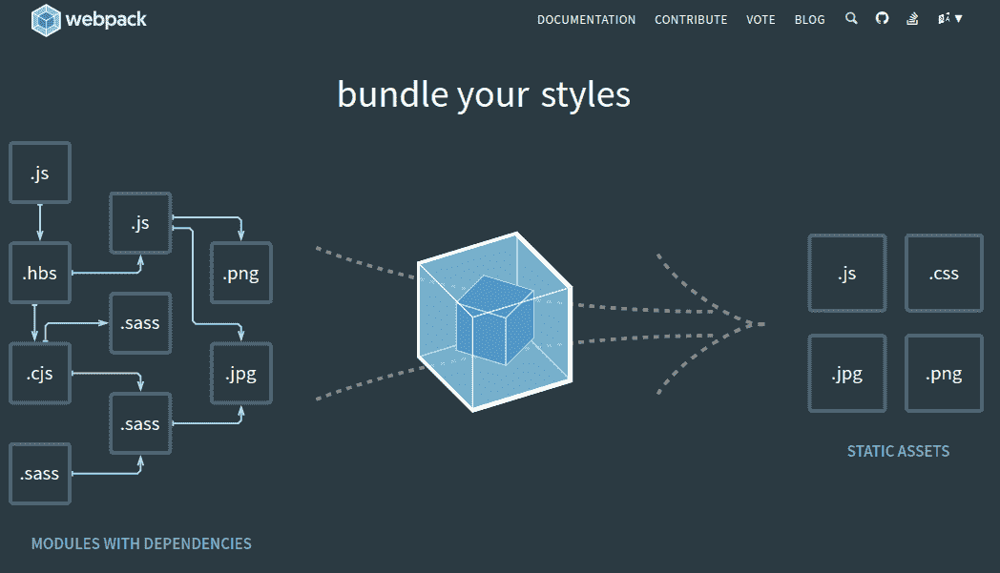
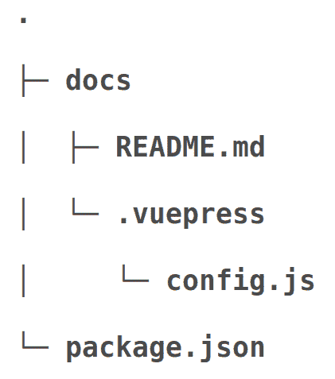

# 第二章：开始使用 VuePress

在[第一章]（4e1526aa-d994-42d8-9a18-12374ba932a0.xhtml）中，*介绍静态站点生成器和 VuePress*，我们了解了静态站点生成器是什么，以及它们可能的优势，以及为什么我们应该使用它们。此外，我们还介绍了一些主要的静态站点生成器，以及 Vue.js。

在这一章中，是时候把我们所有的注意力转向 Vue.js 和 VuePress 了。当然，如果您对 VuePress 的工作方式不熟悉，您可能目前感到有些畏惧。但不用担心，VuePress 的设置相当容易，甚至更容易掌握。很快您就会看到，VuePress 的设置绝对不是什么难事。

然而，为了正确设置和安装 VuePress 并确保满足所有依赖关系，我们首先需要花一些时间熟悉 Vue.js。这将帮助我们更好地理解为什么 VuePress 需要特定的系统设置才能工作，以及如何才能充分利用这个简单而迅速的站点生成器。

因此，是时候把我们的注意力转向 Vue.js 了。

在本章中，我们将讨论以下主题：

+   开始使用 VuePress

+   基本的 Vue.js 术语

+   将 Vue.js 与其他 JavaScript（JS）框架（如 React 或 Angular）进行比较

+   理解 VuePress 的方法论

+   VuePress 的安装和基本配置

# 开始使用 Vue.js 和 VuePress

在我们转向 VuePress 及其与 Vue.js 的关联之前，让我们看看 Vue.js 是什么，以及它对我们有什么用处。

# 什么是 Vue.js？

简而言之，Vue.js 是一个主要用于构建用户界面的开源 JS 框架。它使用 MIT 许可证，这意味着您可以扩展其源代码并使用它构建新项目。

Vue.js 最大最明显的目标是成为固有可采用的。因此，如果您的项目使用其他 JS 库或框架，您不必放弃它们来使用 Vue.js——相反，您可以选择将其与您可能已经在使用的其他 JS 库或框架一起使用。

Vue.js 可以轻松驱动单页面应用程序，也可以作为 Web 应用程序框架。

那么，Vue.js 背后的重要之处是什么，使它与其他框架不同？Vue.js 的主要动机或灵感是简化 Web 开发。此外，它大多是非主观的，因此为开发提供了统一的一套方案。

因此，Vue.js 更多地面向用户界面（UI）开发。你可以将其核心组件嵌入到任何现有项目中，甚至可以利用构建工具和支持库来设置单页面应用程序。

所有 Vue 模板都是有效的 HTML，可以被任何现代 Web 浏览器读取和解析。这意味着你使用 Vue 构建的任何内容都可以轻松地在所有设备和浏览器上呈现。随着 VuePress 的进展，你会注意到 Vue 的这一特性是一个巨大的优势，可以帮助你避免许多兼容性问题。

现在，Vue 是如何工作的？实际上很简单。每当你更新 JS 对象时，Vue 都会更新视图。这种*反应性*的特性意味着输出会在进行更改时被渲染或重新渲染，而不是强制进行完全刷新。

# 一些基本的 Vue.js 术语

我们将在这里跳过有关 Vue.js 功能的详细学习，因为这超出了我们书籍的范围。要更好地了解 Vue.js 本身（而不是 VuePress），你可以查看有关该主题的任何出色的 Packt 图书。现在，我们只需要熟悉一些定义，这样当我们在 VuePress 中使用它们时，就会更容易记住。

我们已经了解到 Vue 模板遵循基于 HTML 的语法。现在，每个模板都可以附带*组件*。简单来说，组件是可重用代码块，用于扩展现有 HTML 元素的功能。

同样，Vue.js 有自己的应用过渡效果的方法。这可以以 CSS 过渡或 JS 挂钩的形式进行。在高级的 VuePress 项目中，你可能会发现自己集成自定义 JS 动画库以实现过渡效果。当然，这取决于你的项目性质，并不总是需要单页面应用程序或博客。

# 为什么不选择其他 JS 框架呢？

这一部分主要适用于那些已经具有 JS 背景并可能熟悉一两个 JS 框架的人。如果你是一个 JS 框架的初学者，而 Vue.js 是你第一个熟悉的框架，你可以跳过这部分。

然而，如果你已经了解了其他框架，你可能会想知道 Vue.js 能够提供什么其他框架不能提供的东西？

一些最流行的 JS 框架是 Angular 和 React，将在下一节中讨论。

# Angular/AngularJS

与 Angular 相比，Vue 似乎并不那么受欢迎。在实际应用中，Angular 是这两者中更大的名字——它得到了 Google 的支持，非常容易上手，并且非常受欢迎，这意味着与之相关的文献丰富。

然而，Vue 也有自己的一些好处。首先，Angular 对应用程序结构有很强的看法——这对于初学者和希望遵循特定应用程序开发模式的开发人员来说是理想的。然而，Vue 提供了更大的灵活性和对项目的完全控制。这意味着您有更多的实验空间，因为 Vue 非常适用于各种用例。

Angular 使用双向数据绑定，而 Vue 依赖其组件之间的单向数据流。在实际应用中，AngularJS（不是 Angular）在应用程序规模和重要性增长时往往变得较慢。这是因为事务之间存在多个观察者。但是 Vue 和 Angular 都没有这个缺点。

有趣的是，在 Vue 中，没有一种正确的应用程序结构方式。这意味着您有更大的灵活性和控制。但是，作为缺点，这也意味着从 Vue 到其他框架（或反之）的移植有时可能会受到严重阻碍。另一方面，Angular 具有一套良好的结构规则，可以强制执行标准，但对于一些用户来说也可能显得非常限制。

这就是为什么 AngularJS 的学习曲线非常陡峭。开发人员必须牢记各种 API 标准。对于 Vue 编码者来说，这些要求数量较少。

# React

React 和 Vue 有很多共同之处。很容易就可以为这些框架中的任何一个进行辩论——虽然 React 旨在扩展，并且从各个标准来看都是一个很好的框架，但对于许多用户来说，Vue 的学习曲线较为平缓。

话虽如此，Vue 目前在某些方面落后于 React。React 允许您为 iOS 和 Android 编写本机渲染的应用程序。这意味着您的应用程序可以在多个平台上无缝运行。Vue 目前正试图通过 Weex 来实现相同的功能，Weex 是 Apache 基金会目前正在孵化的项目。在[`weex.apache.org/`](https://weex.apache.org/)了解更多信息。

Weex 仍处于测试阶段，并没有像 React 那样被广泛采用。这使得 React 在 Vue 方面具有明显优势。

# 其他方面

Ember，另一个声誉良好的 JS 框架，与 Vue 的不同之处在于在 Ember 中，您需要为所有内容手动声明依赖项，并将其全部包装在对象中。在 Vue 中，您也可以利用普通的 JS 对象。与 Ember 相比，Vue 在性能方面显著更快更好，简单地因为 Vue 可以自动运行批量更新。

由 Google 支持的另一个 JS 框架 Polymer 与 Vue 的不同之处在于前者需要基本的 polyfills 才能工作，而 Vue 不需要任何依赖项或 polyfills（除非您的目标是较旧的 Web 浏览器）。

因此，我们可以看到与其他 JS 框架相比，Vue 有自己的几个优势和好处。如果您是 React 或 Angular 用户，您可能已经评估了 Vue 与其他框架的不同之处。它简单，允许组件的重复使用，并且消耗更少的资源。

# Vue.js 与 VuePress 有什么关系？

VuePress 自称为“Vue 动力”，这正是两者之间的关系。Vue.js 驱动 VuePress，换句话说，VuePress 基于 Vue.js。

这意味着您所读到的关于 Vue.js 的所有上述功能都可以被 VuePress 用户使用。因此，VuePress 可以用来快速生成单页面应用程序，这些应用程序在 Web 浏览器中渲染非常快，并且不会对服务器资源造成压力。Vue.js 是 VuePress 的支柱意味着以下几点：

+   VuePress 操作起来快速而敏捷。

+   它可以快速加载页面和单页面应用程序（SPA）。

+   它不需要大量的内存来运行。

# 了解 VuePress 的特殊之处

VuePress 在运行后会生成静态形式的预渲染 HTML，之后它可以作为 SPA 运行，因此对于每个简单的查询都不需要重复调用服务器。

这就是 VuePress 的特殊之处。与其他网站创建工具和平台不同，VuePress 不会占用大量资源。它是一个简单的站点生成器，设置最少。正如我们将在本章后面看到的那样，设置 VuePress 不需要复杂的火箭科学或服务器管理知识。您可以在几分钟内完成设置，即使是 JS 的基本学习者也可以开始使用。

此外，如果你是 Markdown 用户，VuePress 对你来说可能会有特殊用途，因为它的整个项目结构都是基于 Markdown 的。事实上，我们将在本书的后面章节中介绍 VuePress 中的 Markdown 扩展，以帮助你更好地了解它。

总的来说，如果你希望利用 Vue 所提供的优势，VuePress 就是你应该使用的。通过合理使用 Vue 组件，以及与 Markdown 扩展和自定义模板的结合，VuePress 可以作为完美的、高度可定制的、多功能的静态站点生成器，适用于各种用户。

# VuePress 是如何工作的？

在最基本的层面上，每个 VuePress 网站都有两个主要部分：

+   一个具有基于 Vue 的主题系统的静态站点生成器

+   一个默认的 VuePress 主题，理想情况下适用于文档站点，但也可以轻松定制为其他用途

现在，VuePress 生成的每个页面都是静态 HTML，并且完全优化了搜索引擎。然而，在页面加载时，静态内容会被转换成 SPA，以实现更快的性能。

现在，正如我们所看到的，每个 SPA 都由 Vue 驱动。Vue 使用 Vue 路由器，它与 Vue.js 核心无缝集成，有助于使 HTML5 友好的 SPA 成为一项简单的任务。有关 vue-router 的更多信息，请访问[`github.com/vuejs/vue-router`](https://github.com/vuejs/vue-router)。

最终，为了打包脚本并组合代码结构，VuePress 依赖于 webpack。这是一个流行的工具，可以用来将脚本、代码、图像和其他媒体捆绑成一个统一的单元，以在现代 Web 浏览器中显示，如下所示：



你可以在[`webpack.js.org`](https://webpack.js.org)了解更多关于 webpack 的信息。

由于 VuePress 使用 Markdown，它依赖于 Markdown——也就是说，它将 Markdown 文件编译成 HTML。你也可以在你的内容中嵌入动态内容，并使用 Markdown 作为代码——它可以处理两者。有关更多信息，请访问[`markdown-it.github.io`](https://markdown-it.github.io)。

因此，我们可以看到 VuePress 使用了所有免费可用的标准工具和服务。换句话说，你不必依赖复杂的专有软件来学习 VuePress 并使用它构建你的项目。

# VuePress 能做什么？

然而，一个重要的问题是，VuePress 能实现什么？

VuePress 带有内置的 Markdown 扩展和在 Markdown 中利用 Vue 的能力。这意味着它非常适合想要快速生成网站并将内容上线的人。此外，由于其主题系统是基于 Vue 的，它对于想要使用 Vue.js 开发网站的人来说是一个很好的起点。

VuePress 提供多种语言支持，并且还具有 Google Analytics 集成。默认的 VuePress 主题非常适合文档网站和项目。它完全响应式和移动友好，具有原生的基于标题的搜索，甚至还有导航菜单和侧边栏。这意味着 VuePress 非常适合基本的网站开发、Web 应用程序和文档项目。

然而，不足之处在于，VuePress 仍然没有完美的博客支持。您可以用它来写博客，但它没有开箱即用的博客功能。同样，虽然您可以调用和使用任何您喜欢的 Vue.js 扩展，但 VuePress 本身没有任何插件。

这意味着 VuePress 是一个轻量级的站点生成器，适用于普通的网页开发项目，而不一定适用于更庞大和高度专业的项目。

# 那么其他选择呢？

你可能会想：为什么我们要使用 VuePress，而不是其他东西呢？

首先，VuePress 是一个基于 Vue 的令人兴奋的新项目，可以提供很好的学习和开发体验。

与许多其他类似工具不同，VuePress 完全专注于静态网站和单页应用程序。例如，虽然 Nuxt 与 VuePress 非常相似，但前者完全专注于构建应用程序。另一方面，VuePress 具有使其成为在线文档项目和其他静态站点的完美工具的功能。

说到文档，像 Docsify 和 Docute 这样的解决方案也是不错的选择，因为它们都基于 Vue，并且具有帮助您轻松编写技术文档的功能。然而，Docsify 和 Docute 都是运行时驱动的。现在已经普遍知道，运行时驱动的应用在搜索引擎优化方面往往表现不佳。而 VuePress 在 SEO 方面也做得很好。

同样，VuePress 也比 Hexo 更具优势。许多人使用 Hexo（甚至许多 Vue.js 用户倾向于依赖 Hexo）。但是 Hexo 对 Markdown 的渲染不如 VuePress 灵活多变，这是 VuePress 胜过 Hexo 的明显优势。

正如我们所看到的，尽管 VuePress 相对较新且相对不太为人所知，但它具有一套很好的功能，可以成为许多用户的不错选择。

现在我们已经阅读并了解了 VuePress 的工作原理以及它所提供的功能，我们可以将注意力转向实际使用 VuePress 进行设置。

# 开始使用 VuePress

现在是时候开始了。我们现在已经了解了 Vue.js 是什么以及它所提供的主要功能。此外，我们还了解了 VuePress 的作用，它与 Vue.js 的关系以及它的主要用途和功能。在这一点上，我们已经准备好开始使用 VuePress，并朝着使用它创建令人惊叹的网络项目的方向前进。

自然而然的，第一步将是安装和设置 VuePress，使其可以运行，并准备好供使用。

# 安装

必须注意的是，VuePress 需要 Node.js 版本 8（或更高版本）才能运行，因此您必须在服务器上安装 Node.js 才能运行 VuePress。

VuePress 在服务器端需要 Node.js 8 或更高版本。

有两种流行的安装 VuePress 的方式。如果 VuePress 是您唯一或主要使用的工具，您可以选择全局安装它。或者，如果您在更大的工作流中使用 VuePress，您可以选择将其作为现有项目的依赖项进行安装。

考虑到这是一个快速入门指南，旨在帮助您快速了解 VuePress，将 VuePress 用于更大更复杂的现有项目技术上超出了本书的范围。尽管如此，我们将介绍两种安装类型的命令，以帮助您了解两者之间的主要区别。

# 全局安装 VuePress

有两种方式可以安装 VuePress：

+   使用 npm

+   使用 Yarn

npm 是 Node.js 默认的工具，大多数 Node.js 开发人员对其能力非常熟悉。Yarn 也是 JS 开发人员非常流行的依赖管理系统。它可以与各种 JS 框架和库一起使用，并且非常快速，因为它可以缓存您下载的每个软件包，这样就不需要重新下载任何内容。

如果您一直在关注 JS 开发，您可能已经了解 npm 和 Yarn。就全局安装 VuePress 而言，使用其中一个并没有明显的优势——在很大程度上，这是个人偏好的问题。然而，建议在现有项目中安装 VuePress 时避免使用 npm。

全局安装 VuePress 的方法如下：

```js
# installing vuepress globally
 yarn global add vuepress
 # creating our readme file
 echo '# My VuePress Site' > README.md
 # ready to develop
 vuepress dev
 # building it
 vuepress build
```

这个例子有四个简单的步骤，您可以用它们来安装 VuePress。没有别的。现在让我们更详细地分析每个步骤，从第一个命令开始：

```js
yarn global add vuepress
```

上述命令将全局安装 VuePress。请注意，它使用 Yarn。对于 npm 用户，语法看起来会像下面这样：

```js
npm install -g vuepress
```

第二个命令如下，将为我们创建一个 Markdown 文件：

```js
echo '# My VuePress Site' > README.md
```

第三个命令是最终启动 VuePress，如下所示：

```js
vuepress dev
```

最后，构建命令如下所示：

```js
vuepress build
```

就这样。您已成功在服务器或本地主机上全局安装了 VuePress，并可以开始使用它构建下一个 Web 项目。当然，可能需要一些基本配置来进一步完善您的网站，但我们可以稍后再谈。

# 在现有项目中安装 VuePress

在现有项目中将 VuePress 安装为依赖项是个好主意。请记住，VuePress 是一个相对较新的实体，需要对 JS 开发有相当的了解，您可能已经在运行各种自己的 JS 项目。在这种情况下，在现有项目中将 VuePress 作为本地依赖项意味着您可以利用其无数的功能和能力来为您的项目服务——比如，为您的项目渲染单页面应用，或者维护内容等。

VuePress 作为本地依赖项的安装非常简单。您只需要输入相关的 Yarn 命令，如下所示：

```js
yarn add -D vuepress
```

或者，对于 npm 用户，命令将如下所示：

```js
npm install -D vuepress
```

记得我之前提到过在现有项目中安装 VuePress 时要避免使用 npm 吗？这是因为如果您的项目已经将 Webpack 3.x 作为依赖项，npm 将无法生成 VuePress 的正确依赖树或结构。值得注意的是，Webpack 非常流行，被多个 JS 项目使用。因此，在实际应用中，当将 VuePress 作为本地依赖项添加时，您应该考虑使用 Yarn。

当将 VuePress 作为 webpack 3.x 所需的本地依赖项添加时，您应该考虑使用 Yarn。

在此之后，您需要创建一个 docs 目录，如下所示：

```js
mkdir docs
```

然后，就像以前一样，我们将为我们的项目创建 Markdown 文件：

```js
echo '# My VuePress Site' > README.md
```

就是这样！

在这个阶段，您可能希望向您的`package.json`文件中添加一些脚本。值得注意的是，脚本的要求显然取决于您的项目目的和工作流程。以下是一些示例：

```js
{
 "scripts": {
   "docs:dev": "vuepress dev docs",
   "docs:build": "vuepress build docs"
 }
}
```

现在，要编写脚本，请使用以下命令：

```js
yarn docs:dev
```

或者，对于 npm 用户，命令将如下所示：

```js
npm run docs:dev
```

要为您的项目生成静态资产，请输入此命令：

```js
yarn docs:build
```

对于 npm 用户，请使用以下命令：

```js
npm run docs:build
```

生成的资产和构建的静态文件可以部署到任何服务器。这个话题需要单独讨论，我们将在后面的章节中随着 VuePress 部署的进展而重新讨论它。

现在，您应该能够做到以下几点：

+   使用 Yarn 或 npm 安装 VuePress

+   全局安装 VuePress 或将其作为现有包的依赖项安装

# 理解 VuePress 配置

到目前为止，我们已经学会了如何安装 VuePress。然而，为了有效地使用 VuePress（或者任何 JS 项目），首先要理解配置结构是很重要的。

VuePress 配置非常简单和直观。安装后，您会注意到 VuePress 项目中有一个 docs 目录，该目录将包含您在安装过程中创建的`readme.md` Markdown 文件。除此之外，您可能还会注意到一个 package.json 文件。

现在，您应该在 docs 目录内创建一个`.vuepress`目录。这个`.vuepress`目录是您的`config.js`文件所在的地方——正如任何 JS 开发人员所能告诉您的那样，这个文件应该导出一个 JS 对象。

例如，要向您的 VuePress 站点添加标题和描述，您的`config.js`文件将导出以下内容：

```js
module.exports = {
    title: 'My Fancy Title',
    description: 'my fancy vuepress site'
    }
```

上述代码将为由您的 VuePress 安装呈现的最终页面导出一个标题和描述。

以下图表显示了默认 VuePress 目录结构的样子：



值得注意的是，您也可以使用其他配置格式，而不仅仅使用`config.js`。例如，您可以使用 YAML（然后会有一个`config.yml`文件）或 TOML（使用`config.tml`文件）。

然而，考虑到大多数 VuePress 用户对 Vue.js 都有相当熟悉的经验，并且更习惯使用`config.js`作为默认格式，我们将在本书的整个过程中坚持使用它。

# 其他配置

VuePress 还允许您编辑主题配置以个性化您的网站。VuePress 自带了默认主题，可以进行调整和定制以满足您的需求。然而，我们将只在第六章 *VuePress 中的主题开发* 中专门讨论自定义主题开发时，才会转向主题配置和调整。

正如我们在本章前面讨论的那样，VuePress 可以用来生成单页面 Web 应用程序。这意味着您可以使用自定义钩子将应用程序级配置添加到您的 VuePress 项目中。如果您之前有 Vue.js 的经验，并希望从现有项目中导入或利用现有的 Vue.js 插件和组件，这将非常有用。

在这种情况下，您需要在`.vuepress`目录中添加一个额外的`enhanceApp.js`文件。在该文件中，您可以指定用于添加插件和注册组件的自定义钩子。`.vuepress`/`enhanceApp.js`文件的一般语法如下：

```js
export default ({
Vue, 
options,
router,
siteData
}) => {
 // enhancements come here
}
```

请注意前面代码中每个元素所扮演的角色：

+   `Vue`提到了您的*VuePress*应用程序使用的 Vue 版本

+   `options`指定了 Vue 实例的选项

+   `router`指定了路由器实例的选项

+   `siteData`包含您的应用程序的元数据

请注意，如果您的应用程序不需要应用程序级增强，则不需要应用程序级增强。

您可以在官方文档中找到 VuePress 的所有配置引用的详细列表本身[`vuepress.vuejs.org/config/#basic-config`](https://vuepress.vuejs.org/config/#basic-config)。

# 总结

这就是本章的结束。到目前为止，我们已经涵盖了与 Vue.js 和 VuePress 相关的所有基本信息。我们还了解了 VuePress 是什么，它能做什么，它可以处理什么类型的项目、应用程序或网站，以及与同类产品相比如何表现。同样，我们还熟悉了一些关于 Vue.js 的基本知识，以及它的用途、能做什么等等。

除此之外，我们还介绍了如何安装和设置 VuePress。我们学习了如何在全局范围内安装 VuePress，以及在现有项目中安装为依赖项。我们涵盖了与基本 VuePress 配置文件相关的主题。

在下一章中，我们将把注意力转向 VuePress 开发。然而，与大规模的定制开发不同，我们首先将专注于资产处理和其他定制调用。这将使您能够了解和更好地理解 VuePress 的工作原理，以及您可以使用的一些编码技巧来充分利用它。之后，我们将开始使用 VuePress 创建一个实时网站，然后进行主题开发。
