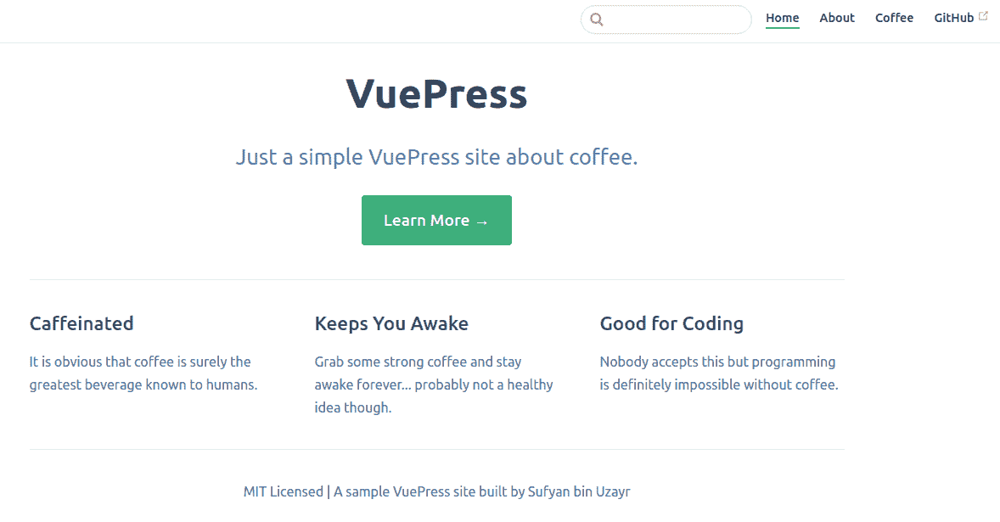
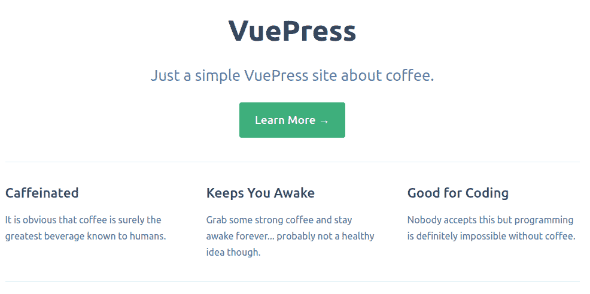

# 第四章：在 VuePress 中创建站点

在第三章中，*VuePress 开发-初步步骤*，我们学习了与 VuePress 配置相关的基础知识，以及如何使用变量和函数。我们了解了可以调整的各种值，以个性化和设置我们的 VuePress 站点。

除此之外，在第二章中，*使用 VuePress 入门*，我们已经在系统上安装了 VuePress。根据我们可能面临的要求，我们可以选择在全局安装 VuePress，或者将其作为现有包的依赖项进行安装。

无论安装方法如何，目前最重要的是我们应该有一个可用的 VuePress 安装。而且，现在我们已经掌握了 VuePress 等静态站点生成器的能力，以及如何配置它们，是时候开始看到实际效果了。

因此，在本章中，我们将把注意力转向 VuePress 的实际实现。换句话说，我们将使用 VuePress 构建一个实际的网站。这将帮助我们更好地理解 VuePress 的工作流程，也会让我们更全面地了解其基本概念。

因此，不要浪费任何时间，让我们开始吧！

在本章中，您将学习以下内容：

+   在 VuePress 中构建站点

+   如何创建 Markdown 文件并运行 VuePress 开发引擎

+   如何在 VuePress 中构建和呈现静态站点

+   介绍`.vuepress/config.js`文件

# 在 VuePress 中构建站点

值得注意的是，在这个阶段，您应该已经有一个正在运行的 VuePress 实例。如果您还没有安装 VuePress，请参考本书的第二章，*使用 VuePress 入门*。

此外，您需要使用基本的 Markdown 文件来输入内容。大多数 Web 开发人员都很熟悉 Markdown，并且大多数人都经常使用它。如果您不知道 Markdown 是什么，或者不习惯使用它，请参考本书的第五章，*在 VuePress 中使用 Markdown*。也就是说，在本章中，我们只会涉及 Markdown 元素的表面，比如段落、标题和链接。因此，对 Markdown 的基本了解现在已经足够了。

最后，虽然我们在本章实际上会建立一个网站，但我们不会将其部署到网络上的实时服务器。关于部署的细节，我们已经单独设置了一个章节。如果您希望在建立网站后立即部署项目文件，请参阅本书的第八章，*将 VuePress 部署到网络*。

既然我们已经介绍完了，现在是时候开始在 VuePress 中进行网站开发了！

# 我们将要建立什么？

大问题是：我们究竟要建立什么？

我们将使用 VuePress 创建一个简单的网站。举例来说，让我们假设这个给定的网站是关于咖啡的。

这是我们打算如何构建它的方式：

+   一个主页，详细介绍网站内容（并有一个呼吁行动的按钮）

+   一个关于页面

+   一个关于咖啡本身的示例页面

此外，我们的网站还将有一个导航菜单，链接到我们所有的页面，以及一个外部链接。实质上，我们希望在 VuePress 中构建一个多页面静态网站，具有自定义的主页视图。

以下是最终主页应该看起来的示例：



# 创建一个 VuePress 网站

既然我们已经明白了我们要做什么，让我们开始建立我们的网站吧。

# README.md 文件

在 VuePress 中，`README.md`文件充当我们的主页。自然而然，这就是 index.html 文件中的所有内容应该放置的地方。

我们可以在 Markdown 中编辑此文件，以包含我们需要的一切。除此之外，我们还可以使用 YAML Front Matter 语法来指定主页的自定义选项，比如区域设置、与 SEO 相关的元数据和自定义布局。

安装了 VuePress 之后，我们可以立即使用以下命令创建一个`README.md`文件：

```js
echo ‘Hello World!' > README.md
```

这个命令将创建一个包含“Hello World!”一行的简单的 Markdown 文件。输出将如下所示：


显然，这对我们的主页来说是不够的，对吧？我们很快将建立一个自定义的主页。

# 启动开发引擎

此时，打开终端（或命令行）并运行以下命令是一个好主意：

```js
vuepress dev
```

这将启动 VuePress 的开发引擎，看起来是这样的：


现在我们可以在网页浏览器中打开上面截图中显示的 URL，并且当我们对文件结构进行更改时，页面将自动刷新以展示实时更改，只要开发引擎正在运行（也就是说，终端是打开的），那么我们就可以在保存内容时查看实时更改。

确保在安装 VuePress 的确切目录中运行`vuepress dev`命令。所有文件都将放置和创建在其中，包括 Markdown 文件，任何媒体元素，以及任何 JS 配置文件。

# 构建首页

还记得我们刚刚创建的`README.md`文件吗？让我们打开它并稍作编辑。

任何编辑器都可以用来编辑 Markdown 文件。我个人只是在 Linux 中使用默认的 xed 或 gedit 文本编辑器。你也可以选择使用流行的代码编辑器来编辑 Markdown 文件。

我们将添加我们的前置内容，以生成一个自定义的首页。我们将使用 YAML 前置内容。如果你对此不熟悉，不用担心——我们将在下一章中更详细地讨论 Markdown 时进行介绍。

我们的首页应该有一个标题，后面跟着一个呼吁行动的按钮，鼓励我们的访客了解更多关于产品的信息。然后，我们还将添加三个单独的部分，向世界介绍更多关于我们的产品。最后，我们将添加页脚布局。

现在，让我们构建首页。

非常重要的是要知道，VuePress 默认主题附带了自己的首页布局。我们所要做的就是在前置内容中指定我们希望使用首页布局。为了做到这一点，我们只需要输入以下内容：

```js
---
home: true
---
```

然后，我们将添加额外的条目，比如我们的呼吁行动按钮文本和链接，如下所示：

```js
---
home: true
navbar: true
actionText: Learn More →
actionLink: /about
---
```

现在我们可以保存文件以预览更改。再次提醒，我们正在对刚刚创建的`README.md`文件进行更改。

如我们在下面的截图中所看到的，已经添加了一个呼吁行动的按钮，链接到一个*关于*页面（尚未创建，因此点击按钮将显示 404 错误）。


接下来，我们可以将剩余的内容添加到我们的前置内容中。以下是前置内容现在应该看起来的样子：

```js
---
home: true
navbar: true
actionText: Learn More →
actionLink: /about
features:
    - title: Caffeinated
    details: It is obvious that coffee is surely the greatest beverage known to humans.
    - title: Keeps You Awake
    details: Grab some strong coffee and stay awake forever... probably not a healthy idea though.
    - title: Good for Coding
    details: Nobody accepts this but programming is definitely impossible without coffee.
---
```

我们在首页添加了一个特性部分。我们添加了三个特性，每个都有自己的标题和正文内容。

因此，我们的首页应该变成以下样子：



接下来，我们只需要添加页脚。我们只需要在我们的前置内容中指定一个页脚条款，如下所示：

```js
---
footer: MIT Licensed | A sample VuePress site built by Sufyan bin Uzayr
---
```

我们选择了 MIT 许可证，因为 VuePress 也使用这个许可证。当然，这完全取决于您如何希望对您的内容进行许可。

添加了页脚之后，我们的首页应该看起来像这样：


# 添加元数据

一旦我们建立了首页，我们也可以在前置内容中添加一些元数据，如下所示：

```js
---
meta:
    - name: description
    content: Just a simple VuePress site about coffee.
    - name: keywords
    content: vuepress coffee
lang: en-US
---
```

在上面的片段中，我们为我们的网站添加了一个元描述，并指定了一些关键词。此外，我们告诉引擎和爬虫我们的网站使用的是美式英语。

到这一点，我们的`README.md`文件应该看起来像下面这样：


显而易见，整个文件仅由前置内容组成。我们将在第五章中详细学习有关 YAML 前置内容，*在 VuePress 中使用 Markdown*，以及在第六章中，VuePress 主题开发时，我们将讨论主题开发。

目前，我们的首页已经准备好了。我们可以选择在 Markdown 中向这个文件添加任何其他内容。这些内容需要在前置内容之后添加，尽管它将显示在页脚之上和首页英雄内容之下。

# 添加其他内容页面

现在我们的网站需要额外的页面来展示更多的内容。考虑到 VuePress 是一个静态网站生成器，我们只需要相应地添加内容，VuePress 会处理其余的工作。

是的，就是这么简单！：

1.  我们将我们的内容添加为 Markdown 文件

1.  VuePress 从这些 Markdown 文件中生成 HTML 文件，只要这些文件是有效的格式

就是这样。因为 VuePress 仍然不是一个博客或电子商务引擎，所以没有需要添加的自定义分类，或类似的东西。

对于我们的网站，我们将添加两个页面。第一个将是一个*关于*页面，第二个将是一个关于咖啡的页面。

对于我们的*关于*页面，我们在与`README.md`文件相同的目录中创建一个`about.md`文件。然后，我们可以用任何我们喜欢的内容填充我们的网站。这是我们在网站上使用的示例：


输出应该显示如下（确保在添加此文件后再次运行`vuepress dev`命令）：


要查看输出，只需将 Web 浏览器导航到`/about.html`，根据开发引擎显示的本地主机地址。

值得注意的是，VuePress 自己处理了一些事情：

+   表情符号基于 GitHub 表情符号服务显示。

+   更重要的是，Markdown 中的每个 H1、H2、H3 和其他类似的标题标签在 HTML 中都被视为锚链接。您可以将光标悬停在任何标题上，注意到自动生成了一个锚链接。

同样，我们也可以添加`coffee.md`文件。实际上，我们可以添加任意数量的页面。我们只需要添加 Markdown 文件，并告诉 VuePress 正确的位置。

# 添加导航菜单

在这个阶段，我们已经向网站添加了所有页面和内容。我们还建立了一个主页，可以在 Web 浏览器中浏览和预览所有内容。

但显然，我们只是输入每个页面的 URL 以预览它们。现实世界的用户无法猜测文件名。因此，在没有导航菜单的情况下，我们的网站无法正常运行。

对于我们来说，考虑为我们的网站添加导航栏是合乎逻辑的。当我们在第六章中更详细地学习 VuePress 的主题开发时，*VuePress 中的主题开发*，我们将触及导航栏定制的每一个方面（包括永久禁用导航栏）。但是，现在，我们的首要任务是展示一个功能齐全且有用的导航栏，以便我们的用户可以轻松浏览网站。

好消息是，VuePress 默认支持导航栏功能。也就是说，除非我们明确向其中添加项目，否则它不会显示。

为了创建导航菜单，我们需要使用以下代码：

```js
module.exports = {
 themeConfig: {
    nav: [
      { text: 'Home', link: '/' },
      { text: 'About', link: '/about' },
      { text: 'Coffee', link: '/coffee' },
      { text: 'GitHub', link: 'https://github.com/packtpublishing/vuepress-quick-start-guide' },
    ]
  }
 }
```

前面的代码为我们的主题配置导出了一个导航栏数组。在这里，我们为以下页面添加了四个链接：

+   主页，位于`/`

+   关于页面，位于`/about`

+   咖啡页面，位于`/coffee`

+   指向我们 GitHub 仓库的外部链接

值得注意的是，所有外部链接都需要完整输入，URL 开头需要带有 HTTP/HTTPS 协议，就像在这个截图中看到的那样：


我们需要将这段代码添加到我们的`config.js`文件中。这个特定的文件位于我们的 VuePress 站点的`.vuepress`目录中（如果偶然间这个文件不存在，可以随意创建一个名为`config.js`的空文件，然后在其中输入前面的代码）。如果我们将这个文件放在`.vuepress`目录之外，可能会导致事情不按预期工作。

`config.js`文件是什么？

在 VuePress 中，`config.js`文件包含了所有与配置相关的代码，正如其名称所示。这意味着任何调整 VuePress 配置的函数或代码都应该添加到这个文件中。如果没有这个文件，VuePress 将退回到默认配置值。

一旦保存了 config.js 的条目，我们可以刷新输出，导航栏将被添加，就像下面截图顶部所示的那样：


您可能会注意到搜索栏也已经添加了。但是等等，我们实际上并没有在任何地方添加搜索栏，是吗？

是的，没错——VuePress 自带搜索栏功能，无需进行调整。它就位于导航菜单旁边。然而，我们可以通过外部搜索索引服务扩展或替换默认搜索方法。

搜索栏在我们输入时就会显示结果；无需刷新页面。这就是 JavaScript 的美妙之处；其他几种网页开发语言只有在强制进行完整页面重新加载后才会显示结果。


与 WordPress 和其他软件不同，VuePress 原生搜索不会在内容主体内进行搜索。相反，它只会搜索输入的标题。这就是为什么在前面的截图中，我们只看到了`Coffee is awesome`页面作为结果，而`coffee`这个词也出现在首页和*关于*页面中。

因此，为了获得更强大的搜索体验，通常建议使用外部服务。我们将在本书的第六章中学习如何集成这一点，*VuePress 主题开发*。

# 最终构建

现在我们已经成功构建了我们的完整站点。我们已经添加了内容，还创建了单独的页面，甚至创建了一个导航菜单。

到目前为止，我们使用`vuepress dev`命令来运行开发引擎并预览站点。一旦确定我们已经构建了站点，我们可以安全（字面上）地*构建*它。

为此，我们需要输入以下命令：

```js
vuepress build
```

此命令将提取我们站点的元数据并编译信息。然后，它将根据 Markdown 内容呈现静态 HTML 页面，如下所示：


生成的内容默认放置在`.vuepress`目录中的 dist 目录中。因此，我们的 VuePress 站点的一般目录结构如下：


值得指出的是，VuePress 根据我们创建的 Markdown 文件生成 HTML 文件。它进一步将所有媒体元素、JS 文件和 CSS 文件放置在`.vuepress/dist`路径下的 assets 子目录中。`/img`目录包含图像，而`/js`子目录包含 JS 文件。

除此之外，VuePress 还创建了一个`404`文件，以便在出现*页面未找到*错误时显示。我们可以根据需要自定义此文件，或者保持原样。

有趣的事实：这个示例站点的最终构建，全部压缩在一起，大约是 68 KB。而在动态数据库驱动的 CMS 中，比如 WordPress 或 Drupal，三个页面的类似站点很容易就会超过 50 MB。

就是这样！我们已经成功构建了一个 VuePress 站点！很简单，不是吗？

# 摘要

在本章中，我们学习了如何使用 VuePress 构建静态站点。我们学习了自定义主页布局，添加呼吁行动按钮以及其他内容，以及其他页面。

不仅如此，我们甚至为我们的站点添加了导航菜单。此外，我们还了解了`config.js`文件的作用。在接下来的章节中，我们将学习更多与定制相关的调整。这些调整中的大部分将放置在`config.js`文件中。

最后，我们学习了如何使用`vuepress build`命令*构建*VuePress 站点。到目前为止，我们已经使用我们自己的内容生成了一个静态站点。

您可以在该书的 GitHub 存储库中找到此站点的原始代码，包括所有 Markdown 文件，以压缩文件的形式。您还可以下载导出的`build`文件，包括静态内容，作为另一个压缩文件。GitHub 存储库位于[`github.com/packtpublishing/vuepress-quick-start-guide`](https://github.com/packtpublishing/vuepress-quick-start-guide)。

这个特定的网站现在可以轻松部署到我们选择的任何云托管服务上。然而，在本书的最后一章中，我们将转向部署，学习如何将我们的网站部署到各种托管服务，如 Heroku、Netlify 和 Google Firebase！

目前，我们将深入研究 Markdown，以便更好地掌握内容格式和演示。然后，我们将学习一些关于主题开发的知识，以便我们可以定制我们的网站，使其成为我们想要的样子。

在下一章中，我们将把注意力转向 Markdown 中的内容编辑，以及 VuePress 如何与 Markdown 配合工作。
