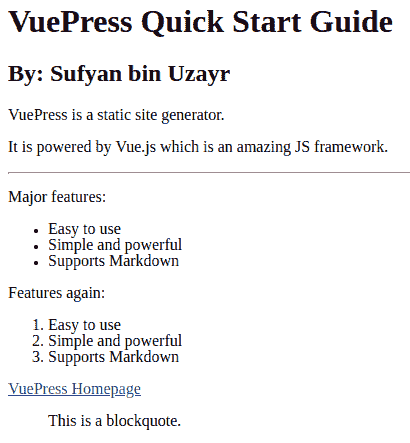
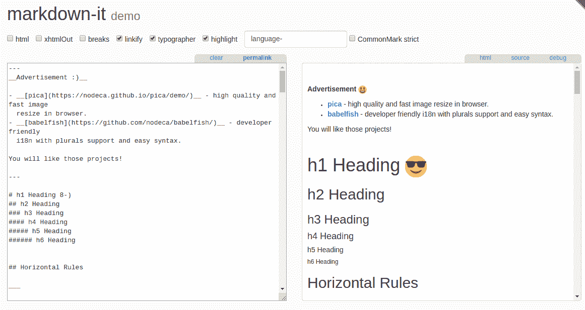

# 第五章：在 VuePress 中使用 Markdown

在[第四章]中，我们学习了如何使用 VuePress 创建站点或博客。如果您迄今为止一直在跟进本书，您应该在本地服务器或计算机上安装了 VuePress，并且所有变量都已就位。此外，您还应该了解可以调整的各种配置值，以充分利用 VuePress。

除此之外，您还知道如何处理页面，如何设置站点结构和导航，应用默认样式等等。

换句话说，您知道如何启动和运行 VuePress 网站，以及如何填充内容。

但说到内容，如何在 VuePress 中管理和添加内容？在这种情况下，完成这些工作的最简单和首选方法是使用 Markdown。

Markdown 是一种简单且轻量级的标记语言，具有自己的格式和语法。由于其简单性和易用性，自诞生以来，Markdown 已经变得非常流行。

在本章中，我们将学习不仅 Markdown 是什么，还要学习如何在 VuePress 中使用它。我们将学习 Markdown 语法，以及 VuePress 的 Markdown 扩展和 Markdown 的各种配置变量。

通过本章的学习，您应该能够在 VuePress 中输入内容，也可以在任何其他内容管理系统中使用 Markdown。

在本章中，您将学习以下主题：

+   什么是 Markdown？

+   Markdown 如何使用？

+   VuePress 中的 Markdown 配置

+   VuePress 的 Markdown 扩展

+   在 VuePress 中格式化 Markdown 内容

# 学习在 VuePress 中使用 Markdown

强烈建议您获得一些 Markdown 格式化的基本技能，因为它很快将成为技术文档世界的事实标准，例如在 VuePress 项目的 README 文件中，甚至是 Vue.js 中。

# 什么是 Markdown？

如果您在 Web 开发领域活跃，您可能已经接触过 Markdown，并且很可能在项目中使用它。由于其流行，Markdown 不需要大量介绍。

话虽如此，值得一提的是，可能值得一提 Markdown 及其优点，以便即使是对这个主题新手的读者也可能会发现它有一些价值。

简而言之，Markdown 是一种注重易用性和可读性的内容格式化解决方案。它是由 John Gruber 于 2004 年与 Aaron Swartz 合作创建的。这里的目标是以更具表现力的格式提供纯文本内容，并在必要时可选择将其转换为有效的 HTML。

由于其高度简化和非常具有表现力的特性，Markdown 在技术上有能力的人群中获得了良好的追随者。

Markdown 带有 BSD 风格的许可证，目前可用于各种内容管理系统的专门插件形式。甚至 WordPress 也有几个 Markdown 插件可用。

此外，许多网站和项目都实现了它们自己定制的 Markdown 变体。这些用户包括 SourceForge、GitHub、reddit、Stack Exchange 等等。

# 一个例子

注意我们在前面的部分谈到了可读性吗？嗯，Markdown 非常注重可读性，即使在原始格式中也是如此。

考虑下面这段简单的 HTML 代码：

```js
<h1>VuePress Quick Start Guide</h1>
<h2>By: Sufyan bin Uzayr</h2>
<p>VuePress is a static site generator.</p>
<p>It is powered by Vue.js which is an amazing JS framework.</p>
<hr />
<p>Major features:</p>
<ul>
    <li>Easy to use</li>
    <li>Simple and powerful</li>
    <li>Supports Markdown</li>
</ul>
<p>Features again:</p>
<ol>
    <li>Easy to use</li>
    <li>Simple and powerful</li>
    <li>Supports Markdown</li>
</ol>
<p><a href="https://vuepress.vuejs.org/">VuePress Homepage</a></p>
<blockquote>
<p>This is a blockquote.</p>
</blockquote>
```

现在，将前面的示例与以下 Markdown 代码进行比较：

```js
# VuePress Quick Start Guide
## By: Sufyan bin Uzayr
VuePress is a static site generator.
It is powered by Vue.js which is an amazing JS framework.
* * *
Major features:
* Easy to use
* Simple and powerful
* Supports Markdown
Features again:
1\. Easy to use
2\. Simple and powerful
3\. Supports Markdown
[VuePress Homepage](https://vuepress.vuejs.org/)
> This is a blockquote.
```

前面两个代码示例将产生相同的输出。结果如下：



但是，正如你所看到的，Markdown 代码比 HTML 更清晰易读。它没有被繁琐的标签和其他元素所淹没。简单的格式化辅助意味着即使在原始格式中（即没有输出的情况下），你也可以阅读文本。这就是 Markdown 的简单和美丽之处！它非常易读，易于理解，也很容易输入。

您可以在官方网站上阅读有关 Markdown 的功能和设置的更多信息，网址为[`daringfireball.net/projects/markdown`](https://daringfireball.net/projects/markdown)。

自然地，许多静态站点内容管理系统，如 VuePress，出于这些原因倾向于使用 Markdown。因此，尝试掌握 Markdown 中的一些基本格式化辅助是很有必要的，以便充分利用 VuePress。

# markdown-it 解析器

现在我们已经了解了 Markdown 是什么，以及它可以为我们提供什么优势，是时候开始学习 VuePress 中 Markdown 的用法和变化了。然而，在进入 VuePress 环境之前，我们必须先了解一个名为 markdown-it 的 Markdown 解析器。

Markdown 解析器是做什么的？

它最简单的任务是分析并将 Markdown 语句分解为易于处理的句法组件。

markdown-it 的工作相当出色，而且非常容易使用。它带有自己一套自定义扩展，多个插件，并且不会减慢你的环境。VuePress 中的大多数 Markdown 扩展和配置变量都与 markdown-it 很好地配合，有些甚至只能通过 markdown-it 来使用。

要使用 markdown-it，你首先需要安装它。可以通过 npm 来完成，就像 VuePress 一样（你已经在第一章 *介绍静态站点生成器和 VuePress*中学习了 npm 安装）：

```js
npm install markdown-it --save
```

接下来，你可以加载它的插件并根据需要使用它。要了解更多关于 markdown-it 解析器的信息，你可以查看其 GitHub 存储库[`github.com/markdown-it/markdown-it`](https://github.com/markdown-it/markdown-it)。

另外，还有一个可用的演示可以在[`markdown-it.github.io/`](https://markdown-it.github.io/)中查看，如下截图所示：



VuePress 使用 markdown-it 作为默认的 Markdown 解析器或渲染器。当然，你不仅可以使用 markdown-it，还可以在 VuePress 中使用它的自定义扩展和插件。

为了在 VuePress 中进一步自定义 markdown-it，修改`.vuepress/config.js`文件以添加 Markdown 实例并在其中修改可能是个好主意。我们已经在之前的章节中介绍了`.vuepress/config.js`文件的内容和细节。请注意，你可以参考 markdown-it 文档以获取有关各种插件的更多详细信息，以及如何引用它们以供我们使用。

当添加到`config.js`文件时，你的示例代码应该如下所示：

```js
module.exports = {
    markdown: {
    // the markdown-it-anchor
        anchor: { permalink: false },
    // the markdown-it-toc extension
        toc: { includeLevel: [1, 2] },
    config: md => {
    // this is where you add more markdown-it extensions
        md.use(require('markdown-it-name-of-extension'))
        }
    }
}
```

在代码的最后部分，请确保添加你希望使用的 markdown-it 扩展的相关名称。请注意，我们将在本章中介绍 markdown-it-anchor 和 markdown-it-toc 扩展，以帮助你更好地理解如何引用它们以及预期的输出是什么。

现在你已经了解了 Markdown 是什么，markdown-it 解析器是什么，以及 VuePress 如何将其作为 Markdown 的默认渲染器，现在可以安全地转向 VuePress 中的 Markdown 配置变量和值。之后，我们将关注 VuePress 对 Markdown 的使用和处理。

# Markdown 配置参考

在这一点上，我们首先将关注 VuePress 中与 Markdown 相关的各种配置实体。请注意，这些是 VuePress 特定的，可能不适用于其他静态站点生成器。

我们已经在第三章中涵盖了基本的配置值，*VuePress 开发-初步步骤*。除此之外，我们将转向特定主题配置值及其在处理自定义主题的后续章节中的用途。

目前，我们只会关注 VuePress 配置中与 Markdown 相关的值和变量。随着在项目中使用 VuePress 的进展，你可以利用这些配置参考实体更好地管理 Markdown 中的内容，并确保它被格式化和呈现成你想要的样子。

# markdown.slugify

这是一个非常重要的功能，你应该尽一切可能了解它。在 VuePress 中，markdown.slugify 可以用来将标题文本转换为 slug。

因此，你可以在 Markdown 中输入标题文本，然后使用这个函数来生成一个 slug（即 URL 或永久链接）。当然，这意味着它主要用于锚链接、目录和其他相关材料。

由于`markdown.slugify`是函数类型，因此在数据类型方面没有值定义。相反，它有一个函数定义。让我们更仔细地看一下它的一般语法，以进一步理解它的功能：

```js
// string.js slugify drops non ascii chars so we have to 
// use a custom implementation here
const removeDiacritics = require('diacritics').remove
    // eslint-disable-next-line no-control-regex
    const rControl = /[\u0000-\u001f]/g
    const rSpecial = /[\s~`!@#$%^&*()\-_+=[\]{}|\\;:"'<>,.?/]+/g
module.exports = function slugify (str) {
    return removeDiacritics(str)
    // Remove control characters
    .replace(rControl, ' ')
    // Replace special characters
    .replace(rSpecial, '-')
    // Remove continous separators
    .replace(/\-{2,}/g, '-')
    // Remove prefixing and trailing separators
    .replace(/^\-+|\-+$/g, '')
    // ensure it doesn't start with a number (#121)
    .replace(/^(\d)/, '_$1')
    // lowercase
    .toLowerCase()
```

你也可以在[`github.com/vuejs/vuepress/blob/master/lib/markdown/slugify.js`](https://github.com/vuejs/vuepress/blob/master/lib/markdown/slugify.js)浏览相同的源代码。

现在，你注意到这个函数在做什么了吗？它获取标题文本，移除其中的空格字符，然后用连字符（`-`）替换，接着移除任何前缀和尾随字符，最后将标题文本转换为小写。

例如，如果我们的标题文本是`Header SamPLE`，它会将其转换为`header-sample`作为 slug。当然，因为 slug 是 URL 的一部分，它不能包含特定字符和空格。`markdown.slugify`确保了这一点。

# markdown.externalLinks

`markdown.externalLinks`用于向内容添加外部链接（从名称上就很明显）。默认情况下，它将其值配对在`<a>`标签中，并在新窗口中打开外部链接。

`markdown.externalLinks`是对象类型，其默认语法如下：

```js
{ target: '_blank', rel: 'noopener noreferrer' }
```

如果您希望不在新窗口中打开外部链接（出于 SEO 原因或类似原因），您可以删除`target:'_blank'`部分，就像您在任何其他 HTML 文档中所做的那样。

# markdown.config

markdown.config 是函数类型，其默认值因此为未定义。

它用于修改默认配置，并向我们在上一节中讨论的 markdown-it Markdown 解析器添加附加功能或外部插件。

以下是一个演示其用法的示例：

```js
module.exports = {
    markdown: {
        config: md => {
            md.set({ breaks: true })
            md.use(require('markdown-it-something'))
        }
    }
}
```

在上面的示例中，markdown.config 添加了对名为 markdown-it-something 的外部实体的要求，然后可以用于实现相同外部实体的附加功能。

# markdown.toc

`markdown.toc`提供了向我们的网站添加目录的选项。如果您计划创建一个需要这样的目录的网站，比如知识库网站或在线小说或书籍的章节布局，它尤其有用。

这是对象类型，其默认语法如下：

```js
{ includeLevel: [2, 3] }
```

值得注意的是，`markdown.toc`实际上与 markdown-it-table-of-contents 插件一起使用。这个特定的插件为 markdown-it 插件提供了一个目录布局。您可以在[`github.com/Oktavilla/markdown-it-table-of-contents`](https://github.com/Oktavilla/markdown-it-table-of-contents)上了解更多信息。

# markdown.anchor

`markdown.anchor`是对象类型，其一般语法如下：

```js
{ permalink: true, permalinkBefore: true, permalinkSymbol: '#' }
```

它提供了向您的内容添加标题锚的选项。

请注意，这不应与`markdown.slugify`添加的标题标识符或 ID 混淆，如前所讨论的那样。相反，markdown.anchor 允许您在内容中添加锚链接。

它与 markdown-it-anchor 插件协同工作，该插件为 markdown-it 添加了标题锚功能。您可以在其 GitHub 页面上了解有关此插件的更多信息[`github.com/valeriangalliat/markdown-it-anchor`](https://github.com/valeriangalliat/markdown-it-anchor)。

# markdown.lineNumbers

每当您向 VuePress 网站添加诸如代码块之类的内容时，您可以选择是否在代码块旁边显示行号。为此，您可以使用`markdown.lineNumbers`配置实体。

`markdown.lineNumbers`是`boolean`类型，它接受简单的`true`或`false`值来显示（或不显示）行号。

例如，当`markdown.lineNumbers`配置值设置为 true 时，代码输入将具有行号。

以下是如何做到的：

```js
module.exports = {
    markdown: {
    lineNumbers: true
    }
}
```

通过设置配置值，任何代码输入都将附加行号。例如，如果我们在页面中显示相同的代码作为预格式化内容，它将如何显示：


现在我们已经涵盖了几乎所有相关的 Markdown 配置术语，是时候把注意力转向 VuePress 中使用的 Markdown 扩展了。

# VuePress 中的 Markdown 扩展

当我们谈论 VuePress 中的 Markdown 扩展时，我们指的是那些可以立即在 VuePress 中使用的 Markdown 扩展。您已经看到了 Markdown 格式如何在 VuePress 的日常使用中使用，在第四章中，*在 VuePress 中创建站点*。

# 标题锚点

VuePress 中的所有标题都会自动应用锚链接，以便更轻松地浏览站点内容。这主要是为了方便浏览站点内容，因为 VuePress 主要是一个文档管理工具，而不是一个商业站点解决方案。在这种情况下，通过标题导航是管理内容的最简单方式。

如果您希望配置或修改锚点设置，可以使用`markdown.anchor`配置选项，如本章的前一节所讨论的那样。

# 链接

在 VuePress 中，链接可以是内部的或外部的。

顾名思义，内部链接指向本地内容，而外部链接指向其他网站和项目的内容。

让我们在下一节中分别讨论每一个。

# 外部链接

所有指向第三方网站的外部和出站链接都会自动附加`target="_blank" rel="noopener noreferrer"`标签。这意味着所有外部链接都会在新窗口（或浏览器标签）中打开。您可以使用`markdown.externalLinks`配置选项来修改此设置，如本章的前一节所讨论的那样。

# 内部链接

在这一点上，值得记住的是 VuePress 生成**单页面应用程序**（**SPA**）以便更轻松、更快速地浏览站点内容。现在，为了实现 SPA 导航，所有本地或入站链接都需要转换为路由链接。

VuePress 通过将所有以 Markdown 或 HTML 格式结尾的内部链接转换为`<router-link>`来实现这一点。

我们在上一章中学到，VuePress 中的每个子目录，除非不是公开访问的，必须有一个`README.md`文件，然后 VuePress 会将其转换为`index.html`文件，然后在浏览器中提供服务。

当在内容中添加内部链接时，您需要在文件路径中指定正确的文件扩展名，否则将会得到 404 错误。因此，在 VuePress 中添加内部或本地链接时，必须牢记以下考虑事项：

+   必须附加`.html`或`.md`——正确的文件扩展名。

+   在编写文件或资源的相对路径时，必须添加尾随斜杠`/`。如果没有尾随斜杠，VuePress 将无法遵循相对路径，并将给出 404 错误。因此，`/mypath`是不正确的，而`/mypath/`是正确的。

+   所有路径规范都是区分大小写的。

现在，为了更好地理解这些要求，让我们举个例子。考虑以下目录结构：


以下表格显示了此结构的链接语法应如何工作：

| **相对路径** | **Markdown** | **解释** |
| --- | --- | --- |
| `/` | `[首页]` | 位于`根`文件夹中的`README`文件 |
| `/testx/` | `[testx]` | 位于`testx`子目录中的`README`文件。 |
| `/testx/filea.md` | `[testx - filea]` | `testx`子目录中的`filea.md`文件；注意`.md`扩展名。 |
| `/testx/fileb.html` | `[testx - fileb]` |

&#124; `fileb.md`文件位于`testx`子目录中；注意`.html`扩展名，它仍然指向`.md`文件。 &#124;

&#124;  &#124;

|

在这个例子中，我们可以清楚地看到，当渲染页面时，VuePress 会自动将`.md`扩展名转换为解析的 HTML。

# 表情符号

考虑到表情符号已经变得相当流行，应该有一种方法来正确格式化并在您的内容中包含它们，如果您愿意的话。WordPress 甚至已经集成了自己的自定义 WordPress 表情符号，您可以在您的内容中使用，或者直接删除并依赖浏览器表情符号。

然而，与 WordPress 不同，VuePress 更注重轻量和迅速。因此，在 VuePress 的核心中配备自定义表情符号集是没有意义的。

但是，您可以轻松地使用 markdown-it-emoji 插件，该插件预装了超过 1,000 个表情符号供您选择。这是一个示例：


您可以选择使用提供所有 GitHub 支持表情符号的完整版本，或者只提供 Unicode 表情符号的轻量级版本。此特定插件还支持基于字符的表情符号，例如`:-)`等。它与 markdown-it 解析器一起工作，并可以通过 npm 安装，如下所示：

```js
npm install markdown-it-emoji --save
```

当然，我们这里的主要重点是如何在 VuePress 中使用 markdown-it-emoji。要了解有关插件本身的更多信息，您可以在其 GitHub 页面上找到：[`github.com/markdown-it/markdown-it-emoji`](https://github.com/markdown-it/markdown-it-emoji)。

在 VuePress 中，您只需在两个冒号内键入所需的表情符号名称即可。例如，要在每个连续行上添加一个头骨、一个外星人、一个尖叫的脸和一个太阳镜表情符号，请尝试以下代码：

```js
:skull:
:alien:
:scream:
:sunglasses:
```

在浏览器中的最终输出将如下所示：


当然，表情符号的最终实际外观也可能会因您的操作系统和浏览器版本而有所不同。有时，某些网络浏览器倾向于用自己的变体替换默认的网络表情符号。

# 添加表格

VuePress 在 Markdown 中原生支持两种主要类型的表格。

第一个显然是目录。这不是一个纯粹的表格，因为几乎没有行或列，但无论如何都被称为表格，所以让我们保持这样。语法很简单，如下所示：

```js
[[toc]]
```

这将根据内容中的标题自动生成目录。您可以进一步通过使用`markdown.toc`配置选项进行自定义，如本章前面所述。

VuePress 中的第二种表格类型类似于 GitHub 上的表格布局。实际上，它被称为 GitHub 风格表格。

假设我们正在创建一个简单的表格，概述每个国家的首都、旅游景点、流行运动和货币。您可以按照以下 Markdown 格式和详细信息输入：


输出将如下所示：


这就是 VuePress 中的表格。表格会自动格式化，并且交替行也会高亮显示，以使表格看起来更加整洁。

# 前置内容

通过 YAML 数据序列化的前置内容概念首先由 Jekyll 引入，Jekyll 是另一个非常流行和多功能的静态站点生成器，我们在第一章中简要讨论过，*介绍静态站点生成器和 VuePress*。

简而言之，前置内容被放置在文件的开头和三虚线之间。在该内容中，您可以指定自定义和预定义变量，以提供有关您的项目的更多信息。这些变量将随后可供您在所有页面和自定义组件中使用。

讨论与前置内容相关的所有变量远远超出了这个快速入门指南的范围。但是，您可以在 Jekyll 项目的网站上查看有关此主题的更多信息：[`jekyllrb.com/docs/frontmatter/`](https://jekyllrb.com/docs/frontmatter/)。

现在，让我们回到 VuePress。

在 VuePress 中，YAML 前置内容得到了原生支持，无需使用任何自定义导入或额外扩展。因此，您在三虚线之间指定的任何内容将在整个页面中都可用。

让我们通过一个例子来理解它。考虑以下前置内容代码：

```js
---
title: My Fancy VuePress Site
lang: en-US
meta:
    - name: site description
    content: hey, this is vuepress!
    - name: keywords
    content: vuepress blogging vuejs
---
```

现在，在上面的例子中，标题和语言变量已经为整个页面指定了。然后，您可以添加自定义的元标签，例如站点描述和与 SEO 相关的关键字，这些将适用于整个页面。

如果 YAML 不是您首选的脚本解决方案，您也可以选择其他选项。TOML 也得到了支持——要使用它，您只需指定您偏好 TOML，如下所示：

```js
---toml
title: My Fancy VuePress Site
lang: en-US
meta:
    - name: site description
    content: hey, this is vuepress!
    - name: keywords
content: vuepress blogging vuejs
---
```

然而，很多 JavaScript 程序员更喜欢 JSON。在这种情况下，您需要遵循标准的 JSON 格式来处理前置内容；也就是说，使用花括号和引号，就像下面的例子所示：

```js
---
{
“title”: “My Fancy VuePress Site”,
“lang”: “en-US”,
“meta”:
    - “name”: “site description”,
    “content”: “hey, this is vuepress!”,
    - “name”: “keywords”,
    “content”: “vuepress” “blogging” “vuejs”
}
---
```

前置内容规范在静态站点生成器的世界中非常常见，任何有过使用这类生成器经验的人几乎肯定已经了解了前置内容的作用。

# 自定义格式选项

在 Markdown 中，VuePress 原生支持一些其他不太常用的格式选项。这些将在下一节中讨论。

# 代码中的突出显示

您可以选择在代码中突出显示行，以使输出更具可读性。以下是一些示例代码：

```js
export default {
    data () {
        return {
        msg: 'Highlight me!'
        }
    }
}
```

输出如下：


# 自定义容器

有时，您可能希望强调内容中的某些部分，比如警告、通知和提示。您可以在 VuePress 中轻松突出它们，以便用户的注意力直接被吸引到手头的内容上。

这意味着您首先需要将给定的内容指定为提示、警告或类似内容。之后，VuePress 将生成所需的通知或提示，并带有给定的彩色容器。

最终的实际外观可能会有所不同，取决于您自己的配置，但这个呈现方式与 GitHub 风格的 Markdown 相当类似，如果您在 GitHub 中有一些关于格式化`README`和其他 Markdown 文件的经验，您可能已经遇到过这样的自定义内容容器。

以下是您可以这样做的方法：

```js
::: tip
Hello World!
:::

::: warning
Hello World! You have been warned!
:::

::: danger
Hello World! This is a really serious warning.
:::
```

输出如下所示：


您也可以选择调整每个容器的标题，就像这里所示：

```js
::: tip HOWDY
Hello World!
:::

::: warning STOP
Hello World! You have been warned!
:::

::: danger NOOO
Hello World! This is a really serious warning.
:::
```

再次，输出将显示如下：


# 导入代码片段

如果您有包含代码的现有文件，您可以将代码片段从中导入到您的 VuePress 项目中。这样做的语法如下：

```js
<<< @/filepath
```

但是，您需要记住，您不能在 webpack 中使用路径别名，因为所有代码片段的导入通常必须在 webpack 编译之前执行。

请记住，代码片段的导入是一个实验性功能，仍处于测试阶段。它有时可能不按预期工作。

代码片段导入函数支持行高亮，正如本章前面讨论的那样。在这种情况下，语法将变成以下形式：

```js
<<< @/filepath{highlightLines}
```

`@`的默认值将是`process.cwd()`。

# 摘要

这就是本章的结束。

在本章中，我们了解了 Markdown 是什么，以及它为什么如此受欢迎，比如它的简单性和可读性，以及易用性。除此之外，我们还介绍了 markdown-it 解析器，这是在静态站点生成工具中渲染 Markdown 的非常常见和流行的实体，比如 VuePress。

我们还介绍了用于 Markdown 的 VuePress 配置值。此外，我们了解了在 VuePress 中可用的几种 Markdown 扩展。当然，这并不是一个详尽的列表。考虑到 VuePress 正在积极开发中，您可以预期最终会添加新的值和扩展。

话虽如此，在完成本章后，您现在应该对 VuePress 中的 Markdown 使用有足够的理解，并且应该能够添加`.md`文件，按照您希望呈现内容的方式对其进行格式化，并保存它们，以便 VuePress 可以将它们呈现为 HTML 并组合成单页应用程序。

说到单页应用程序（SPAs），我们现在需要涵盖网页开发中一个非常重要的方面——模板和主题！

在上一章中，我们了解了默认的 VuePress 主题以及它对我们的作用，它提供的布局以及我们如何使用它来呈现我们的内容。但是，自定义主题呢？在今天的世界中，通常更喜欢，有时甚至需要网站拥有自己独特的外观和感觉。自定义主题可以帮助您实现这一目标，并使您的网站脱颖而出！

因此，在下一章中，我们将把注意力转向 VuePress 中的自定义主题，并涵盖相关主题。
