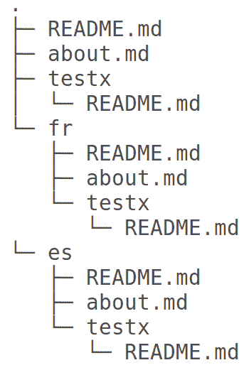

# 第七章：更多 VuePress 的用法！

在之前的章节中，我们学习了如何在 VuePress 中设置和构建网站。我们也知道如何使用 Markdown 格式化我们的内容，以及我们可以如何自定义 VuePress 主题。

总的来说，假设你已经按照上一章的内容进行了学习，现在你应该对 VuePress 有了相当的掌握。

但是，尽管说了这么多，网站开发仍然有一个关键的方面。如今，越来越多的人转向互联网，英语不再是网络上唯一使用的语言。因此，这个特定的关键方面自然涉及到网站的国际化。

在 VuePress 中，国际化并不是什么高深的科学。事实上，为网站内容添加对不同地区和语言的支持非常容易，甚至可以在几分钟内完成。

当然，你仍然需要在你希望添加的语言中输入正确的内容。如果你想到自动翻译，那么你是错误的——国际化并不意味着内容会自动翻译。

那么，你应该如何为 VuePress 添加新的语言？本章将会详细解释。

在本章中，你将学到以下内容：

+   国际化基础知识

+   VuePress 的国际化

+   分析 VuePress 作为一款软件的未来增长

# VuePress：国际化及其更多用法

但除此之外，你还应该了解关于 VuePress 的其他内容吗？嗯，要记住它正在积极开发中，并不像许多其他内容管理系统那样古老。

因此，我们稍后也会在本章的很大一部分时间来讨论 VuePress 的未来发展，以及现在你已经学会了如何使用它，你应该考虑在什么时候使用它。

现在，让我们从国际化开始。

# 什么是国际化？

在继续之前，我们首先需要花一点时间来理解国际化是什么意思。

首先要强调的是，国际化实际上并不涵盖内容的机器翻译。

它指的是内容的翻译功能。

国际化本身指的是为了将软件和产品添加支持，以便它们可以轻松地被适应和翻译成其他语言。因此，国际化涉及适当的规划和策略，比如以下内容：

+   理解不同语言的口语和书写方式

+   理解多种语言的文化方面，以及它们的差异

这两点都非常重要。例如，一些语言，比如阿拉伯语，是从右到左书写的，而不是相反。同样，其他一些语言，比如泰米尔语和印地语，有非常复杂的自己的文字，可能对英语使用者来说看起来令人生畏。此外，许多语言，比如日语和中文，通常包含需要特殊符号和键盘布局的字符。

因此，可以说国际化是内容准备好被翻译成用户本地语言的方式和过程。实际上，将内容适应各种本地语言和地区需求的过程称为本地化。

**国际化**也被缩写为**i18n**，或者**i-18-n**，意味着**i-eighteen-n**；也就是说，从 I 到 N 的 18 个字母。

在软件方面，最大的关注点通常是要确保那些需要单一代码（比如英语）的语言的字符能够轻松转换成需要多于一个字符代码的语言（比如中文）的相应字符。

一旦满足了这个条件和其他一些次要条件，我们可以安全地说给定的软件支持国际化或者是本地化准备就绪的。

# VuePress 中的国际化

VuePress 默认支持国际化。这意味着你可以轻松地为你选择的语言添加区域设置，然后将你网站的内容本地化到所需的语言。之后，VuePress 将自动处理繁琐的任务，比如适当的内容结构、菜单切换到其他语言等。

在 VuePress 中，国际化本身是在两个级别实现的：

+   站点级别的配置

+   主题级别的配置

我们将涵盖两者。为了解释起见，我们将在我们的代码中使用任何第二语言，比如法语。然而，为了实际在给定语言中本地化您的站点，您需要正确输入与相关语言有关的详细信息。

# VuePress 中的 i18n 配置

让我们首先从主题级别的 i18n 配置开始。

# 默认主题的 i18n 配置

在默认的 VuePress 主题中，本地化有着原生的支持。这是通过`themeConfig.locales`选项实现的。

您添加的每个区域理想情况下应该有自己的导航栏和侧边栏选项。侧边栏和导航栏选项已经在第六章中讨论过，*VuePress 中的主题开发*。此外，您还应该为每个区域单独指定站点特定的元数据和其他字段。

让我们看一下以下代码片段：

```js
module.exports = {
 locales: { /* ... */ },
 themeConfig: {
    locales: {
      '/': {
        // text for the language dropdown in menu
        selectText: 'Languages',
        // label for this language in the language dropdown
        label: 'English',
        // text for the edit-on-github link
        editLinkText: 'Edit this page on GitHub',
        // configuring Service Worker popup UI (optional)
        serviceWorker: {
          updatePopup: {
            message: "New content is available.",
            buttonText: "Refresh"
          }
        },
        // algolia docsearch options (optional)
        algolia: {},
        nav: [
          { text: 'Nested', link: '/nested/' }
        ],
        sidebar: {
          '/': [/* ... */],
          '/nested/': [/* ... */]
        }
      },

     '/fr/': {
        // text for the language dropdown in menu
        selectText: 'Languages-text-in-french',
        // label for this language in the language dropdown
        label: 'French',
        // text for the edit-on-github link
        editLinkText: 'text-in-french',
        // configuring Service Worker popup UI (optional)
        serviceWorker: {
          updatePopup: {
            message: "text-in-french",
            buttonText: "Refresh-text-in-french"
          }
        },
        // algolia docsearch options (optional)
        algolia: {},
        nav: [
          { text: 'Nested', link: '/nested/' }
        ],
        sidebar: {
          '/': [/* ... */],
          '/nested/': [/* ... */]
        } }

    '/es/': {
        // text for the language dropdown in menu
        selectText: 'Languages-text-in-spanish',
        // label for this language in the language dropdown
        label: 'Spanish',
        // text for the edit-on-github link
        editLinkText: 'text-in-spanish',
        // configuring Service Worker popup UI (optional)
        serviceWorker: {
          updatePopup: {
            message: "text-in-spanish",
            buttonText: "Refresh-text-in-spanish"
          }
        },
        // algolia docsearch options (optional)
        algolia: {},
        nav: [
          { text: 'Nested', link: '/nested/' }
        ],
        sidebar: {
          '/': [/* ... */],
          '/nested/': [/* ... */]
        } }
    }
  }
 }
```

上述代码是做什么的？

好吧，它为我们的主题设置了多个区域设置——英语、法语和西班牙语。

它在菜单中添加了一个下拉框以供选择语言。然后，它以不同语言为 GitHub 的条目，以及 Algolia 搜索和服务工作器弹出 UI 添加了相应的文本。

因此，当用户在我们站点的英语版本上时，他们将看到 Refresh 作为按钮文本。但是当用户在我们站点的法语（位于`/fr` URL）版本上时，他们将看到法语中的 Refresh 单词，当用户在我们站点的西班牙语版本（位于`/es` URL）上时，他们将在同一个按钮上看到西班牙语中的 Refresh 单词，这是由我们指定的。

请注意，在上述代码中，您需要输入法语和西班牙语区域的实际对应值。Refresh-text-in-spanish 意味着这是您应该指定相应文本的地方，否则 VuePress 实际上会在前端（字面上）显示短语 Refresh-text-in-spanish。

您可以为任意数量的语言重复此过程。

# 站点级别的 i18n 配置

现在我们已经看到了如何在 VuePress 的主题级别添加多语言支持。但是，在实际执行之前，我们需要首先在站点级别实现这一点。

因此，在主题中添加对给定区域的支持之前，我们首先需要在我们的`config.js`文件中指定 locale 选项。

考虑以下站点结构：



请注意，我们创建了三个相同结构的相同文件的副本。`/`副本显然是用于英文网站。但`/fr/`和`/es/`副本分别用于法语和西班牙语版本。`fr/about.md`文件包含与`/about.md`文件相同的内容，只是用不同的语言。

现在，一旦我们按照自己的意愿构建了网站，我们就可以在`config.js`文件中指定 locales 选项，如下所示：

```js
//goes in .vuepress/config.js
module.exports = {
  locales: {
    // The default locale can use '/' as its path
    '/': {
      lang: 'en-US', // this will be set as the lang attribute in HTML
      title: 'Good Morning',
      description: 'English VuePress'
    },
    '/fr/': {
      lang: 'fr-FR',
      title: 'Bon Jour',
      description: 'French VuePress'
    }
     '/es/': {
      lang: 'es-ES',
      title: 'Buenos Dias',
      description: 'Spanish VuePress'
    }
  }
 }
```

正如你所看到的，我们为每种语言单独指定了标题和描述属性，从而使 VuePress 能够支持多种语言，并根据语言/区域的选择切换到正确的标题、描述和其他信息版本。

如果某个区域恰巧没有自己的标题或描述数值，VuePress 将自动回退到根数值（在我们的情况下是英文）。

在网站级别实施了前述的事情之后，就可以安全地实施主题级别的更改，正如之前讨论的那样。随后，VuePress 将自动在导航栏级别的菜单中添加语言切换器条目。

一个活生生的例子就是官方的 VuePress 网站本身，它已经被本地化为英文和中文。语言切换器出现在菜单中，所有相关的标签也都在必要的位置上。


就 VuePress 而言，这就是我们关于 i18n 讨论的范围。一旦你确定已经添加了正确的目录结构，并为特定主题的区域设置做好了必要的安排，你就可以安全地上线你的网站了。

说到这一点，我们很快将在下一章转向部署。然而，在这个阶段，快速讨论一下关于 VuePress 的其他方面会更明智。

# 分析 VuePress

现在我们几乎涵盖了与 VuePress 开发相关的所有内容，让我们专注于与这个令人印象深刻的静态网站生成器相关的一些实际方面。

重要的问题是：我们对 VuePress 的了解会带我们去哪里？

或者换个说法：VuePress 在不久的将来会有什么期望，以及长期维护 VuePress 网站会是什么感觉？

# VuePress 接下来会怎样？

在这个阶段，这个问题几乎是可以预料的。既然你已经接触了一个全新的静态网站生成工具，接下来会发生什么呢？

VuePress 绝对是一个可能随着时间而受欢迎的解决方案。这主要是因为它提供的一些功能长期以来一直是开发者社区所渴望的。

例如，它直接支持国际化是一个很大的优点。您可以轻松地在多个地区创建网站和项目。

VuePress 的另一个令人印象深刻的地方是，它自带一个完全功能的默认主题。并不是很多静态网站生成器都可以夸耀的事实！更重要的是，正如我们在前一章中所看到的，这个默认主题不仅仅是一个起始或骨架主题。它是一个具有前端显示和令人惊叹的定制范围的完整代码。

此外，VuePress 支持 Markdown 编辑，由于 Markdown 的广泛流行，这也很可能对 VuePress 有利。事实上，即使是流行的工具，如 WordPress，最近也添加了 Markdown 编辑和格式化的插件。基于 Node.js 的常见博客平台 Ghost 也原生支持 Markdown。

既然提到了博客的话题，值得一提的是 VuePress 目前还不完全准备好用于博客。的确，可以使用 VuePress 创建博客，但这样的博客在功能和功能方面将严重缺乏。例如，几乎没有支持博客文章的标记或分类等。

VuePress 仍在积极开发中。这意味着博客支持很可能会在不久的将来被添加，就像 Jekyll 一样。

然而，就目前而言，VuePress 更像是一个文档生成软件，而不是一个博客平台。它可以创建令人惊叹的静态网站，可以作为单页面应用程序动态提供。这正是 VuePress 的独特卖点！

随着时间的推移，随着 VuePress 的势头增加，它也将在受欢迎程度和使用率上升。随着 Vue.js 在 JavaScript 框架世界的不断崛起，VuePress 有着自己坚实的基础和基础。如果 VuePress 继续受欢迎并开始被列为一些顶级静态网站生成器之一，这也不足为奇。

# 长期使用 VuePress

既然您已经学会了如何使用 VuePress 建立和维护网站，您是否应该考虑长期使用这个工具来进行项目？

你可能已经在使用其他静态网站生成器或类似的服务。在这种情况下，转向 VuePress 对你是否会有额外的好处？

如果你打算为你的项目创建文档站点，那么 VuePress 绝对是你长期应该认真考虑的东西。显然，VuePress 似乎是专门为创建和维护文档而量身定制的。它原生支持国际化、多个标题链接结构、简单的导航机制，并且可以与 GitHub 或 GitLab 集成，以便更轻松地推送更新。

此外，当你考虑其他常用于文档目的的项目时，你会注意到 VuePress 比其他项目具有明显的优势。以 Nuxt.js 为例，它可以创建令人印象深刻和出色的文档站点，但它也是为应用级开发而设计的。

另一方面，VuePress 并不是“样样精通，样样稀松”。你可以使用它构建单页面应用，但几乎无法完全基于 VuePress 构建事件或电子商务注册系统。但是文档呢？完美！

也许 VuePress 与 Markdown 非常契合并且完美集成的事实是另一个需要考虑的因素。如果你是一个喜欢用 Markdown 写作的人（就像我自己一样），VuePress 可能正是你在寻找的静态网站生成 CMS！

另一方面，目前唯一的缺点是，精简的 VuePress 软件目前并没有出色的博客支持。开发人员通常会构建他们的文档站点，类似于博客，包括评论、查询、标签和内容的分类。VuePress 目前没有这些功能。当然，它可能会在不久的将来添加这些功能，但这更多是一种预测，而不是确定性。

说到底，可以肯定地假设如果以下情况之一适用于你，你可以并且应该使用 VuePress：

+   你正在寻找一个简单的静态网站生成器

+   你更喜欢使用 Vue.js

+   你需要具有出色的国际化能力、带有出色默认主题并且支持 Markdown 的东西

+   你的主要目的是整理一系列内容并且 Git 集成可能对你有所帮助

另一方面，如果你符合以下情况之一，你可能会觉得 VuePress 不值得你的努力：

+   如果你需要高级功能的支持，比如博客、杂志式发布、所见即所得编辑等等

+   你不喜欢 Markdown，也不觉得有必要像文档项目一样有条理地组织内容

# 总结

就是这样！

在本章中，我们涵盖了 VuePress 中与国际化相关的所有内容。通过选择合适的语言环境，你可以轻松将 VuePress 网站本地化为你选择的语言。

另外，我们还简要讨论了 VuePress 可能的未来发展方向。毫无疑问，这款产品正在稳步发展，新功能和 bug 修复也在相当频繁地提供。当然，它可能适合也可能不适合你的工作流程，但如果你需要一个基于 Markdown 并且易于使用的东西，VuePress 绝对值得一试！

未来会怎样呢？

在本书的最后一章中，我们将把注意力转向 VuePress 部署到云端，这样我们就可以将网站上线了。在第四章 *在 VuePress 中创建网站*中，我们已经创建了一个小型的 VuePress 网站，在接下来的章节中，我们学习了如何使用 Markdown 进行内容编辑以及在 VuePress 中进行主题定制。

当然，学习如何部署我们的 VuePress 网站是有意义的。因此，在接下来的章节中，我们将学习如何将 VuePress 网站部署到 Heroku、Netlify 等服务上！
