# 第八章：将 VuePress 部署到网络上

在本书的前几章中，我们已经对 VuePress 有了相当多的了解。我们从静态站点生成器开始，介绍了 VuePress 的定位，然后进行了安装、设置和变量配置，以及 Markdown 中的实际使用和内容编辑。

除此之外，我们还特别关注了 VuePress 中的本地化、国际化和主题定制。

现在，在这个阶段，你很可能已经在 VuePress 中准备好了一个网站。你可能也已经配置和修改了它。

这意味着我们唯一需要做的就是将我们的网站上线！为了做到这一点，我们需要部署我们的网站，让全世界都能看到它。

Web 应用程序和网站的部署并不是一件大事，如果你有丰富的 Web 开发经验，你可能会经常部署项目。然而，像 VuePress 这样的 JavaScript 应用程序不能简单地在任何服务器上直接上线。通常，共享托管提供商并不直接支持 JavaScript。

因此，在本章中，我们将把注意力转向 VuePress 的部署。我们将涵盖诸如在哪里部署我们的网站，如何做到这一点等主题。

在本章中，您将学习以下内容：

+   VuePress 部署建议

+   将 VuePress 部署到各种云/远程托管提供商

+   在 VuePress 站点上使用自定义域名

# VuePress 部署-简介

目前，我们有一个 VuePress 网站，我们在第四章中构建了它，*在 VuePress 中创建网站*。此外，我们还设法在接下来的章节中调整了外观并在 Markdown 中编辑了内容。

因此，我们目前拥有的是一个托管在本地主机上的网站；也就是说，我们自己的设备上。它可以是你正在开发的笔记本电脑或计算机。或者，如果你直接在远程服务器上开发，你可能已经部署了网站。

因此，本章将假设我们构建的网站位于本地存储设备上，并相应地进行。我们将学习如何部署到各种服务，包括以下内容：

+   GitHub Pages

+   GitLab Pages

+   Google Firebase

+   Heroku

+   Netlify

+   Surge.sh

但在继续之前，值得注意的是，我们的重点将仅放在那些要么完全免费使用要么提供免费计划的服务上。当然，如果您已经有一个或者打算获得一个高级计划，您可以选择使用高级计划。但是纯粹为了部署静态站点而注册付费服务几乎没有意义。

自然地，这意味着 VuePress 部署将要求您注册您计划使用的服务。在某些情况下，您可能已经有一个账户，例如，如果您是 GitHub 用户，您已经有一个 Pages 账户；您只需要设置好来使用它。

这就引出了一个重要的问题。为什么我们不能随意使用任何云托管服务来部署我们的 VuePress 网站呢？

# VuePress 部署的先决条件

正如我们已经知道的，VuePress 本身的系统要求非常少。它不使用数据库从服务器获取和写入数据，因此很少需要 MySQL 或 MS-SQL。

考虑到 VuePress 作为单页面 Web 应用程序运行，它非常迅速，内存使用低。您甚至可以在内存有限的基本服务器上运行它，而不像其他内容管理系统那样需要大量内存才能运行。

然而，VuePress 确实有一些要求才能正常运行：

+   很明显，VuePress 由 Vue.js 驱动。因此，您的服务器应该支持 JavaScript 和 Vue.js，并安装所有依赖和变量。

+   VuePress 需要 Node.js 8 或更高版本才能运行。

# 我们能使用共享托管来运行 VuePress 吗？

如今，在共享托管环境上运行网站和项目非常普遍，特别是如果它们不是高流量网站。这样的托管计划每月只需花费 3 美元，而且功能齐全。

事实上，许多 WordPress 网站往往可以在共享托管计划上顺利运行，有些甚至可以轻松处理每天超过 25,000 个访问者，如果进行了适当的优化。自然地，考虑在共享托管平台上运行 VuePress 可能是一种诱惑。毕竟，如果 WordPress 和 Drupal 都可以在上面运行，为什么 VuePress 不行呢（它消耗的资源远少于 WordPress 和 Drupal）？

嗯，在教科书上的术语中，是的，VuePress 可以部署到共享服务器上。

实际上，遗憾的是，这样的部署是不可能的。这是因为共享主机往往有自己预配置的变量和语言支持。您无法安装新的依赖项和其他语言或框架，因为您无法访问服务器的根目录。

大多数共享主机提供商默认提供 PHP 和 MySQL，以及 Python 和其他脚本语言。WordPress、Drupal 和其他各种 CMS 都需要 PHP 才能运行。但 JavaScript 框架，如 Vue.js 和 Node.js，在共享主机环境中很少见。

这意味着，虽然理论上您可以在共享服务器上运行 VuePress，但实际上不太可能。对于大多数共享主机提供商来说，支持 Vue.js 站点生成器在其服务器上的机会很渺茫。

那么这是否意味着您需要购买自己的 VPS 或专用服务器？当然不是！

有一些令人惊奇的服务，既免费又付费，可以帮助我们部署 VuePress 站点。

# 使用 VuePress 部署入门

在开始传输过程之前，请确保您的项目目录结构正确。

如果您将 VuePress 作为现有项目中的本地依赖项使用（请参阅本书的第一章，了解本地依赖项和全局安装之间的区别），您应该在开始部署之前运行以下 npm 命令：

```js
{
  "scripts": {
    "docs:build": "vuepress build docs"
  }
 }
```

VuePress 默认的构建输出位置是`.vuepress`目录中的 dist 目录。如果您愿意，可以选择更改它，但在本章中，我们将坚持使用默认位置。如果您已更改了默认的构建输出位置，请确保相应编辑您的部署命令。否则，部署可能会失败。

# 将 VuePress 部署到 GitHub Pages

现在我们将学习如何将现有的 VuePress 站点部署到 GitHub Pages，这是一个非常受开发社区欢迎的托管静态站点的服务。

# GitHub Pages 是什么？

GitHub Pages 是一个流行的服务，可以让您为项目部署和托管网站。您也可以直接从 GitHub 存储库部署。这意味着每次您对数据进行更改时，只需将它们推送到 GitHub 存储库，页面站点将相应更新。


GitHub Pages 在托管静态站点方面是一个非常知名的名字。在第一章中，*介绍静态站点生成器和 VuePress*，您简要介绍了博客工具 Jekyll，它也是一个像 VuePress 一样的静态站点生成器。GitHub Pages 在 Jekyll 中运行得非常好，实际上，它是目前托管 Jekyll 博客最流行的平台。

GitHub Pages 没有单独的定价结构，但您需要注册 GitHub 提供的计划之一。有一个免费的计划，并且对于高端用户，还有带有额外功能的付费计划。

在很大程度上，许多新开发者倾向于完全依赖 GitHub 的免费计划。

# 用法

使用 GitHub Pages 部署您的 VuePress 站点非常简单。

首先，您需要在`config.js`文件中指定正确的基础。默认情况下，VuePress 将基础读取为`/`，因此，如果您部署在根域上，可以选择不指定基础。

在这里，根域指的是类似`yourusername.github.io`的东西。

但是，如果您要部署到子目录，则需要指定基础。例如，如果您要部署到`yourusername.github.io/vuep`，那么基础将是`/vuep/`。

在使用 GitHub Pages 时，您的存储库名称通常也是部署地址。

下一步是创建一个部署脚本。在您的 VuePress 项目中，创建一个名为`deploy.sh`的文件，具有以下语法（确保将路径替换为您的存储库的路径）：

```js
# !/usr/bin/env sh

# aborting on errors
set -e

# building
npm run docs:build

# navigating to the build output directory
cd .vuepress/dist

# if you are deploying to a custom domain
# be sure to add proper CNAME records to your domain 
echo 'www.myfancydomain.com' > CNAME-record-here

git init
git add -A
git commit -m 'deploy'

# if deploying to https://yourusername.github.io
git push -f git@github.com:yourusername/yourusername.github.io.git master

# or if deploying to https://username.github.io/reponame
git push -f git@github.com:username/repo.git master:gh-pages
```

请注意，在前述语法的最后两个命令中，您必须根据您的部署路径选择使用其中一个。

就是这样。一旦运行了前述脚本，部署就完成了。请记住，您必须根据您的项目结构指定路径和详细信息。

或者，如果您将 VuePress 作为 Pages 帐户的唯一站点，并且/或者希望创建一个组织站点，您还可以通过存储库直接部署。

为了实现这一点，第一步是使用您的 GitHub 用户名（或组织名称）创建一个新的存储库，类似于`username.github.io`，如下所示：

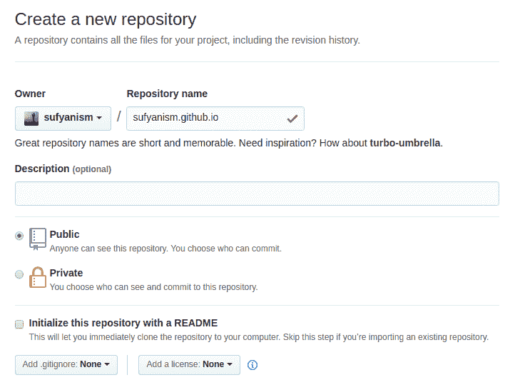

下一步是使用以下命令克隆新的存储库：

```js
git clone https://github.com/username/username.github.io
```

使用前述命令时，请确保将用户名字段更改为您自己的用户名。

然后，剩下的就是添加、提交和推送更改，如下所示：

```js
git add --all
git commit -m "initial commit"
git push -u origin master
```

# 使用自定义域名

GitHub Pages 允许用户向其项目站点添加自定义域名，而不受其所在计划的限制。

要将域名映射到您的站点，首先步骤显然是注册该域名。

有许多域名注册商，例如[GoDaddy](http://GoDaddy.com)、[Register.com](http://Register.com)、[Gandi.net](http://Gandi.net)等。我个人使用[Namecheap](http://Namecheap.com)和[Name.com](https://www.name.com/)注册所有我的域名，但这更多是偏好而不是推荐。

注册域名后，您需要修改其 DNS 记录，指向所涉及的托管平台，例如 GitHub Pages。通常，这是通过 CNAME 记录来实现的，尽管有些平台也可能使用 A 记录。

根据您的域名注册商提供的界面和设置，添加或修改 DNS 记录的程序可能会有所不同。如果有疑问，请务必联系您的注册商支持团队！不正确的配置可能导致域名无法解析。

对于 GitHub Pages，您只需将域名添加到存储库设置（而不是页面设置）中。然后，您只需输入 CNAME 记录并等待 DNS 传播。

您可以在[`help.github.com/articles/using-a-custom-domain-with-github-pages/`](https://help.github.com/articles/using-a-custom-domain-with-github-pages/)找到详细的自定义域名映射指南。

# 将 VuePress 部署到谷歌 Firebase

VuePress 可以借助 Firebase CLI 工具部署到 Firebase 上。Firebase 是一个众所周知但相对更复杂的选项，用于在云中托管站点和项目。

# 什么是谷歌 Firebase？

如果您对 Firebase 还不熟悉，首先要注意的是它由谷歌支持。这意味着您的项目将获得企业级可靠性、令人惊叹的云基础设施以及谷歌提供的各种其他功能。


Firebase 让您可以使用谷歌基础设施在云中托管您的应用程序和项目。但它不仅仅止步于此——每个 Firebase 计划（包括免费计划）都附带了各种令人惊叹的功能：

+   A/B 测试

+   谷歌分析

+   Crashlytics

+   云消息传递（FCM）

+   远程配置

+   性能监控

+   云测试

+   自定义域

+   自定义 SSL 证书

+   还有更多！

事实上，一个简单的 VuePress 网站甚至不需要大多数这些功能。话虽如此，谷歌 Firebase 免费提供如此多的令人惊叹的功能，确实是一笔非常划算的交易！

Firebase 的免费计划为您提供 1GB 的存储空间，但没有数据库访问权限。对于大多数 VuePress 网站来说，这已经足够了。然而，令人遗憾的是，免费计划中只有 10GB 的月度带宽。对于一个繁忙的网站，10GB 的带宽可能不足够。

您也可以选择付费计划，起价为每月 25 美元，或选择按使用量额外付费。这意味着如果您超出了免费计划，您只需支付额外的使用费用。

如果您担心 Google Firebase 的定价结构，您可以使用他们的费用计算器来评估您每月可能支付的费用。在[`firebase.google.com/pricing/`](https://firebase.google.com/pricing)找到计算器。

# 用法

为了使用 Firebase，我们需要注册一个帐户，无论是免费还是高级。

一旦我们注册了 Firebase，就会得到一个 Firebase ID。确保将其保存在安全的地方（您可以在 Firebase 控制台中找到密钥）。


将项目添加到 Firebase 控制台很简单 - 我们只需要指定项目名称，如图所示（默认情况下，项目将添加到免费计划中）：

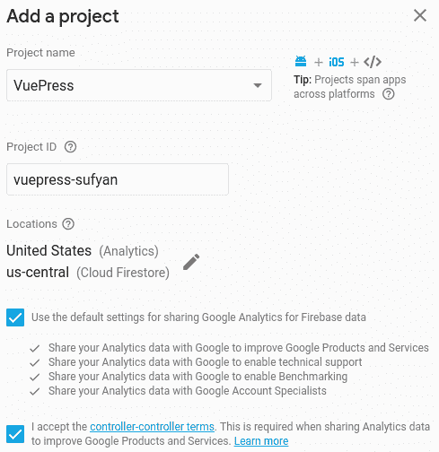

一旦我们创建了一个项目，Firebase 将自动带我们进入项目的控制台页面。随意尝试一下；由于 VuePress 还没有连接到 Google Firebase，在这个阶段不用担心破坏任何东西。控制台页面如下所示：


接下来，是时候为我们的 VuePress 实例做好部署的准备了。我们的系统上已经有了 Node 和 npm，但我们需要 Firebase 工具才能在系统上运行 Firebase 命令。

Firebase 工具是一组命令行工具和命令，可用于将代码部署到 Firebase 项目，向 Firebase 添加和删除用户和其他数据，并在需要时读取和写入数据到我们的 Firebase 数据库。更多细节可以在[`www.npmjs.com/package/firebase-tools`](https://www.npmjs.com/package/firebase-tools)找到。

要安装 Firebase 工具，我们需要运行此命令：

```js
npm install -g firebase-tools
```

安装完成后，我们可以在 CLI 中使用 Firebase 命令。

此时，我们需要在 VuePress 网站的根文件夹中创建两个文件。

首先，我们将创建`firebase.json`文件，语法如下（添加到您特定的 dist 目录的路径）：

```js
{
 "hosting": {
   "public": "path-to-dist-directory",
   "ignore": [ ]
 }
 }
```

我们需要创建的第二个文件是`.firebaserc`（请注意，这是一个点文件，在 Linux/UNIX 系统的文件查看器中默认情况下将被隐藏）。此文件的语法如下（添加您的 Firebase ID）：

```js
{
 "projects": {
   "default": "Firebase-ID-comes-here"
 }
 }
```

然后，我们只需要使用以下命令构建项目：

```js
npm run docs:build
```

最后，要部署我们的网站，我们使用此命令：

```js
firebase deploy
```

就这样！我们的网站将部署在 Firebase 服务器上。

然后，我们可以返回 Firebase 控制台进行其他任务，例如自定义域名映射、A/B 测试、Crashlytics，甚至其他集成，如 AdSense、Slack 等。

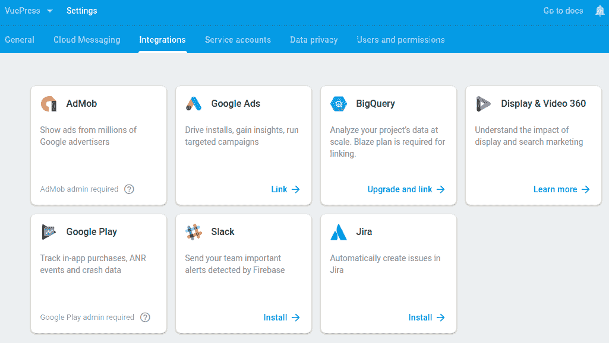

# 使用自定义域名

此时，我们的网站将位于免费子域，类似于`yoursite.firebaseapp.com`。

要映射自定义域名，在 Firebase 控制台中，我们需要点击“连接域”按钮，如此截图所示：

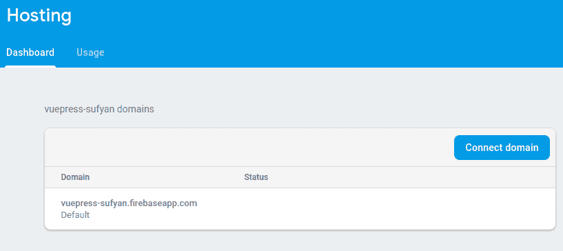

然后，我们将指定我们的域名，并验证其所有权。最简单的方法是通过 CNAME 记录来实现，如下所示：

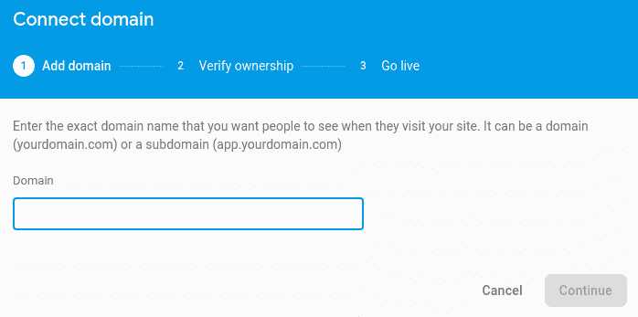

请记住，域名传播可能需要几个小时，即使是 CNAME 记录的情况也是如此。

根据我们注册域名的域名注册商，添加 CNAME 记录的过程可能会有所不同。因此，建议与注册商的支持团队联系以获取更多建议。

了解如何将自定义域名连接到 Firebase 的更多信息，请访问[`firebase.google.com/docs/hosting/custom-domain`](https://firebase.google.com/docs/hosting/custom-domain)。

# 将 VuePress 部署到 Surge

VuePress 可以部署到 Surge.sh 静态站点托管服务。这种特定的服务并不像 Google Firebase 那样功能丰富，但它已被证明非常可靠，并且在性能方面非常快。

# 什么是 Surge？

Surge 是一个让您可以直接从命令行发布网站到网络的服务。它更适合前端开发人员，但并没有严格限制谁可以使用它。

与 Firebase 不同，后者通常专门为 Android 或其他移动应用开发人员定制，Surge 旨在满足 HTML 和 JavaScript 编码人员的需求，特别是 Web 开发人员的需求。

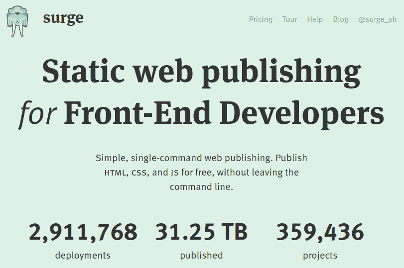

Surge 自带了针对 Gulp 和 Grunt 的即插即用插件。它还与 GitHub 集成，并支持各种静态站点生成器，包括 Jekyll 和 VuePress！

在定价方面，Surge 也有免费和付费计划。付费计划每月 30 美元，提供无限制的一切，以及自定义 SSL、自定义重定向规则和密码保护。

另一方面，免费计划允许我们添加具有基本 SSL 的自定义域，但不会对发布设置任何限制。这意味着我们可以对我们的网站进行任意数量的更改，而不必担心带宽限制或其他类似问题。这就是使 Surge 对前端开发人员特别有帮助的原因！

# 用法

在继续之前，我们需要通过 npm 安装 Surge。只需运行以下命令：

```js
npm install -g surge
```

这应该在我们的系统上安装 Surge，现在我们可以使用 Surge 命令。有关该命令的更多详细信息，请访问[`www.npmjs.com/package/surge`](https://www.npmjs.com/package/surge)。

之后，我们只需要构建我们的文档，如下所示：

```js
npm run docs:build
```

最后，是时候部署了（请注意，如果您偶然更改了值或路径，可能需要传递正确的路径到您的 dist 目录）：

```js
surge .vuepress/dist
```

就是这样！Surge 是最容易使用的静态站点托管服务之一！

如果我们在根目录中添加一个名为`404.html`的文件，Surge 足够智能，可以将该文件用作自定义 404 页面，在出现*页面未找到*错误时显示。

# 使用自定义域

如果您有一个希望使用的自定义域名，最好的做法是遵循官方 Surge 文档，其中包含逐步指南，适用于十多个域名注册商。

此文档可在[`surge.sh/help/adding-a-custom-domain`](https://surge.sh/help/adding-a-custom-domain)找到。

然而，值得注意的是，如果我们不使用默认的 surge.sh 子域，我们需要在部署命令中传递自定义域名。因此，前面的命令将改为以下内容：

```js
surge .vuepress/dist mycustomdomain.com
```

# 将 VuePress 部署到 Heroku

对于 VuePress 网站使用 Heroku 通常似乎有些大材小用。这是因为 Heroku 提供了大量功能，通常对于简单的 VuePress 网站并不需要。

但是，如果您已经有一个 Heroku 账户（比如，用于您的其他开发项目），将您的 VuePress 网站添加到其中可能比浪费时间、精力和金钱注册另一个服务更有意义。

# 什么是 Heroku？

Heroku 是一个强大而强大的云托管平台，支持非常广泛的语言、脚本、技术等。您可以轻松在 Heroku 上运行 PHP、JavaScript、Ruby、UNIX、Python、Perl 等许多其他应用程序。


Heroku 还能够支持多个数据库管理系统，如 MySQL 甚至 PostgreSQL。这意味着 Heroku 拥有广泛的用户群，涵盖了多种方法论和编码范式。

当然，在所有这些中，对于静态网站使用 Heroku 可能看起来是不必要的。但是话虽如此，如果您的目标是在您的工作流程的更大框架内使用 VuePress，比如现有的 React 或 Vue.js 应用程序，那么 Heroku 可以为整个项目提供无缝的平台，并与各种管理工具集成。

在定价方面，Heroku 提供了一个非常多样化的定价模型，从 7 美元开始，一直到企业定价，每月达到 500 美元。更合理的是直接呈现定价表的整体情况：

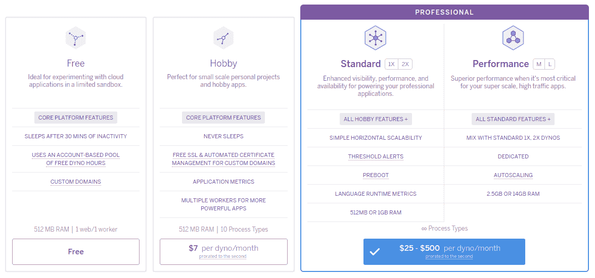

如您所见，免费计划让我们拥有一个工作连接，并且还允许我们映射我们的自定义域。

您可以在[`www.heroku.com/pricing`](https://www.heroku.com/pricing)上计算运行 Heroku 实例的预计成本。

# 用法

为了将我们的 VuePress 网站部署到 Heroku，我们首先需要注册一个 Heroku 账户。您可以在[`signup.heroku.com/`](https://signup.heroku.com/)注册免费账户。注册界面将看起来像这样：

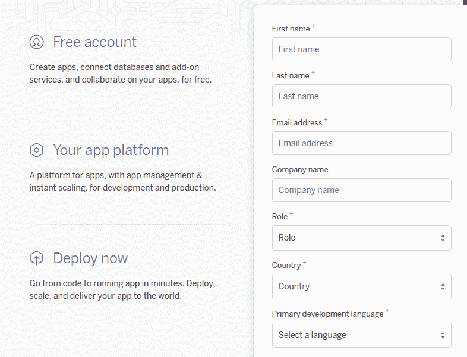

请注意，在注册过程中有选择主要开发语言的要求。如果没有其他主要使用的语言，Node.js 是您需要选择的 VuePress 部署语言。这并不重要；您可以选择任何语言，仍然可以轻松部署其他语言的应用程序。

一旦我们成功创建了一个帐户，我们将被带到 Heroku 仪表板。我们现在可以在这里注册一个新的应用程序：

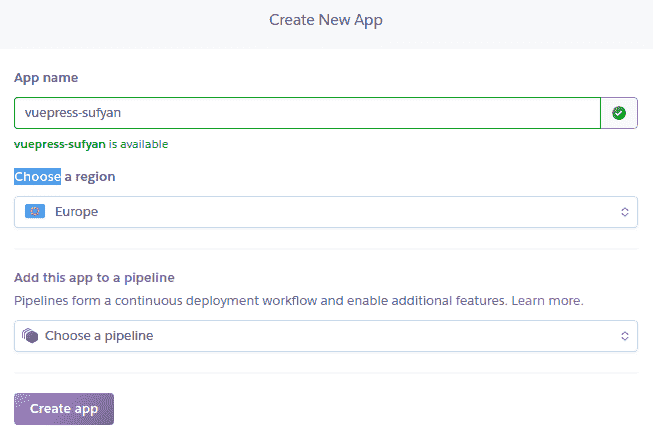

有两种主要方法可以将 VuePress 项目部署到 Heroku：

+   使用 Heroku CLI 依赖于 Heroku Git

+   连接到 GitHub 本身

连接到 GitHub 意味着我们正在将存储库的一个分支部署到 Heroku，以便更改会自动推送到现场，如下所示：

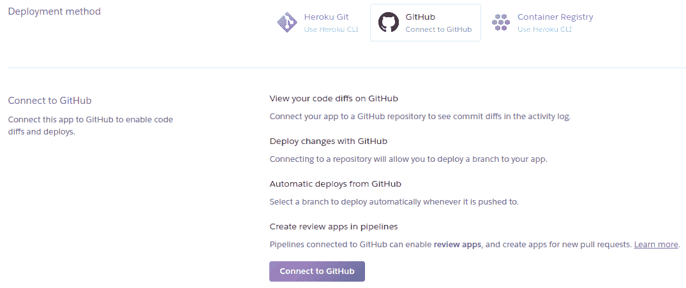

然而，让我们讨论使用 CLI 的主流路线，因为有时可能更具挑战性。

在继续之前，需要安装 Heroku CLI。使用 npm，只需发出以下命令即可：

```js
npm install -g heroku
```

然而，在这里情况略有不同。Heroku CLI 依赖于最新版本的 Node，如果我们的系统跟不上它，事情可能会潜在地出错。为了避免这种情况，如果通过 npm 安装了 Heroku CLI，则不提供自动更新。我们需要根据可能或必要的情况手动更新 CLI。

当然，这可能会增加太多额外的工作。更简单的方法是使用官方安装程序。Heroku 为 Windows、Mac 和 Ubuntu 平台提供了安装程序。对于其他 Linux 版本，安装的一般命令如下（以超级用户身份运行）：

```js
sudo snap install --classic heroku
```

有关 Heroku CLI 安装过程的更多详细信息，以及下载 Windows 和 macOS 安装程序的链接，可在[`devcenter.heroku.com/articles/heroku-cli`](https://devcenter.heroku.com/articles/heroku-cli)找到。

Heroku CLI 需要 Git 才能运行。在安装 Heroku CLI 之前，请确保您的系统已安装 Git。

一旦我们创建了一个帐户并设置了 Heroku CLI，就该使用我们的密码和用户名凭据登录 Heroku 了。我们只需输入以下命令，然后在提示时输入我们的登录详细信息：

```js
heroku login
```

此后，我们需要在 VuePress 项目的根目录中创建一个`static.json`文件。该文件应填写以下内容（需要完整指定到`dist`目录的路径）：

```js
{
  "root": "path-to-vuepress-dist-directory"
 }
```

`static.json`文件非常重要，如果没有它，远程部署将无法工作！

完成后，我们需要使用 Heroku Git 进行设置。要添加 Git 提交，请使用以下代码：

```js
# version change
cd project-path

git init

heroku git:remote -a app-name-here
git add
git commit -m "Ready to deploy."
```

要创建新的应用程序，请输入以下命令：

```js
# creates a new app
heroku apps:create vuepress-app-name
```

要设置`buildpack`，请使用此命令：

```js
# buildpack for static sites 
heroku buildpacks:set https://github.com/heroku/heroku-buildpack-static.git
```

Heroku 的`buildpack`是一个主要用于静态站点的自定义工具和命令集。在其 GitHub 页面上了解更多关于其用法：[`github.com/heroku/heroku-buildpack-static`](https://github.com/heroku/heroku-buildpack-static)。

最后，我们只需要部署我们的网站并推送更改，如下所示：

```js
git push heroku master
```

我们完成了！关于网站的指标和使用统计可以在 Heroku 仪表板中查看。

# 使用自定义域名

我们可以在 Heroku 仪表板中为 VuePress 网站添加多个自定义域名。默认情况下，我们的网站只会使用`herokuapp.com`子域。

然而，为了添加自定义域名，需要验证您的帐户。这可以通过添加信用卡详细信息来完成。虽然信用卡上不会有任何账单或费用，但为了防止滥用 Heroku 系统，这些详细信息是必需的。

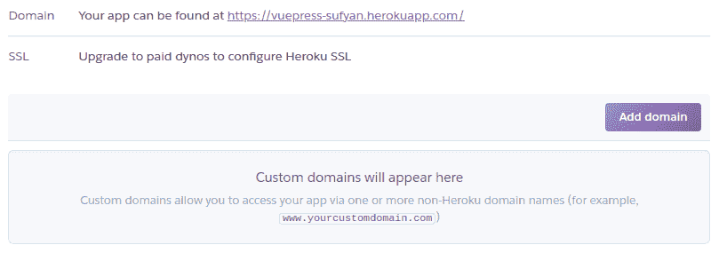

添加了自定义域名后，我们可以在域名注册商那里修改 CNAME 记录，将域名指向我们的 VuePress 网站。

# 将 VuePress 部署到 Netlify

由于其自动化工作机制，Netlify 已经成为 Web 开发人员中的知名品牌。您只需从 GitHub、GitLab 等处推送更改，Netlify 就可以处理其余的工作。

事实上，在使用 Netlify 时很少出现问题的可能性。对于寻找只需点击几下即可使用的云托管服务的人来说，它通常是推荐的解决方案。

不用说，Netlify 也非常适用于 VuePress。

# 什么是 Netlify？

Netlify 自称为*自动化现代 Web 项目的一体化平台*。简而言之，它让您可以在全球基础设施上部署您的 Web 项目，具有自动 SSL、自定义域名、多个内容交付网络（CDN）等功能。

您可以选择通过 Git 直接部署，然后根据需要推送更改：


Netlify 的高级计划从每月 45 美元起。然而，免费计划让我们轻松部署个人项目，并且还允许我们使用自定义域名。不足之处在于免费计划有一个用户限制，这排除了任何团队协作。定价选项如下所示：


此外，企业级 CDN 在免费计划中也不可用。但就价值而言，免费计划应该足够用于 VuePress 部署。

# 用法

为了将我们的网站部署到 Netlify，我们首先需要注册一个计划。之后，我们将能够在其中添加关于我们项目的详细信息。

好消息是，Netlify 提供了多种注册选项。我们可以选择使用 GitHub、GitLab 或 BitBucket 进行注册，然后轻松地推送我们的存储库，如下所示：


或者，我们可以依赖电子邮件注册机制。

Netlify 界面非常出色，因为它非常简洁，所以新手用户不会感到困惑：


我们所需要做的就是点击“从 Git 创建新站点”按钮！

然后，我们需要连接到我们选择的 Git 服务，如下所示：


之后，我们只需要选择我们的项目所在的存储库，然后按照以下选项进行指定：

+   对于构建命令，我们将输入`npm run docs:build`

+   对于“发布”目录，我们必须指定完整的路径到我们的`dist`目录，比如`.vuepress/dist`

就是这样！

# 使用自定义域名

Netlify 允许我们在免费计划中为我们的网站添加自定义域名。默认情况下，网站首先在`sitename.netlify.com`子域上线。

网站添加后，我们可以指定要添加的域名，然后根据我们的域名注册商提供的界面添加 CNAME 记录。

值得注意的是，Netlify 也提供域名的 DNS 管理服务，尽管是在付费计划中。

正如所见，将网站部署到 Netlify 相当容易。唯一的问题是，从本地主机进行部署可能会相当棘手。但如果您是 GitHub、GitLab 或 BitBucket 用户，Netlify 是一个非常简单和可靠的部署解决方案。

# 将 VuePress 部署到 GitLab Pages

与 GitHub Pages 非常相似，GitLab Pages 也是一种类似的提供，并提供几乎相同级别的功能。

此外，与 GitHub Pages 非常相似，GitLab Pages 也非常注重静态站点及其部署。它可以与 Jekyll、Hugo、Harp、Hexo、Pelican 和显然 VuePress 等服务和软件直接配合使用。我们在本书的第一章中学习了这些静态站点生成器，*介绍静态站点生成器和 VuePress*。

# 什么是 GitLab Pages？

GitLab Pages 为基于 GitLab 的项目和存储库提供可靠且高度灵活的托管解决方案。虽然 GitLab 在某种意义上与 GitHub 相似，因为这两个服务都基于 Git，但前者也有自托管的选择，最近变得越来越受欢迎。有许多开发人员出于这个原因而更喜欢 GitLab。


GitLab Pages 允许我们连接自定义域名，以及 SSL 证书。我们可以选择在自己的服务器上运行 GitLab，或者在[GitLab.com](http://GitLab.com)上运行——无论我们的选择是什么，GitLab Pages 仍然可以用来将站点部署到云端。

在定价方面，GitLab 的自管理和托管变体都配备了免费计划。好处是，与 GitHub 不同，我们甚至可以在免费计划中拥有私人项目！付费计划更适合高端特定用途；如果您的最终目标只是建立一个 VuePress 网站，免费计划就足够了。

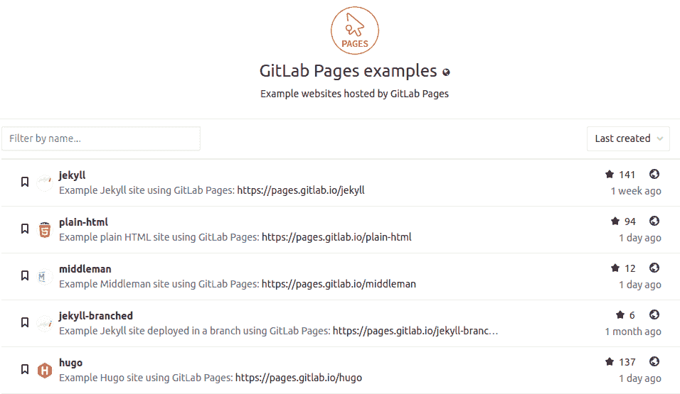

值得注意的是，GitLab Pages 没有单独的定价结构。无论是免费还是付费，都是针对 GitLab 本身的。GitLab Pages 是所有计划的免费附加组件。

# 用法

为了将我们的 VuePress 站点部署到 GitLab Pages，我们首先需要确保在我们的`config.js`文件中指定了正确的基本值。否则，部署将无法正常工作。

默认情况下，VuePress 将基本值读取为`/`。这意味着如果站点部署在`username.gitlab.io`，那么我们可以在`config.js`中省略基本值。

但是，如果我们要在其他地方部署站点，比如`username.gitlab.io/mysite`，那么我们需要将基本值指定为`/mysite/`，依此类推。

此外，`config.js`文件中的`dest`值设置为`public`非常重要。否则，GitLab Pages 可能无法读取项目数据。

一旦我们在`config.js`文件中输入了所需的值，我们需要在 VuePress 项目的根目录中创建一个名为`.gitlab-ci.yml`的新文件。然后，我们将根据 VuePress 开发人员的建议填充该文件的以下内容：

```js
image: node:9.11.1

 pages:
  cache:
    paths:
    - node_modules/

  script:
  - npm install
  - npm run docs:build
  artifacts:
    paths:
    - public
  only:
  - master
```

这个文件只是在我们对站点进行更改时运行所需的脚本来构建和部署我们的站点。

# 使用自定义域名

默认情况下，GitLab Pages 上的每个站点都可以在项目页面地址上访问，例如`myusername.gitlab.io/myproject`。

我们可以很容易地将其更改为`myusername.gitlab.io`（即删除`/myproject`子路径）。我们只需要在设置中输入项目的名称为`myusername.gitlab.io`即可——这适用于 GitLab Pages 上托管的几乎所有静态站点生成器。

如果我们需要为我们的站点添加自定义域名，这也是可以做到的。为此，我们需要在站点设置中指定域名，然后将相关的 CNAME 记录添加到我们的域名本身。

GitLab Pages 提供了有关自定义域映射的详细指南，网址为[`docs.gitlab.com//ce/user/project/pages/introduction.html#add-a-custom-domain-to-your-pages-website`](https://docs.gitlab.com//ce/user/project/pages/introduction.html#add-a-custom-domain-to-your-pages-website)。

# 总结

好了，这就是 VuePress 快速入门指南的结束。在本章中，我们介绍了 VuePress 在各种云托管服务上的部署。

# 远程或云平台的链接

为了方便参考，这里是本章中我们谈论过的云和远程托管提供商的链接：

+   **GitHub Pages**: [`pages.github.com/`](https://pages.github.com/)

+   **GitLab Pages**: [`about.gitlab.com/features/pages/`](https://about.gitlab.com/features/pages/)

+   **Google Firebase**: [`firebase.google.com/`](https://firebase.google.com/)

+   **Heroku**: [`heroku.com/home/`](http://heroku.com/home)

+   **Netlify**: [`www.netlify.com/`](https://www.netlify.com/)

+   **Surge.sh**: [`surge.sh/`](http://surge.sh/)

# 结束语

在本书的过程中，我们学习了关于 VuePress 的大量知识，包括以下内容：

+   VuePress 在本地主机或机器上的安装

+   VuePress 配置

+   VuePress 的使用和构建

+   VuePress 主题定制

+   使用 Markdown 处理内容

+   VuePress 国际化

+   最后，在本章中，我们学习了如何将站点从本地主机或存储设备部署到远程或云平台

随着 VuePress 的开发和部署的进展，您会发现它非常易于使用，并且是一个相当强大的软件。此外，VuePress 仍在积极开发中，是一个相对较新的工具。这意味着随着时间的推移，VuePress 必定会在功能和受欢迎程度上不断增长。

事实上，在我写这本书的时候，VuePress 推出了九个新版本（包括主要版本和次要版本）！

在这一点上，强烈建议并推荐学习 Vue.js，特别是如果你想在 VuePress 中构建项目并做更多事情的话。在当今时代拥有一个 JavaScript 框架总是一个好主意，要牢记 JavaScript 的日益流行。

读者可以在 GitHub 上浏览本书的代码示例仓库，网址是[`github.com/packtpublishing/vuepress-quick-start-guide`](https://github.com/packtpublishing/vuepress-quick-start-guide)。

另外，最新的 VuePress 代码可以在其 GitHub 仓库中找到，网址是[`github.com/vuejs/vuepress`](https://github.com/vuejs/vuepress)。

话虽如此，我希望你在阅读本书并特别了解 VuePress 的过程中度过了愉快的时光。

编程愉快！
